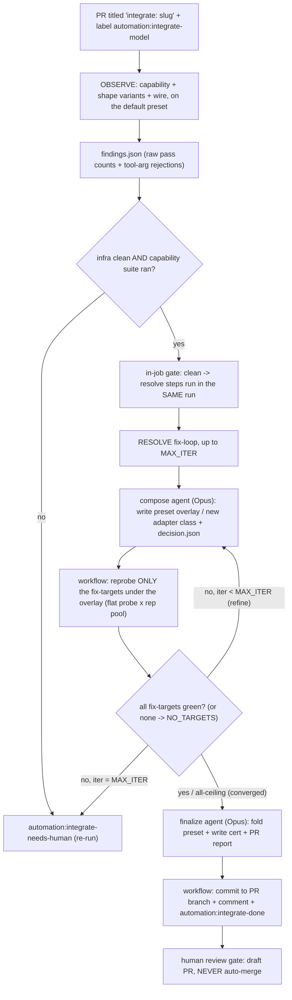

# Model auto-integration

Automates onboarding a new candidate model into the arena eval: DETECT its tool-calling
quirks, propose and PROVE a policy fix (or classify a genuine ceiling), and land a preset +
capability cert on the PR for human review. A SINGLE label-triggered GitHub Actions workflow
(`.github/workflows/integrate-model.yml`) runs OBSERVE and, on a clean observe, RESOLVE in the
SAME run - one job, not two workflows, because a `GITHUB_TOKEN` label add cannot trigger a
second workflow. It NEVER merges: the draft PR is the human review gate.

## Trigger

Open a PR titled `integrate: <openrouter-model-slug>` (e.g. `integrate: qwen/qwen3.6-plus`)
and add the label `automation:integrate-model`. That starts OBSERVE; a clean observe chains
straight into RESOLVE in the same run (an in-job gate, no second workflow).

## Flow

## Stage 1 - Observe

Deterministic detection on the DEFAULT (raw) preset. Runs the capability integration probes +
shape variants (report-only, K repeats) and the NON-SCORING wire-probe task-pack, then
`scripts/integration/observe_findings.py` emits `findings.json` (raw pass counts + the
tool-arg rejections that graded metrics are blind to). Posts a summary comment. A `gate` step
then decides:

- Clean (capability suite ran AND no infra contamination) -> the resolve steps below run in the
  SAME job (label flips to `automation:resolve-running`).
- Infra-dirty / did-not-run -> `automation:integrate-needs-human` (re-run needed); resolve skipped.

## Stage 2 - Resolve (same workflow, `if: gate.clean == 'yes'`)

A DETERMINISTIC loop drives the fix; short Opus Claude Code agents do the reasoning. Per
iteration (up to `MAX_ITER`): a `claude -p` agent (`prompts/resolve_agent.md`) reads the
findings and composes/refines a preset OVERLAY (a model-scoped entry combining reusable
adapter axes, or a new small adapter class it writes into the engine) plus a `decision.json`
naming its `fix_targets`, then the WORKFLOW runs `reprobe.py` on ONLY those fix-targets (as a
flat probe x rep pool, so both probes and repeats run concurrently) and green-checks them
(`resolve_greencheck.py`). The agent never runs reprobe/git, so it cannot stall on it.
Empirical rule: a fix-target still red under the policy is reclassified as a ceiling
(known_unsupported), not chased forever. If the agent names NO fix-targets (all failures are
genuine ceilings), the verdict is `NO_TARGETS` -> converge straight to finalize, which records
them as `known_unsupported`.

- Converged -> a finalize agent (`prompts/resolve_finalize.md`) folds the preset into
  `model_presets.yaml` and writes the cert into `registry.py`. Before committing, the workflow
  VERIFIES the staged tree (what it is about to commit, via `git stash --keep-index`): it must
  import, must not turn any already-valid tool-call arg invalid (`test_policy_no_regression`, the
  anti-over-reach gate), and must recover the array-corruption shapes so the result validates +
  round-trips against the tool's Pydantic schema (`test_policy_array_recovery`).
  Only then does it commit to the PR branch, comment the record, and label
  `automation:integrate-done`. A broken / over-reaching / divergent fix fails verification here
  and goes to `automation:integrate-needs-human`. NEVER merges.
- Not converged within `MAX_ITER` (or staged verification failed) -> `automation:integrate-needs-human`.

## Auth split

- AGENT (Claude reasoning): `ANTHROPIC_API_KEY` (the same secret the hygiene review uses).
- CANDIDATE (reprobe live calls): `ARENA_AUTOMATION_OPENROUTER_API_KEY` (written to `.env`).

## Configuration (repo Actions variables)

| Variable | Default | Meaning |
|---|---|---|
| `OBSERVE_CAPABILITY_K` | 15 | observe capability + variant repeats |
| `OBSERVE_WIRE_K` | 10 | observe wire-probe repeats |
| `OBSERVE_WORKERS` | 10 | wire-probe orchestrator workers (trial-level) |
| `OBSERVE_CAP_PARALLEL` | 10 | capability + variant flat (node x rep) pool width (raised from 4; the old per-rep pool was serial-within-rep and cost a slow reasoning model hours) |
| `RESOLVE_MAX_ITER` | 3 | resolve fix-loop iterations |
| `RESOLVE_MAX_TURNS` | 80 | per-iteration agent turn budget (headroom for code-CREATE; exhausting it degrades to needs-human, never hard-fails) |
| `RESOLVE_AGENT_MODEL` | claude-opus-4-8 | resolve agent model |
| `RESOLVE_CAPABILITY_K` | 5 | resolve per-iteration capability reprobe (cheap inner loop) |
| `RESOLVE_CAP_PARALLEL` | 10 | resolve reprobe width (flat probe x rep pool; keep >= `RESOLVE_CAPABILITY_K`, <= ~16 for the rate limit) |
| `RESOLVE_WIRE_K` | 10 | reserved for the final wire-verification pass (not yet wired) |

## Labels (the state machine)

`automation:integrate-model` (trigger) -> `automation:integrate-running` (observe) ->
`automation:resolve-running` (clean observe, in-job resolve) ->
`automation:integrate-done` (success) OR `automation:integrate-needs-human` (infra-dirty, no
convergence, or a broken/over-reaching fix failing staged verification). There is no
`automation:resolve` handoff label anymore - observe and resolve are one run.

## Slack notifications (optional)

One Slack thread per integration PR: a root the pipeline posts once
(`Auto-integration: <model> (PR #<N>)`) plus a threaded reply per milestone. The root ts is NOT
stored GitHub-side - it is rediscovered by scanning recent channel history for the PR-unique
`(PR #<N>)` token, so a re-trigger (and repeated resolve rounds on the same PR) reuse the same
thread. The PR number is the thread key; the same model in two PRs is two threads. Transport is
bot-token + `chat.postMessage` (an incoming webhook returns no ts and can neither thread nor read
history). All config is optional: with any value unset, `scripts/integration/slack_notify.py`
logs and no-ops, so an unconfigured repo (and a fork PR, which receives no secrets) degrades
cleanly, and a Slack failure never fails the job.

| Config | Kind | Meaning |
|---|---|---|
| `ARENA_AUTOMATION_SLACK_BOT_TOKEN` | secret | bot `xoxb-` token; needs `chat:write` + `channels:history` (history read is what finds the root), and the bot must be a member of the channel |
| `ARENA_AUTOMATION_SLACK_CHANNEL` | variable | target channel id |
| `ARENA_AUTOMATION_SLACK_MENTIONS` | variable | comma-separated Slack user ids to @mention; empty -> no mention |

Messages are emoji-prefixed and carry the run URL. `mention` = the `SLACK_MENTIONS` users are
pinged (terminal / attention states only):

| When | Mention |
|---|---|
| observe started / observe clean -> resolve / resolve started | no |
| integrated (preset + cert committed) | yes |
| needs-human: parse-fail / infra-dirty / no-converge / data-scope review | yes |
| unexpected failure (catch-all, deduped against the handled cases above) | yes |

The fork-reject path is PR-comment-only (a fork `pull_request` run gets no secrets, so the
notifier cannot post). `SLACK_MENTIONS` pings fire on the terminal and error notifications so a
human is alerted when the PR needs review or the run broke.

## Prompts (`scripts/integration/prompts/`)

The analysis-dimension briefs interpret an eval or observe artifact (one dimension per
sub-agent); the resolve prompts drive the fix loop. `index.yaml` is the machine-readable map.

| Prompt | Used by | What it does (brief) |
|---|---|---|
| `_shared_context.md` | every analysis dimension | Prepended context: data layout, pass@k/pass^k metric definitions, the four-bucket vocabulary, observe-vs-eval mode, the aggregate-synthesis precedence, efficiency rules. |
| `harness_infra.md` | analysis | Is any failure infra-caused (429 / timeout / max_turns / stuck / crash)? Gates trust in the pass numbers. |
| `preset_codec_leak.md` | analysis | Did the intended preset apply on every trial, with no reasoning-leak or schema-loss? Verdict: clean-native OR the exact policy-fix target. |
| `four_bucket.md` | analysis | Bucket every failing trial into infra / oracle / formatting / genuine-model; how many pp are recoverable at all. |
| `consistency_passk.md` | analysis | pass@1 / pass@5 / pass^5 + consistency tax; is the model consistency-limited or capability-limited. |
| `task_design_oracle.md` | analysis (eval only) | Find FALSE failures (correct action graded fail) + unwinnable/ambiguous tasks; footnote vs regrade. |
| `resolve_agent.md` | resolve (per iteration) | Compose or refine the model's preset overlay from reusable adapter axes (or write a new small adapter class), and write `decision.json` (fix_targets / ceilings / required). Does NOT run reprobe or commit. |
| `resolve_finalize.md` | resolve (on convergence) | Fold the proven overlay into `model_presets.yaml` + write the cert into `registry.py`, and write the PR comment/description. Does NOT commit. |

## Key files

- `scripts/integration/observe_findings.py` - deterministic raw-stat facts emitter (no banding,
  no verdict; interpretation is the agent's job).
- `scripts/integration/run_probes.py` - flat (node x rep) parallel runner for the observe
  capability + variant steps: collects the candidate's nodes once, then runs each node x rep as
  its own single-node pytest at `OBSERVE_CAP_PARALLEL` width (so nodes AND repeats parallelize,
  not `W` long serial reps - the fix for a slow reasoning model spending hours on the variants).
- `scripts/integration/reprobe.py` - targeted re-probe under a policy overlay; re-runs ONLY the
  named `--targets` (the agent's fix-targets), or all failed probes if none given, as a flat
  (probe x rep) pool parallelized at `--cap-parallel`; capability-only inner loop, plus a final
  wire pass on failed wire tasks.
- `scripts/integration/resolve_greencheck.py` - fix-target convergence check.
- `scripts/integration/slack_notify.py` - Slack thread notifier (`ensure-root` / `reply`
  subcommands); stdlib-only (runs under the system `python3` before `uv sync`), dry-run no-op
  without a token. See "Slack notifications" above.
- `tests/integration/llm/test_policy_no_regression.py` - GENERIC (model-agnostic) anti-over-reach
  gate: every model's resolved response policy must keep an already-valid tool-call arg valid.
- `tests/integration/llm/test_policy_array_recovery.py` - schema-driven recovery oracle: inject
  each XML->JSON array-corruption shape (`{item:[...]}` / stringified / empty) into a VALID
  Pydantic tool call, run the resolved policy, and require the result to validate + round-trip
  back (no hand-authored answer-key; an uncorrupted call must survive unchanged = over-reach
  guard). Both run in the finalize staged-tree gate.
- `scripts/integration/prompts/` - `_shared_context.md` + the analysis dimension briefs
  (`harness_infra` / `preset_codec_leak` / `four_bucket` / `consistency_passk` /
  `task_design_oracle`) and the resolve agent prompts (`resolve_agent.md`, `resolve_finalize.md`).

## Notes

- A "policy" is a preset entry composing SHIPPED adapter axes (schema_sanitizer / prompt_policy /
  response_policy / reasoning_codec / content_policy / cache_policy / params). A genuinely novel
  recovery needs a NEW adapter class (engine code) which the agent writes + registers.
- The auto-cert is verified at `RESOLVE_CAPABILITY_K` (a small sample by default) and can be MORE
  optimistic than a human baseline. Guardrails: `resolve_agent.md` requires evidence + mechanism
  consistency before marking a capability `required` (no promoting a cap a summary-only codec
  cannot support); the finalize staged-tree gate blocks over-reaching / broken fixes. The
  draft-PR human gate and the hygiene review remain the backstop: never merge without review.
- DATA-SCOPE review: a converged fix that recovers an array nested inside a FREE-FORM / open
  object (an `additionalProperties: true` parent) is DATA-BOUND - which fields carry the array is
  not in the schema, only in the domain data. Such a fix is committed but routed to
  `automation:integrate-needs-human` with a warning (NOT a silent `integrate-done`): a
  locally-green fix can still be too narrow (or over-broad) on domains the observe never surfaced,
  so a human verifies the scope breadth before merge. Triggered by the agent's `data_scope_review`
  flag in `decision.json` OR an observe "valid list/array" rejection signal.
- Disposable de-integration test branches (`test/observe-<model>[-rN]`) simulate a fresh candidate
  by deleting the model's cert/preset (and any bespoke policy class); they carry deletions and are
  NEVER merged out.
