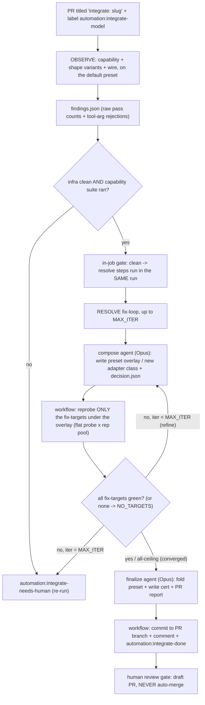

# Model auto-integration

Automates onboarding a new candidate model into the arena eval: DETECT its tool-calling
quirks, propose and PROVE a policy fix (or classify a genuine ceiling), and land a preset +
capability cert on the PR for human review. A SINGLE GitHub Actions workflow
(`.github/workflows/integrate-model.yml`) runs OBSERVE and, on a clean observe, RESOLVE in the
SAME run - one job, not two workflows, because a `GITHUB_TOKEN` label add cannot trigger a
second workflow. It NEVER merges: the draft PR is the human review gate.

## Trigger

Two entry points, same engine run:

1. **By hand:** open a PR titled `integrate: <openrouter-model-slug>` (e.g.
   `integrate: qwen/qwen3.6-plus`) and add the label `automation:integrate-model`.
2. **From Slack:** tag the bot in the automation channel
   (`@delivery-tech-bot integrate <model>`) and the poller opens the PR + dispatches the engine
   for you (see [Slack-triggered poller](#slack-triggered-poller-alternative-entry-point)).

Either way this starts OBSERVE; a clean observe chains straight into RESOLVE in the same run (an
in-job gate, no second workflow). The engine also accepts a `workflow_dispatch` (inputs `pr` /
`head_ref` / `model`, with `|| inputs.*` fallbacks for every value the labeled path reads from
the PR event) - that is how the poller starts it, since a `GITHUB_TOKEN` label add cannot.

## Flow



## Stage 1 - Observe

Deterministic detection on the DEFAULT (raw) preset. Runs the capability integration probes +
shape variants (report-only, K repeats) and the NON-SCORING wire-probe task-pack, then
`automation observe-findings` emits `findings.json` (raw pass counts + the
tool-arg rejections that graded metrics are blind to). Posts a summary comment. A `gate` step
then decides:

- Clean (capability suite ran AND no infra contamination) -> the resolve steps below run in the
  SAME job (label flips to `automation:resolve-running`).
- Infra-dirty / did-not-run -> `automation:integrate-needs-human` (re-run needed); resolve skipped.

## Stage 2 - Resolve (same workflow, `if: gate.clean == 'yes'`)

A DETERMINISTIC loop drives the fix; short Opus Claude Code agents do the reasoning. Per
iteration (up to `MAX_ITER`): a `claude -p` agent (`prompts/resolve_agent.md`) reads the
findings and composes/refines a preset OVERLAY (a model-scoped entry combining reusable
adapter axes, or a new small adapter class it writes into the engine) plus a `decision.json`
naming its `fix_targets`, then the WORKFLOW runs `automation reprobe` on ONLY those fix-targets (as a
flat probe x rep pool, so both probes and repeats run concurrently) and green-checks them
(`automation greencheck`). The agent never runs reprobe/git, so it cannot stall on it.
Empirical rule: a fix-target still red under the policy is reclassified as a ceiling
(known_unsupported), not chased forever. If the agent names NO fix-targets (all failures are
genuine ceilings), the verdict is `NO_TARGETS` -> converge straight to finalize, which records
them as `known_unsupported`. The agent can also ESCALATE directly: if it judges it cannot produce
a correct policy from the observe data (a data-bound quirk whose correct scope needs real-domain
evidence the observe never surfaced), it sets `needs_human: true` in `decision.json` and the loop
breaks IMMEDIATELY to `automation:integrate-needs-human` with the agent's reason - no wasted
iterations, no fabricated fix. (Distinct from `data_scope_review`, which commits a fix the agent
DID produce and routes it for a post-hoc human scope-check.)

- Converged -> a finalize agent (`prompts/resolve_finalize.md`) folds the preset into
  `model_presets.yaml` and writes the cert into `registry.py`. Before committing, the workflow
  VERIFIES the staged tree (what it is about to commit, via `git stash --keep-index`): it must
  import, must not turn any already-valid tool-call arg invalid (`test_policy_no_regression`, the
  anti-over-reach gate), and must recover the array-corruption shapes so the result validates +
  round-trips against the tool's Pydantic schema (`test_policy_array_recovery`). The cert itself is
  reconciled against the observe baseline (`automation reconcile-cert`, run before the stash so
  `findings.json` is still present): every probed capability must be declared (no silent auto-skip),
  and no capability the baseline shows passing (>= 0.9) may be `known_unsupported` - catching the
  free-form cert's under-declaration and false-pessimism.
  Only then does it commit to the PR branch, comment the record, and label
  `automation:integrate-done`. A broken / over-reaching / divergent fix (or a cert that does not
  reconcile) fails verification here and goes to `automation:integrate-needs-human`. NEVER merges.
- Not converged within `MAX_ITER` (or staged verification failed) -> `automation:integrate-needs-human`.

## Auth

Both the AGENT and the CANDIDATE run on the OpenRouter budget (`ARENA_AUTOMATION_OPENROUTER_API_KEY`); no first-party `ANTHROPIC_API_KEY` is used (that avoids the key's workspace usage cap).

- AGENT (Claude reasoning): the Claude Code CLI speaks the Anthropic Messages API, so a LiteLLM proxy sidecar (the "Start LiteLLM gateway" step) bridges Anthropic `/v1/messages` -> `openrouter/anthropic/claude-opus-4.8`. Both `claude -p` steps point `ANTHROPIC_BASE_URL` at the local gateway.
- CANDIDATE (probe + reprobe live calls): `ARENA_AUTOMATION_OPENROUTER_API_KEY` directly (written to `.env`).

## Configuration (repo Actions variables)

| Variable | Default | Meaning |
|---|---|---|
| `OBSERVE_CAPABILITY_K` | 15 | observe capability + variant repeats |
| `OBSERVE_WIRE_K` | 10 | observe wire-probe repeats |
| `OBSERVE_WORKERS` | 10 | wire-probe orchestrator workers (trial-level) |
| `OBSERVE_CAP_PARALLEL` | 10 | capability + variant flat (node x rep) pool width (raised from 4; the old per-rep pool was serial-within-rep and cost a slow reasoning model hours) |
| `RESOLVE_MAX_ITER` | 8 | resolve fix-loop iterations (the agent can also escalate early, see below) |
| `RESOLVE_MAX_TURNS` | 80 | per-iteration agent turn budget (headroom for code-CREATE; exhausting it degrades to needs-human, never hard-fails) |
| `RESOLVE_AGENT_MODEL` | claude-opus-4-8 | resolve agent model alias (shared by the Claude Code CLI and the gateway; keep it a full model id, not a CLI shorthand like `opus`) |
| `RESOLVE_AGENT_OR_MODEL` | openrouter/anthropic/claude-opus-4.8 | the OpenRouter model the LiteLLM gateway routes the agent to |
| `RESOLVE_CAPABILITY_K` | 5 | resolve per-iteration capability reprobe (cheap inner loop) |
| `RESOLVE_CAP_PARALLEL` | 10 | resolve reprobe width (flat probe x rep pool; keep >= `RESOLVE_CAPABILITY_K`, <= ~16 for the rate limit) |
| `RESOLVE_WIRE_K` | 10 | reserved for the final wire-verification pass (not yet wired) |
| `ARENA_AUTOMATION_AUTO_MERGE_ENABLED` | (unset = off) | When `true` (case-insensitive), squash-merge the integration PR on a clean success. Never merges a `test/*` de-integration branch; a data-scope needs-human path never merges; any merge error (branch protection, draft, perms, conflict) leaves the PR open. `false` / missing / error => nothing merges. |

Two **secrets** gate the optional gateway route (both, or neither — a base URL without a key
would forward the OpenRouter key to the gateway host):

| Secret | Meaning |
|---|---|
| `ARENA_AUTOMATION_LLM_PROXY_BASE_URL` | Gateway base URL, including the path its OpenAI-compatible route lives under (commonly `/v1`). A secret rather than a variable because the hostname is usually internal and this repo is public. |
| `ARENA_AUTOMATION_LLM_PROXY_API_KEY` | Gateway credential. |

## Labels (the state machine)

`automation:integrate-model` (trigger) -> `automation:integrate-running` (observe) ->
`automation:resolve-running` (clean observe, in-job resolve) ->
`automation:integrate-done` (success) OR `automation:integrate-needs-human` (infra-dirty, no
convergence, or a broken/over-reaching fix failing staged verification). There is no
`automation:resolve` handoff label anymore - observe and resolve are one run.

## Slack-triggered poller (alternative entry point)

Instead of opening the PR by hand, tag the bot in the automation channel:

```
@delivery-tech-bot integrate <model>       e.g. "integrate Grok 4.5 and GPT 5.6"
@delivery-tech-bot integrate <model> via litellm      route the probes through the gateway
@delivery-tech-bot integrate <model> via openrouter   the default, stated explicitly
```

A scheduled workflow (`.github/workflows/slack-integrate.yml`) polls the channel and, per
request, resolves each free-text model phrase to a model slug DETERMINISTICALLY
(`automation resolve-models` / `model_resolver`, no LLM guessing - strict version discipline, so
"Grok 4.5" never resolves to `grok-4` or `grok-4.3`), then:

- **resolved** (exactly one slug) -> opens a draft `integrate: <slug>` PR (on an empty seed
  commit carrying the request metadata - no artifact is committed) and dispatches
  `integrate-model.yml` on it via `workflow_dispatch`, then replies in-thread with the PR link;
- **ambiguous** (several slugs match) -> replies in-thread with the exact slugs to choose from;
- **unknown** (no match in either catalog) -> replies that it could not find the model, naming
  which catalogs were actually searched.

**Two catalogs, OpenRouter first.** A phrase is matched against the OpenRouter catalog and, only
if that matches NOTHING, against the deployment's gateway catalog. A fallback rather than a union,
deliberately: a phrase that resolves (or is ambiguous) against OpenRouter is unaffected by the
gateway, so the calibrated default route cannot move and a gateway that lists the same model under
a second route name cannot turn a working request into a clarify reply. The fallback is what makes
a gateway-ONLY model such as `azure_ai/cohere-command-a-plus-05-2026` requestable.

A gateway catalog is a routing table rather than a model list, so only part of it is a candidate: a
wildcard (`x-ai/*`) is a passthrough, an id the OpenRouter catalog already carries (bare or under
one route prefix) is the same model under a second name, and an id outside the slug charset can
never be integrated because a slug reaches the shell.

**Known limits of the gateway-only path.** Two things do not follow automatically, and both surface
in the reply rather than being discovered mid-run:

- `automation ensure-pricing` resolves a price by exact id against the OpenRouter catalog, so a
  gateway-only id never matches. Without a `pricing.json` entry, `COST_USD_POPULATED` (a
  non-opt-out CORE capability) fails in observe.
- the run's gateway `.env` is job-wide, so the gateway must also serve the wire probes' user
  simulator (`anthropic/claude-sonnet-4.6`). The poller checks it and downgrades an explicit
  `via litellm` when it is missing; a gateway-only model has no route to downgrade to, so it is
  warned about instead.

### Integration route (OpenRouter vs the LLM gateway)

**OpenRouter is the default and stays it.** The leaderboard is calibrated on the OpenRouter
serving path, so a request that does not name a route must never change it.

When the gateway secrets are configured (`ARENA_AUTOMATION_LLM_PROXY_BASE_URL` +
`ARENA_AUTOMATION_LLM_PROXY_API_KEY`), the poller additionally reports, per resolved model,
whether that model is **also** reachable through the gateway — see
[`automation/gateway_catalog.py`](../tools/automation/src/automation/gateway_catalog.py). It is
advisory on purpose: a gateway route may be backed by a *different upstream* for the same model
name, which is a comparability decision for a human, not a transport detail the automaton should
take on itself.

The name looked up is the one that actually reaches the gateway: litellm strips exactly one
provider prefix, so this run's `provider: openrouter` + `name: <slug>` config puts the **bare
slug** on the wire. An `openrouter/<slug>` (or `openrouter/*`) catalog entry is therefore *not*
evidence for this run — reaching a prefixed route needs the gateway-named config in
[`docs/LLM_LAYER.md` § naming a gateway route explicitly](LLM_LAYER.md#naming-a-gateway-route-explicitly),
which this workflow does not use.

The report distinguishes two strengths, because they are not equally trustworthy:

| Reply says | Means |
|---|---|
| `also on the gateway as <route>` | an explicit catalog entry for the bare slug — someone configured this model |
| `probably reachable … (matched a passthrough)` | only a wildcard over the slug's own namespace (`x-ai/*`, or a bare `*`) covers it; a live call is the real proof |
| `not on the gateway` | the catalog was read and does not cover it |

A requester can choose the route with `via litellm` / `via openrouter` (also `through the
gateway`, `using the proxy`, `via OR`). The directive is stripped before model-phrase parsing,
so `integrate Grok 4.5 via litellm` still resolves the model as `Grok 4.5`. The chosen route
travels in `plan.json` and is passed to `integrate-model.yml` as its `route` input; on the
gateway route that workflow adds `LLM_PROXY_*` to the candidate's `.env`. That is **job-wide,
not per-role**: `proxy.py` routes every `openrouter`/`openai` call, so the wire probes' user
simulator (`openrouter/anthropic/claude-sonnet-4.6`) is proxied too and the gateway must serve
it as well — otherwise observe goes infra-dirty in the user simulator, not in the candidate
(see [`docs/LLM_LAYER.md` § proxy](LLM_LAYER.md#proxy--routing-calls-through-an-llm-gateway)).

The route is chosen **per model, not per message**, because the two sides of one request can
disagree. A model that resolved only from the gateway catalog pins the gateway: OpenRouter does
not carry it, so the calibrated default is not an option and an explicit `via openrouter` for it
is reported as not honourable instead of being dispatched onto a name OpenRouter would reject.
Everything else in the same message keeps the default. This is not a comparability loophole: a
model OpenRouter carries is never moved to the gateway unless a human asks with `via litellm`.

With no gateway configured the flow is OpenRouter-only: the availability lookup returns
"unknown", nothing is reported, resolution searches OpenRouter alone (and says so when it fails),
and `route` stays `openrouter`.
A `via litellm` request the poller cannot confirm (availability `unknown` or `not on the
gateway`, for any model in the message that OpenRouter *does* carry - a gateway-only model is not
evidence against the gateway) is **downgraded to `openrouter` with a warning in the
reply** rather than dispatched — a run over a gateway that does not serve the model would fail
every probe and read as a model failure. On a manual `workflow_dispatch` with `route: litellm`
but no secrets, `integrate-model.yml` logs a workflow warning and probes over OpenRouter rather
than failing the run.

It runs entirely on the `github-actions[bot]` `GITHUB_TOKEN` (no PAT, no GitHub App): a bot
token cannot be reached from outside GitHub, so the initiative comes from INSIDE (the workflow
polls Slack with the existing bot token). It dispatches the engine via `workflow_dispatch`
because a label or PR created with `GITHUB_TOKEN` cannot trigger a second workflow (the Actions
recursion guard); `workflow_dispatch` + `repository_dispatch` are its only two exceptions.

Dedup is STATE-FREE: a request whose thread already has a bot reply is skipped (the reply IS the
processed-marker), and a slug is queued only after its reply posts, so re-polling never
double-acts. A single-flight `concurrency` group serializes overlapping polls.

Cadence (edit the cron in `slack-integrate.yml`): weekdays 08:00-20:00 -> every 10 min, weekday
nights + weekends -> every 30 min (tracks Hungary/CEST; GitHub cron is UTC-only, so shift the
hour ranges by -1 for winter-exact timing). Each poll scans only the last `--window-hours` (48)
of channel history.

GOTCHA: `schedule` and `workflow_dispatch` only activate once this file is on the DEFAULT branch
(a brand-new workflow on a feature branch is not yet registered). Before then, exercise the poller
by TEMPORARILY adding a `push:` trigger on the feature branch (remove it before merge).

### Integrating a model only the gateway serves

Two things do not follow from the route alone, and both would surface late.

**Pricing.** `ensure-pricing` resolves a price by exact id against the OpenRouter catalog, so a
gateway-only id never matches, and nothing else can fetch one. `COST_USD_POPULATED` is a CORE
capability that can never be a `known_unsupported` ceiling, so the run cannot finish clean
without a price. Supply it at dispatch as the `pricing` input, `"<input>,<output>"` in USD per
million tokens; it is written verbatim. Nothing invents a price: without the input the miss is
reported and left for a human.

**The certificate gate.** A certificate's `env_key` names what must be set before its live
probes run; absent, they skip. The first onboarding of a model has no certificate, so the
registry synthesises one gated on the provider key the run already supplies. A **re-onboarding**
reuses the curated certificate instead, and a gateway-only model's gate names the deployment that
serves the route, which no workflow sets. Every probe would then skip and the cleanliness gate
would read "capability suite did not run", which is a transport fact wearing a capability mask.

So the run opens that gate itself: `automation cert-env-gate --model-id <slug>` reports the
variable a curated certificate declares and the workflow sets it, but only on the gateway route,
because that route is the claim the gate encodes. On the OpenRouter route an unset gate is a
warning instead, since nothing there can vouch for it.

New certificates the finalize agent writes get a derived gate name on the gateway route
(`TF_<MODEL_ID>_GATEWAY_LIVE`) rather than an invented one, so a later re-onboarding finds it.

## Slack notifications (optional)

One Slack thread per integration PR: a root the pipeline posts once
(`Auto-integration: <model> (PR #<N>)`) plus a threaded reply per milestone. The root ts is NOT
stored GitHub-side - it is rediscovered by scanning recent channel history for the PR-unique
`(PR #<N>)` token, so a re-trigger (and repeated resolve rounds on the same PR) reuse the same
thread. The PR number is the thread key; the same model in two PRs is two threads. Transport is
bot-token + `chat.postMessage` (an incoming webhook returns no ts and can neither thread nor read
history). All config is optional: with any value unset, `automation slack`
logs and no-ops, so an unconfigured repo (and a fork PR, which receives no secrets) degrades
cleanly, and a Slack failure never fails the job.

| Config | Kind | Meaning |
|---|---|---|
| `ARENA_AUTOMATION_SLACK_BOT_TOKEN` | secret | bot `xoxb-` token; needs `chat:write` + `channels:history` (history read is what finds the root), and the bot must be a member of the channel |
| `ARENA_AUTOMATION_SLACK_CHANNEL` | variable | target channel id (both the notifier's thread root and the poller's scan target) |
| `ARENA_AUTOMATION_SLACK_MENTIONS` | variable | comma-separated Slack user ids to @mention; empty -> no mention |
| `ARENA_AUTOMATION_SLACK_ALLOWED_USERS` | variable | (poller) comma-separated Slack user-ids allowed to trigger an integration; empty -> anyone in the channel (channel membership is the authz gate, since GitHub only ever sees the bot) |
| `ARENA_AUTOMATION_SLACK_ICON_OVERRIDE` | variable | OPTIONAL. JSON map from icon ROLE to the emoji the workspace uploaded, e.g. `{"observe_started":":tf-observe-started:","needs_human":":tf-needs-human:"}`. Unset (the default) leaves every message with its default icon |

### Custom icons

`ARENA_AUTOMATION_SLACK_ICON_OVERRIDE` restyles the notifications without a code change. It is
keyed on the icon ROLE, not on the standard emoji the role defaults to, and that
is the point: four messages share `:warning:` today and three share
`:white_check_mark:`, so a map keyed on the standard name could not give any of
those pairs separate icons - one entry would restyle them all.
`automation.icons.DEFAULT_ICONS` is the registry, and its defaults reproduce
exactly what the flow sends today, so an unset variable changes nothing.

Every message site names its role, so no emoji is left in message text: the workflow-driven
notifications pass `slack reply --icon <role>`, and the messages the poller BUILDS in Python
(its reply to a request) call `icons.icon(role, overrides)` per line. Both are swept by
`tools/automation/tests/test_icons.py`, which fails on an emoji literal in either the workflows or
the automation sources. It is a tripwire rather than a proof: it sees literals and unicode emoji
characters, so an emoji assembled at runtime would still need catching by review.

Four behaviours worth knowing:

- A partial map is safe: roles you do not list keep their defaults.
- An UNKNOWN role is reported loudly, with the known roles listed. It is the one
  error detectable here - whether the icon exists in the workspace is not - and a
  silently-ignored role looks exactly like a working override that did nothing.
- Parsing is otherwise fail-soft per entry: unparseable JSON applies nothing, one
  unusable entry is dropped by name and the rest still apply.
- **Upload the icons to the workspace first.** Slack renders a name it does not
  have as literal `:name:` text, so an override pointing at a missing icon
  degrades to visible raw text rather than an error. Nothing is committed for
  them: the automation only ever needs the names.

This does not extend to reactions: `reactions.add` fails with `invalid_name` on
an emoji the workspace lacks, so a reaction vocabulary has to stay standard.

An unknown role costs only the STYLING: the message is sent unstyled and the bad role is raised
as a workflow annotation. `icons.icon()` itself still raises (a role is written by this codebase,
so a bad one is a bug here, not a user typo), but the CLI wrappers catch everything and exit 0,
which would otherwise turn that raise into a silently dropped notification on a green step.

Messages are emoji-prefixed and carry the run URL. `mention` = the `SLACK_MENTIONS` users are
pinged (terminal / attention states only):

| When | Mention |
|---|---|
| observe started / observe clean -> resolve / resolve started | no |
| integrated (preset + cert committed) | yes |
| needs-human: parse-fail / infra-dirty / no-converge / data-scope review | yes |
| unexpected failure (catch-all, deduped against the handled cases above) | yes |

The fork-reject path is PR-comment-only (a fork `pull_request` run gets no secrets, so the
notifier cannot post). `SLACK_MENTIONS` pings fire on the terminal and error notifications so a
human is alerted when the PR needs review or the run broke.

## Prompts (`tools/automation/src/automation/prompts/`)

The analysis-dimension briefs interpret an eval or observe artifact (one dimension per
sub-agent); the resolve prompts drive the fix loop. `index.yaml` is the machine-readable map.

| Prompt | Used by | What it does (brief) |
|---|---|---|
| `_shared_context.md` | every analysis dimension | Prepended context: data layout, pass@k/pass^k metric definitions, the four-bucket vocabulary, observe-vs-eval mode, the aggregate-synthesis precedence, efficiency rules. |
| `harness_infra.md` | analysis | Is any failure infra-caused (429 / timeout / max_turns / stuck / crash)? Gates trust in the pass numbers. |
| `preset_codec_leak.md` | analysis | Did the intended preset apply on every trial, with no reasoning-leak or schema-loss? Verdict: clean-native OR the exact policy-fix target. |
| `four_bucket.md` | analysis | Bucket every failing trial into infra / oracle / formatting / genuine-model; how many pp are recoverable at all. |
| `consistency_passk.md` | analysis | pass@1 / pass@5 / pass^5 + consistency tax; is the model consistency-limited or capability-limited. |
| `task_design_oracle.md` | analysis (eval only) | Find FALSE failures (correct action graded fail) + unwinnable/ambiguous tasks; footnote vs regrade. |
| `resolve_agent.md` | resolve (per iteration) | Compose or refine the model's preset overlay from reusable adapter axes (or write a new small adapter class), and write `decision.json` (fix_targets / ceilings / required). Does NOT run reprobe or commit. |
| `resolve_finalize.md` | resolve (on convergence) | Fold the proven overlay into `model_presets.yaml` + write the cert into `registry.py`, and write the PR comment/description. Does NOT commit. |

## Key files

- `automation observe-findings` - deterministic raw-stat facts emitter (no banding,
  no verdict; interpretation is the agent's job).
- `automation run-probes` - flat (node x rep) parallel runner for the observe
  capability + variant steps: collects the candidate's nodes once, then runs each node x rep as
  its own single-node pytest at `OBSERVE_CAP_PARALLEL` width (so nodes AND repeats parallelize,
  not `W` long serial reps - the fix for a slow reasoning model spending hours on the variants).
- `automation reprobe` - targeted re-probe under a policy overlay; re-runs ONLY the
  named `--targets` (the agent's fix-targets), or all failed probes if none given, as a flat
  (probe x rep) pool parallelized at `--cap-parallel`; capability-only inner loop, plus a final
  wire pass on failed wire tasks.
- `automation greencheck` - fix-target convergence check.
- `automation ensure-pricing` - best-effort, run before observe: if the candidate's
  litellm name is missing from `pricing.json`, fetch its OpenRouter pricing and insert one key
  (minimal diff), so `COST_USD_POPULATED` can pass. `--check` mode (exit 1 if unpriced) is the
  auto-merge price gate.
- `automation reconcile-cert` - reconciles the finalized cert against the observe
  `findings.json`: fails if any probed capability is undeclared, if a capability the baseline shows
  passing (>= 0.9) is marked `known_unsupported`, or if any CORE capability (e.g.
  `cost_usd_populated`) is `known_unsupported` (a laundered pricing gap). Runs in the finalize gate
  before the stash.
- `automation slack` - Slack thread notifier (`ensure-root` / `reply` / `post-thread`
  subcommands); dry-run no-op without a token. See "Slack notifications" above. `post-thread`
  posts a plain threaded reply under an arbitrary message ts (the poller's per-request
  confirmation, with the PR link).
- `automation slack-poll` / `resolve-models` - the Slack-triggered poller: `model_resolver`
  resolves free-text model phrases to OpenRouter slugs (deterministic, version-strict), and
  `slack-poll` scans the channel (last `--window-hours`), replies per request, and emits the
  integration plan that `slack-integrate.yml` turns into a draft PR + `workflow_dispatch`.
- `tests/unit/llm/test_policy_no_regression.py` - GENERIC (model-agnostic) anti-over-reach
  gate: every model's resolved response policy must keep an already-valid tool-call arg valid.
- `tests/unit/llm/test_policy_array_recovery.py` - schema-driven recovery oracle: inject
  each XML->JSON array-corruption shape (`{item:[...]}` / stringified / empty) into a VALID
  Pydantic tool call, run the resolved policy, and require the result to validate + round-trip
  back (no hand-authored answer-key; an uncorrupted call must survive unchanged = over-reach
  guard). Both run in the finalize staged-tree gate.
- `tools/automation/src/automation/prompts/` - `_shared_context.md` + the analysis dimension briefs
  (`harness_infra` / `preset_codec_leak` / `four_bucket` / `consistency_passk` /
  `task_design_oracle`) and the resolve agent prompts (`resolve_agent.md`, `resolve_finalize.md`).

## Notes

- A "policy" is a preset entry composing SHIPPED adapter axes (schema_sanitizer / prompt_policy /
  response_policy / reasoning_codec / content_policy / cache_policy / params). A genuinely novel
  recovery needs a NEW adapter class (engine code) which the agent writes + registers.
- The auto-cert is verified at `RESOLVE_CAPABILITY_K` (a small sample by default) and can be MORE
  optimistic than a human baseline. Guardrails: `resolve_agent.md` requires evidence + mechanism
  consistency before marking a capability `required` (no promoting a cap a summary-only codec
  cannot support); the finalize staged-tree gate blocks over-reaching / broken fixes. The
  draft-PR human gate and the hygiene review remain the DEFAULT backstop: nothing merges without
  review UNLESS auto-merge is explicitly enabled (see the auto-merge note below).
- DATA-SCOPE review: a converged fix that recovers an array nested inside a FREE-FORM / open
  object (an `additionalProperties: true` parent) is DATA-BOUND - which fields carry the array is
  not in the schema, only in the domain data. Such a fix is committed but routed to
  `automation:integrate-needs-human` with a warning (NOT a silent `integrate-done`): a
  locally-green fix can still be too narrow (or over-broad) on domains the observe never surfaced,
  so a human verifies the scope breadth before merge. Triggered by the agent's `data_scope_review`
  flag in `decision.json` OR an observe "valid list/array" rejection signal.
- AUTO-MERGE (opt-in, OFF by default): when `ARENA_AUTOMATION_AUTO_MERGE_ENABLED` is `true`
  (case-insensitive), a clean `integrate-done` squash-merges the PR automatically. This bypasses
  the human review gate, so it stays off unless explicitly enabled. It NEVER fires on a `test/*`
  de-integration branch (those carry deletions and must never merge out), NEVER on the data-scope
  needs-human path, and any merge failure (branch protection / draft / perms / conflict) leaves the
  PR open (fail-safe - nothing merges on false / missing / error). It also requires the candidate to
  be PRICED (an `ensure_pricing.py --check` gate) - an unpriced model never auto-merges, since its
  cost reports would be wrong. The Slack success notification states which happened: auto-merged,
  left-open, or disabled.
- Disposable de-integration test branches (`test/observe-<model>[-rN]`) simulate a fresh candidate
  by deleting the model's cert/preset (and any bespoke policy class); they carry deletions and are
  NEVER merged out.
