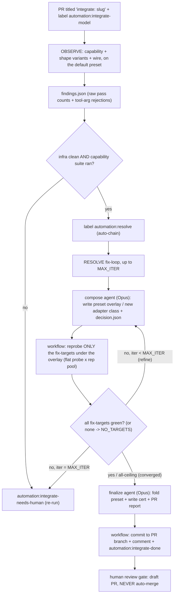

# Model auto-integration

Automates onboarding a new candidate model into the arena eval: DETECT its tool-calling
quirks, propose and PROVE a policy fix (or classify a genuine ceiling), and land a preset +
capability cert on the PR for human review. Two label-triggered GitHub Actions stages,
chained. It NEVER merges: the draft PR is the human review gate.

## Trigger

Open a PR titled `integrate: <openrouter-model-slug>` (e.g. `integrate: qwen/qwen3.6-plus`)
and add the label `automation:integrate-model`. That starts OBSERVE; a clean observe
auto-chains to RESOLVE.

## Flow

## Stage 1 - Observe (`.github/workflows/integrate-model.yml`)

Deterministic detection on the DEFAULT (raw) preset. Runs the capability integration probes +
shape variants (report-only, K repeats) and the NON-SCORING wire-probe task-pack, then
`scripts/integration/observe_findings.py` emits `findings.json` (raw pass counts + the
tool-arg rejections that graded metrics are blind to). Posts a summary comment.

- Clean (capability suite ran AND no infra contamination) -> adds `automation:resolve` (chain).
- Infra-dirty / did-not-run -> `automation:integrate-needs-human` (re-run needed).

## Stage 2 - Resolve (`.github/workflows/resolve-model.yml`)

A DETERMINISTIC loop drives the fix; short Opus Claude Code agents do the reasoning. Per
iteration (up to `MAX_ITER`): a `claude -p` agent (`prompts/resolve_agent.md`) reads the
findings and composes/refines a preset OVERLAY (a model-scoped entry combining reusable
adapter axes, or a new small adapter class it writes into the engine) plus a `decision.json`
naming its `fix_targets`, then the WORKFLOW runs `reprobe.py` on ONLY those fix-targets (as a
flat probe x rep pool, so both probes and repeats run concurrently) and green-checks them
(`resolve_greencheck.py`). The agent never runs reprobe/git, so it cannot stall on it.
Empirical rule: a fix-target still red under the policy is reclassified as a ceiling
(known_unsupported), not chased forever. If the agent names NO fix-targets (all failures are
genuine ceilings), the verdict is `NO_TARGETS` -> converge straight to finalize, which records
them as `known_unsupported`.

- Converged -> a finalize agent (`prompts/resolve_finalize.md`) folds the preset into
  `model_presets.yaml` and writes the cert into `registry.py`; the workflow commits to the PR
  branch, comments the integration record, and labels `automation:integrate-done`. NEVER merges.
- Not converged within `MAX_ITER` -> `automation:integrate-needs-human`.

## Auth split

- AGENT (Claude reasoning): `ANTHROPIC_API_KEY` (the same secret the hygiene review uses).
- CANDIDATE (reprobe live calls): `ARENA_AUTOMATION_OPENROUTER_API_KEY` (written to `.env`).

## Configuration (repo Actions variables)

| Variable | Default | Meaning |
|---|---|---|
| `OBSERVE_CAPABILITY_K` | 15 | observe capability + variant repeats |
| `OBSERVE_WIRE_K` | 10 | observe wire-probe repeats |
| `OBSERVE_WORKERS` / `OBSERVE_CAP_PARALLEL` | 10 / 4 | observe parallelism |
| `RESOLVE_MAX_ITER` | 3 | resolve fix-loop iterations |
| `RESOLVE_AGENT_MODEL` | claude-opus-4-8 | resolve agent model |
| `RESOLVE_CAPABILITY_K` | 5 | resolve per-iteration capability reprobe (cheap inner loop) |
| `RESOLVE_CAP_PARALLEL` | 10 | resolve reprobe width (flat probe x rep pool; keep >= `RESOLVE_CAPABILITY_K`, <= ~16 for the rate limit) |
| `RESOLVE_WIRE_K` | 10 | reserved for the final wire-verification pass (not yet wired) |

## Labels (the state machine)

`automation:integrate-model` (trigger observe) -> `automation:integrate-running` ->
`automation:resolve` (clean observe) -> `automation:resolve-running` ->
`automation:integrate-done` (success) OR `automation:integrate-needs-human` (infra-dirty, or
no convergence).

## Prompts (`scripts/integration/prompts/`)

The analysis-dimension briefs interpret an eval or observe artifact (one dimension per
sub-agent); the resolve prompts drive the fix loop. `index.yaml` is the machine-readable map.

| Prompt | Used by | What it does (brief) |
|---|---|---|
| `_shared_context.md` | every analysis dimension | Prepended context: data layout, pass@k/pass^k metric definitions, the four-bucket vocabulary, observe-vs-eval mode, the aggregate-synthesis precedence, efficiency rules. |
| `harness_infra.md` | analysis | Is any failure infra-caused (429 / timeout / max_turns / stuck / crash)? Gates trust in the pass numbers. |
| `preset_codec_leak.md` | analysis | Did the intended preset apply on every trial, with no reasoning-leak or schema-loss? Verdict: clean-native OR the exact policy-fix target. |
| `four_bucket.md` | analysis | Bucket every failing trial into infra / oracle / formatting / genuine-model; how many pp are recoverable at all. |
| `consistency_passk.md` | analysis | pass@1 / pass@5 / pass^5 + consistency tax; is the model consistency-limited or capability-limited. |
| `task_design_oracle.md` | analysis (eval only) | Find FALSE failures (correct action graded fail) + unwinnable/ambiguous tasks; footnote vs regrade. |
| `resolve_agent.md` | resolve (per iteration) | Compose or refine the model's preset overlay from reusable adapter axes (or write a new small adapter class), and write `decision.json` (fix_targets / ceilings / required). Does NOT run reprobe or commit. |
| `resolve_finalize.md` | resolve (on convergence) | Fold the proven overlay into `model_presets.yaml` + write the cert into `registry.py`, and write the PR comment/description. Does NOT commit. |

## Key files

- `scripts/integration/observe_findings.py` - deterministic raw-stat facts emitter (no banding,
  no verdict; interpretation is the agent's job).
- `scripts/integration/reprobe.py` - targeted re-probe under a policy overlay; re-runs ONLY the
  named `--targets` (the agent's fix-targets), or all failed probes if none given, as a flat
  (probe x rep) pool parallelized at `--cap-parallel`; capability-only inner loop, plus a final
  wire pass on failed wire tasks.
- `scripts/integration/resolve_greencheck.py` - fix-target convergence check.
- `scripts/integration/prompts/` - `_shared_context.md` + the analysis dimension briefs
  (`harness_infra` / `preset_codec_leak` / `four_bucket` / `consistency_passk` /
  `task_design_oracle`) and the resolve agent prompts (`resolve_agent.md`, `resolve_finalize.md`).

## Notes

- A "policy" is a preset entry composing SHIPPED adapter axes (schema_sanitizer / prompt_policy /
  response_policy / reasoning_codec / content_policy / cache_policy / params). A genuinely novel
  recovery needs a NEW adapter class (engine code) which the agent writes + registers.
- The auto-cert is verified at `RESOLVE_CAPABILITY_K` (a small sample by default) and can be MORE
  optimistic than a human baseline. The draft-PR human gate and the hygiene review are the
  backstop: never merge an auto-integration without review.
- Disposable de-integration test branches (`test/observe-<model>`) simulate a fresh candidate by
  deleting the model's cert/preset; they carry deletions and are NEVER merged out.
