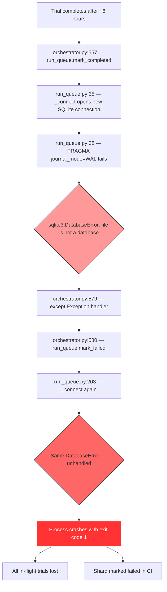
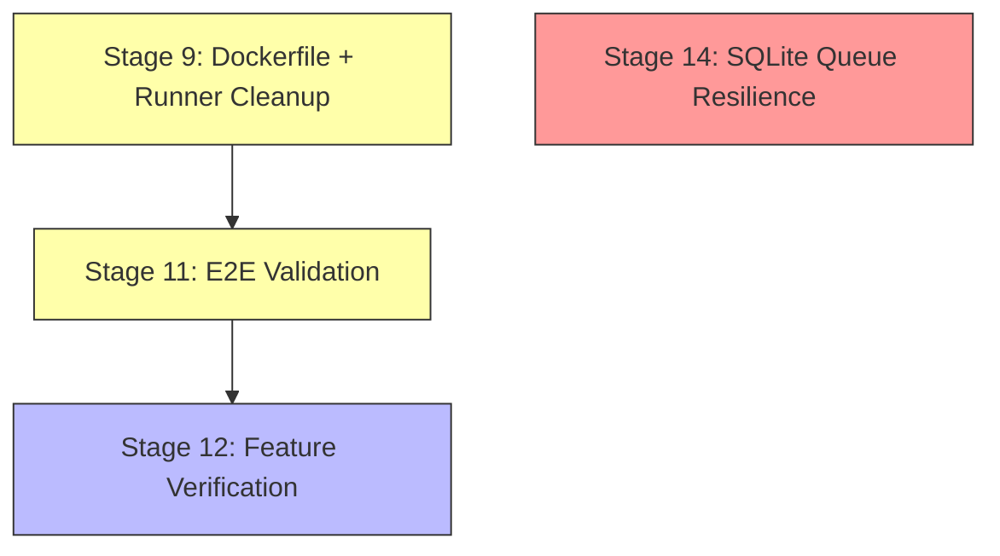

# Future Development Plan

> **Status:** Active
> **Updated:** 2026-04-02
> **Scope:** Dockerfile cleanup, end-to-end validation, feature verification, SQLite resilience

---

## Table of Contents

- [Completed Work](#completed-work)
- [Open Issues](#open-issues)
- [Stage 9 — Dockerfile Review and Runner Image Cleanup](#stage-9--dockerfile-review-and-runner-image-cleanup)
- [Stage 11 — End-to-End Adapter and Provider Validation](#stage-11--end-to-end-adapter-and-provider-validation)
- [Stage 12 — Feature Verification Matrix](#stage-12--feature-verification-matrix)
- [Stage 14 — SQLite Run Queue Corruption Resilience](#stage-14--sqlite-run-queue-corruption-resilience)
- [Dependency Graph](#dependency-graph)
- [Migration Checklist](#migration-checklist)

---

## Completed Work

| Stage | Achievement |
|-------|------------|
| 0–6 (Phase 1) | Task data separation, Docker Python layer, adapter plugins, native conversion layer, canonical test infrastructure |
| 7 | Test failures fixed: 31→0 failures, 708→1 warnings. Dead-skip tests deleted, skips reduced 103→23. Final: 427 passed, 23 skipped, 0 failures |
| 10 | Test consolidation: 5→3 categories (unit/canonical/integration). `functional/` and `e2e/` deleted. 688→449 tests |
| 13 | `.gitattributes` cleaned, 39 orphaned files removed, `.gitignore` updated, 3 unused test utils deleted |
| FrozenMcpCoreAdapter | Self-contained converted tasks with `_domain/` bundle, `tool_artifacts` delivery, stable hash grading. Unit + integration tests |

---

## Open Issues

### Issue 1 — Runner Docker image includes unnecessary domain files

The Runner Docker image bakes in domain-specific directories that should not be part of the image. This causes:
- **Unnecessary rebuilds:** touching domain files triggers a content-hash change and full rebuild
- **Slow context assembly:** `shutil.copytree` copies files to a temp directory
- **Bloated image:** redundant copies of domain code already delivered via `tool_artifacts`
- **Wrong abstraction:** new domains require modifying Docker infrastructure

The problem exists in three synchronized locations:

| Location | What it contains |
|----------|-----------------|
| `docker/runner.Dockerfile` | COPY commands + PYTHONPATH for domain dirs |
| `tolokaforge/docker/stacks/core.py` | `context_files` list with domain dirs |
| `tolokaforge/docker/builder.py` | `IMAGE_DEFINITIONS` with domain dirs |

### Issue 2 — `docker/` directory: still needed?

The `docker/` directory contains 8 Dockerfiles. Questions:
- Are all 8 Dockerfiles still needed? `json_db.Dockerfile` and `db_service.Dockerfile` may overlap. `orchestrator.Dockerfile` and `agent.Dockerfile` may be obsolete.
- Should Dockerfiles move inside `tolokaforge/docker/dockerfiles/`?
- Do Dockerfiles correctly reference the new project structure?

### Issue 3 — No end-to-end validation for native adapter

We have not:
- Launched tasks with `native` adapter
- Verified different LLM providers (Anthropic, OpenAI, OpenRouter)
- Verified the Docker infrastructure works (`tolokaforge docker build`, `tolokaforge docker up`)

Frozen MCP core adapter has been partially validated — converted tasks run successfully via `frozen_mcp_core`. More complex features remain untested.

### Issue 4 — Feature verification gaps

Task/grading features not verified post-refactoring:
- Unstable fields (excluded from hash comparison)
- Unstable extra fields (dynamically added by tool execution)
- Tools initial state + task-specific data patches
- Different grading methods (hash, transcript, LLM judge, custom checks, combined)
- User simulator with backstory/context injection
- Multi-turn conversation tracing

### Issue 5 — SQLite run queue corruption crashes CI benchmark shards

**Observed:** 2026-04-02, during a long-running benchmark shard.

After ~6 hours of execution, the `run_queue.sqlite` file becomes corrupted, producing `sqlite3.DatabaseError: file is not a database` when any operation tries to connect. The immediate crash is caused by a **cascading double-fault** in the orchestrator exception handler: when `mark_completed()` fails with a DB error, the `except` block calls `mark_failed()` which also calls `_connect()` and throws the same error — this second exception is unhandled and kills the process.

**Error trace (abbreviated):**
```
File "tolokaforge/core/orchestrator.py", line 557, in run
    run_queue.mark_completed(lease.id, cost_usd=trial_cost)
  File "tolokaforge/core/run_queue.py", line 185, in mark_completed
    with self._connect() as conn:
  File "tolokaforge/core/run_queue.py", line 38, in _connect
    conn.execute("PRAGMA journal_mode=WAL")
sqlite3.DatabaseError: file is not a database

During handling of the above exception, another exception occurred:

  File "tolokaforge/core/orchestrator.py", line 580, in run
    should_retry = run_queue.mark_failed(lease.id, str(e), retryable=True)
  File "tolokaforge/core/run_queue.py", line 203, in mark_failed
    with self._connect() as conn:
  File "tolokaforge/core/run_queue.py", line 38, in _connect
    conn.execute("PRAGMA journal_mode=WAL")
sqlite3.DatabaseError: file is not a database
```

**Contributing factors:**
1. Every `SqliteRunQueue` operation creates a new `sqlite3.Connection` via `_connect()` — thousands of connect/disconnect cycles over 6+ hours churn WAL/SHM files
2. No WAL checkpointing — the WAL journal grows unbounded during long runs
3. Disk pressure on CI runners from trial outputs + Docker images accumulating over hours
4. No retry logic for transient SQLite errors
5. No fault tolerance in the orchestrator exception handler — a DB error in the error path is unrecoverable

**Impact:** Process exit code 1, all in-flight trials lost, shard marked as failed in CI.

**See:** [Stage 14](#stage-14--sqlite-run-queue-corruption-resilience) for the fix plan.

---

## Stage 9 — Dockerfile Review and Runner Image Cleanup

> **Goal:** Make the Runner Docker image domain-agnostic. Remove domain-specific files from the build context. Audit and consolidate Dockerfiles.

### 9.1 Adapter tool delivery analysis

The key question for removing baked-in domain files is: how does each adapter deliver tools to the Docker Runner?

| Adapter | Delivery mechanism | Uses `tool_artifacts`? | Needs baked-in files? |
|---------|--------------------|:----------------------:|:---------------------:|
| `frozen_mcp_core` | Bundles `_domain/` as base64 in `TaskDescription.tool_artifacts` | ✅ | ❌ |
| `native` | MCP server subprocess / file-based | N/A | Depends on tool type |

**`frozen_mcp_core`** populates `TaskDescription.tool_artifacts`. The Runner's `_extract_tool_artifacts()` (`tolokaforge/runner/service.py:279`) handles extraction + `sys.path` injection.

### 9.2 Solution paths

**Path A — Freeze everything (recommended):**
- Convert all tasks to frozen format, use `frozen_mcp_core` exclusively for Docker runs
- Runner image only contains `tolokaforge/` + `pyproject.toml` + `README.md`
- Zero domain files in Docker context → fast rebuilds, small image, domain-agnostic

### 9.3 Implementation plan (Path A)

1. Strip domain directories from `runner.Dockerfile` COPY commands and PYTHONPATH
2. Strip domain directories from `core.py` `context_files`
3. Strip domain directories from `builder.py` `IMAGE_DEFINITIONS`
4. Keep only: `pyproject.toml`, `README.md`, `tolokaforge/`
5. Remove domain-specific `pip install` commands from runner.Dockerfile (lines 56–67)
6. Verify `frozen_mcp_core` tasks still work end-to-end with minimal image
7. Document that live adapters require in-process runtime for Docker runs

### 9.4 Audit Dockerfiles

| Dockerfile | Purpose | Status to verify |
|-----------|---------|-----------------|
| `db_service.Dockerfile` | JSON DB state service | Needed |
| `json_db.Dockerfile` | Legacy alias? | May overlap with `db_service.Dockerfile` |
| `runner.Dockerfile` | gRPC runner service | Needed — simplify per 9.3 |
| `rag.Dockerfile` | RAG search service | Needed |
| `mock_web.Dockerfile` | Mock web service | Needed |
| `executor.Dockerfile` | Tool executor | Verify still used |
| `orchestrator.Dockerfile` | Orchestrator container | Verify still used |
| `agent.Dockerfile` | Agent container | Verify still used |

### 9.5 Verification gate

- [ ] Runner image builds with only `tolokaforge/` + `pyproject.toml` + `README.md`
- [ ] `frozen_mcp_core` tasks execute correctly with minimal runner image
- [ ] Content hash depends only on `tolokaforge/` source
- [ ] No orphaned Dockerfiles
- [ ] `builder.py` IMAGE_DEFINITIONS matches actual files
- [ ] `tolokaforge docker build --core` succeeds

---

## Stage 11 — End-to-End Adapter and Provider Validation

> **Goal:** Validate full pipeline for each adapter. Test LLM provider connectivity.

### 11.1 Current validation status

| Adapter | Convert | Run (in-process) | Run (Docker) | Notes |
|---------|:-------:|:-----------------:|:------------:|-------|
| `frozen_mcp_core` | ✅ | ✅ partially | Not tested | Converted + ran. Complex features untested |
| `native` | N/A | Not tested | Not tested | |

### 11.2 NativeAdapter end-to-end

```bash
# Validate native tasks
tolokaforge validate --tasks "examples/**/task.yaml"

# Run a native task
tolokaforge run --config examples/browser_task/run_config.yaml --limit 1
```

### 11.3 FrozenMcpCoreAdapter — extended validation

The basic pipeline works. Next steps:
- Test tasks with TypeSense search enabled
- Test tasks with user LLM simulator (not scripted)
- Test tasks with complex data patches
- Verify unstable fields are correctly excluded from hash grading

### 11.4 Docker infrastructure validation

```bash
tolokaforge docker build
tolokaforge docker up --profile core
tolokaforge docker status
tolokaforge docker down
```

### 11.5 LLM provider connectivity

Test each configured provider:
- Anthropic (Claude) — `ANTHROPIC_API_KEY`
- OpenAI — `OPENAI_API_KEY`
- OpenRouter — `OPENROUTER_API_KEY`

### 11.6 Verification gate

- [ ] NativeAdapter validates all example tasks
- [ ] FrozenMcpCoreAdapter runs tasks with TypeSense, user LLM, data patches
- [ ] Docker services start and pass health checks
- [ ] At least one LLM provider can complete a minimal task

---

## Stage 12 — Feature Verification Matrix

> **Goal:** Systematically verify every task/grading feature works correctly post-refactoring.

### 12.1 Grading method verification

| Grading Method | Task to Test | What to Verify |
|---------------|-------------|----------------|
| Hash-based | frozen retail tasks | `state_checks.hash` compares final DB state against golden hash |
| Transcript rules | calc_custom_checks | `transcript_checks.required_phrases` pattern matching |
| State assertions | tool_use_public_example_01 | `state_checks.assertions` JSONPath checks |
| LLM judge | (create test task) | `judge` config calls LLM and returns structured score |
| Custom checks | order_modify_with_checks | `custom_checks.script` executes Python grading logic |
| Combined grading | (create test task) | Multiple grading methods compose correctly |

### 12.2 Unstable fields verification

- Create a test with `unstable_fields` config
- Verify fields marked as unstable are excluded from hash comparison
- Verify `unstable_extra_fields` (fields dynamically added by tools) are handled

### 12.3 Initial state and data patches

- Verify `initial_state.json_db` correctly populates the DB service
- Verify task-specific `data_patch` overrides merge with base state
- Verify tools can read/write the populated state

### 12.4 User simulator features

- Verify user simulator receives backstory and context
- Verify multi-turn conversation tracks context between turns
- Verify user simulator generates contextually relevant replies

### 12.5 Verification gate

- [ ] Each grading method produces correct pass/fail for known inputs
- [ ] Unstable fields excluded from hash comparison
- [ ] Data patches merge correctly
- [ ] User simulator maintains context across turns

---

## Stage 14 — SQLite Run Queue Corruption Resilience

> **Goal:** Prevent the orchestrator from crashing when the SQLite run queue database becomes corrupted during long CI benchmark runs. Ensure partial results are preserved and the process degrades gracefully.
> **Tracks:** [Issue 5](#issue-5--sqlite-run-queue-corruption-crashes-ci-benchmark-shards)
> **Priority:** High — blocks reliable CI benchmark execution

### 14.0 Failure anatomy

The failure chain has two distinct problems that must be addressed independently:



**Problem 1 — Root cause: SQLite file corruption.** The database worked for ~6 hours then became unreadable. Contributing factors:

| Factor | Detail |
|--------|--------|
| Connection churn | Every `SqliteRunQueue` operation creates a new `sqlite3.Connection`, executes one query, closes it. With 5 workers over 6 hours = thousands of connect/disconnect cycles churning WAL/SHM files |
| No WAL checkpointing | `PRAGMA journal_mode=WAL` is set on every connect, but `wal_checkpoint` is never called. WAL grows unbounded |
| CI disk pressure | 5 workers x 5 repeats + Docker containers + trial outputs accumulate over hours on finite runner disk |
| No retry on transient errors | A brief SQLITE_BUSY or I/O hiccup causes immediate failure with no recovery attempt |

**Problem 2 — Cascading crash: No fault tolerance in exception handler.** When `mark_completed()` throws at `orchestrator.py:557`, the `except` block at line 580 calls `mark_failed()` which also calls `_connect()` — a second unhandled `DatabaseError` kills the process.

### 14.1 Fix 1 — Orchestrator exception handler safety net

**File:** `tolokaforge/core/orchestrator.py`
**Lines:** 528, 557, 580

Wrap every `run_queue.*` call inside the worker completion loop in a `try/except` so that a broken queue database does not crash the process. When the queue is unreachable, fall back to updating `run_state.json` directly via `StateManager` (which writes to a plain JSON file, independent of SQLite).

**Current code at line 579:**
```python
except Exception as e:
    should_retry = run_queue.mark_failed(lease.id, str(e), retryable=True)
    self.logger.error(
        "Trial execution exception",
        task_id=task_id, trial_index=trial_idx,
        error=str(e), will_retry=should_retry,
    )
    if not should_retry:
        run_state.mark_failed(task_id, trial_idx, str(e))
        self.state_manager.save_state(run_state)
```

**Proposed replacement:**
```python
except Exception as e:
    try:
        should_retry = run_queue.mark_failed(lease.id, str(e), retryable=True)
    except Exception as db_err:
        self.logger.error(
            "Queue DB error while marking failure; treating as non-retryable",
            task_id=task_id, trial_index=trial_idx,
            original_error=str(e), db_error=str(db_err),
        )
        should_retry = False
    self.logger.error(
        "Trial execution exception",
        task_id=task_id, trial_index=trial_idx,
        error=str(e), will_retry=should_retry,
    )
    if not should_retry:
        run_state.mark_failed(task_id, trial_idx, str(e))
        self.state_manager.save_state(run_state)
```

Apply the same pattern to:
- **Line 528:** `run_queue.mark_failed(lease.id, ...)` in the retryable trajectory branch
- **Line 557:** `run_queue.mark_completed(lease.id, ...)` in the success path

Also wrap `run_queue.get_counts()` at line 608 (post-loop summary) so the cleanup path does not crash either.

### 14.2 Fix 2 — Thread-local connection reuse in SqliteRunQueue

**File:** `tolokaforge/core/run_queue.py`
**Class:** `SqliteRunQueue`

Replace the create-connect-close-per-operation pattern with thread-local connection caching. This eliminates WAL churn and avoids redundant PRAGMA execution on every call.

**Current `_connect()` at line 35:**
```python
def _connect(self) -> sqlite3.Connection:
    conn = sqlite3.connect(self.db_path, timeout=30.0, isolation_level=None)
    conn.row_factory = sqlite3.Row
    conn.execute("PRAGMA journal_mode=WAL")
    conn.execute("PRAGMA synchronous=NORMAL")
    conn.execute("PRAGMA busy_timeout=5000")
    return conn
```

**Proposed replacement:**
```python
import threading

class SqliteRunQueue:
    def __init__(self, db_path: Path, max_retries: int = 0):
        self.db_path = Path(db_path)
        self.max_retries = max(0, int(max_retries))
        self.db_path.parent.mkdir(parents=True, exist_ok=True)
        self._local = threading.local()
        self._checkpoint_interval_s = 60.0
        self._last_checkpoint_at = 0.0
        self._init_db()

    def _connect(self) -> sqlite3.Connection:
        # Reuse per-thread connection when available and healthy
        conn = getattr(self._local, "conn", None)
        if conn is not None:
            try:
                conn.execute("SELECT 1")
                return conn
            except sqlite3.Error:
                try:
                    conn.close()
                except Exception:
                    pass
                self._local.conn = None

        # Create new connection with retry
        conn = self._new_connection()
        self._local.conn = conn
        return conn

    def _new_connection(self, retries: int = 3) -> sqlite3.Connection:
        last_err: Exception | None = None
        for attempt in range(retries):
            try:
                conn = sqlite3.connect(
                    self.db_path, timeout=30.0, isolation_level=None
                )
                conn.row_factory = sqlite3.Row
                conn.execute("PRAGMA journal_mode=WAL")
                conn.execute("PRAGMA synchronous=NORMAL")
                conn.execute("PRAGMA busy_timeout=5000")
                return conn
            except sqlite3.DatabaseError as e:
                last_err = e
                if attempt < retries - 1:
                    time.sleep(0.5 * (2 ** attempt))  # 0.5s, 1s, 2s
        raise sqlite3.DatabaseError(
            f"SQLite connect failed after {retries} attempts: {last_err}"
        ) from last_err
```

Key behaviors:
- `_connect()` returns cached per-thread connection if healthy (verified by `SELECT 1`)
- On stale/broken connection, creates a new one via `_new_connection()`
- `_new_connection()` retries up to 3 times with exponential backoff (0.5s, 1s, 2s)
- `threading.local()` ensures each `ThreadPoolExecutor` worker thread gets its own connection — no cross-thread sharing

### 14.3 Fix 3 — Periodic WAL checkpointing

**File:** `tolokaforge/core/run_queue.py`
**Class:** `SqliteRunQueue`

Add a `_maybe_checkpoint()` helper called after state-mutating operations (`mark_completed`, `mark_failed`). Uses `PRAGMA wal_checkpoint(PASSIVE)` which does not block readers or writers.

```python
def _maybe_checkpoint(self, conn: sqlite3.Connection) -> None:
    """Run passive WAL checkpoint to prevent unbounded WAL growth."""
    now = time.time()
    if now - self._last_checkpoint_at < self._checkpoint_interval_s:
        return
    try:
        conn.execute("PRAGMA wal_checkpoint(PASSIVE)")
        self._last_checkpoint_at = now
    except sqlite3.Error:
        pass  # best-effort; do not propagate checkpoint failures
```

Call sites — add at the end of:
- `mark_completed()` after the UPDATE
- `mark_failed()` after the UPDATE

Default `_checkpoint_interval_s = 60.0` — at most one checkpoint per minute. The `PASSIVE` mode checkpoints only pages that do not require blocking, so it is safe to call from any thread.

### 14.4 Fix 4 — Retry logic in `_connect()`

This is already included in Fix 2 above via `_new_connection(retries=3)`. The retry handles:
- `sqlite3.DatabaseError` — covers "file is not a database", corrupt header, I/O errors
- Exponential backoff — 0.5s, 1s, 2s between attempts
- Clear error message after exhaustion — includes the original exception via `from last_err`

Note: Retry will NOT fix actual file corruption (the header bytes are wrong). It will help with:
- Transient `SQLITE_BUSY` that somehow surfaces as `DatabaseError`
- Brief disk I/O errors that resolve on retry
- Race conditions during WAL recovery

For true corruption, Fix 1 (orchestrator safety net) is the backstop.

### 14.5 Fix 5 — Unit tests for resilience paths

**File:** `tests/unit/test_run_queue.py` — add tests:

| Test | What it verifies |
|------|-----------------|
| `test_connect_retries_on_transient_error` | Mock `sqlite3.connect` to fail twice then succeed; verify 3 attempts, correct backoff sleep calls |
| `test_connect_raises_after_max_retries` | Mock persistent failure; verify clean error after 3 attempts |
| `test_thread_local_connection_reuse` | Call `_connect()` twice from same thread; verify same connection object returned |
| `test_thread_local_isolation` | Call `_connect()` from two threads; verify different connection objects |
| `test_wal_checkpoint_called_periodically` | Mock time; verify `PRAGMA wal_checkpoint` fires after interval |
| `test_wal_checkpoint_not_called_too_often` | Verify checkpoint skipped when called within interval |
| `test_stale_connection_replaced` | Set `_local.conn` to a broken mock; verify `_connect()` creates fresh connection |

**File:** `tests/unit/test_orchestrator_db_resilience.py` (new) — add tests:

| Test | What it verifies |
|------|-----------------|
| `test_mark_completed_survives_db_error` | Mock `run_queue.mark_completed` to raise; verify orchestrator logs error, updates `run_state` directly, does not crash |
| `test_mark_failed_survives_db_error` | Mock `run_queue.mark_failed` to raise; verify orchestrator catches, sets `should_retry=False`, updates `run_state` |

### 14.6 Relevant source code reference

| File | Line | Function/Class | Role in fix |
|------|------|---------------|-------------|
| `tolokaforge/core/run_queue.py` | 22 | `SqliteRunQueue` | Connection management, WAL checkpointing, retry logic |
| `tolokaforge/core/run_queue.py` | 35 | `_connect()` | Primary modification target for Fixes 2-4 |
| `tolokaforge/core/run_queue.py` | 183 | `mark_completed()` | Add checkpoint call |
| `tolokaforge/core/run_queue.py` | 200 | `mark_failed()` | Add checkpoint call |
| `tolokaforge/core/orchestrator.py` | 528 | `run` — retryable branch | Wrap in try/except |
| `tolokaforge/core/orchestrator.py` | 557 | `run` — success branch | Wrap in try/except |
| `tolokaforge/core/orchestrator.py` | 580 | `run` — exception handler | Wrap in try/except — critical fix |
| `tolokaforge/core/orchestrator.py` | 608 | `run` — post-loop counts | Wrap in try/except |
| `tolokaforge/core/resume.py` | 127 | `save_state()` | Fallback persistence path — writes JSON, independent of SQLite |
| `tests/unit/test_run_queue.py` | 1 | Existing tests | Add resilience test cases |

### 14.7 Implementation order

1. **Fix 1** — Orchestrator exception handler safety net (prevents cascading crash)
2. **Fix 2** — Thread-local connection reuse (biggest prevention impact)
3. **Fix 3** — Periodic WAL checkpointing (prevents WAL bloat)
4. **Fix 4** — Retry in `_new_connection()` (already part of Fix 2)
5. **Fix 5** — Unit tests for all above

### 14.8 Verification gate

- [ ] Fix 1: Orchestrator exception handler wraps queue DB calls in try/except
- [ ] Fix 2: `SqliteRunQueue` uses `threading.local()` for connection caching
- [ ] Fix 2: `_new_connection()` retries up to 3 times with exponential backoff
- [ ] Fix 3: `_maybe_checkpoint()` called after `mark_completed` and `mark_failed`
- [ ] Fix 5: Unit tests pass for retry, thread-local, checkpoint, and orchestrator resilience
- [ ] Existing `tests/unit/test_run_queue.py` tests still pass
- [ ] Lint passes: `uv run ruff check tolokaforge tests`

---

## Dependency Graph



**Execution order:** Stage 14 is independent and can be implemented immediately. Stage 9 → 11 → 12 remain sequential.

---

## Migration Checklist

### Stage 9 — Dockerfile Review + Runner Cleanup
- [ ] Analyze adapter tool delivery mechanisms
- [ ] Strip domain directories from runner.Dockerfile, core.py, builder.py
- [ ] Audit all 8 Dockerfiles for necessity
- [ ] Remove duplicates and unused Dockerfiles
- [ ] Verify minimal runner image works with frozen_mcp_core
- [ ] Update `ImageBuilder` definitions

### Stage 11 — E2E Validation
- [x] FrozenMcpCoreAdapter converts and runs tasks (basic pipeline)
- [ ] FrozenMcpCoreAdapter extended validation (TypeSense, user LLM, data patches)
- [ ] NativeAdapter validates and runs tasks
- [ ] Docker services start and health-check
- [ ] At least one LLM provider completes a task

### Stage 12 — Feature Verification
- [ ] All grading methods verified
- [ ] Unstable fields work correctly
- [ ] Initial state and data patches work
- [ ] User simulator maintains context

### Stage 14 — SQLite Run Queue Corruption Resilience
- [ ] Fix 1: Orchestrator exception handler wraps queue DB calls in try/except
- [ ] Fix 2: `SqliteRunQueue` uses `threading.local()` for connection caching with retry
- [ ] Fix 3: Periodic WAL checkpointing via `_maybe_checkpoint()`
- [ ] Fix 5: Unit tests for retry, thread-local, checkpoint, and orchestrator resilience
- [ ] All existing `test_run_queue.py` tests still pass
- [ ] Lint clean
