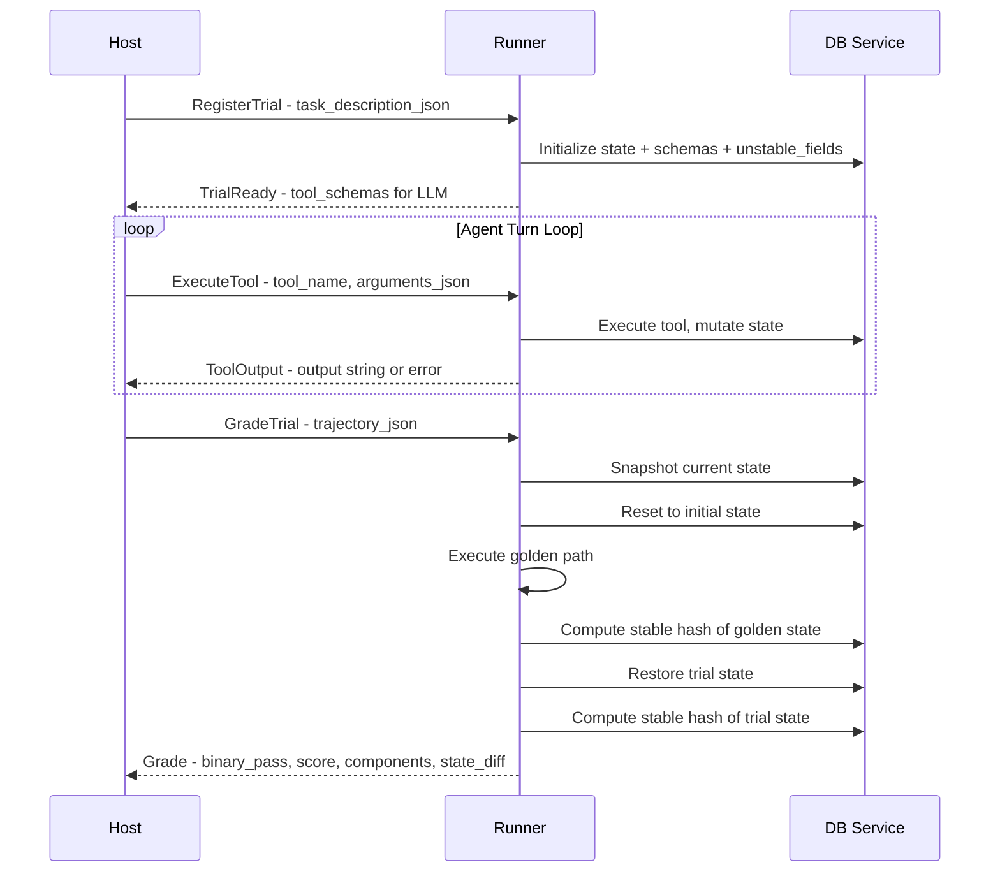

# gRPC Protocol: Host ↔ Runner Communication

This document defines the gRPC protocol for communication between the **Host** (orchestrator) and **Runner** (container) in the Tolokaforge distributed architecture.

## Architecture Overview

```
┌─────────────────────────────────────────────────────────────────────────────┐
│                                   HOST                                       │
│  ┌─────────────┐  ┌─────────────┐  ┌─────────────┐  ┌─────────────────────┐ │
│  │ Task Loader │  │ LLM Client  │  │ Trial Coord │  │ Results Collection  │ │
│  └──────┬──────┘  └──────┬──────┘  └──────┬──────┘  └──────────┬──────────┘ │
│         │                │                │                     │            │
│         └────────────────┴────────────────┴─────────────────────┘            │
│                                   │                                          │
│                          gRPC Channel                                        │
└──────────────────────────────────┬───────────────────────────────────────────┘
                                   │
┌──────────────────────────────────┴───────────────────────────────────────────┐
│                            RUNNER CONTAINER                                   │
│  ┌─────────────────┐  ┌─────────────────┐  ┌─────────────────────────────┐   │
│  │ Adapter Runtime │  │ Tool Execution  │  │ Grading Engine              │   │
│  │ - Tool Reconstr │  │ - MCP/Tau/Native│  │ - Golden Path Execution     │   │
│  │ - Schema Gen    │  │ - State Mutation│  │ - Hash Comparison           │   │
│  └────────┬────────┘  └────────┬────────┘  └──────────────┬──────────────┘   │
│           │                    │                          │                   │
│           └────────────────────┴──────────────────────────┘                   │
│                                   │                                           │
│                          Internal gRPC                                        │
└──────────────────────────────────┬────────────────────────────────────────────┘
                                   │
┌──────────────────────────────────┴────────────────────────────────────────────┐
│                          DB SERVICE CONTAINER                                  │
│  ┌─────────────────┐  ┌─────────────────┐  ┌─────────────────────────────┐    │
│  │ State Storage   │  │ Schema + Fields │  │ Stable State Filtering      │    │
│  │ - Tables        │  │ - Unstable Spec │  │ - Hash Computation          │    │
│  │ - Snapshots     │  │ - Validation    │  │ - Snapshot/Restore          │    │
│  └─────────────────┘  └─────────────────┘  └─────────────────────────────┘    │
└───────────────────────────────────────────────────────────────────────────────┘
```

## Protocol Flow



## Protocol Definition

```protobuf
syntax = "proto3";

package tolokaforge.runner;

option go_package = "tolokaforge/runner";

// =============================================================================
// Runner Service - Main Host ↔ Runner communication
// =============================================================================

service RunnerService {
  // Register a new trial with full task description
  // Host sends TaskDescription JSON, Runner initializes environment
  rpc RegisterTrial(RegisterTrialRequest) returns (RegisterTrialResponse);

  // Execute a tool call from the LLM
  // Host forwards tool call, Runner executes and returns output
  rpc ExecuteTool(ExecuteToolRequest) returns (ExecuteToolResponse);

  // Grade the completed trial
  // Host sends trajectory, Runner computes grade via golden path comparison
  rpc GradeTrial(GradeTrialRequest) returns (GradeTrialResponse);

  // Get current state snapshot - for debugging
  rpc GetState(GetStateRequest) returns (GetStateResponse);

  // Reset trial state to initial - for retries
  rpc ResetTrial(ResetTrialRequest) returns (ResetTrialResponse);

  // Health check
  rpc HealthCheck(HealthCheckRequest) returns (HealthCheckResponse);
}

// =============================================================================
// RegisterTrial - Initialize trial with full TaskDescription
// =============================================================================

message RegisterTrialRequest {
  // Unique identifier for this trial instance
  // Format: "{task_id}:{trial_index}" e.g. "airline_task_001:0"
  string trial_id = 1;

  // Full TaskDescription as JSON string
  // See docs/TASK_DESCRIPTION_SCHEMA.md for schema
  // Contains: task_id, system_prompt, agent_tools, user_tools,
  //           initial_state, grading config, user_simulator config
  string task_description_json = 2;

  // Optional: Override timeout for tool execution (seconds)
  double default_tool_timeout_s = 3;
}

message RegisterTrialResponse {
  // Whether registration succeeded
  bool success = 1;

  // Error message if registration failed
  string error = 2;

  // Tool schemas in OpenAI function calling format
  // These are returned to Host for LLM tool configuration
  // Format: [{"type": "function", "function": {"name": "...", "description": "...", "parameters": {...}}}]
  repeated ToolSchema tool_schemas = 3;

  // Number of agent tools registered
  int32 num_agent_tools = 4;

  // Number of user tools registered (for dual-control scenarios)
  int32 num_user_tools = 5;
}

// Tool schema in OpenAI function calling format
message ToolSchema {
  string name = 1;
  string description = 2;
  // JSON Schema for parameters
  string parameters_json = 3;
  // Tool category: "read", "write", "compute"
  string category = 4;
  // Timeout override for this specific tool
  double timeout_s = 5;
}

// =============================================================================
// ExecuteTool - Execute a single tool call
// =============================================================================

message ExecuteToolRequest {
  // Trial identifier (must match a registered trial)
  string trial_id = 1;

  // Tool name to execute
  string tool_name = 2;

  // Tool arguments as JSON string
  // Must conform to the tool's parameter schema
  string arguments_json = 3;

  // Timeout for this execution (seconds)
  // If 0, uses default from RegisterTrial or tool schema
  double timeout_seconds = 4;

  // Which environment is making the call
  // "agent" for assistant tools, "user" for user-side tools
  string executor = 5;
}

message ExecuteToolResponse {
  // Execution status
  ExecutionStatus status = 1;

  // Tool output string (what the LLM sees)
  // For success: the tool's return value as string
  // For error: empty (see error_message)
  // For timeout: empty (see error_message)
  string output = 2;

  // Error message if status != SUCCESS
  string error_message = 3;

  // Execution metrics
  ToolMetrics metrics = 4;
}

enum ExecutionStatus {
  EXECUTION_STATUS_UNSPECIFIED = 0;
  EXECUTION_STATUS_SUCCESS = 1;
  EXECUTION_STATUS_ERROR = 2;
  EXECUTION_STATUS_TIMEOUT = 3;
  EXECUTION_STATUS_TOOL_NOT_FOUND = 4;
  EXECUTION_STATUS_INVALID_ARGUMENTS = 5;
  EXECUTION_STATUS_TRIAL_NOT_FOUND = 6;
}

message ToolMetrics {
  // Execution latency in seconds
  double latency_seconds = 1;

  // Exit code (for bash-like tools)
  int32 exit_code = 2;

  // Number of state mutations caused by this tool (optional, low priority)
  // Requires Runner to track via DB Service - may be 0 if not implemented
  int32 state_mutations = 3;
}

// =============================================================================
// Design Note: Executor Field (agent vs user)
// =============================================================================
//
// The `executor` field on ExecuteToolRequest distinguishes between:
//
// - "agent": Tools called by the assistant (LLM agent)
//   Examples: get_customer_by_phone, book_reservation, create_ticket
//
// - "user": Tools called by the user simulator (user-side device tools)
//   Examples: toggle_airplane_mode, toggle_data, check_internet_speed
//
// This is important for Native adapter tasks with dual-control scenarios
// where both agent and user have tools that mutate shared state.
//
// The Runner uses this to:
// 1. Route to correct tool registry (agent_tools vs user_tools)
// 2. Track tool calls by executor for required_actions grading
// 3. Apply appropriate permissions/sandboxing per executor

// =============================================================================
// GradeTrial - Compute grade for completed trial
// =============================================================================

message GradeTrialRequest {
  // Trial identifier
  string trial_id = 1;

  // Optional: LLM messages for transcript rules grading
  // Only needed if grading config includes transcript_rules (must_contain, required_actions, etc.)
  // For hash-only grading (TlkMcpCore, Tau), this can be omitted - Runner has tool call history
  // Contains: messages array with role, content (assistant/user text only, not tool results)
  string llm_messages_json = 2;

  // Optional: Skip golden path execution if expected hash is pre-computed
  // If provided, Runner compares trial state hash directly
  string precomputed_expected_hash = 3;

  // Which grading components to compute
  // If empty, computes all configured in TaskDescription.grading
  repeated string grading_components = 4;  // "state_checks", "transcript_rules"
}

message GradeTrialResponse {
  // Whether grading succeeded
  bool success = 1;

  // Error message if grading failed
  string error = 2;

  // The computed grade
  Grade grade = 3;
}

message Grade {
  // Binary pass/fail based on pass_threshold
  bool binary_pass = 1;

  // Numeric score 0.0 - 1.0
  double score = 2;

  // Individual component scores
  GradeComponents components = 3;

  // Human-readable reasons for the grade
  // Format: "State: hash mismatch | Transcript: 2 required actions missing"
  string reasons = 4;

  // State diff if hash comparison failed
  // JSON object with: added, removed, modified, diff_lines
  string state_diff_json = 5;

  // Detailed custom check results if applicable
  repeated CustomCheckResult custom_checks = 6;
}

message GradeComponents {
  // State checks score (hash comparison, JSONPath assertions, env assertions)
  // -1.0 means not evaluated
  double state_checks = 1;

  // Transcript rules score (required actions, communicate info, max turns)
  double transcript_rules = 2;

  // LLM judge score - NOT computed by Runner (see Design Note below)
  // Runner returns -1.0; Host computes this separately if configured
  double llm_judge = 3;

  // Custom Python checks score
  double custom_checks = 4;
}

// =============================================================================
// Design Note: LLM Judge Grading
// =============================================================================
//
// LLM Judge grading requires an LLM API call (OpenAI, Anthropic, etc.).
// This is handled by the HOST, not the Runner, because:
//
// 1. Host already has LLM client configured with API keys
// 2. Runner shouldn't need LLM API access (security boundary)
// 3. LLM Judge evaluates conversation quality, which Host has full context for
//
// Flow:
//   1. Host calls GradeTrial() → Runner returns state_checks + transcript_rules
//   2. If grading.llm_judge is configured, Host runs LLM judge locally
//   3. Host combines all component scores using grading.weights
//
// The GradeComponents.llm_judge field is included for completeness but
// Runner always returns -1.0 (not evaluated). Host fills it in after.

message CustomCheckResult {
  string check_name = 1;
  // "passed", "failed", "skipped", "error"
  string status = 2;
  double score = 3;
  string message = 4;
  // Additional details as JSON
  string details_json = 5;
}

// =============================================================================
// GetState - Debug endpoint to inspect current state
// =============================================================================

message GetStateRequest {
  // Trial identifier
  string trial_id = 1;

  // Whether to include unstable fields in response
  bool include_unstable = 2;

  // Specific tables to return (empty = all)
  repeated string tables = 3;
}

message GetStateResponse {
  // Whether request succeeded
  bool success = 1;

  // Error message if failed
  string error = 2;

  // Current state as JSON
  // Structure: {"table_name": [records...], ...}
  string state_json = 3;

  // Stable state hash (excluding unstable fields)
  string stable_hash = 4;

  // Full state hash (including unstable fields)
  string full_hash = 5;
}

// =============================================================================
// ResetTrial - Reset state to initial for retries
// =============================================================================

message ResetTrialRequest {
  // Trial identifier
  string trial_id = 1;

  // Whether to re-execute initialization_actions
  bool execute_init_actions = 2;
}

message ResetTrialResponse {
  // Whether reset succeeded
  bool success = 1;

  // Error message if failed
  string error = 2;

  // State hash after reset
  string state_hash = 3;
}

// =============================================================================
// HealthCheck - Service health status
// =============================================================================

message HealthCheckRequest {}

message HealthCheckResponse {
  // Service status: "healthy", "degraded", "unhealthy"
  string status = 1;

  // Service version
  string version = 2;

  // Number of active trials
  int32 num_active_trials = 3;

  // DB Service connectivity
  bool db_service_connected = 4;

  // Available tool adapters
  repeated string available_adapters = 5;
}
```

## Message Details

### RegisterTrialRequest

The `task_description_json` field contains the full [`TaskDescription`](docs/TASK_DESCRIPTION_SCHEMA.md) schema:

```json
{
  "task_id": "airline_task_001",
  "name": "Book Flight",
  "category": "airline",
  "description": "Book a flight from NYC to Seattle",
  "adapter_type": "tau",
  "schema_version": "1.0.0",
  "system_prompt": "You are a customer service agent...",
  "agent_tools": [
    {
      "name": "book_reservation",
      "description": "Book a new flight reservation",
      "parameters": {"type": "object", "properties": {...}},
      "source": {
        "toolset": "airline",
        "module_path": "tau_tools.book_reservation",
        "class_name": "BookReservation",
        "invocation_style": "tau_sync"
      }
    }
  ],
  "user_tools": [],
  "initial_state": {
    "tables": {"users": [...], "flights": [...], "reservations": []},
    "schemas": [...],
    "unstable_fields": [
      {"table_name": "reservations", "field_name": "id", "reason": "auto_id"},
      {"table_name": "reservations", "field_name": "created_at", "reason": "timestamp"}
    ]
  },
  "grading": {
    "combine_method": "weighted",
    "weights": {"state_checks": 1.0},
    "pass_threshold": 1.0,
    "state_checks": {
      "hash_enabled": true,
      "golden_actions": [
        {"tool_name": "book_reservation", "arguments": {"user_id": "mia_li_3668", "origin": "JFK", "destination": "SEA"}}
      ]
    }
  }
}
```

### ExecuteToolRequest/Response

The tool execution flow:

1. Host receives tool call from LLM: `{"name": "book_reservation", "arguments": {"user_id": "mia_li_3668"}}`
2. Host sends `ExecuteToolRequest` with `arguments_json = '{"user_id": "mia_li_3668"}'`
3. Runner:
   - Looks up tool by name in registered tools
   - Reconstructs tool from `ToolSource` (module_path, class_name, invocation_style)
   - Executes tool with arguments
   - State mutations are persisted to DB Service
4. Runner returns `ExecuteToolResponse` with output string

**Error Handling:**

| Status | Meaning | Host Action |
|--------|---------|-------------|
| `SUCCESS` | Tool executed successfully | Return output to LLM |
| `ERROR` | Tool raised exception | Return error message to LLM |
| `TIMEOUT` | Execution exceeded timeout | Return timeout message to LLM |
| `TOOL_NOT_FOUND` | Tool name not registered | Log error, fail trial |
| `INVALID_ARGUMENTS` | Arguments don't match schema | Return validation error to LLM |
| `TRIAL_NOT_FOUND` | Trial ID not registered | Log error, fail trial |

### GradeTrialRequest

The `trajectory_json` contains the full conversation history:

```json
{
  "task_id": "airline_task_001",
  "trial_index": 0,
  "start_ts": "2024-01-15T10:00:00Z",
  "end_ts": "2024-01-15T10:05:00Z",
  "status": "completed",
  "messages": [
    {"role": "user", "content": "I want to book a flight to Seattle"},
    {"role": "assistant", "content": "", "tool_calls": [
      {"id": "call_123", "name": "book_reservation", "arguments": {"user_id": "mia_li_3668", "origin": "JFK", "destination": "SEA"}}
    ]},
    {"role": "tool", "content": "Reservation confirmed: RES-456", "tool_call_id": "call_123"},
    {"role": "assistant", "content": "I've booked your flight to Seattle."}
  ],
  "tool_log": [
    {"tool_name": "book_reservation", "success": true, "output": "Reservation confirmed: RES-456"}
  ]
}
```

### Grading Algorithm

The Runner executes this grading algorithm:

```python
def grade_trial(trial_id: str, trajectory: Trajectory) -> Grade:
    # 1. Get current trial state from DB Service
    trial_state = db_service.get_state(trial_id)
    
    # 2. Compute stable hash of trial state (excludes unstable fields)
    trial_hash = db_service.get_stable_hash(trial_id)
    
    # 3. Execute golden path on fresh state
    db_service.snapshot(trial_id, "pre_golden")
    db_service.reset_to_initial(trial_id)
    
    for action in grading_config.golden_actions:
        execute_tool(trial_id, action.tool_name, action.arguments)
    
    golden_hash = db_service.get_stable_hash(trial_id)
    
    # 4. Restore trial state
    db_service.restore(trial_id, "pre_golden")
    
    # 5. Compare hashes
    if trial_hash == golden_hash:
        state_score = 1.0
        state_diff = None
    else:
        state_score = 0.0
        state_diff = compute_diff(golden_state, trial_state)
    
    # 6. Evaluate transcript rules
    transcript_score = evaluate_transcript(trajectory, grading_config.transcript_rules)
    
    # 7. Combine scores
    final_score = weighted_combine(state_score, transcript_score, ...)
    
    return Grade(
        binary_pass=final_score >= pass_threshold,
        score=final_score,
        components=GradeComponents(state_checks=state_score, transcript_rules=transcript_score),
        state_diff_json=json.dumps(state_diff) if state_diff else ""
    )
```

**CRITICAL: Hash Algorithm Compatibility**

The `db_service.get_stable_hash()` call MUST use the canonical hash algorithm defined in [`TASK_DESCRIPTION_SCHEMA.md`](TASK_DESCRIPTION_SCHEMA.md#canonical-hash-algorithm):

```python
json_str = json.dumps(stable_state, sort_keys=True, separators=(",", ":"), default=str)
return hashlib.sha256(json_str.encode("utf-8")).hexdigest()
```

All components (DB Service, adapters, grading engine) MUST use this exact algorithm for hash comparison to work correctly.

## Unstable Fields Handling

Unstable fields are excluded from hash comparison to handle non-deterministic values:

| Reason | Example Fields | Handling |
|--------|---------------|----------|
| `auto_id` | `id`, `reservation_id` | Excluded from hash |
| `timestamp` | `created_at`, `updated_at` | Excluded from hash |
| `llm_generated` | `subject`, `description` | Excluded from hash |
| `random` | `confirmation_code` | Excluded from hash |

The DB Service filters these fields when computing stable state:

```python
def get_stable_state(trial_id: str) -> Dict:
    state = get_full_state(trial_id)
    unstable_specs = get_unstable_specs(trial_id)
    
    for spec in unstable_specs:
        for record in state.get(spec.table_name, []):
            if spec.field_name in record:
                del record[spec.field_name]
    
    return state
```

## Implementation Notes

### Host-Side Changes

The Host (orchestrator) needs to:

1. **Replace `RegisterTools` with `RegisterTrial`**: Send full TaskDescription instead of just tool definitions
2. **Update `DockerExecutorAdapter`**: Use new `ExecuteToolResponse` status enum
3. **Add `GradeTrial` call**: After trial completion, call `GradeTrial` instead of local grading
4. **Handle new error statuses**: Map `ExecutionStatus` to appropriate LLM responses

### Runner-Side Implementation

The Runner needs to:

1. **Parse TaskDescription**: Deserialize JSON and validate against schema
2. **Initialize DB Service**: Send initial_state, schemas, unstable_fields
3. **Reconstruct tools**: Use `ToolSource` to import and instantiate tools
4. **Execute tools**: Route to appropriate adapter (tau_sync, mcp_async, mcp_server)
5. **Implement grading**: Execute golden path, compute hashes, compare states

### DB Service API

The Runner communicates with DB Service via HTTP. All endpoints are trial-scoped:

```
POST   /trials/{trial_id}/init                         ← Initialize with initial state + schemas + unstable fields
GET    /trials/{trial_id}/state                        ← Full current state
GET    /trials/{trial_id}/state/stable                 ← State with unstable fields filtered
GET    /trials/{trial_id}/state/hash                   ← SHA256 of stable state
PATCH  /trials/{trial_id}/state/{table_name}           ← Mutations (insert, update, delete)
POST   /trials/{trial_id}/snapshots/{snapshot_name}    ← Create named snapshot
POST   /trials/{trial_id}/snapshots/{snapshot_name}/restore ← Restore from snapshot
POST   /trials/{trial_id}/reset                        ← Reset to initial state
DELETE /trials/{trial_id}                              ← Cleanup trial data
GET    /health                                         ← Service health check (global)
```

See [`DB_SERVICE_API.md`](DB_SERVICE_API.md) for full endpoint specifications.

## Migration Path

### Phase 1: Extend Current Protocol
- Add `RegisterTrial` RPC alongside existing `RegisterTools`
- Add `GradeTrial` RPC
- Keep `ExecuteTool` compatible

### Phase 2: Update Host
- Modify orchestrator to use `RegisterTrial`
- Add grading via `GradeTrial`
- Update error handling

### Phase 3: Deprecate Old RPCs
- Remove `RegisterTools` (replaced by `RegisterTrial`)
- Update documentation

## Error Codes

| gRPC Code | Meaning | Recovery |
|-----------|---------|----------|
| `OK` | Success | Continue |
| `INVALID_ARGUMENT` | Bad request format | Fix request |
| `NOT_FOUND` | Trial/tool not found | Re-register |
| `DEADLINE_EXCEEDED` | Timeout | Retry or fail |
| `INTERNAL` | Server error | Retry with backoff |
| `UNAVAILABLE` | Service down | Wait and retry |

## Security Considerations

1. **Trial Isolation**: Each trial has isolated state in DB Service
2. **Tool Sandboxing**: Tools execute in container with limited permissions
3. **Input Validation**: All JSON inputs validated against schemas
4. **Timeout Enforcement**: Hard timeouts prevent runaway execution
5. **Resource Limits**: Container resource limits prevent DoS
