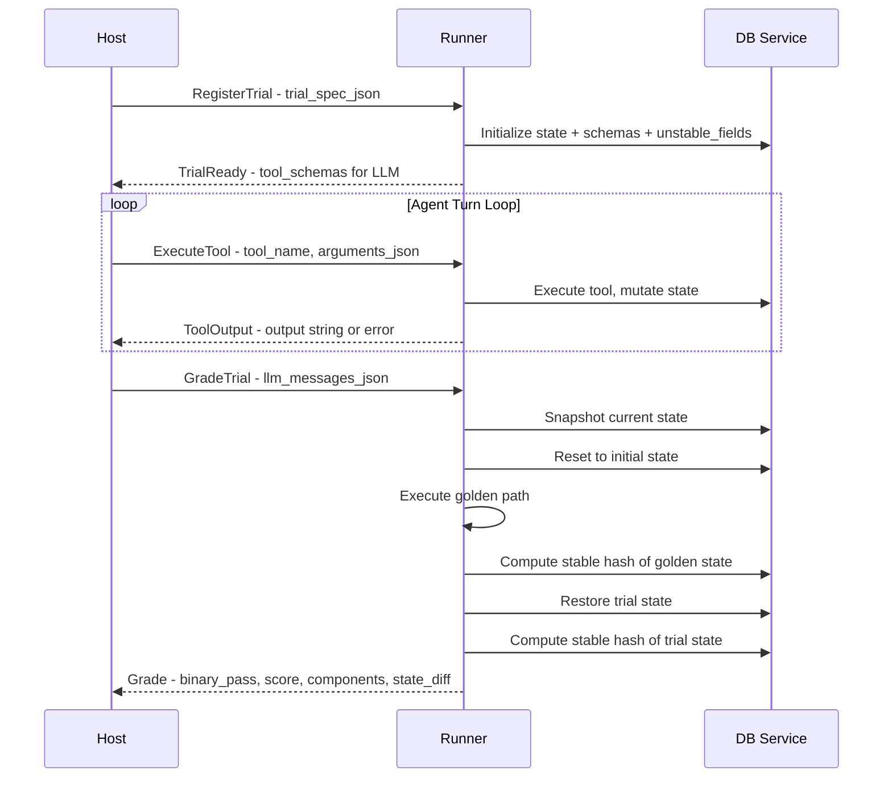

# gRPC Protocol: Host ↔ Runner Communication

This document defines the gRPC protocol for communication between the **Host** (orchestrator) and **Runner** (container) in the Tolokaforge distributed architecture.

## Architecture Overview

```
┌─────────────────────────────────────────────────────────────────────────────┐
│                                   HOST                                       │
│  ┌─────────────┐  ┌─────────────┐  ┌─────────────┐  ┌─────────────────────┐ │
│  │ Task Loader │  │ LLM Client  │  │ Trial Coord │  │ Results Collection  │ │
│  └──────┬──────┘  └──────┬──────┘  └──────┬──────┘  └──────────┬──────────┘ │
│         │                │                │                     │            │
│         └────────────────┴────────────────┴─────────────────────┘            │
│                                   │                                          │
│                          gRPC Channel                                        │
└──────────────────────────────────┬───────────────────────────────────────────┘
                                   │
┌──────────────────────────────────┴───────────────────────────────────────────┐
│                            RUNNER CONTAINER                                   │
│  ┌─────────────────┐  ┌─────────────────┐  ┌─────────────────────────────┐   │
│  │ Adapter Runtime │  │ Tool Execution  │  │ Grading Engine              │   │
│  │ - Tool Reconstr │  │ - MCP/Tau/Native│  │ - Golden Path Execution     │   │
│  │ - Schema Gen    │  │ - State Mutation│  │ - Hash Comparison           │   │
│  └────────┬────────┘  └────────┬────────┘  └──────────────┬──────────────┘   │
│           │                    │                          │                   │
│           └────────────────────┴──────────────────────────┘                   │
│                                   │                                           │
│                          Internal gRPC                                        │
└──────────────────────────────────┬────────────────────────────────────────────┘
                                   │
┌──────────────────────────────────┴────────────────────────────────────────────┐
│                          DB SERVICE CONTAINER                                  │
│  ┌─────────────────┐  ┌─────────────────┐  ┌─────────────────────────────┐    │
│  │ State Storage   │  │ Schema + Fields │  │ Stable State Filtering      │    │
│  │ - Tables        │  │ - Unstable Spec │  │ - Hash Computation          │    │
│  │ - Snapshots     │  │ - Validation    │  │ - Snapshot/Restore          │    │
│  └─────────────────┘  └─────────────────┘  └─────────────────────────────┘    │
└───────────────────────────────────────────────────────────────────────────────┘
```

## Protocol Flow


```mermaid
sequenceDiagram
    participant H as Host
    participant R as Runner
    participant DB as DB Service

    H->>R: RegisterTrial - trial_spec_json
    R->>DB: Initialize state + schemas + unstable_fields
    R-->>H: TrialReady - tool_schemas for LLM

    loop Agent Turn Loop
        H->>R: ExecuteTool - tool_name, arguments_json
        R->>DB: Execute tool, mutate state
        R-->>H: ToolOutput - output string or error
    end

    H->>R: GradeTrial - llm_messages_json
    R->>DB: Snapshot current state
    R->>DB: Reset to initial state
    R->>R: Execute golden path
    R->>DB: Compute stable hash of golden state
    R->>DB: Restore trial state
    R->>DB: Compute stable hash of trial state
    R-->>H: Grade - binary_pass, score, components, state_diff
```

## Protocol Definition

```protobuf
syntax = "proto3";

package tolokaforge.runner;

option go_package = "tolokaforge/runner";

// =============================================================================
// Runner Service - Main Host ↔ Runner communication
// =============================================================================

service RunnerService {
  // Register a new trial with a typed TrialSpec payload
  // Host sends TrialSpec JSON; Runner reads spec.task to initialise environment
  rpc RegisterTrial(RegisterTrialRequest) returns (RegisterTrialResponse);

  // Execute a tool call from the LLM
  // Host forwards tool call, Runner executes and returns output
  rpc ExecuteTool(ExecuteToolRequest) returns (ExecuteToolResponse);

  // Grade the completed trial
  // Host sends trajectory, Runner computes grade via golden path comparison
  rpc GradeTrial(GradeTrialRequest) returns (GradeTrialResponse);

  // Get current state snapshot - for debugging
  rpc GetState(GetStateRequest) returns (GetStateResponse);

  // Reset trial state to initial - for retries
  rpc ResetTrial(ResetTrialRequest) returns (ResetTrialResponse);

  // Forget a trial's registration entirely - for retry-after-transient-failure paths
  // Idempotent: succeeds when the trial is not registered.
  // Distinct from ResetTrial: ResetTrial keeps the registration and resets state;
  // CleanupTrial removes the registration so the same trial_id can be re-registered.
  rpc CleanupTrial(CleanupTrialRequest) returns (CleanupTrialResponse);

  // Health check
  rpc HealthCheck(HealthCheckRequest) returns (HealthCheckResponse);
}

// =============================================================================
// RegisterTrial - Initialise trial with a TrialSpec payload
// =============================================================================

message RegisterTrialRequest {
  // Unique identifier for this trial instance
  // Format: "{task_id}:{trial_index}" e.g. "airline_task_001:0"
  // Redundant with TrialSpec.trial_id; kept top-level so routing/lookups
  // don't need to parse the JSON payload.
  string trial_id = 1;

  // Full TrialSpec as JSON string. See tolokaforge/core/trial.py for the
  // Pydantic model and docs/adr/0003-trial-spec-and-trial-result.md
  // for the rationale. The TrialSpec embeds a TaskDescription at spec.task
  // (see docs/TASK_DESCRIPTION_SCHEMA.md) plus the per-trial execution context
  // (run_id, attempt_id, model configs, env endpoints, runtime context).
  string trial_spec_json = 2;

  // Optional: Override timeout for tool execution (seconds)
  double default_tool_timeout_s = 3;

  // Wire-protocol version the calling engine speaks. See
  // tolokaforge/runner/protocol.py for the current value and what it carries.
  // RegisterTrial fails when it is below the version the runner requires, so
  // an engine/image skew aborts the trial before any tokens are spent.
  int32 engine_protocol_version = 4;
}

message RegisterTrialResponse {
  // Whether registration succeeded
  bool success = 1;

  // Error message if registration failed
  string error = 2;

  // Tool schemas in OpenAI function calling format
  // These are returned to Host for LLM tool configuration
  // Format: [{"type": "function", "function": {"name": "...", "description": "...", "parameters": {...}}}]
  repeated ToolSchema tool_schemas = 3;

  // Number of agent tools registered
  int32 num_agent_tools = 4;

  // Number of user tools registered (for dual-control scenarios)
  int32 num_user_tools = 5;
}

// Tool schema in OpenAI function calling format
message ToolSchema {
  string name = 1;
  string description = 2;
  // JSON Schema for parameters
  string parameters_json = 3;
  // Tool category: "read", "write", "compute"
  string category = 4;
  // Timeout override for this specific tool
  double timeout_s = 5;
}

// =============================================================================
// ExecuteTool - Execute a single tool call
// =============================================================================

message ExecuteToolRequest {
  // Trial identifier (must match a registered trial)
  string trial_id = 1;

  // Tool name to execute
  string tool_name = 2;

  // Tool arguments as JSON string
  // Must conform to the tool's parameter schema
  string arguments_json = 3;

  // Timeout for this execution (seconds)
  // If 0, uses default from RegisterTrial or tool schema
  double timeout_seconds = 4;

  // Which environment is making the call
  // "agent" for assistant tools, "user" for user-side tools
  string executor = 5;

  // The provider's tool-call id (ToolCall.id) — the key that joins this call
  // to the tool-result message it produced. Required: the runner rejects an
  // empty value, because two calls to the same tool with identical arguments
  // are otherwise indistinguishable in the recorded history.
  string call_id = 6;
}

message ExecuteToolResponse {
  // Execution status
  ExecutionStatus status = 1;

  // Tool output string (what the LLM sees)
  // For success: the tool's return value as string
  // For error: empty (see error_message)
  // For timeout: empty (see error_message)
  string output = 2;

  // Error message if status != SUCCESS
  string error_message = 3;

  // Execution metrics
  ToolMetrics metrics = 4;
}

enum ExecutionStatus {
  EXECUTION_STATUS_UNSPECIFIED = 0;
  EXECUTION_STATUS_SUCCESS = 1;
  EXECUTION_STATUS_ERROR = 2;
  EXECUTION_STATUS_TIMEOUT = 3;
  EXECUTION_STATUS_TOOL_NOT_FOUND = 4;
  EXECUTION_STATUS_INVALID_ARGUMENTS = 5;
  EXECUTION_STATUS_TRIAL_NOT_FOUND = 6;
}

message ToolMetrics {
  // Execution latency in seconds
  double latency_seconds = 1;

  // Exit code (for bash-like tools)
  int32 exit_code = 2;

  // Number of state mutations caused by this tool (optional, low priority)
  // Requires Runner to track via DB Service - may be 0 if not implemented
  int32 state_mutations = 3;
}

// =============================================================================
// Design Note: Executor Field (agent vs user)
// =============================================================================
//
// The `executor` field on ExecuteToolRequest distinguishes between:
//
// - "agent": Tools called by the assistant (LLM agent)
//   Examples: get_customer_by_phone, book_reservation, create_ticket
//
// - "user": Tools called by the user simulator (user-side device tools)
//   Examples: toggle_airplane_mode, toggle_data, check_internet_speed
//
// This is important for Native adapter tasks with dual-control scenarios
// where both agent and user have tools that mutate shared state.
//
// The Runner uses this to:
// 1. Route to correct tool registry (agent_tools vs user_tools)
// 2. Track tool calls by executor for required_actions grading
// 3. Apply appropriate permissions/sandboxing per executor

// =============================================================================
// GradeTrial - Compute grade for completed trial
// =============================================================================

message GradeTrialRequest {
  // Trial identifier
  string trial_id = 1;

  // The trial's full interleaved message trace, encoded by
  // tolokaforge.core.grading.transcript_wire.encode_transcript_wire: a JSON array
  // of {role, content} objects in execution order, covering every role — a tool
  // result crosses as role "tool" carrying its tool_call_id.
  // An assistant or user turn that called tools also carries
  // tool_calls: [{"id", "function": {"name", "arguments"}}], where "id" is the
  // provider's tool-call id and "arguments" is a JSON-encoded string. That id is
  // the only key joining a call to its result — parallel calls to one tool with
  // identical arguments are otherwise indistinguishable — and
  // decode_transcript_wire rejects a payload whose tool_calls carry none.
  // The leading "system" message is the agent's policy, lifted out by
  // split_leading_system_message rather than replayed as a conversational turn.
  // Needed for transcript_rules and llm_judge grading; for hash-only grading
  // (TlkMcpCore, Tau) it can be omitted — the Runner has its own tool-call record.
  string llm_messages_json = 2;

  // Optional: Skip golden path execution if expected hash is pre-computed
  // If provided, Runner compares trial state hash directly
  string precomputed_expected_hash = 3;

  // Which grading components to compute
  // If empty, computes all configured in TaskDescription.grading
  repeated string grading_components = 4;  // "state_checks", "transcript_rules"

  // How the trial ended, as a tolokaforge.core.models.TerminationReason value
  // ("agent_done", "user_stop", "max_turns", ...); empty when the engine
  // reported none. Grading input, never author-matchable: it tells a deliberate
  // finish apart from an exhausted turn budget. A value outside the enum fails
  // the RPC rather than parsing to "none", which would mislabel trial health.
  string termination_reason = 5;
}

message GradeTrialResponse {
  // Whether grading succeeded
  bool success = 1;

  // Error message if grading failed
  string error = 2;

  // The computed grade
  Grade grade = 3;
}

message Grade {
  // Binary pass/fail based on pass_threshold
  bool binary_pass = 1;

  // Numeric score 0.0 - 1.0
  double score = 2;

  // Individual component scores
  GradeComponents components = 3;

  // Human-readable reasons for the grade
  // Format: "State: hash mismatch | Transcript: 2 required actions missing"
  string reasons = 4;

  // State diff if hash comparison failed
  // JSON object with: added, removed, modified, diff_lines
  string state_diff_json = 5;

  // Detailed custom check results if applicable
  repeated CustomCheckResult custom_checks = 6;

  // Per-criterion rubric-judge breakdown (empty unless an LLM judge ran).
  repeated CriterionResult criterion_results = 7;

  // Rubric-judge status: UNSPECIFIED (no judge), COMPLETED, or ERRORED.
  // ERRORED is fail-loud: the llm_judge component is incomplete, NOT 0.0.
  JudgeStatus judge_status = 8;

  // The judge's own token usage / cost + audit transcript (unset when no
  // judge ran). The Runner runs the judge's LLM, so this is grading spend,
  // separate from the agent's usage.
  JudgeReport judge_report = 9;
}

message CriterionResult {
  string id = 1;              // matches Criterion.id in the rubric
  bool met = 2;              // binary verdict (graded: cleared the author's bar)
  double score = 3;          // 0/1 for binary, 0–1 for graded
  string justification = 4;  // judge's per-criterion reasoning
}

enum JudgeStatus {
  JUDGE_STATUS_UNSPECIFIED = 0;  // no judge configured / not run
  JUDGE_STATUS_COMPLETED = 1;    // per-criterion results produced
  JUDGE_STATUS_ERRORED = 2;      // judge failed; component incomplete, no score
}

message JudgeReport {
  int32 calls = 1;             // LLM calls the judge made
  int32 prompt_tokens = 2;
  int32 completion_tokens = 3;
  int32 reasoning_tokens = 4;
  double cost_usd = 5;         // the judge's own spend
  int32 tool_calls = 6;        // read-only tool calls the judge made
  string transcript_json = 7;  // judge message transcript (audit channel), JSON
}

message GradeComponents {
  // State checks score (hash comparison, JSONPath assertions, DB probes)
  // -1.0 means not evaluated
  double state_checks = 1;

  // Transcript rules score (required actions, communicate info, max turns)
  double transcript_rules = 2;

  // LLM judge (rubric) score, computed by the Runner on the shared loop.
  // -1.0 means not evaluated; see Grade.judge_status for ERRORED runs (which
  // do NOT report a 0.0 score).
  double llm_judge = 3;

  // Custom Python checks score
  double custom_checks = 4;
}

// =============================================================================
// Design Note: LLM Judge Grading
// =============================================================================
//
// The LLM rubric judge is computed by the RUNNER, not the Host. The Runner is
// already inside the trial's security boundary, co-located with the DB service
// and the agent workspace the read-only judge tools inspect; secrets are
// reconstructed in-container, so the judge builds its own LLM client there.
//
// Flow:
//   1. Host calls GradeTrial(), forwarding the transcript (incl. the agent's
//      system prompt) via llm_messages_json.
//   2. The Runner computes state_checks + transcript_rules, and — when
//      grading.llm_judge is configured — runs the read-only rubric judge on the
//      shared tool-calling loop, returning criterion_results + the llm_judge
//      component score (or JUDGE_STATUS_ERRORED with no score), plus a
//      JudgeReport (judge usage + transcript).
//   3. The Runner combines all component scores using grading.weights and
//      returns the final Grade. (An earlier protocol revision left the judge to
//      the Host; the Runner now owns it — see docs/RUBRIC_GRADING_DESIGN.md.)

message CustomCheckResult {
  string check_name = 1;
  // "passed", "failed", "skipped", "error"
  string status = 2;
  double score = 3;
  string message = 4;
  // Additional details as JSON
  string details_json = 5;
}

// =============================================================================
// GetState - Debug endpoint to inspect current state
// =============================================================================

message GetStateRequest {
  // Trial identifier
  string trial_id = 1;

  // Whether to include unstable fields in response
  bool include_unstable = 2;

  // Specific tables to return (empty = all)
  repeated string tables = 3;
}

message GetStateResponse {
  // Whether request succeeded
  bool success = 1;

  // Error message if failed
  string error = 2;

  // Current state as JSON
  // Structure: {"table_name": [records...], ...}
  string state_json = 3;

  // Stable state hash (excluding unstable fields)
  string stable_hash = 4;

  // Full state hash (including unstable fields)
  string full_hash = 5;
}

// =============================================================================
// ResetTrial - Reset state to initial for retries
// =============================================================================

message ResetTrialRequest {
  // Trial identifier
  string trial_id = 1;

  // Whether to re-execute initialization_actions
  bool execute_init_actions = 2;
}

message ResetTrialResponse {
  // Whether reset succeeded
  bool success = 1;

  // Error message if failed
  string error = 2;

  // State hash after reset
  string state_hash = 3;
}

// =============================================================================
// CleanupTrial - Forget a trial's registration
// =============================================================================

message CleanupTrialRequest {
  // Trial identifier
  string trial_id = 1;
}

message CleanupTrialResponse {
  // Whether cleanup succeeded. Idempotent: true when trial was already absent.
  bool success = 1;

  // Error message if cleanup failed
  string error = 2;
}

// =============================================================================
// HealthCheck - Service health status
// =============================================================================

message HealthCheckRequest {}

message HealthCheckResponse {
  // Service status: "healthy", "degraded", "unhealthy"
  string status = 1;

  // Service version
  string version = 2;

  // Number of active trials
  int32 num_active_trials = 3;

  // DB Service connectivity
  bool db_service_connected = 4;

  // Available tool adapters
  repeated string available_adapters = 5;
}
```

## Message Details

### RegisterTrialRequest

**Version lock.** `engine_protocol_version` declares the wire protocol the calling engine speaks; `ENGINE_PROTOCOL_VERSION` in [`tolokaforge/runner/protocol.py`](../tolokaforge/runner/protocol.py) is the single source of that number, and the engine sets it on every registration. The runner refuses to register a trial from an engine below its own version and names the skew in `RegisterTrialResponse.error`, which the orchestrator already treats as fatal — so a skewed pair fails before any tokens are spent, rather than burning a turn budget on rejected tool calls and reporting a completed trial that scored ~0.

Version 1 is the first that sends `ExecuteToolRequest.call_id`. An engine that predates the field sends nothing, which arrives as `0` and is refused. Rebuild the runner image from the engine you are running (`make docker-build-core`) or pin an image tag that matches it.

The gate is a lower bound, not an equality: a *newer* engine still sends `call_id`, so this runner registers it.

The `trial_spec_json` field contains a serialised [`TrialSpec`](../tolokaforge/core/trial.py), which embeds the full [`TaskDescription`](docs/TASK_DESCRIPTION_SCHEMA.md) schema at `spec.task` (shown below) alongside the per-trial execution context (`run_id`, `attempt_id`, model configs, `env_endpoints`, `runtime_context`):

```json
{
  "task_id": "airline_task_001",
  "name": "Book Flight",
  "category": "airline",
  "description": "Book a flight from NYC to Seattle",
  "adapter_type": "tau",
  "schema_version": "1.0.0",
  "system_prompt": "You are a customer service agent...",
  "agent_tools": [
    {
      "name": "book_reservation",
      "description": "Book a new flight reservation",
      "parameters": {"type": "object", "properties": {...}},
      "source": {
        "toolset": "airline",
        "module_path": "tau_tools.book_reservation",
        "class_name": "BookReservation",
        "invocation_style": "tau_sync"
      }
    }
  ],
  "user_tools": [],
  "initial_state": {
    "tables": {"users": [...], "flights": [...], "reservations": []},
    "schemas": [...],
    "unstable_fields": [
      {"table_name": "reservations", "field_name": "id", "reason": "auto_id"},
      {"table_name": "reservations", "field_name": "created_at", "reason": "timestamp"}
    ]
  },
  "grading": {
    "combine_method": "weighted",
    "weights": {"state_checks": 1.0},
    "pass_threshold": 1.0,
    "state_checks": {
      "hash_enabled": true,
      "golden_actions": [
        {"tool_name": "book_reservation", "arguments": {"user_id": "mia_li_3668", "origin": "JFK", "destination": "SEA"}}
      ]
    }
  }
}
```

### ExecuteToolRequest/Response

The tool execution flow:

1. Host receives tool call from LLM: `{"id": "call_123", "name": "book_reservation", "arguments": {"user_id": "mia_li_3668"}}`
2. Host sends `ExecuteToolRequest` with `arguments_json = '{"user_id": "mia_li_3668"}'` and `call_id = "call_123"`
3. Runner:
   - Looks up tool by name in registered tools
   - Reconstructs tool from `ToolSource` (module_path, class_name, invocation_style)
   - Executes tool with arguments
   - State mutations are persisted to DB Service
   - Records the call in the trial's history under `call_id`, stamped with a trial-wide 0-based `sequence`
4. Runner returns `ExecuteToolResponse` with output string

**`call_id` is required.** It is the provider's `ToolCall.id`, and it is the only key that joins a recorded call to the `role: tool` message carrying its result — position does not resolve the same tool called twice with identical arguments. The runner raises on an empty value rather than answering with a non-success status: a tool-shaped failure is one the agent survives and retries, so it would burn the turn budget instead of surfacing. Every registered engine declares a protocol version that carries the field (see the version lock under [RegisterTrialRequest](#registertrialrequest)), so an empty `call_id` is a harness bug, not skew.

**Error Handling:**

| Status | Meaning | Host Action | Recorded in trial history |
|--------|---------|-------------|---------------------------|
| `SUCCESS` | Tool executed successfully | Return output to LLM | yes |
| `ERROR` | Tool raised exception | Return error message to LLM | yes |
| `TIMEOUT` | Execution exceeded timeout | Return timeout message to LLM | yes |
| `TOOL_NOT_FOUND` | Tool name not registered | Log error, fail trial | yes |
| `INVALID_ARGUMENTS` | Arguments don't match schema | Return validation error to LLM | yes, with empty `arguments` |
| `TRIAL_NOT_FOUND` | Trial ID not registered | Log error, fail trial | no — there is no trial context to record into |

A call the runner refuses before execution is still recorded, because the host appends a `role: tool` error message for it either way; a record that omitted it would read as a call the agent never attempted.

### GradeTrialRequest

`llm_messages_json` is a JSON **array** of messages — the trial's full interleaved
trace in execution order, not a trajectory object:

```json
[
  {"role": "system", "content": "You are a booking agent. Follow the refund policy."},
  {"role": "user", "content": "I want to book a flight to Seattle"},
  {"role": "assistant", "content": "", "tool_calls": [
    {"id": "call_123", "function": {"name": "book_reservation", "arguments": "{\"user_id\": \"mia_li_3668\", \"origin\": \"JFK\", \"destination\": \"SEA\"}"}}
  ]},
  {"role": "tool", "content": "Reservation confirmed: RES-456", "tool_call_id": "call_123"},
  {"role": "assistant", "content": "I've booked your flight to Seattle."}
]
```

Three properties a consumer can rely on:

- **Tool results are on the wire.** A result is a `role: tool` message carrying the
  `tool_call_id` of the call that produced it, positioned where it happened.
- **Calls are joined to results by `id`, never by position.** Every `tool_calls`
  entry carries the provider's tool-call id; `arguments` is a JSON-encoded string.
  Parallel calls to one tool with identical arguments are distinguishable only by
  that id, so a payload whose `tool_calls` carry none is rejected rather than
  degraded — see `tolokaforge.core.grading.transcript_wire`.
- **The leading `system` message is the agent's policy**, lifted out of the
  transcript and injected as policy for rubric evaluation rather than replayed as
  a conversational turn.

`tool_calls` appears on `role: user` turns too, for a simulated user that calls
tools. `content_blocks` (multimodal), reasoning blocks and per-message timestamps
are not represented: a screenshot-only assistant turn crosses as `content: ""`.

The Runner's own ordered tool-call record is a **separate** input it already
holds — one `RecordedToolCall` per call, carrying `call_id`, `sequence`,
`tool_name`, `arguments`, `executor`, `status`, `output` (untruncated),
`latency_seconds` and `timestamp` — and never rides on this request.

`termination_reason` carries how the trial ended, as a `TerminationReason`
value. It is typed for the whole enum, and the Runner parses it back to the enum
or fails the RPC naming the accepted set — an unrecognised value is never
coerced to "not reported", which would make a skewed engine look like a healthy
trial. An empty value means the engine reported no reason, which is valid.

Only three reasons reach this RPC — `agent_done`, `user_stop` and `max_turns`.
Each names a trial the agent drove to an end the harness planned for, and task
grading is meaningful for exactly those. The host grader answers every other
trial itself, without an RPC: a task grade describes how the agent performed the
task, and a trial that never completed has no such performance to describe.
`tests/canonical/test_termination_reason_reachability.py` locks both halves —
that every reason is produced by some real termination path, and that only those
three reach `GradeTrial`.

### Grading Algorithm

The Runner executes this grading algorithm:

```python
def grade_trial(trial_id: str, llm_messages: list[dict]) -> Grade:
    # 0. Join the transcript and the tool-call record into the trial's timeline.
    #    Raises TimelineInconsistencyError -> success=false, before any component.
    _, transcript = split_leading_system_message(llm_messages)
    timeline = build_trial_timeline(
        decode_transcript_wire(transcript), trial_context.tool_call_history, termination_reason
    )

    # 1. Get current trial state from DB Service
    trial_state = db_service.get_state(trial_id)
    
    # 2. Compute stable hash of trial state (excludes unstable fields)
    trial_hash = db_service.get_stable_hash(trial_id)
    
    # 3. Execute golden path on fresh state
    db_service.snapshot(trial_id, "pre_golden")
    db_service.reset_to_initial(trial_id)
    
    for action in grading_config.golden_actions:
        execute_tool(trial_id, action.tool_name, action.arguments)
    
    golden_hash = db_service.get_stable_hash(trial_id)
    
    # 4. Restore trial state
    db_service.restore(trial_id, "pre_golden")
    
    # 5. Compare hashes
    if trial_hash == golden_hash:
        state_score = 1.0
        state_diff = None
    else:
        state_score = 0.0
        state_diff = compute_diff(golden_state, trial_state)
    
    # 6. Evaluate transcript rules off the timeline
    transcript_score = evaluate_transcript_rules(timeline, grading_config.transcript_rules)
    
    # 7. Combine scores
    final_score = weighted_combine(state_score, transcript_score, ...)
    
    return Grade(
        binary_pass=final_score >= pass_threshold,
        score=final_score,
        components=GradeComponents(state_checks=state_score, transcript_rules=transcript_score),
        state_diff_json=json.dumps(state_diff) if state_diff else ""
    )
```

**CRITICAL: Hash Algorithm Compatibility**

The `db_service.get_stable_hash()` call MUST use the canonical hash algorithm defined in [`TASK_DESCRIPTION_SCHEMA.md`](TASK_DESCRIPTION_SCHEMA.md#canonical-hash-algorithm):

```python
json_str = json.dumps(stable_state, sort_keys=True, separators=(",", ":"), default=str)
return hashlib.sha256(json_str.encode("utf-8")).hexdigest()
```

All components (DB Service, adapters, grading engine) MUST use this exact algorithm for hash comparison to work correctly.

### GradeTrial Error Semantics

`GradeTrialResponse.success = false` leaves `grade` unset — an unusable grade is
never approximated with a score. The two views of the trial are joined into its
[event timeline](GRADING.md#trial-event-timeline) **before** any component runs,
so an unreadable or self-contradictory payload fails the RPC before golden replay
touches the trial's state.

The host does not fill the gap either: `RunnerRPCTrialGrader.grade` raises
`GradingFailedError` on any `success = false`, so the trial is published with no
score rather than with one the runner never computed. See
[`GRADING.md`](GRADING.md#trial-event-timeline) for what that costs the run's
counts.

| `error` | Cause |
|---|---|
| `Trial '<id>' not found` | The trial was never registered, or was already cleaned up |
| `Trial '<id>' is not gradeable: TimelineInconsistencyError: …` | The transcript and the Runner's tool-call record cannot be joined into one timeline — a recorded call the transcript never asked for, or one `call_id` used twice. The error names the offending `call_id` |
| `Trial '<id>' is not gradeable: <ValueError subclass>: …` | `llm_messages_json` does not decode into a transcript — malformed JSON, a message missing `role` / `content`, a `tool_calls` entry carrying no `id`, or one whose `function` / `function.name` / `function.arguments` is absent. Every rejection is a `ValueError`, so it lands on this row rather than the catch-all below |
| `Trial '<id>' is not gradeable: ValueError: state_checks.hash.weight is required …` | A hash verdict and a JSONPath score are both real and `state_checks.hash_weight` says nothing about how to fold them. Reachable only for a pack the presence gate accepts at `RegisterTrial` yet whose hash source materialises at grade time — a refusal-shaped pack (`hash_enabled` with empty `golden_actions`) carrying live assertions |
| `Hash grading failed: …` | Golden replay or stable-state retrieval raised |
| `Grading config populates scored keys the runner neither evaluated nor recorded a skip for: …` | The accounted-keys ledger (below) found a populated scored key with no evaluator result and no recorded skip |
| `Grading error: …` | Any other exception escaping the grading path |

**The accounted-keys ledger.** Through the component phase the Runner records,
at every point an evaluator runs or is deliberately skipped, which author-facing
`grading.yaml` key that call accounts for. After the phase it subtracts those
records from the scored keys the request's `TaskDescription.grading` actually
populated (non-empty, not merely present). Any remainder is a key that would have
contributed nothing to the score while the trial still received a grade, so the
RPC fails naming each key and the runner evaluator its manifest entry expects. A
key the manifest declares core-only that nonetheless arrives populated fails the
same way, quoting the reason it is core-only. Scope is scored checks only:
`state_checks.id_fields`, `state_checks.relaxed_validation` and
`state_checks.numeric_string_fields` shape other checks instead of producing a
component score, and `combine.*` is the aggregation itself. See
[`GRADING.md`](GRADING.md#the-runtime-ledger) for the manifest behind it.

**The recorded skips.** A trial can legitimately reach `GradeTrial` with a
populated key whose evaluator cannot run. Each such site records a skip rather
than nothing, and the reason lands in `Grade.reasons` so the outcome is visible:

| Skip | Condition | Keys covered |
|---|---|---|
| `skipped: the trial's timeline carries no events` | The trial left neither a conversational turn nor a tool call, so every rule would score 0.0 against evidence that does not exist | every `transcript_rules.*` key |
| `skipped: no transcript messages` | `llm_messages_json` is empty | `llm_judge` |
| `skipped: hash grading not enabled` | `state_checks.hash_enabled` is false | the `state_checks.hash` members the hash evaluator reads, including `golden_actions`, which the adapter fills regardless of `hash.enabled` |
| `skipped: core-only — no runner path reads it (#693)` | always | `state_checks.hash.expected_state_hash` — the adapter translates it onto `expected_hash` and no runner path reads it, so hash grading having run does not make it evaluated |
| `skipped: custom checks not enabled` | The pack wrote a `custom_checks` block but left `enabled` false, so the executor never runs | `custom_checks` |

A degenerate trial therefore **scores badly rather than erroring** — the skip
suppresses the component, and the recorded reason says why.

The ledger covers scored checks, so one skip is reported beside it rather than
through it: a `state_checks.hash_weight` the fold never consulted — because only one
state source produced a score, or because `db_probes` filled the component outright —
appends its own line to `Grade.reasons`, from the same constant the core engine uses.
`hash_weight` is a `CONFIG_INPUT`, not a scored check, so the ledger would never have
seen it.

`grading_method = "test_execution"` dispatches before the component phase and the
ledger does not apply to it.

## Unstable Fields Handling

Unstable fields are excluded from hash comparison to handle non-deterministic values:

| Reason | Example Fields | Handling |
|--------|---------------|----------|
| `auto_id` | `id`, `reservation_id` | Excluded from hash |
| `timestamp` | `created_at`, `updated_at` | Excluded from hash |
| `llm_generated` | `subject`, `description` | Excluded from hash |
| `random` | `confirmation_code` | Excluded from hash |

The DB Service filters these fields when computing stable state:

```python
def get_stable_state(trial_id: str) -> Dict:
    state = get_full_state(trial_id)
    unstable_specs = get_unstable_specs(trial_id)
    
    for spec in unstable_specs:
        for record in state.get(spec.table_name, []):
            if spec.field_name in record:
                del record[spec.field_name]
    
    return state
```

## Implementation Notes

### Host-Side Changes

The Host (orchestrator) needs to:

1. **Replace `RegisterTools` with `RegisterTrial`**: Send full TaskDescription instead of just tool definitions
2. **Update `DockerRunnerAdapter`**: Use new `ExecuteToolResponse` status enum
3. **Add `GradeTrial` call**: After trial completion, call `GradeTrial` instead of local grading
4. **Handle new error statuses**: Map `ExecutionStatus` to appropriate LLM responses

### Runner-Side Implementation

The Runner needs to:

1. **Parse TaskDescription**: Deserialize JSON and validate against schema
2. **Initialize DB Service**: Send initial_state, schemas, unstable_fields
3. **Reconstruct tools**: Use `ToolSource` to import and instantiate tools
4. **Execute tools**: Route to appropriate adapter (tau_sync, mcp_async, mcp_server)
5. **Implement grading**: Execute golden path, compute hashes, compare states

### DB Service API

The Runner communicates with DB Service via HTTP. All endpoints are trial-scoped:

```
POST   /trials/{trial_id}/init                         ← Initialize with initial state + schemas + unstable fields
GET    /trials/{trial_id}/state                        ← Full current state
GET    /trials/{trial_id}/state/stable                 ← State with unstable fields filtered
GET    /trials/{trial_id}/state/hash                   ← SHA256 of stable state
PATCH  /trials/{trial_id}/state/{table_name}           ← Mutations (insert, update, delete)
POST   /trials/{trial_id}/snapshots/{snapshot_name}    ← Create named snapshot
POST   /trials/{trial_id}/snapshots/{snapshot_name}/restore ← Restore from snapshot
POST   /trials/{trial_id}/reset                        ← Reset to initial state
DELETE /trials/{trial_id}                              ← Cleanup trial data
GET    /health                                         ← Service health check (global)
```

See [`DB_SERVICE_API.md`](DB_SERVICE_API.md) for full endpoint specifications.

## Migration Path

### Step 1: Extend Current Protocol
- Add `RegisterTrial` RPC alongside existing `RegisterTools`
- Add `GradeTrial` RPC
- Keep `ExecuteTool` compatible

### Step 2: Update Host
- Modify orchestrator to use `RegisterTrial`
- Add grading via `GradeTrial`
- Update error handling

### Step 3: Deprecate Old RPCs
- Remove `RegisterTools` (replaced by `RegisterTrial`)
- Update documentation

## Error Codes

| gRPC Code | Meaning | Recovery |
|-----------|---------|----------|
| `OK` | Success | Continue |
| `INVALID_ARGUMENT` | Bad request format | Fix request |
| `NOT_FOUND` | Trial/tool not found | Re-register |
| `DEADLINE_EXCEEDED` | Timeout | Retry or fail |
| `INTERNAL` | Server error | Retry with backoff |
| `UNAVAILABLE` | Service down | Wait and retry |

## Security Considerations

1. **Trial Isolation**: Each trial has isolated state in DB Service
2. **Tool Sandboxing**: Tools execute in container with limited permissions
3. **Input Validation**: All JSON inputs validated against schemas
4. **Timeout Enforcement**: Hard timeouts prevent runaway execution
5. **Resource Limits**: Container resource limits prevent DoS
