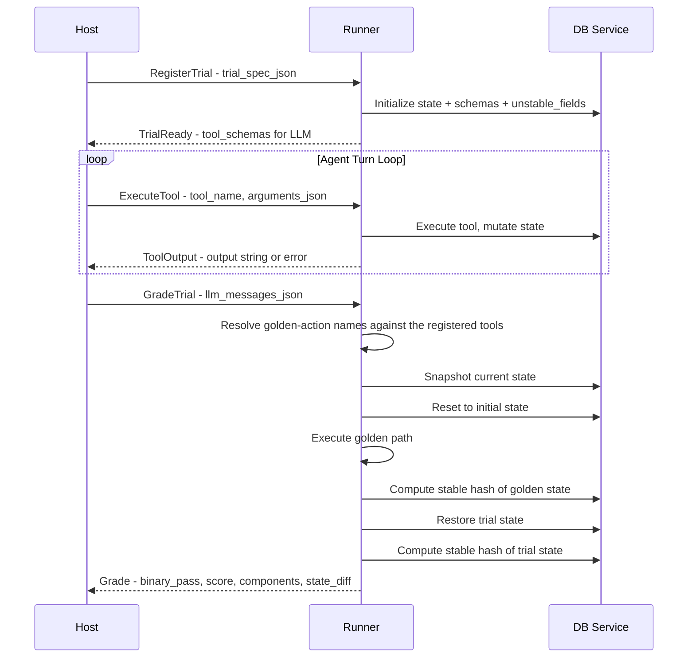

# gRPC Protocol: Host ↔ Runner Communication

This document defines the gRPC protocol for communication between the **Host** (orchestrator) and **Runner** (container) in the Tolokaforge distributed architecture.

## Architecture Overview

```
┌─────────────────────────────────────────────────────────────────────────────┐
│                                   HOST                                       │
│  ┌─────────────┐  ┌─────────────┐  ┌─────────────┐  ┌─────────────────────┐ │
│  │ Task Loader │  │ LLM Client  │  │ Trial Coord │  │ Results Collection  │ │
│  └──────┬──────┘  └──────┬──────┘  └──────┬──────┘  └──────────┬──────────┘ │
│         │                │                │                     │            │
│         └────────────────┴────────────────┴─────────────────────┘            │
│                                   │                                          │
│                          gRPC Channel                                        │
└──────────────────────────────────┬───────────────────────────────────────────┘
                                   │
┌──────────────────────────────────┴───────────────────────────────────────────┐
│                            RUNNER CONTAINER                                   │
│  ┌─────────────────┐  ┌─────────────────┐  ┌─────────────────────────────┐   │
│  │ Adapter Runtime │  │ Tool Execution  │  │ Grading Engine              │   │
│  │ - Tool Reconstr │  │ - MCP/Tau/Native│  │ - Golden Path Execution     │   │
│  │ - Schema Gen    │  │ - State Mutation│  │ - Hash Comparison           │   │
│  └────────┬────────┘  └────────┬────────┘  └──────────────┬──────────────┘   │
│           │                    │                          │                   │
│           └────────────────────┴──────────────────────────┘                   │
│                                   │                                           │
│                          Internal gRPC                                        │
└──────────────────────────────────┬────────────────────────────────────────────┘
                                   │
┌──────────────────────────────────┴────────────────────────────────────────────┐
│                          DB SERVICE CONTAINER                                  │
│  ┌─────────────────┐  ┌─────────────────┐  ┌─────────────────────────────┐    │
│  │ State Storage   │  │ Schema + Fields │  │ Stable State Filtering      │    │
│  │ - Tables        │  │ - Unstable Spec │  │ - Hash Computation          │    │
│  │ - Snapshots     │  │ - Validation    │  │ - Snapshot/Restore          │    │
│  └─────────────────┘  └─────────────────┘  └─────────────────────────────┘    │
└───────────────────────────────────────────────────────────────────────────────┘
```

## Protocol Flow


```mermaid
sequenceDiagram
    participant H as Host
    participant R as Runner
    participant DB as DB Service

    H->>R: RegisterTrial - trial_spec_json
    R->>DB: Initialize state + schemas + unstable_fields
    R-->>H: TrialReady - tool_schemas for LLM

    loop Agent Turn Loop
        H->>R: ExecuteTool - tool_name, arguments_json
        R->>DB: Execute tool, mutate state
        R-->>H: ToolOutput - output string or error
    end

    H->>R: GradeTrial - llm_messages_json
    R->>R: Resolve golden-action names against the registered tools
    R->>DB: Snapshot current state
    R->>DB: Reset to initial state
    R->>R: Execute golden path
    R->>DB: Compute stable hash of golden state
    R->>DB: Restore trial state
    R->>DB: Compute stable hash of trial state
    R-->>H: Grade - binary_pass, score, components, state_diff
```

## Protocol Definition

```protobuf
syntax = "proto3";

package tolokaforge.runner;

option go_package = "tolokaforge/runner";

// =============================================================================
// Runner Service - Main Host ↔ Runner communication
// =============================================================================

service RunnerService {
  // Register a new trial with a typed TrialSpec payload
  // Host sends TrialSpec JSON; Runner reads spec.task to initialise environment
  rpc RegisterTrial(RegisterTrialRequest) returns (RegisterTrialResponse);

  // Execute a tool call from the LLM
  // Host forwards tool call, Runner executes and returns output
  rpc ExecuteTool(ExecuteToolRequest) returns (ExecuteToolResponse);

  // Grade the completed trial
  // Host sends trajectory, Runner computes grade via golden path comparison
  rpc GradeTrial(GradeTrialRequest) returns (GradeTrialResponse);

  // Get current state snapshot - for debugging
  rpc GetState(GetStateRequest) returns (GetStateResponse);

  // Reset trial state to initial - for retries
  rpc ResetTrial(ResetTrialRequest) returns (ResetTrialResponse);

  // Forget a trial's registration entirely - for retry-after-transient-failure paths
  // Idempotent: succeeds when the trial is not registered.
  // Distinct from ResetTrial: ResetTrial keeps the registration and resets state;
  // CleanupTrial removes the registration so the same trial_id can be re-registered.
  rpc CleanupTrial(CleanupTrialRequest) returns (CleanupTrialResponse);

  // Health check
  rpc HealthCheck(HealthCheckRequest) returns (HealthCheckResponse);
}

// =============================================================================
// SubstrateService - read-only view of a trial's grading substrate.
//
// Registered on the same gRPC server + listen port as RunnerService iff
// RunConfig.grader.expose_substrate: true is set (env var
// RUNNER_EXPOSE_SUBSTRATE=true reaches the runner container). Runner
// started with the flag off returns UNIMPLEMENTED for any
// SubstrateService/* call. See docs/GRADER_SERVICE.md § "SubstrateService
// (runner-side, read-only)".
// =============================================================================

service SubstrateService {
  // Pre-execution state ({table: [rows]}).
  rpc ReadInitialState(ReadInitialStateRequest) returns (ReadStateResponse);

  // RAW final DB state — mirrors db_client.get_state. Judge state-diff
  // and custom_checks read RAW; parity depends on this split.
  rpc ReadFinalDBState(ReadFinalDBStateRequest) returns (ReadStateResponse);

  // STABLE final DB state — mirrors db_client.get_stable_state (unstable
  // fields filtered server-side by the DB service). Jsonpath grading
  // reads STABLE.
  rpc ReadFinalDBStateStable(ReadFinalDBStateStableRequest) returns (ReadStateResponse);

  // One file under AGENT_WORK_DIR. Same filter and exclusion policy as
  // tolokaforge.core.grading.filesystem_view.read_agent_visible_filesystem;
  // refuses reads under any AGENT_VISIBLE_EXCLUDES directory. Symlinks /
  // non-files / missing paths return exists=false.
  rpc ReadFilesystemPath(ReadFilesystemPathRequest) returns (ReadFilesystemPathResponse);

  // Relative POSIX paths of every non-symlink UTF-8-decodable file under
  // AGENT_WORK_DIR, alphabetically sorted. Same filter and exclusion policy
  // as tolokaforge.core.grading.filesystem_view.read_agent_visible_filesystem.
  rpc ListFilesystemDir(ListFilesystemDirRequest) returns (ListFilesystemDirResponse);

  // Trial's per-trial KB. kb_available=false is a first-class "no KB
  // provisioned" signal; the callback substrate returns None from
  // knowledge_search() when it is false.
  rpc KBSearch(KBSearchRequest) returns (KBSearchResponse);

  // Substrate liveness + capacity. Distinct from RunnerService.HealthCheck.
  rpc SubstrateHealthCheck(SubstrateHealthCheckRequest) returns (SubstrateHealthCheckResponse);
}

// =============================================================================
// RegisterTrial - Initialise trial with a TrialSpec payload
// =============================================================================

message RegisterTrialRequest {
  // Unique identifier for this trial instance
  // Format: "{task_id}:{trial_index}" e.g. "airline_task_001:0"
  // Redundant with TrialSpec.trial_id; kept top-level so routing/lookups
  // don't need to parse the JSON payload.
  string trial_id = 1;

  // Full TrialSpec as JSON string. See tolokaforge/core/trial.py for the
  // Pydantic model and docs/adr/0003-trial-spec-and-trial-result.md
  // for the rationale. The TrialSpec embeds a TaskDescription at spec.task
  // (see docs/TASK_DESCRIPTION_SCHEMA.md) plus the per-trial execution context
  // (run_id, attempt_id, model configs, env endpoints, runtime context).
  string trial_spec_json = 2;

  // Optional: Override timeout for tool execution (seconds)
  double default_tool_timeout_s = 3;

  // Wire-protocol version the calling engine speaks. See
  // tolokaforge/runner/protocol.py for the current value and what it carries.
  // RegisterTrial fails when it is below the version the runner requires, so
  // an engine/image skew aborts the trial before any tokens are spent.
  int32 engine_protocol_version = 4;
}

message RegisterTrialResponse {
  // Whether registration succeeded
  bool success = 1;

  // Error message if registration failed
  string error = 2;

  // Tool schemas in OpenAI function calling format
  // These are returned to Host for LLM tool configuration
  // Format: [{"type": "function", "function": {"name": "...", "description": "...", "parameters": {...}}}]
  //
  // Ordering contract: the agent's tools come first, then the user actor's,
  // and num_agent_tools partitions the list exactly — tool_schemas[:n] is the
  // agent's surface and tool_schemas[n:] the user actor's, with
  // n + num_user_tools == len(tool_schemas). The host slices on this to decide
  // which actor is offered which tool; a tool offered to the wrong actor is
  // refused TOOL_NOT_FOUND at ExecuteTool, since each actor's registry holds
  // only its own.
  repeated ToolSchema tool_schemas = 3;

  // Number of agent tools registered — the partition index into tool_schemas
  int32 num_agent_tools = 4;

  // Number of user tools registered — tool_schemas[num_agent_tools:] is theirs
  int32 num_user_tools = 5;
}

// Tool schema in OpenAI function calling format
message ToolSchema {
  string name = 1;
  string description = 2;
  // JSON Schema for parameters
  string parameters_json = 3;
  // Tool category: "read", "write", "compute"
  string category = 4;
  // Timeout override for this specific tool
  double timeout_s = 5;
}

// =============================================================================
// ExecuteTool - Execute a single tool call
// =============================================================================

message ExecuteToolRequest {
  // Trial identifier (must match a registered trial)
  string trial_id = 1;

  // Tool name to execute
  string tool_name = 2;

  // Tool arguments as JSON string
  // Must conform to the tool's parameter schema
  string arguments_json = 3;

  // Per-call budget (seconds). The engine always sends 0: only the runner
  // knows which tool is about to run, so it resolves the budget that tool
  // declares, falling back to the trial's default_tool_timeout_s. A positive
  // value overrides that resolution and is retained for engine/image skew.
  double timeout_seconds = 4;

  // Which environment is making the call
  // "agent" for assistant tools, "user" for user-side tools
  string executor = 5;

  // The trial's episode-unique tool-call id (ToolCall.id, after the agent loop
  // has assigned it) — the key that joins this call to the tool-result message
  // it produced. Required: the runner rejects an empty value, because two calls
  // to the same tool with identical arguments are otherwise indistinguishable
  // in the recorded history.
  string call_id = 6;
}

message ExecuteToolResponse {
  // Execution status
  ExecutionStatus status = 1;

  // Tool output string (what the LLM sees)
  // For success: the tool's return value as string
  // For error: empty (see error_message)
  // For timeout: empty (see error_message)
  string output = 2;

  // Error message if status != SUCCESS
  string error_message = 3;

  // Execution metrics
  ToolMetrics metrics = 4;
}

enum ExecutionStatus {
  EXECUTION_STATUS_UNSPECIFIED = 0;
  EXECUTION_STATUS_SUCCESS = 1;
  EXECUTION_STATUS_ERROR = 2;
  EXECUTION_STATUS_TIMEOUT = 3;
  EXECUTION_STATUS_TOOL_NOT_FOUND = 4;
  EXECUTION_STATUS_INVALID_ARGUMENTS = 5;
  EXECUTION_STATUS_TRIAL_NOT_FOUND = 6;
}

message ToolMetrics {
  // Execution latency in seconds
  double latency_seconds = 1;

  // Exit code (for bash-like tools)
  int32 exit_code = 2;

  // Number of state mutations caused by this tool (optional, low priority)
  // Requires Runner to track via DB Service - may be 0 if not implemented
  int32 state_mutations = 3;
}

// =============================================================================
// Design Note: Executor Field (agent vs user)
// =============================================================================
//
// The `executor` field on ExecuteToolRequest distinguishes between:
//
// - "agent": Tools called by the assistant (LLM agent)
//   Examples: get_customer_by_phone, book_reservation, create_ticket
//
// - "user": Tools called by the user simulator, from `tools.user.enabled`
//   Examples: calculator, read_file
//
// This is important for Native adapter tasks with dual-control scenarios
// where both agent and user have tools that mutate shared state.
//
// The Runner uses this to:
// 1. Route to correct tool registry (agent_tools vs user_tools)
// 2. Track tool calls by executor for required_actions grading
// 3. Apply appropriate permissions/sandboxing per executor

// =============================================================================
// GradeTrial - Compute grade for completed trial
// =============================================================================

message GradeTrialRequest {
  // Trial identifier
  string trial_id = 1;

  // The trial's full interleaved message trace, encoded by
  // tolokaforge.core.grading.transcript_wire.encode_transcript_wire: a JSON array
  // of {role, content} objects in execution order, covering every role — a tool
  // result crosses as role "tool" carrying its tool_call_id.
  // An assistant or user turn that called tools also carries
  // tool_calls: [{"id", "function": {"name", "arguments"}}], where "id" is the
  // trial's episode-unique tool-call id and "arguments" is a JSON-encoded string.
  // That id is what joins a call to its result — parallel calls to one tool with
  // identical arguments are otherwise indistinguishable — and
  // decode_transcript_wire rejects a payload whose tool_calls carry none.
  // The leading "system" message is the agent's policy, lifted out by
  // split_leading_system_message rather than replayed as a conversational turn.
  // Needed for transcript_rules and llm_judge grading; for hash-only grading
  // (TlkMcpCore, Tau) it can be omitted — the Runner has its own tool-call record.
  string llm_messages_json = 2;

  // An engine older than this schema may still put a string on field 3, and a
  // new field inheriting that number would silently parse those bytes.
  reserved 3;

  // Which grading components to compute
  // If empty, computes all configured in TaskDescription.grading
  repeated string grading_components = 4;  // "state_checks", "transcript_rules"

  // How the trial ended, as a tolokaforge.core.models.TerminationReason value
  // ("agent_done", "user_stop", "max_turns", ...); empty when the engine
  // reported none. Grading input, never author-matchable: it tells a deliberate
  // finish apart from an exhausted turn budget. A value outside the enum fails
  // the RPC rather than parsing to "none", which would mislabel trial health.
  string termination_reason = 5;
}

message GradeTrialResponse {
  // Whether grading succeeded
  bool success = 1;

  // Error message if grading failed
  string error = 2;

  // The computed grade
  Grade grade = 3;
}

message Grade {
  // Binary pass/fail based on pass_threshold
  bool binary_pass = 1;

  // Numeric score 0.0 - 1.0
  double score = 2;

  // Individual component scores
  GradeComponents components = 3;

  // Human-readable reasons for the grade
  // Format: "State: hash mismatch | Transcript: 2 required actions missing"
  string reasons = 4;

  // State diff if hash comparison failed
  // JSON object with: added, removed, modified, diff_lines
  string state_diff_json = 5;

  // Detailed custom check results if applicable
  repeated CustomCheckResult custom_checks = 6;

  // Per-criterion rubric-judge breakdown (empty unless an LLM judge ran).
  repeated CriterionResult criterion_results = 7;

  // Rubric-judge status: UNSPECIFIED (no judge), COMPLETED, or ERRORED.
  // ERRORED is fail-loud: the llm_judge component is incomplete, NOT 0.0.
  JudgeStatus judge_status = 8;

  // The judge's own token usage / cost + audit transcript (unset when no
  // judge ran). The Runner runs the judge's LLM, so this is grading spend,
  // separate from the agent's usage.
  JudgeReport judge_report = 9;

  // Per-constraint trace-check verdicts (empty unless the pack declared
  // trace_checks and the timeline carried events). Small and scannable, so the
  // Host writes it inline in grade.yaml rather than to a sidecar. A payload the
  // Host cannot read fails the grade parse instead of being dropped: nothing
  // else records which constraint failed.
  repeated TraceConstraintResult trace_checks = 10;

  // Which alternative route the component was scored on and whether a trace
  // gate shut the trial. A message, not four scalars: proto3 scalars carry no
  // presence, and a false gate_failed decoded from a Runner predating the field
  // is a gate silently opening. A payload the Host cannot read fails the grade
  // parse, for the reason trace_checks above does.
  TraceChecksSummary trace_checks_summary = 11;
}

message TraceConstraintResult {
  string id = 1;                        // unique within the pack's trace_checks block
  string kind = 2;                      // one of the ten constraint kinds
  bool passed = 3;
  double weight = 4;                    // the author's weight, as it entered the fold
  string message = 5;                   // empty on a pass
  repeated int32 matched_positions = 6; // timeline positions, resolved in trajectory.yaml
  string severity = 7;                  // "scored" | "gate"; empty from an older Runner
  bool undecided = 8;                   // the evidence could not settle it; never true beside passed
}

message TracePathResult {
  string id = 1;
  double score = 2;      // the route's own score, never zeroed by a gate
  bool gate_failed = 3;
}

message TraceChecksSummary {
  string winning_path = 1;           // "" when the pack declared no alternatives
  bool gate_failed = 2;              // the trial fails outright, whatever the score
  repeated string failed_gate_ids = 3;
  repeated TracePathResult paths = 4;  // one per alternative, in declaration order
}

message CriterionResult {
  string id = 1;              // matches Criterion.id in the rubric
  bool met = 2;              // binary verdict (graded: cleared the author's bar)
  double score = 3;          // 0/1 for binary, 0–1 for graded
  string justification = 4;  // judge's per-criterion reasoning
}

enum JudgeStatus {
  JUDGE_STATUS_UNSPECIFIED = 0;  // no judge configured / not run
  JUDGE_STATUS_COMPLETED = 1;    // per-criterion results produced
  JUDGE_STATUS_ERRORED = 2;      // judge failed; component incomplete, no score
}

message JudgeReport {
  int32 calls = 1;             // LLM calls the judge made
  int32 prompt_tokens = 2;
  int32 completion_tokens = 3;
  int32 reasoning_tokens = 4;
  double cost_usd = 5;         // the judge's own spend
  int32 tool_calls = 6;        // read-only tool calls the judge made
  string transcript_json = 7;  // judge message transcript (audit channel), JSON
}

message GradeComponents {
  // State checks score (hash comparison, JSONPath assertions, DB probes)
  // -1.0 means not evaluated
  double state_checks = 1;

  // Transcript rules score (required actions, communicate info, max turns)
  double transcript_rules = 2;

  // LLM judge (rubric) score, computed by the Runner on the shared loop.
  // -1.0 means not evaluated; see Grade.judge_status for ERRORED runs (which
  // do NOT report a 0.0 score).
  double llm_judge = 3;

  // Custom Python checks score
  double custom_checks = 4;

  // Trace checks score (temporal constraints over the trial's event timeline).
  // Explicit presence, unlike the four fields above — see the note below.
  optional double trace_checks = 5;
}

// =============================================================================
// Design Note: LLM Judge Grading
// =============================================================================
//
// The LLM rubric judge is computed by the RUNNER, not the Host. The Runner is
// already inside the trial's security boundary, co-located with the DB service
// and the agent workspace the read-only judge tools inspect; secrets are
// reconstructed in-container, so the judge builds its own LLM client there.
//
// Flow:
//   1. Host calls GradeTrial(), forwarding the transcript (incl. the agent's
//      system prompt) via llm_messages_json.
//   2. The Runner computes state_checks + transcript_rules, and — when
//      grading.llm_judge is configured — runs the read-only rubric judge on the
//      shared tool-calling loop, returning criterion_results + the llm_judge
//      component score (or JUDGE_STATUS_ERRORED with no score), plus a
//      JudgeReport (judge usage + transcript).
//   3. The Runner folds all component scores by grading.combine_method — one of
//      "weighted" (their mean, scaled by grading.weights), "all" (the weakest)
//      or "any" (the strongest) — and returns the final Grade. (An earlier
//      protocol revision left the judge to the Host; the Runner now owns it —
//      see docs/RUBRIC_GRADING_DESIGN.md.)

message CustomCheckResult {
  string check_name = 1;
  // "passed", "failed", "skipped", "error"
  string status = 2;
  double score = 3;
  string message = 4;
  // Additional details as JSON
  string details_json = 5;
}

// =============================================================================
// GetState - Debug endpoint to inspect current state
// =============================================================================

message GetStateRequest {
  // Trial identifier
  string trial_id = 1;

  // Whether to include unstable fields in response
  bool include_unstable = 2;

  // Specific tables to return (empty = all)
  repeated string tables = 3;
}

message GetStateResponse {
  // Whether request succeeded
  bool success = 1;

  // Error message if failed
  string error = 2;

  // Current state as JSON
  // Structure: {"table_name": [records...], ...}
  string state_json = 3;

  // Stable state hash (excluding unstable fields)
  string stable_hash = 4;

  // Full state hash (including unstable fields)
  string full_hash = 5;
}

// =============================================================================
// ResetTrial - Reset state to initial for retries
// =============================================================================

message ResetTrialRequest {
  // Trial identifier
  string trial_id = 1;

  // Whether to re-execute initialization_actions
  bool execute_init_actions = 2;
}

message ResetTrialResponse {
  // Whether reset succeeded
  bool success = 1;

  // Error message if failed
  string error = 2;

  // State hash after reset
  string state_hash = 3;
}

// =============================================================================
// CleanupTrial - Forget a trial's registration
// =============================================================================

message CleanupTrialRequest {
  // Trial identifier
  string trial_id = 1;
}

message CleanupTrialResponse {
  // Whether cleanup succeeded. Idempotent: true when trial was already absent.
  bool success = 1;

  // Error message if cleanup failed
  string error = 2;
}

// =============================================================================
// HealthCheck - Service health status
// =============================================================================

message HealthCheckRequest {}

message HealthCheckResponse {
  // Service status: "healthy", "degraded", "unhealthy"
  string status = 1;

  // Service version
  string version = 2;

  // Number of active trials
  int32 num_active_trials = 3;

  // DB Service connectivity
  bool db_service_connected = 4;

  // Available tool adapters
  repeated string available_adapters = 5;
}
```

## Message Details

### RegisterTrialRequest

#### Version lock

`engine_protocol_version` declares the wire protocol the calling engine speaks; `ENGINE_PROTOCOL_VERSION` in [`tolokaforge/runner/protocol.py`](../tolokaforge/runner/protocol.py) is the single source of that number, and the engine sets it on every registration. The runner refuses to register a trial from an engine below its own version and names the skew in `RegisterTrialResponse.error`, which the orchestrator already treats as fatal — so a skewed pair fails before any tokens are spent, rather than burning a turn budget on rejected tool calls and reporting a completed trial that scored ~0.

Version 1 is the first that sends `ExecuteToolRequest.call_id`. An engine that predates the field sends nothing, which arrives as `0` and is refused. Rebuild the runner image from the engine you are running (`make docker-build-core`) or pin an image tag that matches it.

Version 2 is the first that omits `user_simulator.first_message` and `user_simulator.user_context` from the trial spec, so an engine below it emits two keys this runner no longer declares and could not parse.

The gate is a lower bound, not an equality: a *newer* engine still sends `call_id`, so this runner registers it.

#### Trial spec payload

The `trial_spec_json` field contains a serialised [`TrialSpec`](../tolokaforge/core/trial.py), which embeds the full [`TaskDescription`](TASK_DESCRIPTION_SCHEMA.md) schema at `spec.task` (shown below) alongside the per-trial execution context (`run_id`, `attempt_id`, model configs, `env_endpoints`, `runtime_context`):

```json
{
  "task_id": "airline_task_001",
  "name": "Book Flight",
  "category": "airline",
  "description": "Book a flight from NYC to Seattle",
  "adapter_type": "tau",
  "schema_version": "1.0.0",
  "system_prompt": "You are a customer service agent...",
  "agent_tools": [
    {
      "name": "book_reservation",
      "description": "Book a new flight reservation",
      "parameters": {"type": "object", "properties": {...}},
      "source": {
        "toolset": "airline",
        "module_path": "tau_tools.book_reservation",
        "class_name": "BookReservation",
        "invocation_style": "tau_sync"
      }
    }
  ],
  "user_tools": [],
  "initial_state": {
    "tables": {"users": [...], "flights": [...], "reservations": []},
    "schemas": [...],
    "unstable_fields": [
      {"table_name": "reservations", "field_name": "id", "reason": "auto_id"},
      {"table_name": "reservations", "field_name": "created_at", "reason": "timestamp"}
    ]
  },
  "grading": {
    "combine_method": "weighted",
    "weights": {"state_checks": 1.0},
    "pass_threshold": 1.0,
    "state_checks": {
      "hash_enabled": true,
      "golden_actions": [
        {"tool_name": "book_reservation", "arguments": {"user_id": "mia_li_3668", "origin": "JFK", "destination": "SEA"}}
      ]
    }
  }
}
```

`grading.combine_method` is a closed set — `weighted`, `all` or `any`. The runner
validates it while decoding this payload, so any other value fails `RegisterTrial`
with a `ValidationError` naming the value and the three it may be. Which score each
one returns is in [GRADING.md](GRADING.md#score-combination) § Score Combination.

**`grading.weights` defaults to `{}`** — an empty map, never a share for a component
the payload did not configure. A payload that configures a component and omits its
weight therefore reaches the `MissingComponentWeight` row below at grade time rather
than being folded at a share nobody sent. A payload configuring nothing and weighting
nothing is the deliberately non-scoring shape and grades `(1.0, True)`.

### ExecuteToolRequest/Response

The tool execution flow:

1. Host receives tool call from LLM: `{"id": "call_123", "name": "book_reservation", "arguments": {"user_id": "mia_li_3668"}}`
2. Host sends `ExecuteToolRequest` with `arguments_json = '{"user_id": "mia_li_3668"}'` and `call_id = "call_123"`
3. Runner:
   - Looks up tool by name in registered tools
   - Reconstructs tool from `ToolSource` (module_path, class_name, invocation_style)
   - Executes tool with arguments
   - State mutations are persisted to DB Service
   - Records the call in the trial's history under `call_id`, stamped with a trial-wide 0-based `sequence`
4. Runner returns `ExecuteToolResponse` with output string

**`call_id` is required.** It is the trial's episode-unique tool-call id — the agent loop assigns it before the call reaches this RPC, so what the runner records is already unambiguous ([GRADING.md G3](GRADING.md#guarantees): the provider's own id where the provider kept it unique within the episode, `<id>#<n>` for the n-th further occurrence where it did not). It is what joins a call to its result: position does not resolve the same tool called twice with identical arguments, and an empty value leaves the call with no key at all. The runner raises on an empty value rather than answering with a non-success status: a tool-shaped failure is one the agent survives and retries, so it would burn the turn budget instead of surfacing. Every registered engine declares a protocol version that carries the field (see the version lock under [RegisterTrialRequest](#registertrialrequest)), so an empty `call_id` is a harness bug, not skew.

**Error Handling:**

| Status | Meaning | Host Action | Recorded in trial history |
|--------|---------|-------------|---------------------------|
| `SUCCESS` | Tool executed successfully | Return output to LLM | yes |
| `ERROR` | Tool raised exception | Return error message to LLM | yes |
| `TIMEOUT` | Execution exceeded timeout | Return timeout message to LLM | yes |
| `TOOL_NOT_FOUND` | Tool name not registered | Log error, fail trial | yes |
| `INVALID_ARGUMENTS` | Arguments don't match schema | Return validation error to LLM | yes, with empty `arguments` |
| `TRIAL_NOT_FOUND` | Trial ID not registered | Abort the trial as `trial_lost` | no — on either side; the call reached no tool |

A call the runner refuses before execution is still recorded, because the host appends a `role: tool` error message for it either way; a record that omitted it would read as a call the agent never attempted. `TRIAL_NOT_FOUND` is the exception, and it is not one: the runner holds no registration, so the call reached no tool and there is no outcome for either side to record. `GrpcRunnerClient` raises `TrialNotRegisteredError` instead of building a `ToolResult`, and the trial ends with `termination_reason: trial_lost` — see [RUNNER.md](RUNNER.md) § Retryability and countability are two questions.

### GradeTrialRequest

`llm_messages_json` is a JSON **array** of messages — the trial's full interleaved
trace in execution order, not a trajectory object:

```json
[
  {"role": "system", "content": "You are a booking agent. Follow the refund policy."},
  {"role": "user", "content": "I want to book a flight to Seattle"},
  {"role": "assistant", "content": "", "tool_calls": [
    {"id": "call_123", "function": {"name": "book_reservation", "arguments": "{\"user_id\": \"mia_li_3668\", \"origin\": \"JFK\", \"destination\": \"SEA\"}"}}
  ]},
  {"role": "tool", "content": "Reservation confirmed: RES-456", "tool_call_id": "call_123"},
  {"role": "assistant", "content": "I've booked your flight to Seattle."}
]
```

Three properties a consumer can rely on:

- **Tool results are on the wire.** A result is a `role: tool` message carrying the
  `tool_call_id` of the call that produced it, positioned where it happened.
- **Calls are joined to results by `id`, never by position.** Every `tool_calls`
  entry carries the trial's episode-unique tool-call id; `arguments` is a
  JSON-encoded string.
  Parallel calls to one tool with identical arguments are distinguishable only by
  that id, so a payload whose `tool_calls` carry none is rejected rather than
  degraded — see `tolokaforge.core.grading.transcript_wire`.
- **The leading `system` message is the agent's policy**, lifted out of the
  transcript and injected as policy for rubric evaluation rather than replayed as
  a conversational turn.

`tool_calls` appears on `role: user` turns too, for a simulated user that calls
tools. `content_blocks` (multimodal), reasoning blocks and per-message timestamps
are not represented: a screenshot-only assistant turn crosses as `content: ""`.

The Runner's own ordered tool-call record is a **separate** input it already
holds — one `RecordedToolCall` per call, carrying `call_id`, `sequence`,
`tool_name`, `arguments`, `executor`, `status`, `output` (untruncated),
`latency_seconds` and `timestamp` — and never rides on this request.

`termination_reason` carries how the trial ended, as a `TerminationReason`
value. It is typed for the whole enum, and the Runner parses it back to the enum
or fails the RPC naming the accepted set — an unrecognised value is never
coerced to "not reported", which would make a skewed engine look like a healthy
trial. An empty value means the engine reported no reason, which is valid.

Only three reasons reach this RPC — `agent_done`, `user_stop` and `max_turns`.
Each names a trial the agent drove to an end the harness planned for, and task
grading is meaningful for exactly those. The host grader answers every other
trial itself, without an RPC: a task grade describes how the agent performed the
task, and a trial that never completed has no such performance to describe.
`tests/canonical/test_termination_reason_reachability.py` locks both halves —
that every reason is produced by some real termination path, and that only those
three reach `GradeTrial`.

### Grading Algorithm

The Runner executes this grading algorithm:

```python
def grade_trial(trial_id: str, llm_messages: list[dict]) -> Grade:
    # 0. Join the transcript and the tool-call record into the trial's timeline.
    #    Raises TimelineInconsistencyError -> success=false, before any component.
    timeline = build_timeline_from_wire(
        llm_messages, trial_context.tool_call_history, termination_reason
    )

    # 1. Resolve every golden-action name against the tools RegisterTrial registered.
    #    Raises UnresolvableGoldenAction -> success=false, before anything below
    #    writes to the trial's database.
    resolved = resolve_golden_action_names(
        [action.tool_name for action in grading_config.golden_actions],
        candidates=trial_context.agent_tools.keys(),
        match=_tool_registered_for_trial,
    )

    # 2. Get current trial state from DB Service
    trial_state = db_service.get_state(trial_id)
    
    # 3. Compute stable hash of trial state (excludes unstable fields)
    trial_hash = db_service.get_stable_hash(trial_id)
    
    # 4. Execute golden path on fresh state
    db_service.snapshot(trial_id, "pre_golden")
    db_service.reset_to_initial(trial_id)
    
    for tool_name, action in zip(resolved, grading_config.golden_actions):
        execute_tool(trial_id, tool_name, action.arguments)
    
    golden_hash = db_service.get_stable_hash(trial_id)
    
    # 5. Restore trial state
    db_service.restore(trial_id, "pre_golden")
    
    # 6. Compare hashes
    if trial_hash == golden_hash:
        state_score = 1.0
        state_diff = None
    else:
        state_score = 0.0
        state_diff = compute_diff(golden_state, trial_state)
    
    # 7. Evaluate transcript rules off the timeline
    transcript_score = evaluate_transcript_rules(timeline, grading_config.transcript_rules)
    
    # 8. Fold the components by the method the pack declared. "weighted" returns
    #    their mean scaled by grading_config.weights, "all" the weakest component,
    #    "any" the strongest; anything else raises and the RPC returns success=false.
    #    Every component folded here carries a share grading_config.weights declares,
    #    and a fold with no weighted component decides before this call: nothing
    #    configured and nothing weighted passes, anything else fails with the reason.
    #    Shares summing to zero over the scored components is that second answer under
    #    "weighted" alone — "all" and "any" aggregate the component set and read no
    #    share, so a 0.0 there is inert and each component's own verdict still decides.
    final_score, binary_pass = combine_by_method(
        method=grading_config.combine_method,
        component_scores={"state_checks": state_score, "transcript_rules": transcript_score},
        weighted_mean=weighted_mean(state_score, transcript_score, grading_config.weights),
        pass_threshold=pass_threshold,
    )
    
    return Grade(
        binary_pass=binary_pass,
        score=final_score,
        components=GradeComponents(state_checks=state_score, transcript_rules=transcript_score),
        state_diff_json=json.dumps(state_diff) if state_diff else ""
    )
```

**CRITICAL: Hash Substrate Discipline**

`db_service.get_stable_hash()` and every comparison against its output MUST stay
within the runner substrate's persisted-digest algorithm —
`tolokaforge/core/hash.py::compute_stable_hash`, defined in
[`TASK_DESCRIPTION_SCHEMA.md` § Stable State Hash](TASK_DESCRIPTION_SCHEMA.md#stable-state-hash).
That scope is db-service and the consumers of its digests, nothing wider. The
grading engine's core substrate hashes state in a different algebra by design:
the two agree on which states are equal and label every state differently, so a
hash comparison computes both sides on one substrate and a digest never crosses
substrates — see [`GRADING.md` § Substrate Parity](GRADING.md#substrate-parity).

### Component scores on the wire

`GradeComponents` carries one score per grading component, and "not evaluated"
has to be distinguishable from a real `0.0` — a scored zero is a failing trial,
an unevaluated component is excluded from the fold entirely.

`state_checks`, `transcript_rules`, `llm_judge` and `custom_checks` encode it as
the sentinel **`-1.0`**. `trace_checks` uses **explicit presence** (proto3
`optional`) instead: it was added after those four, so a runner image predating
it omits the field, and proto3 would decode that omission as `0.0` — recording a
scored zero for a runner that cannot evaluate trace checks at all. The
`RegisterTrial` version lock does not cover this direction, because a newer
engine registers happily against an older runner. `include_agent_system_prompt`
on `JudgeReport` and `Grade.trace_checks_summary` carry the same reasoning: the
summary is a *message* so that an absent one is distinguishable from one
reporting that no gate failed, which is the difference between "this runner
cannot evaluate a gate" and "the gate held".

The host reads presence, not just the value, so three things all reach `None`:
the `-1.0` sentinel, an absent `components` submessage, and a presence-carrying
field the sending runner never set. A `trace_checks` that is *present* and `0.0`
is a real failing score and survives as `0.0`. Which field carries which score
is declared once in
[`GRADE_COMPONENTS`](../tolokaforge/core/grading/grade_components.py); see
[GRADING.md § What a component is](GRADING.md#what-a-component-is).

### GradeTrial Error Semantics

`GradeTrialResponse.success = false` leaves `grade` unset — an unusable grade is
never approximated with a score. The two views of the trial are joined into its
[event timeline](GRADING.md#trial-event-timeline) **before** any component runs,
so an unreadable or self-contradictory payload fails the RPC before golden replay
touches the trial's state.

Golden replay resolves too, before it writes. Every `golden_actions[].tool_name` is
matched against the tools `RegisterTrial` registered — exactly, or against a single
registered `…_<name>` suffix, since golden actions are authored unprefixed — as the
first thing hash grading does. A name that matches neither is a pack defect, and the
RPC answers `success = false` naming the action and the set the trial registered rather
than replaying the rest and reporting a hash against a golden world the action never
touched. Nothing has been written at that point: the MCP state sync, the `pre_golden`
snapshot and the reset all follow resolution, so the trial's database still holds
exactly what the agent left behind and the host can retry or re-grade it.

The host does not fill the gap either: `RunnerRPCTrialGrader.grade` raises
`GradingFailedError` on any `success = false`, so the trial is published with no
score rather than with one the runner never computed. The conductor catches that
exception and records the `error` string on `Trajectory.grading_error`, so the
trial is still counted and its bundle still written, with the cause recoverable
from `trajectory.yaml`. See [`GRADING.md`](GRADING.md#trial-event-timeline) for
what that costs the run's counts.

| `error` | Cause |
|---|---|
| `Trial '<id>' not found` | The trial was never registered, or was already cleaned up |
| `Trial '<id>' is not gradeable: TimelineInconsistencyError: …` | The transcript and the Runner's tool-call record cannot be joined into one timeline — a recorded call the transcript never asked for, a tool result answering one, or a recorded call naming a different tool than the declaration it paired with. The error names the offending call's key |
| `Trial '<id>' is not gradeable: <ValueError subclass>: …` | `llm_messages_json` does not decode into a transcript — malformed JSON, a message missing `role` / `content`, a `tool_calls` entry carrying no `id`, or one whose `function` / `function.name` / `function.arguments` is absent. Every rejection is a `ValueError`, so it lands on this row rather than the catch-all below |
| `Trial '<id>' is not gradeable: ValueError: state_checks.hash.weight is required …` | A hash verdict and a JSONPath score are both real and `state_checks.hash_weight` says nothing about how to fold them. Reachable only for a pack the presence gate accepts at `RegisterTrial` yet whose hash source materialises at grade time — a refusal-shaped pack (`hash_enabled` with empty `golden_actions`) carrying live assertions. An authored pack cannot be that shape: `hash.enabled` with no source is refused before the run ([GRADING.md](GRADING.md#what-is-validated-before-a-run)), so this row is reached by a `TaskDescription` built directly against the runner or recorded before that rule |
| `Trial '<id>' is not gradeable: ValueError: state_checks.db_probes is the sole state source for a task that declares it …` | A probe score arrived at the fold beside a hash verdict or a JSONPath score — two verdicts for one `state_checks` component with no declared share between them, so `resolve_state_checks_component` refuses. It refuses *before* the weight is read, so a block refused outright is never answered with a demand for a `hash.weight`. An authored pack cannot be that shape: both config models reject a probe declared beside a non-empty `jsonpaths` or an enabled `hash` naming a source, so such a pack stops loading on either substrate ([GRADING.md](GRADING.md#substrate-grading-state_checksdb_probes)). One shape reaches here — `hash_enabled` true with **no** declared source beside non-empty `db_probes`, which neither model refuses because neither sees a source to conflict with, yet the runner grades that hash against the trial's initial state and so produces a real verdict at grade time — reachable from a `TaskDescription` built directly against the runner, or one recorded before the rule |
| `Trial '<id>' is not gradeable: MissingComponentWeight: <component> was scored and combine.weights declares no weight for it …` | The fold evaluated a component `grading.weights` declares no share for. Neither `1.0` nor `0.0` is defensible, so the fold refuses rather than picking one. An authored pack cannot be that shape — a configured component with no weight is refused before the run ([GRADING.md](GRADING.md#what-is-validated-before-a-run)) — so this row is reached by a `TaskDescription` built directly against the runner, or by one recorded before that rule |
| `Trial '<id>' cannot be graded as authored: state_checks.<jsonpaths\|hash> … reads the trial's database, but the task's initial_state provisions none …` | The pack asserts over a database `RegisterTrial` never provisioned — a `path:` addressing it, or `hash` enabled with or without a source, on a task declaring no tables, schemas or unstable fields. Refused ahead of every grading branch, so nothing reaches the DB client and no component is scored against state the grader never read. The message names the key, the assertion that triggered it and both ways out ([GRADING.md](GRADING.md#a-state_checks-block-the-trial-cannot-answer)) |
| `Trial '<id>' cannot be graded as authored: state_checks.jsonpaths declares path '…', which addresses state the runner's JSONPath grading does not carry …` | The assertion is rooted where the runner composes nothing — `filesystem`, `agent`, `user`, `mock_web_url` or `rag_corpus_dir` — so it resolves on the core engine and never on the runner. Refused rather than evaluated, because evaluating it yields a `0.0` indistinguishable from an agent that failed the assertion. The message names the path and its remedy: `path_glob:` + `contains_ci:` for a file, `db` or `tables` for anything else the trial holds ([GRADING.md](GRADING.md#a-state_checks-block-the-trial-cannot-answer)) |
| `Hash grading failed: UnresolvableGoldenAction: golden actions naming no tool the replay can call: …` | A `golden_actions` entry names a tool the trial never registered, or names nothing at all. Every offending action is named in one error with its index and the registered set, and the trial's database is untouched |
| `Hash grading failed: …` | Golden replay or stable-state retrieval raised |
| `Grading config populates scored keys the runner neither evaluated nor recorded a skip for: …` | The accounted-keys ledger (below) found a populated scored key with no evaluator result and no recorded skip |
| `Grading error: …` | Any other exception escaping the grading path |

**The accounted-keys ledger.** Through the component phase the Runner records,
at every point an evaluator runs or is deliberately skipped, which author-facing
`grading.yaml` key that call accounts for. After the phase it subtracts those
records from the scored keys the request's `TaskDescription.grading` actually
populated (non-empty, not merely present). Any remainder is a key that would have
contributed nothing to the score while the trial still received a grade, so the
RPC fails naming each key and the runner evaluator its manifest entry expects. A
key the manifest declares core-only that nonetheless arrives populated fails the
same way, quoting the reason it is core-only. Scope is scored checks only:
`state_checks.id_fields`, `state_checks.relaxed_validation` and
`state_checks.numeric_string_fields` shape other checks instead of producing a
component score, and `combine.*` is the aggregation itself. A constraint kind
written only inside a `trace_checks.alternatives` path is covered by the
`trace_checks.alternatives` key rather than by its own leaf, so the guarantee holds
for the block rather than leaf by leaf there (#772). See
[`GRADING.md`](GRADING.md#the-runtime-ledger) for the manifest behind it.

**The component segments.** `Grade.reasons` is a `" | "`-joined list, and every
component that took a verdict names itself in it:

| Component | Segment |
|---|---|
| `state_checks` — hash | `State: hash match`, or `State: <diff summary>` / `State: hash mismatch` |
| `state_checks` — jsonpath | `JSONPath: …` |
| `state_checks` — db probes | `DB probes: …` |
| `transcript_rules` | `Transcript: all N rules passed`, or the failing rules by message |
| `trace_checks` | `Trace checks: score=…`, then `FAILED trace gates: …` and one `Trace check <id>: …` per failing constraint |
| `llm_judge` | `Judge: score=… (…)` |
| `custom_checks` | `Custom checks: …` — the suite's score, its counts and every check that did not pass by name and message; `no check reached a verdict — …` where every check skipped or the file declared none; or `the suite failed to run — <error>` |

A component the trial did not score contributes nothing, with one deliberate
exception: the `custom_checks` segment is emitted whenever the evaluator had
something to say rather than on the component's score, because a suite that failed to
run under `fail_on_error: false` is left unscored and its error is the only account of
why the trial earned nothing. The segment is the same text on both substrates.

A trial that scored **no** component therefore contributes no component segment —
apart from that one exception — and carries no placeholder in their place: the fold
decided that grade without reading a score, so the fold's own sentence — `no component was configured and no weight names
one, so nothing was scored and nothing was owed` for a task declaring no grading, or
the sentence naming what was asked for and not counted — is the whole account, beside
any skip note the ledger filed. The segments are joined once rather than appended to
each other, so a grade whose components said nothing opens with its first real
sentence rather than with a separator.

**The recorded skips.** A trial can legitimately reach `GradeTrial` with a
populated key whose evaluator cannot run. Each such site records a skip rather
than nothing, and the reason lands in `Grade.reasons` so the outcome is visible:

| Skip | Condition | Keys covered |
|---|---|---|
| `skipped: the trial's timeline carries no events` | The trial left neither a conversational turn nor a tool call, so the rule would score 0.0 against evidence that does not exist | every `transcript_rules.*` key **except** `min_assistant_turns`, which is evaluated there because absence is that key's answer |
| `skipped: no transcript messages` | `llm_messages_json` is empty | `llm_judge` |
| `skipped: hash grading not enabled` | `state_checks.hash_enabled` is false | the `state_checks.hash` members the hash evaluator reads, including `golden_actions`, which the adapter fills regardless of `hash.enabled` |
| `skipped: custom checks not enabled` | The pack wrote a `custom_checks` block but left `enabled` false, so the executor never runs | `custom_checks` |
| `skipped: the binding yielded no assignment` | A `trace_checks` constraint declaring a `bind` whose binder selected no event, or selected events carrying no value to bind, so its `require` tree was never entered | the `trace_checks.constraints.<kind>` keys **nested inside** that `require` tree. The tree's own top-level kind is `evaluated`: the constraint takes a verdict under it either way, decided by `on_unbound`. A kind any other constraint in the block did score stays `evaluated` too |

A degenerate trial therefore **scores badly rather than erroring** — the skip
suppresses the component unless a declared `transcript_rules.min_assistant_turns`
scores it `0.0`, and the recorded reason says why either way.

The ledger covers scored checks, so one skip is reported beside it rather than
through it: a `state_checks.hash_weight` the fold never consulted — because only one
state source produced a score — appends its own line to `Grade.reasons`, from the same
constant the core engine uses.
`hash_weight` is a `CONFIG_INPUT`, not a scored check, so the ledger would never have
seen it.

`grading_method = "test_execution"` dispatches before the component phase and the
ledger does not apply to it.

## Unstable Fields Handling

Unstable fields are excluded from hash comparison to handle non-deterministic values:

| Reason | Example Fields | Handling |
|--------|---------------|----------|
| `auto_id` | `id`, `reservation_id` | Excluded from hash |
| `timestamp` | `created_at`, `updated_at` | Excluded from hash |
| `llm_generated` | `subject`, `description` | Excluded from hash |
| `random` | `confirmation_code` | Excluded from hash |

The DB Service filters these fields when computing stable state:

```python
def get_stable_state(trial_id: str) -> Dict:
    state = get_full_state(trial_id)
    unstable_specs = get_unstable_specs(trial_id)
    
    for spec in unstable_specs:
        for record in state.get(spec.table_name, []):
            if spec.field_name in record:
                del record[spec.field_name]
    
    return state
```

## Implementation Notes

### Host-Side Changes

The Host (orchestrator) needs to:

1. **Replace `RegisterTools` with `RegisterTrial`**: Send full TaskDescription instead of just tool definitions
2. **Update `DockerRunnerAdapter`**: Use new `ExecuteToolResponse` status enum
3. **Add `GradeTrial` call**: After trial completion, call `GradeTrial` instead of local grading
4. **Handle new error statuses**: Map `ExecutionStatus` to appropriate LLM responses

### Runner-Side Implementation

The Runner needs to:

1. **Parse TaskDescription**: Deserialize JSON and validate against schema
2. **Initialize DB Service**: Send initial_state, schemas, unstable_fields
3. **Reconstruct tools**: Use `ToolSource` to import and instantiate tools
4. **Execute tools**: Route to appropriate adapter (tau_sync, mcp_async, mcp_server)
5. **Implement grading**: Execute golden path, compute hashes, compare states

### DB Service API

The Runner communicates with DB Service via HTTP. All endpoints are trial-scoped:

```
POST   /trials/{trial_id}/init                         ← Initialize with initial state + schemas + unstable fields
GET    /trials/{trial_id}/state                        ← Full current state
GET    /trials/{trial_id}/state/stable                 ← State with unstable fields filtered
GET    /trials/{trial_id}/state/hash                   ← SHA256 of stable state
PATCH  /trials/{trial_id}/state/{table_name}           ← Mutations (insert, update, delete)
POST   /trials/{trial_id}/snapshots/{snapshot_name}    ← Create named snapshot
POST   /trials/{trial_id}/snapshots/{snapshot_name}/restore ← Restore from snapshot
POST   /trials/{trial_id}/reset                        ← Reset to initial state
DELETE /trials/{trial_id}                              ← Cleanup trial data
GET    /health                                         ← Service health check (global)
```

See [`DB_SERVICE_API.md`](DB_SERVICE_API.md) for full endpoint specifications.

## Migration Path

### Step 1: Extend Current Protocol
- Add `RegisterTrial` RPC alongside existing `RegisterTools`
- Add `GradeTrial` RPC
- Keep `ExecuteTool` compatible

### Step 2: Update Host
- Modify orchestrator to use `RegisterTrial`
- Add grading via `GradeTrial`
- Update error handling

### Step 3: Deprecate Old RPCs
- Remove `RegisterTools` (replaced by `RegisterTrial`)
- Update documentation

## Error Codes

| gRPC Code | Meaning | Recovery |
|-----------|---------|----------|
| `OK` | Success | Continue |
| `INVALID_ARGUMENT` | Bad request format | Fix request |
| `NOT_FOUND` | Trial/tool not found | Re-register |
| `DEADLINE_EXCEEDED` | Timeout | Retry or fail |
| `INTERNAL` | Server error | Retry with backoff |
| `UNAVAILABLE` | Service down | Wait and retry |

## Security Considerations

1. **Trial Isolation**: Each trial has isolated state in DB Service
2. **Tool Sandboxing**: Tools execute in container with limited permissions
3. **Input Validation**: All JSON inputs validated against schemas
4. **Timeout Enforcement**: `ExecuteTool` bands every call, so a wedged tool cannot hold the RPC open indefinitely. The band cancels the await; it does not terminate a tool already running on a worker thread, so a tool holding state across calls has its session rebuilt before the next one
5. **Resource Limits**: Container resource limits prevent DoS
