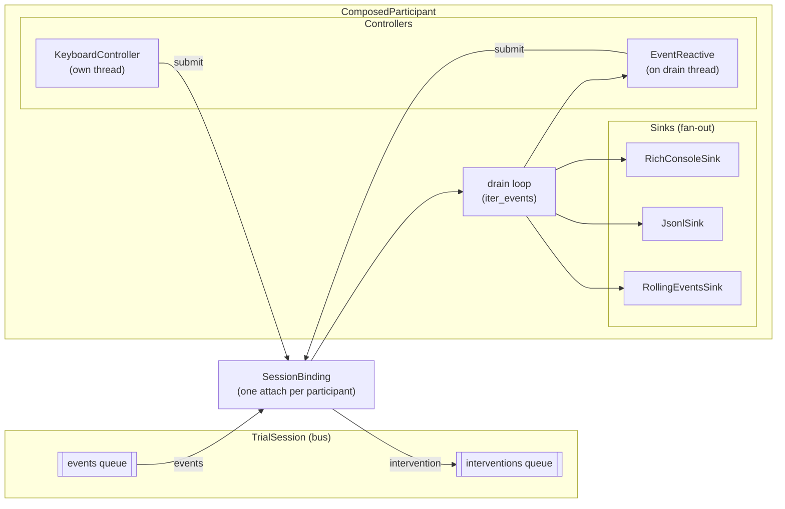
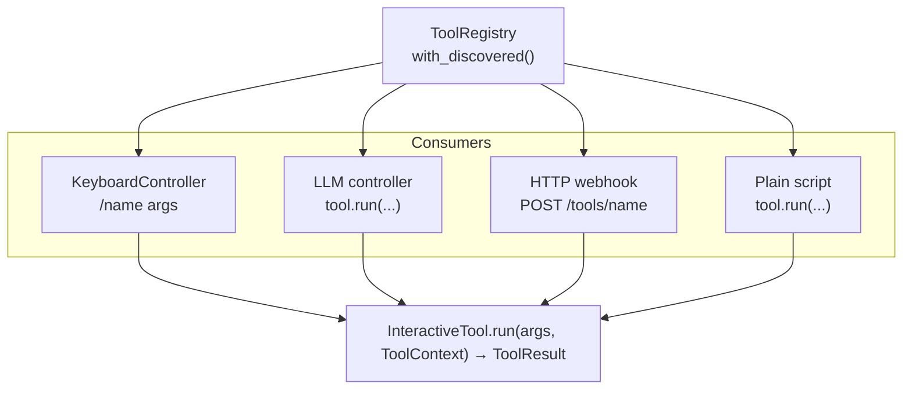

# Intervener

Design guide for the `tools/intervener/` peer package — the reference
consumer of the Open Agent Loop gate.

For the gate itself (event/intervention taxonomy, sealed vs open modes,
config, trace format), see [`docs/OPEN_AGENT_LOOP.md`](OPEN_AGENT_LOOP.md).
For the architectural decision record, see
[ADR-0019](adr/0019-open-agent-loop-sessions.md).

---

## 1. What it is

`tools/intervener/` is a **peer package** that consumes the OAL gate.
Nothing in `tolokaforge/` imports it; the intervener imports only what
the gate contract exposes (`tolokaforge.session`), plus recorded/live
`TrialSession` implementations to attach against.

The package ships two participant shapes, five reference event sinks,
four reference input controllers, and a tools plug-in surface — all
compositional, all decoupled from tolokaforge's runner-side internals
(credentials, model configs, LLM stack). See §6 for the exact contract.

Two participant shapes coexist:

| Shape | When to reach for it |
| --- | --- |
| **`Participant`** (event-reactive) | Every action is triggered by an event (LLM drafter reacting to each `AssistantMessage`, rule-based safety checks). Simplest — subclass and implement one `handle_event(event) → EventReaction` method. |
| **`ComposedParticipant`** (compositional) | The input is independent of events (human at a keyboard, HTTP webhook, chaos timer). Wire N `EventSink`s and M `InputController`s around one `SessionBinding`. |

Both attach through the same session bus and are indistinguishable from
the gate's perspective. Pick by callsite ergonomics.

---

## 2. Architecture

### Composition around a session binding



Key properties:

- **One attach per participant.** `SessionBinding` owns the
  `ParticipantHandle` and exposes `submit()`. Attach happens in the
  binding's constructor; `detach()` is idempotent.
- **Sinks fan out** — every event drained from the bus flows to every
  sink registered on the participant. Sink failures are isolated
  (`CompoundSink` swallows child exceptions so a broken metrics sink
  doesn't blind the durable log).
- **Controllers split into two flavors.** Event-reactive controllers
  (e.g. `EventReactiveController` used by an LLM drafter) implement
  `EventSink` too, so the drain loop delivers events to them on the
  drain thread. Independent controllers (`KeyboardController`,
  `TimerController`) spawn their own thread and submit whenever their
  own trigger fires.
- **`ComposedParticipant.run()`** owns the drain loop: create binding →
  start controllers → drain events → forward to every listener → on
  `TerminalReached`, set the shared terminal event → stop controllers →
  detach.

---

## 3. Reference sinks

| Sink | Purpose |
| --- | --- |
| `RichConsoleSink` | Interactive terminal — cyan `Panel` for assistant messages, colored one-liners for tool calls / results / pause / resume / terminal. |
| `PlainLineSink` | One colored ANSI line per event. Scripts, CI logs, tail-style monitoring. |
| `JsonlSink` | One JSON object per event, appended to a stream or file. Machine-readable durable log for downstream analysis. |
| `RollingEventsSink` | Bounded in-memory buffer (default `maxlen=200`). Read via `.events` to build a `ToolContext.recent_events` list. |
| `SilentSink` | `/dev/null` — for metrics-only participants that don't need event display. |
| `CompoundSink` | Fan out to N child sinks. Child failures are swallowed so one broken sink doesn't stop the others. |

### Writing your own sink

Two methods, both required by the Protocol:

```python
from tolokaforge.session import TrialEvent

class MetricsSink:
    """Counts events per kind and logs the totals on trial end."""

    def __init__(self) -> None:
        self._counts: dict[str, int] = {}

    def on_event(self, event: TrialEvent) -> None:
        self._counts[event.kind] = self._counts.get(event.kind, 0) + 1

    def on_terminal(self) -> None:
        print(f"trial event counts: {self._counts}")
```

Any class satisfying `intervener.protocols.EventSink` (both methods)
plugs straight into `ComposedParticipant(sinks=[MetricsSink(), …])`.

---

## 4. Reference controllers

| Controller | Trigger | Notes |
| --- | --- | --- |
| `KeyboardController` | Raw `i` key on stdin (default; configurable via `trigger_key`) | Opens a step-mode REPL. Also implements `EventSink` so it can observe `PauseAcknowledged` / `TerminalReached`. Uses termios cbreak. |
| `ScriptedController` | Line-triggered (consume one line per seam) or time-scheduled (`(delay, intervention)` pairs) | Deterministic replay for tests, canned demos, non-TTY consumers. |
| `EventReactiveController` | Callback `(event, binding) → Optional[TrialIntervention]` | Wraps any event → intervention function. LLM drafters and rule-based agents use this shape. |
| `TimerController` | Fires every `interval_seconds` | Chaos testing, periodic health injection. |

### Writing your own controller

The `InputController` Protocol needs two methods:

```python
import threading
from intervener.binding import SessionBinding
from intervener.tools.base import LLMCallable  # example — if your controller uses one
from tolokaforge.session import InjectMessage
from datetime import datetime, UTC

class WebhookController:
    """Toy example — listens on an HTTP endpoint, submits when POSTed."""

    def start(self, binding: SessionBinding, terminal: threading.Event) -> None:
        self._binding = binding
        self._terminal = terminal
        # Spawn HTTP server on a background daemon thread here.

    def stop(self) -> None:
        # Server thread will exit when the process ends (daemon=True).
        self._binding = None

    # ... handler method called by the HTTP server on request:
    def _handle_post(self, content: str) -> None:
        if self._binding is None:
            return
        self._binding.submit(InjectMessage(
            trial_id=self._binding.trial_id,
            attach_to_seq=0,
            participant_id=self._binding.participant_id,
            timestamp=datetime.now(UTC),
            content=content,
        ))
```

Event-reactive controllers additionally implement `on_event(event)` — see
`intervener/controllers/event_reactive.py` for the minimal template.

---

## 5. Interactive tools — plug the gate open

Any consumer attached to a session often wants to call **shared
utilities**: inspect the trial's context, summarise the last N turns, run
a retrieval query, invoke a safety monitor. The `intervener.tools`
package lets you write those utilities **once** and call them from **any
consumer** — the keyboard REPL, an LLM controller, an HTTP webhook, a
plain script.

### The four types

```python
from intervener import (
    InteractiveTool,   # Protocol: name, description, run(args, ctx)
    LLMCallable,       # Callable[[str, str], str] — (system, user) → text
    ToolContext,       # all fields optional; caller populates what it has
    ToolResult,        # output (text) + optional data (dict) + submitted_interventions
    ToolRegistry,      # name → tool; entry_points discovery via with_discovered()
)
```

`ToolContext` is a dataclass with every field optional:

| Field | Purpose |
| --- | --- |
| `binding: SessionBinding \| None` | Present when the caller has a live session. Tools MAY submit interventions through it. |
| `recent_events: list[TrialEvent]` | Bounded window the caller decides. |
| `task_metadata: dict \| None` | Opaque — populated by the caller from anywhere (task.yaml, project config, …). |
| `console: Console \| None` | Optional Rich console for rendering. |
| `llm_call: LLMCallable \| None` | Caller-supplied `(system, user) → text`. See §6 — this is the LLM decoupling seam. |
| `extras: dict` | Future-proofing escape hatch. |

### One tool, many callers



Tools don't know which consumer called them. They read from `ToolContext`,
handle missing fields gracefully, and return a `ToolResult`.

### Ship a tool as an installable package

Third-party integrators register tools under Python entry-points:

```toml
# in the third-party package's pyproject.toml
[project.entry-points."intervener.tools"]
retrieval      = "my_pkg.tools:RetrievalTool"
safety_monitor = "my_pkg.tools:SafetyMonitorTool"
```

`pip install my-pkg` → next `ToolRegistry.with_discovered()` call
enumerates the entry-points and instantiates both tools. **No intervener
core edit required.** This is the "install a tool" story.

Reference tools shipped in this package (registered under the same
group in `tools/intervener/pyproject.toml`):

- **`ContextTool`** — prints task metadata + event counters + last
  assistant preview. Non-agentic. Returns both `output` (text) and `data`
  (structured dict).
- **`AnalyzeTool`** — LLM-drafts a brief of the last N turns via
  `ToolContext.llm_call`. Heuristic fallback when `llm_call is None`,
  raises, or returns empty. Accepts `args` as an int (default 5).

---

## 6. Decoupling contract

The intervener package **must not import from**:

- `tolokaforge.core.llm` (LLM stack, provider selection, presets)
- `tolokaforge.secrets` (credential loading)
- `tolokaforge.core.models` (`ModelConfig`, `RunConfig`)
- `tolokaforge.core.orchestrator` (run-scope machinery)

Any runner-side capability is the **conductor's domain**. If the
intervener needs one, it defines a narrow contract and lets callers wire
the concrete implementation. Current examples:

| Contract | Concrete backend wired by callers |
| --- | --- |
| `SessionBinding` (attach + submit) | Any `TrialSession` implementation (`InProcessTrialSession`, `RecordedTrialSession`, future `WebSocketTrialSession`) |
| `LLMCallable` (`(system, user) → text`) | A closure wrapping `tolokaforge.core.llm.LLMClient` (or direct Anthropic, an in-house HTTP client, a test stub) |

**Why:** the conductor manages credentials, provider selection, preset
resolution, and secret loading for everything that runs inside the
trial. If the intervener imported those directly it would (a) create a
hard dependency the peer shape doesn't intend, (b) duplicate decisions
that belong in one place, and (c) make third-party plug-ins impossible
without touching intervener code.

**Verification:** at the repo root,

```bash
grep -rn 'from tolokaforge\.\(core\.llm\|core\.models\|secrets\|core\.orchestrator\)' \
    tools/intervener/intervener/
```

must return no matches.

---

## 7. Writing a live-attach driver

End-to-end pattern: build a `ComposedParticipant` with a `RichConsoleSink`,
a keyboard controller with an LLM-callable, and a tool registry loaded
via entry-points discovery.

```python
import threading
from pathlib import Path

import yaml
from intervener import (
    ComposedParticipant,
    JsonlSink,
    KeyboardController,
    RichConsoleSink,
    ToolRegistry,
)
from tolokaforge.core.llm import LLMClient
from tolokaforge.core.models import Message, MessageRole, RunConfig
from tolokaforge.core.orchestrator import Orchestrator
from tolokaforge.session import ParticipantRole


def build_llm_call(model_config):
    """Wrap tolokaforge's LLMClient into an intervener-shaped LLMCallable.
    The intervener knows nothing about LLMClient — callers do."""
    client = LLMClient(model_config)

    def _call(system: str, user: str) -> str:
        result = client.generate(
            system=system,
            messages=[Message(role=MessageRole.USER, content=user)],
            max_tokens=400,
        )
        return result.text.strip()

    return _call


def main() -> None:
    config = RunConfig.model_validate(yaml.safe_load(Path("run.yaml").read_text()))
    orchestrator = Orchestrator(config=config)

    trial_id = "my_task:0"
    session = orchestrator.sessions.get_or_create(trial_id)

    participant = ComposedParticipant(
        participant_id="human-operator",
        role=ParticipantRole.ADMIN,
        sinks=[
            RichConsoleSink(),
            JsonlSink("/tmp/events.jsonl"),
        ],
        controllers=[
            KeyboardController(
                trigger_key="i",
                tools=ToolRegistry.with_discovered(),
                task_metadata={"name": "my_task", "description": "…"},
                llm_call=build_llm_call(config.models["agent"]),
            ),
        ],
    )

    threading.Thread(target=participant.run, args=(session,), daemon=True).start()
    orchestrator.run()
```

That's the whole surface for an interactive human-attached demo:
compose four objects, hand them the session, run the orchestrator on
the main thread.

---

## 8. Testing

Tests should exercise tools + controllers **without** live sessions or
network calls. Two patterns:

**Stub `LLMCallable` for agentic tools:**

```python
from intervener import AnalyzeTool, ToolContext

def stub(system: str, user: str) -> str:
    return "the agent is stuck in a db_query loop"

result = AnalyzeTool().run("3", ToolContext(
    recent_events=my_captured_events,
    llm_call=stub,
))
assert "stuck" in result.output
assert result.data["source"] == "llm"
```

**Use `RecordedTrialSession` for offline participant runs:**

```python
from tolokaforge.session import RecordedTrialSession

session = RecordedTrialSession.from_trajectory_yaml("path/to/trajectory.yaml")
log = participant.run(session)   # blocks until the recorded events drain
```

Recorded transport gives you the whole participant lifecycle (attach →
drain → detach) without needing Docker, an LLM, or a live orchestrator.

See `tools/intervener/tests/test_tools.py` and `test_composition.py`
for the full test patterns.

---

## See also

- [`docs/OPEN_AGENT_LOOP.md`](OPEN_AGENT_LOOP.md) — the OAL gate itself: event/intervention taxonomy, modes, config, trace format.
- [ADR-0019 — Open Agent Loop: TrialSession Protocols and gate](adr/0019-open-agent-loop-sessions.md) — the architectural record for the whole stack (main + two addenda covering the composed layer and the tools plug-in).
- [`examples/open_agent_loop/`](../examples/open_agent_loop/) — runnable copilot-attach example.
- [`tools/intervener/README.md`](../tools/intervener/README.md) — package README (installation, `intervener-demo` CLI, layout).
- [`tools/intervener/intervener/`](../tools/intervener/intervener/) — the code itself. Every public class is `__all__`-exported and docstringed.
