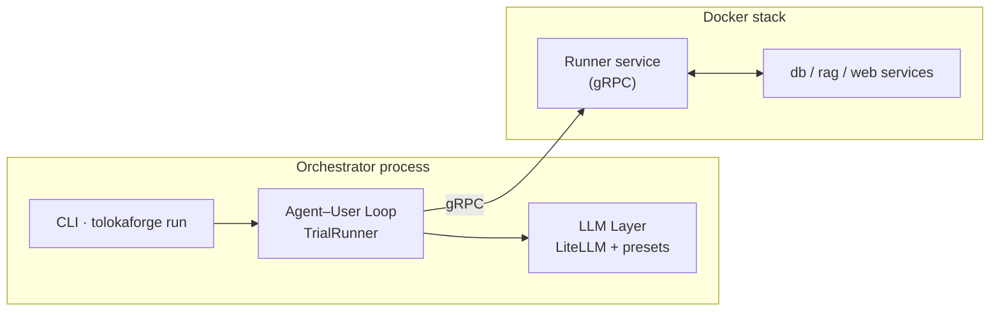
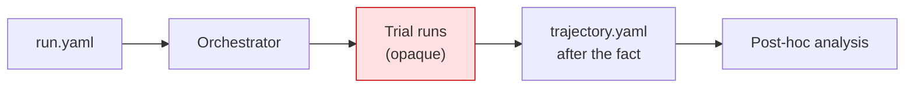
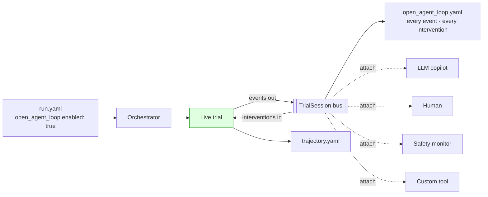
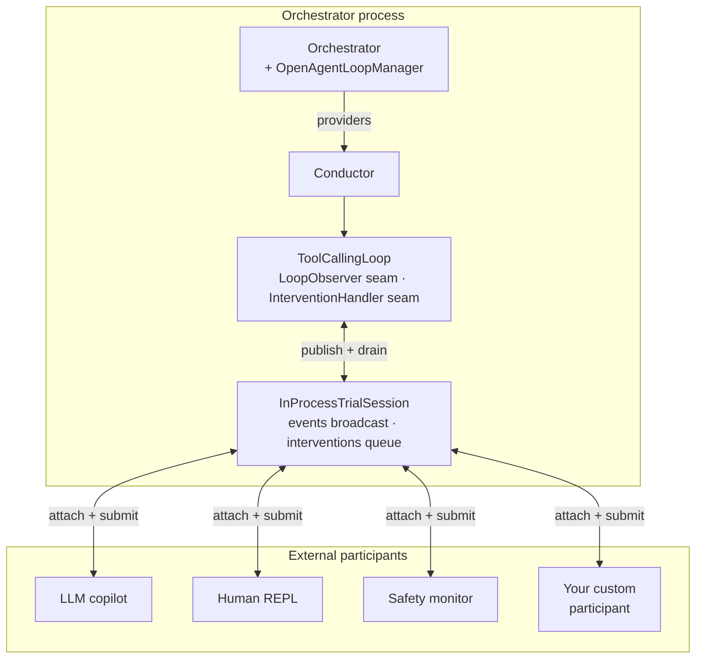

# Open Agent Loop — Presentation Source

> **Instructions for the slide generator.**
> This file is the single source for a **~10-slide, 7–10 minute presentation**
> on the Open Agent Loop (OAL) project for tolokaforge. Every slide below is
> fully specified — title, layout, visual content, Mermaid diagram (when
> applicable), and speaker talking points. Render each slide as its own page.
> Preserve the Mermaid blocks verbatim (do not paraphrase into text).
> Preserve tables. Style guidance is at the end of this file.

---

## Meta

| Field | Value |
| --- | --- |
| Project | Open Agent Loop (OAL) — a decoupled participant gate for tolokaforge |
| Author | Ciro Gamboa |
| Total slides | 10 |
| Target length | 7–10 minutes |
| Audience | Technical peers · comfortable with software engineering + LLM/agent basics · **may not know tolokaforge or Toloka** |
| Deliverable posture | Brief description of the domain · clear problem statement + why it matters · well-structured overview of the solution · live demo |
| Brand color | Teal-green `#00B37E` (Toloka accent) |
| Language | English |

## Deliverable requirements to satisfy

The deck must cover:

- **A brief description of your domain or problem area** — Slides 2 & 3.
- **A clear problem statement and why it matters** — Slide 4.
- **A well-structured overview of your solution** — Slides 5–8.
- **A live demo of your project** — Slide 9.

Plus a results slide (10) to close with an evidence-based claim before Q&A.

## Constraints and posture

- **Public safety.** No internal Jira keys, no named client companies, no unpublished adapter or client-repo names on visible slides.
- **Honesty over hype.** The results slide reports what actually happened in the A/B study — no fictional numbers. If the study surfaced null or ambiguous results, present them honestly.
- **No slide is "just an intro."** Every slide earns its 30–90 seconds by delivering one concrete claim or one useful diagram.
- **High-level diagrams only.** Aim for at-a-glance comprehension — no source code, no full API surfaces. If the audience wants depth they can read `docs/OPEN_AGENT_LOOP.md` and ADR-0019.
- **The demo slide is a placeholder.** The presenter opens the terminal and runs the live scenario during that slide; nothing renders on-screen from this file except the slide title + one-line prompt.

## One-line pitch

> **The Open Agent Loop turns tolokaforge trials from a closed batch process into a live, observable, interactively steerable system — without breaking any benchmark's reproducibility guarantees.**

---

## Slide 1 — Title

**Layout.** Centered title slide. No diagram. Small footer with author, project, date.

**Content.**

- **Title (H1):** Open Agent Loop
- **Subtitle:** Turning agent evaluations into a live, participant-driven system
- **Footer:** Ciro Gamboa · Toloka / tolokaforge · 2026

**Speaker notes (~10s).**

> "Today I'll show a change to how we run AI-agent evaluations — one that turns them from a black box into something you can watch, steer, and coach in real time. All while keeping the benchmark guarantees intact."

---

## Slide 2 — Domain: what is tolokaforge

**Layout.** Left column: 4 bullets of what tolokaforge does. Right column: Mermaid architecture snapshot (small, at-a-glance).

**Content — bullets (left):**

- **A benchmarking harness for tool-using LLM agents.** Ships tasks, runs them against any provider (OpenAI, Anthropic, Google, OpenRouter...), reports pass/fail + cost + latency + failure modes.
- **Deterministic by design.** Same task + same model + same seed → same verdict. Every tool call runs in a Docker-hosted Runner service to isolate state.
- **Extensible.** Any benchmark format plugs in as an *adapter*; task packs + tool servers ship as separate repositories.
- **Produces the data ML teams actually need.** Trajectories, per-turn cost, tool-use patterns, failure attribution — the exact substrate for evaluating and improving agent products.

**Diagram (right):**

**Speaker notes (~45s).**

> "Tolokaforge is Toloka's benchmarking harness for LLM agents. You give it a task, a model, and a task pack; it runs the agent, executes tool calls in a sandboxed Docker Runner, grades the result, and gives you deterministic metrics — pass@k, cost, latency, failure attribution. It's designed for reproducibility: same seed, same result. It supports any LLM provider through LiteLLM. This is real infrastructure — Toloka runs it internally and it's open-sourced under the same name."

---

## Slide 3 — Why this data matters

**Layout.** Two columns. Left: what the data enables. Right: who consumes it.

**Content.**

**What the data enables:**
- **Model evaluation** — pass@k across benchmarks, provider comparisons, cost/latency profiling.
- **Regression detection** — trajectory hashes catch behavior changes across model versions.
- **Failure analysis** — turn-by-turn trajectories + typed failure modes (`stuck`, `tool_arguments`, `timeout_or_resource`, ...).
- **Cost engineering** — per-trial cost breakdowns, budget guards, comparative token usage.

**Who consumes it:**
- **Model teams** benchmarking new releases before shipping.
- **Task authors** validating that a new task discriminates between agents.
- **Product teams** deciding which model to route to at scale.
- **Researchers** publishing agent-quality claims.

**Speaker notes (~45s).**

> "This data is the raw material for every serious decision about deploying LLM agents in production. It's how you tell if switching from Sonnet to Haiku costs you 15 percentage points of quality or none. It's how you catch a silent regression when a provider ships a model update. Every trajectory is a piece of evidence — and today, every trajectory is written to disk only *after* the agent finishes. Which brings us to the problem."

---

## Slide 4 — The problem: the loop is closed

**Layout.** Full-width. Top: statement in bold. Middle: Mermaid diagram of the closed loop. Bottom: 3-bullet consequences.

**Content — statement:**

> **The current agent loop runs to completion in isolation. Once a trial starts, no external code can observe events as they happen, and no external code can influence what the agent does.**

**Diagram:**

**Consequences:**

- **No mid-run observability.** A trial that spends $2 looping on the same wrong tool call runs to completion — you find out when the aggregate lands on disk.
- **No mid-run intervention.** Cannot inject a hint when the agent misreads a tool result. Cannot veto a risky tool call. Cannot pause and inspect.
- **No live human-in-the-loop.** Human review is post-mortem only.

**Speaker notes (~60s).**

> "Every current eval harness works this way — Inspect, Weave, Braintrust, Promptfoo, Harbor. You configure a run, start it, wait for it to finish, then look at what happened. If the agent gets stuck in an obvious loop 60 seconds in, you can't help it. If it's about to do something risky mid-turn, you can't stop it. If you want to actually watch an agent think, you can't — you can only read the transcript afterward. And when the failure mode is subtle, this closed loop makes iteration painfully slow."

---

## Slide 5 — Opening the loop

**Layout.** Full-width. Top: the core idea in one sentence. Middle: Mermaid diagram of the open loop. Bottom: three properties.

**Content — statement:**

> **Add a typed session bus alongside the trial. Events stream out; interventions stream in. External code can attach — humans, LLM copilots, safety monitors, cross-trial orchestrators — through the same contract.**

**Diagram:**

**Properties (bottom):**

- **Opt-in.** Off by default; sealed benchmark runs are byte-identical to before. The reproducibility guarantee holds.
- **Multi-participant.** Any number of external actors can attach at once. Role priority resolves conflicts (`admin > participant > observer`).
- **Every action recorded.** Both agent events and participant interventions land in a durable trace file, so open-mode runs are still fully auditable.

**Speaker notes (~60s).**

> "The proposal is to add a bus — a typed session bus — alongside the trial. Events flow out; interventions flow in. Anyone who satisfies a narrow contract can attach: a human at a terminal, an LLM coach, a safety monitor, a chaos tester, an HTTP webhook. The bus is opt-in — a single boolean in the run config. When it's off, nothing changes; benchmarks stay reproducible. When it's on, the trial becomes a live, observable, steerable object. And every intervention is recorded in a separate trace file, so even open-mode runs remain auditable."

---

## Slide 6 — Architecture: two seams, one bus

**Layout.** Full-width diagram. Small caption below.

**Diagram:**

**Caption:** Two narrow Protocol seams on the loop (`LoopObserver` outbound, `InterventionHandler` inbound). A run-scoped manager wires them to concrete `InProcessTrialSession` instances. Everything session-specific lives *on the session side of the seam* — the loop and the conductor stay session-agnostic. Sealed mode uses null implementations of the seams.

**Speaker notes (~60s).**

> "Architecturally: two narrow Protocol seams on the agent loop — one for events out, one for interventions in — plus a per-trial session bus that any external participant can attach to. The conductor knows nothing about sessions; it just carries a pair of provider callables. Sealed benchmarks hit null implementations and run identically to before. Open runs wire in a real session, and everything on the participant side lives outside the runner. This split matters because it means the runner's core stays stable — we can add sinks, controllers, tools, whole new integration patterns, without touching the trial-execution code."

---

## Slide 7 — Implementation: what was built

**Layout.** Two columns. Left: the four layers, top to bottom. Right: a small callout of what the numbers add up to.

**Content — left (four layers):**

1. **Session gate** (`tolokaforge/session/`) — `TrialSession` Protocols, event/intervention taxonomies (Pydantic v2 discriminated unions), `InProcessTrialSession` live transport, `RecordedTrialSession` replay transport, `OpenAgentLoopManager` run-scoped coordinator.
2. **Loop seams** (`tolokaforge/core/loop.py`) — `LoopObserver` + `InterventionHandler` Protocols on `ToolCallingLoop`. Sealed mode uses null impls; open mode wires session-bound bridges. Intervention pump handles Pause/Resume state machine + tool-approval + Kill with role-priority conflict resolution.
3. **Intervener package** (`tools/intervener/`) — peer package. Two participant shapes (`Participant` event-reactive · `ComposedParticipant` compositional), 6 reference `EventSink`s (Rich console · plain · JSONL · rolling · silent · compound), 4 reference `InputController`s (keyboard · scripted · event-reactive · timer).
4. **Interactive tools plug-in surface** (`intervener.tools`) — `InteractiveTool` Protocol, `ToolRegistry` with entry-point auto-discovery. Reference tools: `context` (trial metadata + counters) and `analyze` (LLM-drafted brief of the last N turns).

**Right — callout box:**

> **Ships as ~4,000 LOC across `tolokaforge/session/` + `tools/intervener/`.**
> **43 unit tests, ruff-clean, sealed-mode byte-identity verified.**
> **Two PRs on `feat/open-agent-loop` (open-mode core) and `feat/oal-interactive-tools` (compositional layer + tools + coaching demo).**

**Speaker notes (~75s).**

> "Four layers. First, the session gate itself — the Protocols, the event and intervention wire types, the live and recorded transports, a run-scoped manager. Second, the loop seams — two Protocols on the tool-calling loop that default to no-ops, so sealed mode is genuinely a no-op path. Third, the intervener package — a peer package that ships two participant shapes plus reusable sinks, controllers, and everything you'd want to compose a participant from. Fourth, an interactive tools plug-in surface — utilities any consumer can invoke, discovered from installed packages via Python entry-points, so pip-installing a third-party tool package makes new capabilities available with zero core edits."

---

## Slide 8 — Potential: what can you plug in

**Layout.** Full-width. Grid of 6 boxes describing plausible participant/tool categories with a one-sentence use case each. Small footer noting decoupling constraint.

**Content — the six boxes:**

| Category | Concrete example |
| --- | --- |
| **Coaching** | An LLM watches the agent turn-by-turn; when it detects a stuck pattern, it drafts and injects a hint. (Live demo next.) |
| **Live human review** | A human attaches to a running trial from a terminal, steps through turn-by-turn like a debugger, injects context when the agent needs it. |
| **Safety monitor** | A policy engine watches tool calls and vetoes anything matching a "risky" pattern in real time. Recorded veto with reason. |
| **Cross-trial supervisor** | A single participant attaches to N concurrent trials, learns from failures in one, injects the lesson into another. |
| **Chaos / red-teaming** | A timer-driven participant injects adversarial messages on a schedule to probe agent robustness. |
| **HTTP-driven integrations** | A webhook consumer exposes tool invocations as REST endpoints — plug the agent into your existing ops tooling. |

**Footer:**

> Every category above already fits through the same `SessionBinding` + `LLMCallable` contracts. Third-party packages register tools via `[project.entry-points."intervener.tools"]` — `pip install` distributes new capabilities without touching the core.

**Speaker notes (~60s).**

> "Now that the gate is open, what fits through it? These six categories are all concrete — the coaching case is what I'll demo next. Live human review is a debugger for agents. Safety monitors get to intercept risky tool calls before they execute. A cross-trial supervisor is genuinely novel — nobody else's eval harness lets you learn from one running trial and inject the lesson into another. And because tools are discovered through Python entry-points, third-party integrations are pip-install away — no core edits, no forks."

---

## Slide 9 — DEMO

**Layout.** Very sparse. Large centered word "DEMO". One-line description below in smaller font. No diagram.

**Content:**

- **H1:** DEMO
- **Subtitle:** A live human attaching to a running trial · pause · inject · step · resume

**Speaker notes (~90–120s live).**

> **What to demo (live, in a terminal):**
>
> 1. Start the live-human scratchpad against the ticket task:
>    `scripts/with_env.sh uv run --package intervener python <scratchpad>/run_with_human.py`
> 2. Let the agent run a turn or two. Point out the event stream in the Rich console.
> 3. Press `i` — pause lands, REPL opens, hint block visible.
> 4. Type `/context` — the context tool prints task metadata + event counters.
> 5. Type `/analyze 3` — the LLM-analyze tool prints a brief of what the agent is doing.
> 6. Type a hint, e.g. `look for the ticket in the initial state, don't try to seed it` — bare text becomes an InjectMessage AND steps one turn. Show the agent reacting on the next turn.
> 7. `/quit` — leave the REPL; let the trial finish.
> 8. `cat` the OAL trace to show every event and intervention recorded with `ack_outcome: accepted`.
>
> **Fallback if live demo fails:** switch to a pre-recorded terminal capture (asciinema) showing the same flow.

---

## Slide 10 — Results: the coaching study

**Layout.** Top: 1-sentence framing. Middle: results table. Bottom: 2-bullet takeaway.

**Framing (top):**

> **We ran a three-arm A/B benchmark to test whether real-time coaching improves an agent that reliably gets stuck.** Same task (`tool_use_public_example_01` — ticket resolution), same model (Claude Sonnet 4.6 via OpenRouter), same seed. Repeats: 4 per arm. Total study cost: **$0.95**.

**Results table (middle):**

| Arm | Trials | Pass@1 | Avg score | Avg turns | Agent $ | Coach $ | Total $ | Coach interventions |
| --- | --- | --- | --- | --- | --- | --- | --- | --- |
| **solo** (sealed) | 4 | 0.00 | 0.517 | 8.0 | $0.366 | $0.000 | $0.366 | 0 |
| **rule_coached** | 4 | 0.00 | 0.442 | 9.0 | $0.326 | $0.000 | $0.326 | 12 |
| **llm_coached** | 4 | 0.00 | **0.554** | **5.5** | $0.245 | $0.011 | **$0.256** | 7 |

**Takeaway (bottom):**

- **The plumbing works end-to-end.** Coach attached to every live trial, detectors fired, interventions landed in the pump, everything recorded in `open_agent_loop.yaml` + `coach_report.yaml`.
- **Nobody passed the hard binary criterion** — the task is genuinely difficult for this model. Even with coaching, `pass@1` stayed at 0. **Honest finding, not broken demo.**
- **Design choice matters.** The dumb rule coach *hurt* average score (0.52 → 0.44) — canned hints distracted the agent. The LLM coach was *more selective* (7 interventions across 4 trials vs. rule's 12), and delivered a genuine efficiency win.
- **LLM coach's economic story: net-positive even including its own LLM spend.** Turns down 31% (8.0 → 5.5), total cost down 30% ($0.37 → $0.26), score stable. At scale, this is a real saving.
- **The substrate is the deliverable.** The 4×3 = 12 detector×intervener combinations, plus `pip install` for third-party tools, mean anyone can iterate a smarter coach without touching the core.

**Speaker notes (~90s).**

> "Real numbers from a three-arm study — same task, same model, same seed. Nobody passed the binary criterion, but look at what happened: the *rule* coach fired 12 times and actually made things *worse* — dumb hints distracted the agent, average score dropped from 0.52 to 0.44. The *LLM* coach fired only 7 times total across four trials — it was more selective, only intervening when it really saw stuckness. And the LLM coach saved 31% of agent turns and 30% of total cost — including its own $0.01 LLM spend. So we've validated three things: the plumbing works end-to-end; the coach design choice matters more than whether you have a coach at all; and the same substrate — sinks, controllers, tools — is ready for anyone who wants to build a smarter next iteration. Total study cost was under a dollar."

---

## Style guidance

- **Palette.** Teal-green `#00B37E` for headings and rules. Neutral greys for body text. Red `#c00` reserved for the "problem" state on slide 4; green `#080` for the "solution" state on slide 5.
- **Typography.** Sans-serif for body (Inter, IBM Plex Sans, or system default). Monospace (JetBrains Mono, IBM Plex Mono) for code snippets in the demo slide and diagrams.
- **Diagrams.** Render Mermaid at slide-appropriate size — the container view diagrams should read at 15 feet. Avoid packing more than 8 nodes per flowchart. Preserve arrows' dashed vs. solid distinction — dashed for optional/attach relationships, solid for required flow.
- **Density.** No slide should exceed ~50 words of prose. Bullets over paragraphs. Tables preferred over grid layouts when comparing more than two items.
- **Footers.** All content slides include a small footer with author + date. No footer on the DEMO slide or title slide.
- **No emojis** except in the diagrams' UI-glyph slots (`▷`, `◁`, `⏸`, `▶`, `■`) that already carry semantic meaning in the codebase.
- **Public safety.** No internal Jira keys, no client names, no unpublished repo names. Public GitHub PR numbers (#445, #472) are fine to cite in speaker notes if useful, not on the slides themselves.
