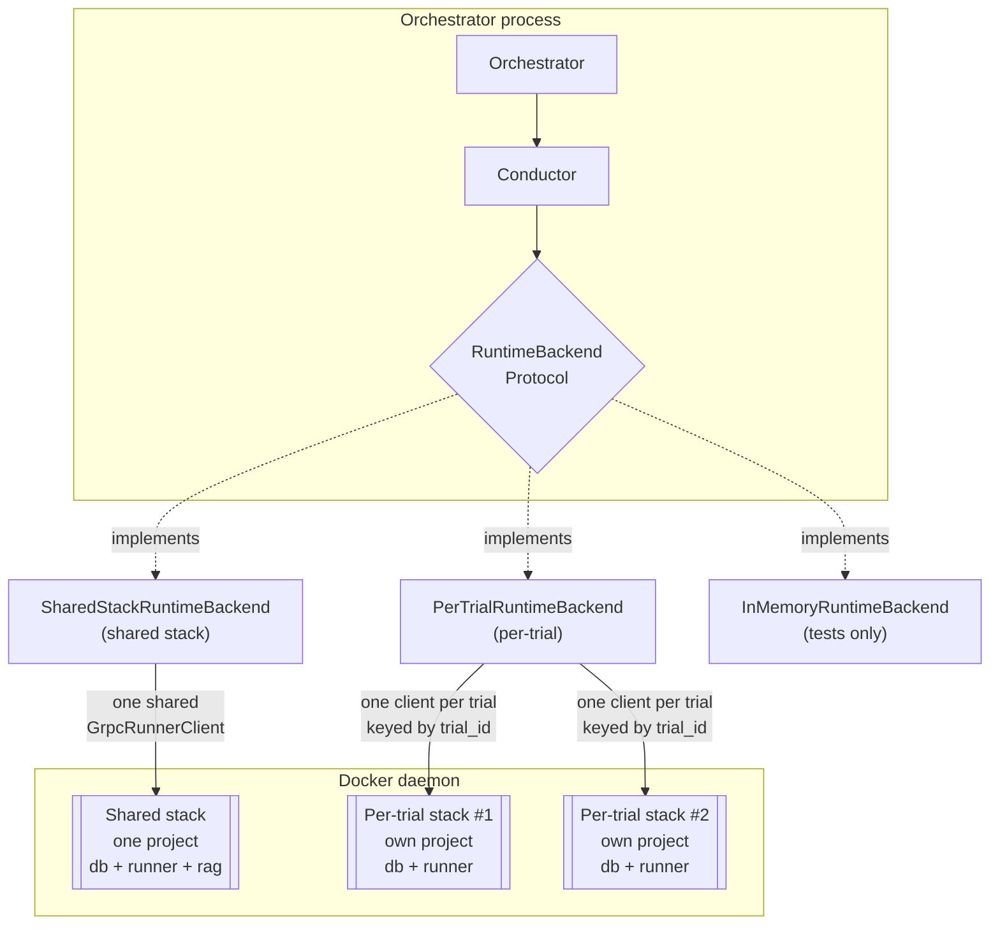
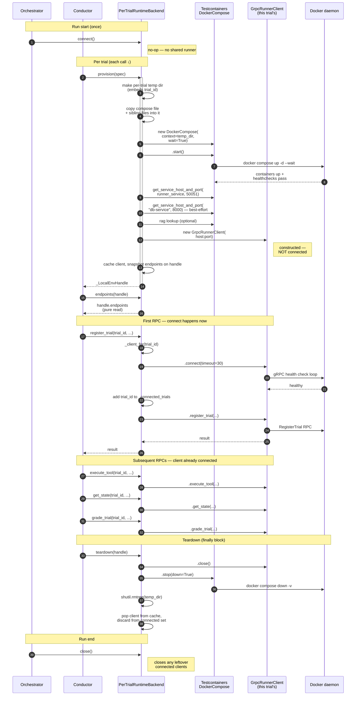
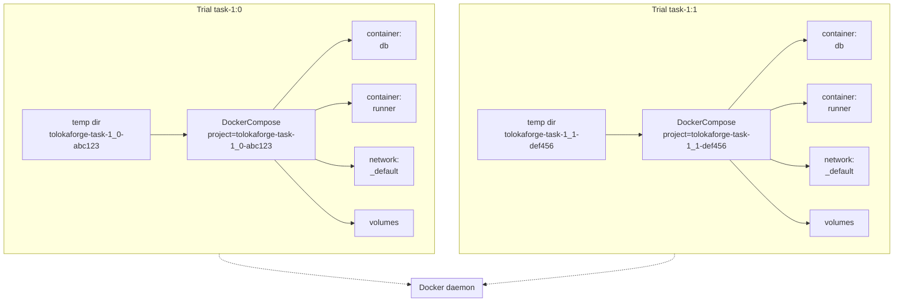
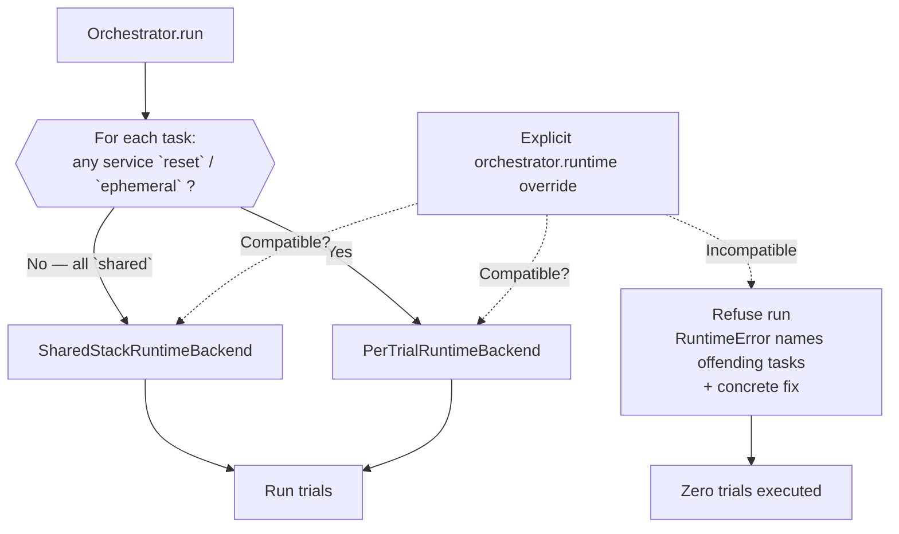

# Runtime backends — how a trial actually runs

This document walks through the `RuntimeBackend` seam end-to-end: what the
Protocol demands, how each production implementation satisfies it, what
happens over the lifetime of a single trial, and how per-trial isolation
composes with the compose-as-source-of-truth manifest.

Companion reading: ADR-0007 (`RuntimeBackend` Protocol), ADR-0010 (per-trial
provisioning contract), ADR-0013 (per-trial RPC methods on the backend),
ADR-0009 (`EnvironmentManifest`), ADR-0011 (Pattern B addendum — typed
wrapper over an external artifact).

## The seam

`RuntimeBackend` is the orchestrator's execution surface. A single Protocol,
ten methods, three concerns:

| Group | Methods | Called when |
|---|---|---|
| Run-level lifecycle | `connect`, `close`, `health_check` | Once per orchestrator run |
| Per-trial provisioning (ADR-0010) | `provision`, `await_ready`, `endpoints`, `teardown`, `capture_service_logs` | Around every trial body |
| Per-trial RPC (ADR-0013) | `register_trial`, `execute_tool`, `grade_trial`, `get_state`, `reset_trial`, `cleanup_trial` | Inside the trial body |

Every implementation ships all ten. The orchestrator holds one backend
instance for the whole run; the conductor calls it per-trial.



Backend names resolve through the `tolokaforge.runtime_backends` entry-point registry: a name is looked up against the registered factories at run start, and an unknown name raises an actionable error listing the registered names (see "Plug-in extension points"). Selection is a run-level choice with two knobs and a safety enforcement:

- **Config**: `orchestrator.runtime: <name>` in the run config YAML — any registered backend name (built-in `shared`, `per_trial`, `in_memory`, or a plug-in's name). Deprecated: when unset, selection is task-driven (below).
- **CLI override**: `tolokaforge run --runtime <name>` overrides the config for a single invocation, accepting any registered backend name. The banner printed at run start names the backend and the source (`cli-flag` vs `config` vs `default`) so operators can see what actually got chosen.
- **Task-side enforcement**: every task's `environment_manifest.services.<name>.isolation` declares its per-service posture (`shared` / `reset` / `ephemeral`; unlabelled services default to `ephemeral`). Backend selection is task-driven: any `reset` or `ephemeral` service routes the run to `PerTrialRuntimeBackend` automatically. An explicit `orchestrator.runtime` override is refused at startup if it contradicts per-service semantics — silent cross-trial state contamination is what this guard prevents. See "Isolation enforcement" below.

Legacy `orchestrator.runtime: docker` is accepted as a deprecated alias for `shared` with a `DeprecationWarning` at config load; it is coerced to `shared` before the registry lookup, since the registry has no `docker` name.

## Composition-plan seams

The compose-mode runtime is factored into three detachable adapter Protocols the composer stitches together per [ADR-0044 § 2](adr/0044-composition-plan-runtime.md). Each Protocol has one shipped implementation; new substrates (K8s, remote sandboxes) slot into the same seams by implementing the Protocol.

- **`ComposeMaterialiser`** (`tolokaforge/core/composition_runtime.py`) — brings one `StackDecl` up as a live compose project and tears it down. `materialise(decl, ctx)` runs the copy-context / network-policy / credential-inject / docker-socket-mount / `.start()` sequence and returns an opaque `StackHandle`; `resolve_endpoint(handle, service, port)` returns `(host, host_port)` or `None`; `teardown(handle)` reverses the sequence idempotently. Shipped impl: `DockerComposeMaterialiser` (`tolokaforge/core/docker_compose_materialiser.py`).
- **`ServiceLifecycleDispatcher`** — cycles one service between trials for a given `ServiceIsolation` label. One dispatcher per closed label — `SharedDispatcher` (no-op), `ResetDispatcher` (delegates to `RECIPE_REGISTRY.dispatch`), `EphemeralDispatcher` (targeted `docker compose rm -f -v <svc>` + `docker compose up -d --wait <svc>`). The composer resolves by `service_spec.isolation` at cycle time via `DISPATCHER_REGISTRY` in `tolokaforge/core/service_lifecycle_dispatchers.py`.
- **`SubstrateComposer`** — the sequencer. `materialise_run(plan, ctx)` walks run-scope stacks and enforces INV-12 (exactly one stack across the plan sets `runner_service`); `provision_trial(plan, spec, run_sub)` walks task-scope and trial-scope stacks and applies reset recipes on newly-materialised stacks; `cycle_between_trials(run_sub, spec)` dispatches every service through the lifecycle registry; `teardown_trial` / `teardown_run` walk the handles in reverse scope order. Shipped impl: `DefaultSubstrateComposer` (`tolokaforge/core/default_substrate_composer.py`).

`SharedStackRuntimeBackend`'s compose-mode path walks a composition plan via the injected `SubstrateComposer`: `connect()` calls `materialise_run` for run-scope stacks, `provision(spec)` calls `provision_trial` for task-scope and trial-scope stacks, per-trial RPCs route through `runner_client_for`, and `close()` hands the substrate to `teardown_run`. The composer/materialiser/dispatcher triple is the only path — the backend carries no inline materialisation code. Byte-parity between the shipped triple and the frozen single-stack-shape baseline (the observable output today's built-in flows produced) is locked at `tests/canonical/test_composition_baseline_parity.py`; the baseline fixture under `tests/canonical/fixtures/composition_parity_baseline/` is the eternal reference, and CI never regenerates it.

## Concrete backends

**`SharedStackRuntimeBackend`** — composer-driven. In built-in-stack mode
(`env_manifest is None`), `connect()` wires a `GrpcRunnerClient` to the
`runner_address` the orchestrator's built-in `EngineStack` already
brought up; per-trial `provision` / `teardown` are no-ops on the
run-wide stack. In env_manifest mode, the backend delegates every
substrate operation to the injected `SubstrateComposer`: `connect()`
materialises run-scope stacks, `provision(spec)` materialises the
trial's task-scope and trial-scope stacks via
`SubstrateComposer.provision_trial`, per-trial RPCs route through
`SubstrateComposer.runner_client_for` (with a deferred-connect gate
that connects a trial-owned runner client on its first RPC call), and
`close()` hands the substrate to `SubstrateComposer.teardown_run`.
Every trial in the run shares the run-scope substrate; cross-trial
isolation lives in whichever service labels declare it via
`ServiceLifecycleDispatcher`.

**`PerTrialRuntimeBackend`** — this PR. One compose project per trial via
`testcontainers.compose.DockerCompose`. Each `provision` call materialises
an isolated stack; the trial's runner container is only reachable through
its own network + host-side port. Concurrent trials each get independent
containers, networks, and volumes. Backwards-compatible because it is
opt-in: tasks that do not declare an `environment_manifest` still run on
`SharedStackRuntimeBackend`.

**`InMemoryRuntimeBackend`** — test-only. Records every method call on a
`RuntimeBackendCallLog`; no Docker daemon required. Used by canonical
contract tests.

## Network posture

Egress policy is a function of **composition** (built-in vs task-declared
stack), not of lifecycle:

- **Built-in stack (Case A — no `environment_manifest`).** `EngineStack` brings
  up the engine's built-in services (runner + db-service ± mock-web ±
  rag-service) on `runner-net`, a bridge network that is **not** `internal`.
  This is `full_internet` **by construction**: the runner needs LLM-provider
  egress for in-container LLM-as-judge grading, and every service on the stack
  is first-party/trusted, so there is nothing untrusted to isolate. A Case A run
  has no `network_policy` surface — that field lives on `EnvironmentManifest`,
  which a Case A run does not have. Locked by
  `tests/unit/test_network_internal.py`.
- **Task-declared stack (Case B / Case C — `environment_manifest` set).** The
  task's compose stack is the untrusted surface, so it carries the enforceable
  posture: `EnvironmentManifest.network_policy` (default `no_internet`) is
  applied by `enforce_network_policy` during materialisation. Under
  `no_internet`, task services join an injected `internal: true` network while
  the runner keeps a non-internal edge network for control-plane and grading
  egress. A per-service opt-out, `services.<name>.network_access: restricted`,
  excludes the named service from the injected shared internal network (and,
  under `limited_internet`, from the proxy-env injection) so it sees only the
  networks its compose entry declares.

See [ADR-0018](adr/0018-multi-container-under-shared-runtime.md) § "Network
policy enforcement" for the enforcement table and [SECURITY.md](SECURITY.md)
for the threat model.

## A trial's lifecycle on `PerTrialRuntimeBackend`

The following sequence covers one trial end-to-end. Reads left-to-right in
time; each arrow is a real method call on the class instances named at the
column headers.



Every step above is a single method call in `tolokaforge/core/per_trial_runtime.py`.

## Trials whose task brings its own agent

The `execute_tool` step above normally repeats once per tool call the LLM turn
loop decides to make. Some tasks instead ship a **coding-harness CLI** — an
agent that runs inside the trial's container and does its own planning,
editing, and tool use. Driving the engine's turn loop over one of those stacks
a second agent on the first: two planners, two token bills, and a trajectory
that describes neither.

`InProcessConductor._run_agent_loop` takes a different branch for such a task.
The signal is one metadata key:

```python
harness_command = spec.task.metadata.get("agent_harness_command")
if harness_command:
    return self._run_harness_trial(spec, task_config, setup, harness_command)
```

`_run_harness_trial` calls `TrialRunner.run_harness`, which makes exactly one
`execute_tool` call carrying that command, records it, and finalises the
trajectory — no `ToolCallingLoop`, no LLM generation, no user turn. The
trajectory holds the task instruction as the user message and the CLI's output
as the agent's single reply; `tool_log` carries the invocation so a post-mortem
can read back what ran.

Two properties make this a narrow branch rather than a second execution model:

- **The engine names no CLI.** The command string arrives fully formed on
  `TaskDescription.metadata`, built by whichever adapter owns the task format.
  Adding a harness is an adapter change, never an engine change.
- **Grading is untouched.** `_grade` reads the trajectory and the trial's env
  state, not how they were produced, so the same graders score harness and
  turn-loop trials alike. For terminal-bench that is `test_execution` — the
  reference test suite run in the container.

The deadline is the target tool's own `timeout_s`, which the runner applies to
*both* governing timers — the RPC (`asyncio.wait_for` in the runner service)
and the `subprocess.run` behind the compose-exec wrapper. They must agree:
abandoning the RPC does not stop the subprocess thread, so a shorter run-level
budget would record the trial as `TIMEOUT` and then grade a container the CLI
is still writing to. Rather than take the shorter of the two,
`_run_harness_trial` **refuses** when the effective episode budget
(`min(task trial_seconds, orchestrator.timeouts.episode_s)`) is below the
harness budget, naming both knobs.

The task's sole agent tool is the one the command runs through; a task
registering more than one is refused, since one exec is the whole trial.

The terminal-bench adapter is the first producer of this metadata — see
[`external_adapters/tolokaforge-adapter-terminal-bench/README.md`](../external_adapters/tolokaforge-adapter-terminal-bench/README.md)
§ "Harness mode" for the image layering and credential wire that make the CLI
runnable inside the container.

## Deep-dive — `provision()`

Eleven steps, in order. Failure at any step raises `ProvisionError(stage="provision")` and cleans up whatever ran successfully before the raise.

1. **Guard on manifest presence.** `spec.task.environment_manifest is None` → raise. Tasks without a manifest belong on `SharedStackRuntimeBackend`, not this backend.
2. **Reject reserved-prefix `stack_inputs`.** Any key in `manifest.stack_inputs` that starts with `TOLOKAFORGE_` raises `ProvisionError(stage="provision")` naming the offending key. The check runs **before** the compose-materialisation `try` block so the reason reads as a manifest error, not `docker compose up failed`.
3. **Make a per-trial temp directory.** Path like `/tmp/tolokaforge-<sanitised-trial-id>-<random>/`. The basename is what Docker Compose reads for its auto-generated project name — encoding the trial id here is what gives each concurrent trial its own project.
4. **Copy the compose context.** Everything in the compose file's parent directory (compose YAML, adjacent bind-mount source files, initial-state fixtures, and any task-authored `.env`) copies into the temp dir. Bind mounts declared as relative paths resolve inside the copied context; safety validators (ADR-0009) already reject `..` and absolute paths, so the copy is closed and complete.
5. **Write the per-trial compose `.env`.** `<temp_dir>/.env` is (re)written with any task-authored `.env` content first, then `manifest.stack_inputs`, then the engine-reserved block (currently `TOLOKAFORGE_TRIAL_SLUG=<sanitised trial id>`). Docker Compose reads this file automatically, so `${VAR}` slots in the compose file resolve to the manifest's values — the same slug the temp-dir basename embeds is exposed as `${TOLOKAFORGE_TRIAL_SLUG}` for `container_name:` interpolation. Later entries win, so the reserved block overrides any earlier collision.
6. **Construct `DockerCompose`** with `context=<temp_dir>`, `compose_file_name=<manifest.compose_file.name>`, `pull=False`, `build=False`, `wait=True`.
7. **`compose.start()`.** Runs `docker compose up -d --wait`. Blocks until every service's compose `healthcheck:` reports healthy. On failure, raise `ProvisionError` and rmtree the temp dir.
8. **Resolve the runner endpoint.** Host + port come from `compose.get_service_host_and_port(manifest.runner_service, manifest.runner_port)`; runner-missing raises `ProvisionError`.
9. **Run the host-side readiness gate.** Probe the runner endpoint for gRPC channel-readiness, plus every service that declares a `readiness:` spec by that spec's kind on its first published port. A not-ready endpoint raises `ProvisionError(stage="provision")` carrying a `DiagnosticPayload` — see [Readiness gate](#readiness-gate).
10. **Construct the runner client** — `GrpcRunnerClient(runner_address="<host>:<port>")`. **The client is not connected here** — `connect()` is deferred to first RPC use (see [Lazy runner-client connect](#lazy-runner-client-connect)).
11. **Snapshot endpoints on the handle** and **cache the client** (`self._clients[spec.trial_id] = client`, the map every per-trial RPC method reads). Endpoint resolution looks up `runner_service` (required) and, best-effort, the db and rag services. Missing `db-service` leaves `EnvEndpoints.db_url = None`; the runner-side `DBServiceClient` binds to `DB_SERVICE_URL` from its container env and `db_json.py` tools fall back to the same env var, so a missing `db_url` is not a provisioning failure. Return `_LocalEnvHandle` carrying the trial_id (public), the compose stack, the runner service name + port, the temp dir, and the endpoints snapshot. All except `trial_id` are backend-private; callers treat the handle as an opaque token.

### Readiness gate

`docker compose up --wait` (step 5) blocks only until each service's *in-container* `healthcheck:` reports healthy — and a container's healthcheck typically probes its own loopback. A service can therefore be Docker-`Healthy` yet unreachable from the orchestrator process on its published host port: it bound `127.0.0.1` only, or bound an IPv6 address the IPv4 published-port DNAT never reaches. The compose `--wait` gate cannot see that gap.

The host-side readiness gate (step 7) closes it. Before the handle is returned, the backend probes each gated endpoint *from the orchestrator process* within the `connect_timeout` budget:

- **The runner substrate is always probed with the `grpc` kind** on its resolved host port — its default client-invocability contract (see [RUNNER.md](RUNNER.md)).
- **Each service that declares a `readiness:` spec** is additionally probed by that spec's `kind` (`grpc` / `http` / `tcp`) on its first published host port. A declared-readiness service that exposes no resolvable published port fails the gate — the contract cannot be honoured. (Under `no_internet` only the runner joins the egress-capable edge network and gets a host-published port; non-runner services are internal-only, so declaring readiness on them requires `full_internet` or `limited_internet`.)

A not-ready probe raises `ProvisionError(stage="provision")` carrying a `DiagnosticPayload` — the probed `service`/`kind`/`endpoint`, the `ReadinessResult`, and a best-effort docker-side view of where the service *actually* listens (published-port map, container listen addresses from `/proc/net/tcp[6]`, per-network IPs). That converts a downstream 30 s client-connect hang into a fast provisioning failure that names the mechanism. The probe seam is swappable per kind — see [Plug-in extension points](#plug-in-extension-points).

### Slow-dependency start order

Step 5's `--wait` is the whole start-order contract: it blocks until every service's compose `healthcheck:` reports healthy, and each service's `depends_on: {condition: service_healthy}` gates the start sequence. So `PerTrialRuntimeBackend` blocks on the full dependency chain before the trial's first RPC — a service never starts against a dependency that is not yet accepting connections.

The `examples/native/multi_service_slow_start` pack stress-covers this against a deliberately slow dependency. Its `app-db` runs a trailing `SELECT pg_sleep(25)` in a `docker-entrypoint-initdb.d` init script (which postgres executes on a socket-only temp server, so TCP :5432 is genuinely refused for the window) and a TCP-probing healthcheck (`pg_isready -h`) with `start_period` sized above the sleep. `app-service` (PostgREST) declares `depends_on: {app-db: {condition: service_healthy}}`, so `--wait` holds it — and the trial's first tool call — until postgres is TCP-reachable. A passing grade proves the chain held: had it not, PostgREST would start against a refused connection and the first runner → app-service → postgres call would fail. `tests/integration/test_startup_order_stress.py` asserts the provision takes ≥20 s and the grade passes.

## Endpoint resolution

`endpoints(handle)` is a **pure read** — it returns `handle.endpoints`, resolved once at provision time. This is a deliberate departure from an earlier design where `endpoints()` re-queried the compose stack every call: a method named `endpoints` mutating state on missing-service was surprising.

Where each URL comes from:

| Field | Service (manifest override) | Port (manifest override) | Required? |
|---|---|---|---|
| `runner_url` | `runner_service` (default `"default"`) | `50051` (`runner_port`) | Yes — missing raises `ProvisionError` |
| `db_url` | `db-service` (`db_service`) | `8000` (`db_port`) | Best-effort — absent leaves `db_url = None` |
| `rag_url` | `rag` or `rag-service` (`rag_service`) | first published port (`rag_port`) | Best-effort |

Each source and port is a **convention default the task author overrides from the manifest's `stack:` block** — `runner_port`, `db_service`, `db_port`, `rag_service`, `rag_port`. A task whose runner listens on a non-standard port, or whose state backend is a differently-named service, points the engine at it without touching this backend. An explicitly-set `db_service` or `rag_service` naming a service absent from the compose file raises `ValidationError` at manifest load. See [`MULTI_CONTAINER_GUIDE.md`](MULTI_CONTAINER_GUIDE.md#endpoint-overrides) for the authoring surface and [ADR-0009](adr/0009-environment-manifest.md) for the design.

`db_url` is best-effort because the runner-side `DBServiceClient` binds to `DB_SERVICE_URL` from its own container env (task compose files set it on the `runner` service), and `db_json.py` tools fall back to the same env var when constructed without a URL. A task compose file that omits `db-service` still provisions; the `db_url` field on the wire is populated only for callers that need to reach the state backend from outside the runner container.

All three are resolved via `compose.get_service_host_and_port(name, port)`, which returns the host-assigned port that maps to a service's container port. Two concurrent trials of the same task get **different** host-assigned ports for the same container port — that is what makes concurrent stacks not clash.

## Per-trial isolation

Testcontainers' `DockerCompose` does not accept a `project_name` parameter. Docker Compose derives the project name from the context directory basename by default. `PerTrialRuntimeBackend` leverages that: each trial's compose file is copied into a temp directory whose name embeds the trial id, so each trial's `DockerCompose` instance sees a unique project name.



Same compose file → two independent projects → independent networks (no cross-trial reachability), independent volumes (no cross-trial state), independent host ports (no port collision).

## Lazy runner-client connect

`GrpcRunnerClient.connect()` runs a gRPC health-check retry loop (up to 30s
by default). For a run-wide backend like `SharedStackRuntimeBackend`, that cost is
amortised — one connect at run start covers every trial. For a per-trial
backend, connecting eagerly at `provision()` time would add the connect cost
to every trial's provisioning latency, even for trials that never actually
call an RPC (e.g., a trial that fails inside the provision path but not
inside the runner).

The industry pattern is lazy: gRPC channels connect on first RPC call; boto3,
`kubernetes-client`, and the Docker SDK all construct lazily; Testcontainers
itself separates "container up" (via `--wait`) from "application-level
connect" (caller's problem).

`PerTrialRuntimeBackend` follows suit:

- `provision()` constructs the `GrpcRunnerClient` but does not call `.connect()`.
- The `_connected_trials: set[str]` tracks which trials' clients have already been through their connect health check.
- `_client_for(trial_id)` — invoked by every per-trial RPC method — checks the set; if the trial isn't in it, calls `.connect()` once and adds it. Subsequent calls to the same trial's RPCs skip the connect.
- `teardown(handle)` and `close()` only invoke `.close()` on clients that were actually connected — closing a never-used client would have nothing to close on the gRPC side.

The deferred client connect is distinct from the [readiness gate](#readiness-gate): the gate opens a throwaway probe channel to prove the runner's host port is reachable and closes it immediately, adding milliseconds — it does not stand in for, or warm, the per-trial client. So `provision()` adds two bounded costs beyond the compose CLI: the compose `--wait` gate (blocks until every container reports healthy) and the readiness probe (fast reachability check). The first RPC call still pays the client connect cost; subsequent calls hit a warm client.

## Reporting component status

Runtime backends can — and, for user-facing runs, should — report the status of every independently-monitored runtime entity they own (docker services, gRPC clients, containers, future k8s pods) through the [Components monitoring seam](adr/0021-component-monitoring-seam.md). This is what makes the panel's status board work; without it, infrastructure health becomes free-form log lines that scroll into the general stream.

Every reporter follows the same three-step contract:

```python
from tolokaforge.core.run_display_events import (
    ComponentSnapshot,
    RunDisplayEvents,
    build_component_id,
)

class MyBackend:
    def __init__(self, *, events: RunDisplayEvents | None = None) -> None:
        self._events = events if events is not None else _NULL_EVENTS

    def start_service(self, name: str) -> None:
        cid = build_component_id("engine", "docker.service", name)
        # 1. Register at first-sight.
        self._events.component_registered(snapshot=ComponentSnapshot(
            id=cid, kind="docker.service", phase="starting",
            detail="waiting for health probe", owner="engine",
        ))
        try:
            self._probe_health()
            # 2. Terminal status.
            self._events.component_status_changed(snapshot=ComponentSnapshot(
                id=cid, kind="docker.service", phase="healthy",
                detail="port 50051 reachable", owner="engine",
            ))
        except HealthProbeFailed as exc:
            # 3. Unhealthy → auto-expand log tail.
            self._events.component_status_changed(snapshot=ComponentSnapshot(
                id=cid, kind="docker.service", phase="unhealthy",
                detail=str(exc), owner="engine",
            ))
            self._events.component_log_appended(
                component_id=cid, level="ERROR",
                message=f"health probe failed: {exc}", ts=time.time(),
            )
            raise
```

Guidelines:

- **One row per `id`.** Reuse the same id string on every update — the panel keys on it and updates the row in place. Per-attempt polling loops fire `component_status_changed` with a fresh `detail` string; no log line scrolls.
- **Tag existing `logger.*` calls with `extra={"component_id": ...}`.** This is the generic escape hatch — any subsystem that already emits log records (including WARNING / ERROR ones) can opt into the component-tail visualisation by adding the tag. `_LogSink` inspects `record.component_id` and routes tagged records to the component's tail buffer instead of the general ring + `print_above` channel. The log record keeps its real level (external log processors, `-v` inspection, post-mortem artefacts all see it correctly); only the panel-side visualisation is switched.
- **Docker containers stream their stdout/stderr into the component tail automatically via `LogRouter`** — see `tolokaforge/docker/logging.py`. Reporters that own docker containers attach one router per container and set `component_id` to the same id the status snapshot uses — `engine/docker.service/<name>` for engine services, `trial/<trial_id>/container/<service>` for per-trial containers. The router emits each stdout/stderr line through Python `logging` tagged with that `component_id`, and `_LogSink` routes it into the tail like any other tagged record. `Container.start(log_router=…)` and `Container.attach_log_router(...)` are the wiring surfaces; `EngineStack`, `SharedStackRuntimeBackend`, and `PerTrialRuntimeBackend` are the reference callers.
- **Use `component_log_appended` for records not already on the `logging` bus.** Direct-Python events (probe outcomes, correlation ids from a third-party SDK) that never went through `logger.*` can be pushed straight into the tail via the event method.
- **Namespace by ownership.** `engine/…` for run-level infrastructure; `trial/<trial_id>/…` for per-trial substrate; `worker/<n>/…` for future worker-thread components. Any transport-native namespace (e.g. `k8s/<pod-name>`) is up to the reporter.
- **`events=None` is legal.** Backends constructed outside the orchestrator (tests, scripts) fall through to `_NULL_EVENTS` and behave as pre-M11.2 — no events, no reporting overhead.

The reference wiring lives in `tolokaforge/core/shared_stack_runtime.py`. `GrpcRunnerClient.connect()` reports the retry loop as one `engine/grpc.client/runner` row that transitions `starting → healthy` (or `starting → unhealthy` on timeout). Every `logger.*` call in the retry loop and `health_check()` carries `extra={"component_id": "engine/grpc.client/runner"}`, so `_LogSink` compacts the per-attempt ERROR / INFO records into the tail beneath that row instead of scrolling them above the panel. Legacy callers that only fire `phase_changed(services=[…])` populate the widget via the adapter shim in `tolokaforge/dx/live_panel.py:_service_to_component`.

## Teardown + cleanup

`teardown(handle)` is idempotent, per ADR-0010. It performs, in order:

1. Pop the client from `_clients` (returns None if already torn down).
2. Discard the trial id from `_connected_trials`; capture whether it was in the set (that determines whether the client needs closing).
3. If the client existed AND was connected, call `.close()` on it. Best-effort — logs on failure, does not raise.
4. `_shutdown_compose(handle.compose)` — runs `compose.stop(down=True)`, which is `docker compose down -v` under the hood. Best-effort. Removes containers, network, and anonymous volumes.
5. `shutil.rmtree(handle.temp_dir, ignore_errors=True)` — removes the per-trial context directory.

A second `teardown(handle)` call finds nothing in the cache, exits quickly. Foreign handles (anything not `_LocalEnvHandle`) return silently — Protocol semantics say teardown of an already-torn-down handle is a no-op.

`close()` (run-level) walks every connected trial, closes their clients, clears the cache. Rarely necessary in practice because the conductor calls `teardown(handle)` in a `finally`; `close()` catches trials that leaked past that (e.g., a caller that forgot to teardown).

## Isolation enforcement

Isolation is declared **per service** on the resolved `EnvironmentManifest` via `services.<name>.isolation`. Three values (per ADR-0018 amendment):

- **`shared`** — the service is long-lived across trials; all trials in the run see the same container instance.
- **`reset`** — a fresh container per trial, plus the recipe named by `reset.seed` runs at each provision to reapply the seed state.
- **`ephemeral`** — a fresh container per trial, no seed applied. This is the default for any service declared in the compose file without an explicit `isolation` entry.

Backend selection is **task-driven**, not operator-driven: if any service on any task in the run has `isolation: reset` or `ephemeral`, the orchestrator routes to `PerTrialRuntimeBackend` automatically. A run with every service labelled `shared` (or a task with no `services:` map at all — the pre-Project-layer shape) stays on `SharedStackRuntimeBackend`. An explicit `orchestrator.runtime` override in the run config wins, but is refused at startup if it violates a task's declared per-service semantics (silent cross-trial state contamination is what this guard prevents).



`PerTrialRuntimeBackend` accepts every task — per-trial isolation is a superset of shared-stack semantics for correctness purposes. Cost of per-trial provisioning for genuinely stateless tasks is a separate concern (the loud-defaults banner surfaces the cost/benefit trade so operators can pick the right backend for their workload).

See [`RESET_RECIPES.md`](RESET_RECIPES.md) for the four seed kinds (`sql_dump`, `filesystem_dir`, `redis_dump`, `bare`) that `isolation: reset` binds to via `services.<name>.reset.seed`.

## Failure modes

| Where | What is raised | What is cleaned up before the raise |
|---|---|---|
| `provision` — no manifest | `ProvisionError(stage="provision")` | Nothing to clean |
| `provision` — compose start fails | `ProvisionError(stage="provision")` wrapping the compose error | Per-service logs captured before teardown (see below); per-trial temp dir removed |
| `provision` — reset recipe fails | `ProvisionError(stage="reset_recipe")` | Per-service logs captured before teardown (see below); compose stack torn down + temp dir removed |
| `provision` — runner host/port unresolvable | `ProvisionError(stage="provision")` | Compose stack torn down + temp dir removed |
| `provision` — readiness gate: a gated endpoint not host-reachable | `ProvisionError(stage="provision")` carrying a `DiagnosticPayload` (probed service/kind/endpoint, `ReadinessResult`, docker-side listen view) | Per-service logs captured before teardown; compose stack torn down + temp dir removed |
| `provision` — endpoint resolution (missing `db-service`) | Not a failure — `EnvEndpoints.db_url` stays `None`; the runner reads `DB_SERVICE_URL` from its container env | — |
| `await_ready` | Never raises today (`--wait` gates during provision); reserved for future backends | — |
| `endpoints` — foreign handle | `TypeError` | — |
| `endpoints` — everything else | Never raises (pure read on the handle's snapshot) | — |
| Any per-trial RPC — trial not provisioned | `RuntimeError("provision() must be called before…")` | — |
| Any per-trial RPC — inside the RPC itself | Whatever `GrpcRunnerClient` raises (typically `grpc.RpcError`) | — |
| `teardown` — foreign handle | Silent no-op (idempotency contract) | — |
| `teardown` — compose down fails | Silent, logged | Whatever succeeded before the failure |

The provisioning contract (ADR-0010) requires provisioners to make a
best-effort teardown of anything partially materialised before raising.
`PerTrialRuntimeBackend` honours that at every failure point above — no
half-provisioned resources leaked to the daemon.

On the `provision` / `reset_recipe` / `await_ready` failure rows, after
teardown the executor also writes the per-trial bundle — `trajectory.yaml` +
`metrics.yaml` + `grade.yaml` — to
`{output_dir}/trials/{task_id}/{trial_index}/`, so cost aggregation and
post-mortem tooling see a consistent trial-directory shape (see
[`OUTPUT_FORMAT.md`](OUTPUT_FORMAT.md) § "Provision-failure bundle").

## Per-service log capture on failure

When a multi-service trial fails, the moment an operator needs to know *why*
postgres / PostgREST went sideways is exactly the moment the containers are
about to be torn down. `PerTrialRuntimeBackend` captures each declared
service's `docker compose logs` output — one `<service>.log` per service —
into the trial bundle **before** the stack comes down, under:

```
<output_dir>/trials/<task_id>/<trial_index>/services/<service>.log
```

**What counts as diagnostics-worthy.** Capture fires on a `ProvisionError`
(the provision-stage path), an execution failure (`trajectory.status` in
`{ERROR, TIMEOUT}`), or a completed-but-red grade (`trajectory.status`
`COMPLETED` with `grade.binary_pass=False`) — the last is the case where a task
author needs postgres / PostgREST output to diagnose why the agent's mutations
did not land. A `COMPLETED` trial that passes, or one with no grade, does not
trigger capture. The `compute.capture_logs_on_success` debug flag overrides
this and captures on success too.

**Capture surfaces.** Two are per-trial (`PerTrialRuntimeBackend`); the third is
run-level (`SharedStackRuntimeBackend`).

- **Provision-failure path** — `provision()` captures before
  `cleanup_partial_materialisation` in both failure branches (compose
  `up --wait` failure and reset-recipe failure). No `metrics.yaml` exists yet
  (the conductor never ran), so the durable record is a `services/_capture.yaml`
  manifest written alongside the `.log` files:
  `{"tail": int, "capture_reason": "provision_error", "services": {"<name>": {"bytes": int}}}`.
- **Trial-body path** — the [`TrialExecutor`](#per-trial-substrate-bracket-trialexecutor)
  drives this surface: after `conductor.run` returns and before teardown it
  computes whether the outcome is diagnostics-worthy (execution failure or a
  completed-but-red grade) and calls `capture_service_logs(handle, *,
  capture_worthy)`, the Protocol hook that writes the per-service `.log` files
  for a still-live trial stack (the `service_names` snapshot taken at provision
  time) and returns a `{service: bytes_written}` map. On a non-empty map the
  executor emits the `trial.service_logs_captured`
  summary log line and amends the trial's existing `metrics.yaml` with a
  top-level `captured_service_logs` mapping — the durable record on this path
  (the hook writes only the `.log` files). See
  [`docs/OUTPUT_FORMAT.md`](OUTPUT_FORMAT.md:1) § `captured_service_logs`.
- **Shared-stack materialise-failure path** — `SharedStackRuntimeBackend`
  in env_manifest mode hands the run's composition plan to
  `SubstrateComposer.materialise_run` at `connect()` time. The composer's
  materialiser is what stands the compose stacks up; on failure it
  captures the run-wide per-service logs before cleanup to a
  **run-level** location, `<output_dir>/services/<name>.log`, with a
  `services/_capture.yaml` durable record carrying
  `capture_reason: "materialise_error"` (distinguishing it from the
  per-trial `"provision_error"`). The run then aborts with the same
  `ProvisionError`; a run with no `log_capture` configured writes no
  `services/` dir.

On every trial that provisions successfully, the executor also amends the
trial's `metrics.yaml` with a top-level `provisioning_duration_s` — the
monotonic-clock wall-clock of the `provision → await_ready → endpoints` bracket,
measured before `provision()` and stopped at `endpoints()` return. See
[`docs/OUTPUT_FORMAT.md`](OUTPUT_FORMAT.md:1) § `provisioning_duration_s`.

Every surface is best-effort: capture runs *because* a failure was already
decided, so a per-service fetch error is logged at debug and that service is
omitted — capture never raises and never masks the original error. On the
shared-stack run-level surface the whole capture is additionally wrapped in a
fail-safe boundary so a compose-parse or manifest-write error cannot mask the
`ProvisionError`.

**`--tail` mechanism.** Testcontainers' `DockerCompose.get_logs` has no tail
bound, so the helper drives the compose CLI directly
(`docker compose … logs --no-color --no-log-prefix --tail=<N> <service>`),
deriving the base command from the `DockerCompose` instance and running the
subprocess with `cwd=<context>` so Compose resolves the per-trial project from
the context-dir basename. `compute.log_tail` (default 500) sets `N`.

**Shared-stack surfaces.** `SharedStackRuntimeBackend.capture_service_logs`
(the per-trial hook) returns `{}` in built-in-stack mode and for a
run-scope-only composer plan: its stack is run-wide, not trial-scoped,
and the per-trial `teardown` is a no-op there, so capturing the same
containers on every trial would be meaningless. Under a plan that
declares trial-scope stacks, the per-trial hook walks those stacks via
the composer's materialiser and returns the aggregated
`{service: bytes_written}` map. Run-scope capture happens once, on the
materialise-failure path (see the run-level surface above): if the
task-declared compose stack fails to come up at `connect` time, the
run-wide per-service logs are written to `<output_dir>/services/<name>.log`
plus a `services/_capture.yaml` (`capture_reason: "materialise_error"`)
before the partial stack is torn down.

## `SharedStackRuntimeBackend` vs `PerTrialRuntimeBackend` side-by-side

See also: [ADR-0016](adr/0016-runtime-backend-comparison.md) — resource-use, grading equivalence (with A/B numbers), failure-mode differences, and the decision rubric (**lifecycle axis**: shared vs per_trial). And [ADR-0018](adr/0018-multi-container-under-shared-runtime.md) — end-to-end sequence diagrams and 2×2 decision flow (**composition axis**: built-in stack vs task-declared stack).

| Concern | `SharedStackRuntimeBackend` | `PerTrialRuntimeBackend` |
|---|---|---|
| Compose scope | One project per **run** | One project per **trial** |
| Container lifetime | Whole run | Bracketed by `provision` / `teardown` |
| Cross-trial state | Shared DB, shared runner state | Isolated per trial |
| Concurrency ceiling | One trial per stateful service | Bounded by host resources (memory, CPU, docker daemon throughput) |
| Runner client | One `GrpcRunnerClient` for the whole run | One `GrpcRunnerClient` per trial, keyed by `trial_id` |
| Client connect timing | Eager, at `connect()` | Lazy, at first RPC call |
| Network isolation | Trial ids in URL paths | Docker network per trial (no cross-project reachability) |
| Volume isolation | None (shared) | Docker anonymous volumes per trial; removed on `teardown` |
| Startup cost | Build engine images + start engine containers | Build engine images only; engine containers not started (`build_and_prepare`) |
| Per-trial latency overhead | None (containers already up) | ~5–15 s per trial for compose up + healthcheck; scales with the task's declared service count |
| Docker daemon load | Constant | Bounded by worker count × per-trial compose service count |
| Grading equivalence | Same code path as per_trial — grader dispatches through the mode-specific runner but the runner-side grading algorithm is mode-blind | Same code path as shared — see ADR-0016 for the A/B confirmation |
| Backwards compat | Yes — default backend | Yes — opt-in via task's `environment_manifest` |
| Config gate | Always available | Task declares an `environment_manifest`; orchestrator selects the backend based on config |

Both satisfy the same `RuntimeBackend` Protocol. Callers depend only on the Protocol — swapping backends is a construction-time choice, not a callsite change.

## Adapter compatibility with `per_trial`

`--runtime per_trial` is opt-in per task, gated on `TaskConfig.environment_manifest`. An adapter opts a task into orchestrator-driven per-trial isolation by populating that field on the `TaskConfig` it produces. Tasks without a manifest belong on `SharedStackRuntimeBackend`; pointing `PerTrialRuntimeBackend` at them raises `ProvisionError("… task did not declare one")` at provision time — fail-loud by design, no silent fallback.

| Adapter | Populates `environment_manifest` | Compatible with `--runtime per_trial` |
|---|---|---|
| `native` | Yes — reads it from the task's `task.yaml` when declared. | Yes. Tested end-to-end with `coding_public_example_01`. |
| `terminal_bench` | Yes — synthesises the compose file (task services + injected `runner` + `db-service`) into a staging directory, then emits an `EnvironmentPatch(stack=StackPatch(compose_file=…, runner_service="runner"))` on `TaskConfig`. `project_loader.resolve` fills every service with `ServiceSpec(isolation="ephemeral")`, which routes the run to `PerTrialRuntimeBackend`. | Yes. The `terminal_bench` adapter emits an all-`ephemeral` manifest, so `_select_backend_from_tasks` returns `per_trial`. `TrialExecutor`'s bracket, per-trial network isolation, and `PROVISION_ERROR` attribution all apply. |

## Extending to new substrates

The manifest is **substrate-neutral by design**: `EnvironmentManifest` points at a Docker Compose file, but compose is the *vocabulary* the manifest speaks — every backend owns the *translation* from compose to its own substrate. Adding a new substrate means adding a new `RuntimeBackend` implementation; task manifests do not change.

Concretely, when the next substrate lands (e.g. Kubernetes):

- Write a new class that satisfies the ten-method `RuntimeBackend` Protocol.
- Inside `provision`, translate `manifest.load_compose()` into that substrate's shape (a k8s backend would use `kompose` or a small owned translator to render Pod / Service specs, then `kubectl apply`; a Modal / E2B backend would render into its SDK's spec type).
- Advertise the backend's isolation posture by setting the class-level `isolation_mode: IsolationMode` attribute — `SHARED_STACK` if trials share one materialisation, `PER_TRIAL_STACK` if each trial gets its own. The orchestrator's isolation-compatibility check reads this attribute, not the class name, so a `KubernetesPerTrialRuntimeBackend` (or whatever it's called) slots into the enforcement path with zero orchestrator changes.
- Register the backend under a name in the `tolokaforge.runtime_backends` entry-point group in your package's `pyproject.toml`; the orchestrator discovers it after `pip install`, with no in-tree edit. See "Plug-in extension points" for the factory + group-table shape.

The isolation axis (shared vs per-trial) and the substrate axis (docker compose vs kubernetes vs hosted sandbox) are orthogonal — a substrate can support either isolation mode, or specialise in one. Class names today collapse the substrate axis (both current backends are docker-compose-based) because there is only one substrate; when a second substrate arrives, the naming can grow to make the substrate explicit alongside the mode.

## Plug-in extension points

Five swappable seams — `RuntimeBackend`, `TrialGrader`, `Conductor`, `ServiceReadinessProbe`, and `TurnPolicy` — are each exposed as an `importlib.metadata` entry-point group. A downstream package registers an implementation under a name in its own `pyproject.toml`; the orchestrator discovers it after `pip install`, with no edit to tolokaforge. Each entry point resolves to a **factory callable** — not the raw class — so divergent constructors are adapted behind a factory. Four of the seams pass a per-group frozen-dataclass context (`Callable[[<Context>], <Impl>]`); a readiness probe needs no build dependencies, so its factory is arg-less (`Callable[[], ServiceReadinessProbe]`). tolokaforge's own built-ins register through the same mechanism.

| Group | Factory type | Context |
| --- | --- | --- |
| `tolokaforge.runtime_backends` | `Callable[[RuntimeBackendBuildContext], RuntimeBackend]` | `runner_address`, `env_manifest`, `run_id`, `seeds`, `log_capture`, `events` |
| `tolokaforge.trial_graders` | `Callable[[TrialGraderContext], TrialGrader]` | `runtime_backend`, `logger` |
| `tolokaforge.conductors` | `Callable[[ConductorContext], Conductor]` | per-run deps (adapter, writer, config, agent client, runtime backend, grader, …) |
| `tolokaforge.service_readiness_probes` | `Callable[[], ServiceReadinessProbe]` | *no context* |
| `tolokaforge.turn_policies` | `Callable[[TurnPolicyContext], TurnPolicy]` | `user_simulator` (the resolved user :class:`Actor`; ``None`` for policies that dispatch no user) |

A factory is free to ignore context fields it does not need. The runtime-backend, trial-grader, and readiness-probe context/factory types are imported from `tolokaforge.core.plugin_registry`; the conductor context is imported from `tolokaforge.core.conductor` (as shown in the conductor example below) since it reuses the pre-existing `ConductorContext` seam. Keep the factory module free of any `tolokaforge.core.orchestrator` import so `.load()` stays independent of the orchestration engine.

**Runtime backend** — `mypkg/runtime.py`:

```python
from tolokaforge.core.plugin_registry import RuntimeBackendBuildContext

def my_backend_factory(ctx: RuntimeBackendBuildContext) -> "MyRuntimeBackend":
    return MyRuntimeBackend(run_id=ctx.run_id, seeds=ctx.seeds)
```

```toml
[project.entry-points."tolokaforge.runtime_backends"]
my_backend = "mypkg.runtime:my_backend_factory"
```

Selectable afterwards via `tolokaforge run --runtime my_backend` or `orchestrator.runtime: my_backend`.

**Trial grader** — `mypkg/grading.py`:

```python
from tolokaforge.core.plugin_registry import TrialGraderContext

def my_grader_factory(ctx: TrialGraderContext) -> "MyTrialGrader":
    return MyTrialGrader(runtime_backend=ctx.runtime_backend, logger=ctx.logger)
```

```toml
[project.entry-points."tolokaforge.trial_graders"]
my_grader = "mypkg.grading:my_grader_factory"
```

**Conductor** — `mypkg/conductor.py`:

```python
from tolokaforge.core.conductor import ConductorContext

def my_conductor_factory(ctx: ConductorContext) -> "MyConductor":
    return MyConductor(**vars(ctx))
```

```toml
[project.entry-points."tolokaforge.conductors"]
my_conductor = "mypkg.conductor:my_conductor_factory"
```

**Service-readiness probe** — `mypkg/readiness.py`. A probe answers, from the calling process, whether a resolved `host:port` is reachable and protocol-ready within a timeout budget, returning a `ReadinessResult`. Register it under a **kind name** (`grpc` / `http` / `tcp`, or a custom kind); the substrate picks it up by kind with no substrate edit. The factory is arg-less — probes carry no build context:

```python
from tolokaforge.core.service_readiness import ReadinessResult, ResolvedEndpoint

class MyReadinessProbe:
    def probe(self, endpoint: ResolvedEndpoint, *, timeout: float) -> ReadinessResult:
        ...  # cheap reachability check; ok=True on success, detail set on failure

def my_probe_factory() -> MyReadinessProbe:
    return MyReadinessProbe()
```

```toml
[project.entry-points."tolokaforge.service_readiness_probes"]
mykind = "mypkg.readiness:my_probe_factory"
```

tolokaforge ships `grpc`, `http`, and `tcp` built-ins under this group.

**Turn policy** — `mypkg/turn_policy.py`. A turn policy choreographs the loop's turn cycle: `bootstrap` decides how message index 0 is delivered, and `next_actor` picks the actor to speak next (or returns `None` to end the turn cycle for an agent-monologue task). The policy is looked up by `TaskConfig.interaction_mode`, so a policy name in this group is a valid `interaction_mode` value:

```python
from tolokaforge.core.plugin_registry import TurnPolicyContext

def my_policy_factory(ctx: TurnPolicyContext) -> "MyTurnPolicy":
    return MyTurnPolicy(user_simulator=ctx.user_simulator)
```

```toml
[project.entry-points."tolokaforge.turn_policies"]
my_shape = "mypkg.turn_policy:my_policy_factory"
```

tolokaforge ships `conversational` (two-party user-plus-agent) as a built-in under this group.

**Fail-loud resolution.** Names resolve lazily and are cached per group. Discovery enumerates names and distributions **without importing any target**, which gives the policy two distinct shapes:

- **Unknown name** — a lookup for an unregistered name raises `UnknownImplementationError`, whose message lists every known registered name in the group.
- **Duplicate name** — two entry points sharing a name within one group are an unresolvable ambiguity, so *any* lookup into that group raises `DuplicateRegistrationError` naming both providing distributions. Uninstall or rename one to resolve it.
- **Broken import** — a target that raises on import fails **only when its own name is requested**; a broken third-party plug-in never breaks resolution of a healthy sibling (including a built-in), and the import error propagates loudly rather than being swallowed.

### In-process library consumer — `tolokaforge.runner.run_trial`

`tolokaforge.runner.run_trial(...)` runs a single trial in-process and consumes these same registries: its `runtime`, `grader`, and `conductor` arguments accept any registered name in the respective group, resolved through the same fail-loud loader. `runtime="auto"` is a reserved value (not a registrable name) that mirrors the CLI's task-driven default — `per_trial` when the task's manifest requires per-trial isolation, else `shared` — intercepted before the registry lookup. See [`docs/API.md`](API.md#run_trial) for the signature, return type, and error contract.

### Subprocess consumer — `tolokaforge run-trial`

`tolokaforge run-trial` wraps `run_trial` as a subprocess a harness in any language drives over a pipe, and selects the same seams from the same registries — the `start` message's `runtime`, `grader`, and `conductor` fields accept any registered name in the respective group, resolved through the same fail-loud loader (an unknown name comes back as a typed `error` message with `error_type: "UnknownImplementationError"` listing the known names). Selection travels on the wire, so a harness picks a backend without a second CLI flag or config source. See [`docs/API.md`](API.md#tolokaforge-run-trial) for the wire contract.

## Per-trial substrate bracket (`TrialExecutor`)

The orchestrator brackets each `conductor.run` call with the substrate contract through a dedicated seam: the `TrialExecutor` Protocol (ADR-0015). The production concrete `ProvisioningTrialExecutor` composes a `RuntimeBackend`, a `Conductor`, and a `StructuredLogger`, and owns exactly this shape:

```python
handle = runtime_backend.provision(spec)
try:
    runtime_backend.await_ready(handle)
    real_endpoints = runtime_backend.endpoints(handle)
    final_spec = spec.model_copy(update={"env_endpoints": real_endpoints})
    return conductor.run(final_spec, task_config)
except ProvisionError as e:
    return synthesize_failed_result(spec, e)
finally:
    runtime_backend.teardown(handle)
```

The `Orchestrator._build_trial_executor(runtime_backend, conductor)` helper composes one per run; both dispatch sites (`Orchestrator.run()` and `Orchestrator.run_worker()`) submit `trial_executor.execute` to their worker pools in place of `conductor.run`. Provisioning parallelism = worker count. Both backends now uniformly source per-trial endpoints from `endpoints(handle)`, so the `env_endpoints` substitution is substrate-agnostic — a no-op for the shared-stack path (same value across trials, resolved once at backend construction) and load-bearing for the per-trial path (real per-trial URLs).

`ProvisionError` at any provisioning stage synthesises a failed `TrialResult` with `TerminationReason.PROVISION_ERROR`; `attribute_failure()` classifies it as `provision_failure` (deterministic=True) in `DETERMINISTIC_CLASSES`, so retry logic and dashboards can distinguish substrate failures from tool / grader / model-reasoning failures.

The Protocol boundary is what future variants slot into — a `RemoteTrialExecutor` (gRPC client to a trial-plane worker per CLOUD_RUNTIME §6.4) replaces `ProvisioningTrialExecutor` behind the same interface, and neither the Orchestrator nor the Conductor changes.

## Referencing the runner image from task manifests

`PerTrialRuntimeBackend` materialises each trial's compose stack via Testcontainers. When a task's `environment_manifest.compose_file` declares a `runner` service, the compose entry needs an `image:` ref — a *pinned* name (the manifest validator rejects floating tags like `:latest`, `:main`, `:edge` for reproducibility).

The tolokaforge runner + db-service images are built locally on every run (content-hash-tagged, cache-hit-driven). To give task-pack authors stable names to reference, the orchestrator applies **`:local` aliases** on top of each content-hash build: right after the images are built and the shared network created, `Orchestrator._ensure_engine_image_local_aliases()` runs `docker tag tolokaforge-runner:<content-hash> tolokaforge-runner:local` (and the same for `tolokaforge-db-service`) — same images, two names each. In `--runtime shared` this happens right after `ServiceStack.start_all()`; in `--runtime per_trial` it happens right after `ServiceStack.build_and_prepare()` (build + network only — the shared containers are not started, since the conductor talks to the per-trial runner). Task compose files reference the aliases:

```yaml
services:
  runner:
    image: tolokaforge-runner:local
    ports:
      - "50051"
  db:
    image: postgres:16.6-alpine3.21@sha256:...
    environment: {...}
    ports:
      - "5432"
```

`:local` is a legal pinned tag (not one of the floating names — `latest` / `main` / `master` / `edge` / `stable` / `dev` / `develop` / `nightly` / `head` — that the validator rejects) and is decoupled from the tolokaforge release version, so task compose files don't rotate on every package bump.

The `:local` image is the slim multi-stage runner (see [RUNNER.md](RUNNER.md#runner-image-contents)). Its dependency surface is `tolokaforge[runner]` — the `runner` extra in `pyproject.toml` carries the domain-tool drivers (SQL, JWT, HTTP-server tools) that task tool code needs at grade time, so a compose file referencing `tolokaforge-runner:local` runs SQL- and JWT-backed task packs with no change. The docker CLI is **not** baked into the default image: the orchestrator detects a terminal-bench run from the configured adapter type (or a run whose tasks route a shipped tool through the compose variant) and builds `:local` with `INSTALL_DOCKER_CLI=true` for it automatically, so terminal-bench task packs that shell out to docker keep working while every other run's image stays slim. The same predicate mounts `/var/run/docker.sock` into the per-trial runner so the runner-side CLI can reach the host daemon — an image with the CLI and no socket, or a socket and no CLI, are both useless, so the two flags are one decision.

Alongside the `:local` alias step, the orchestrator honours any `ComposeImageBuild` entries the adapter declares on `DockerStackRequirements.image_builds` — `docker compose -f <compose_file> build <service>` per entry, skipped when the pinned image already resolves locally. Adapters emit these for task-side services whose compose files carry a local `build:` context (as terminal-bench task packs do), so a broken Dockerfile aborts the run at prep time rather than surfacing as a per-trial `PROVISION_ERROR` naming compose. See [ADAPTER_INTERFACE.md](ADAPTER_INTERFACE.md#docker-stack-requirements) for the field's contract.

For structuring the *task-side* images a compose file references — the base → environment → instance layering that lets Docker's cache share build work across a task family — see [`IMAGE_LAYERING_GUIDE.md`](IMAGE_LAYERING_GUIDE.md).

The alias step is best-effort and logged, not raise-and-fail — the shared-stack path still works with the content-hash tag whether or not the alias applies. Only per-trial task compose files referencing `tolokaforge-runner:local` would then fail, at which point the operator sees the aliasing warning from run start and knows what to fix.

The runner and db-service images are also published to Docker Hub (see [STANDALONE_RUNNER.md § Published images](STANDALONE_RUNNER.md#published-images)); a task compose file may reference a published tag (e.g. `image: docker.io/tolokasoft1/tolokaforge-runner:X.Y.Z`) instead of `:local` — a task-side edit, not an engine change. `:local` stays as the local-dev alias for repo-built runs.

## Follow-up work

- **No perf optimisations.** Image pre-pull, postgres template-DB, container pool, orphan sweep, resource caps, benchmark harness — all filed as a follow-up umbrella ticket.

## Where to read next

- `tolokaforge/core/per_trial_runtime.py` — implementation.
- `tolokaforge/core/runtime.py` — the `RuntimeBackend` Protocol + `InMemoryRuntimeBackend`.
- `tolokaforge/core/shared_stack_runtime.py` — `SharedStackRuntimeBackend` + `RunnerClient` Protocol + `GrpcRunnerClient`.
- `tests/canonical/test_per_trial_runtime_backend.py` — the unit tests exercise every lifecycle branch documented above with fakes.
- `tests/integration/docker/test_per_trial_runtime_backend_integration.py` — the real-daemon lifecycle smoke.
- `docs/adr/0010-runtime-backend-provisioning-contract.md` — the contract this document implements.
