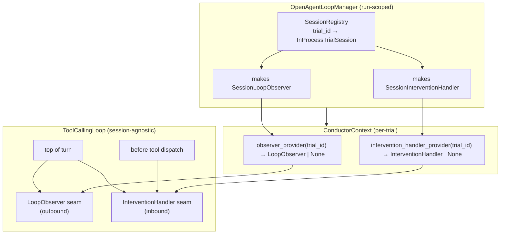
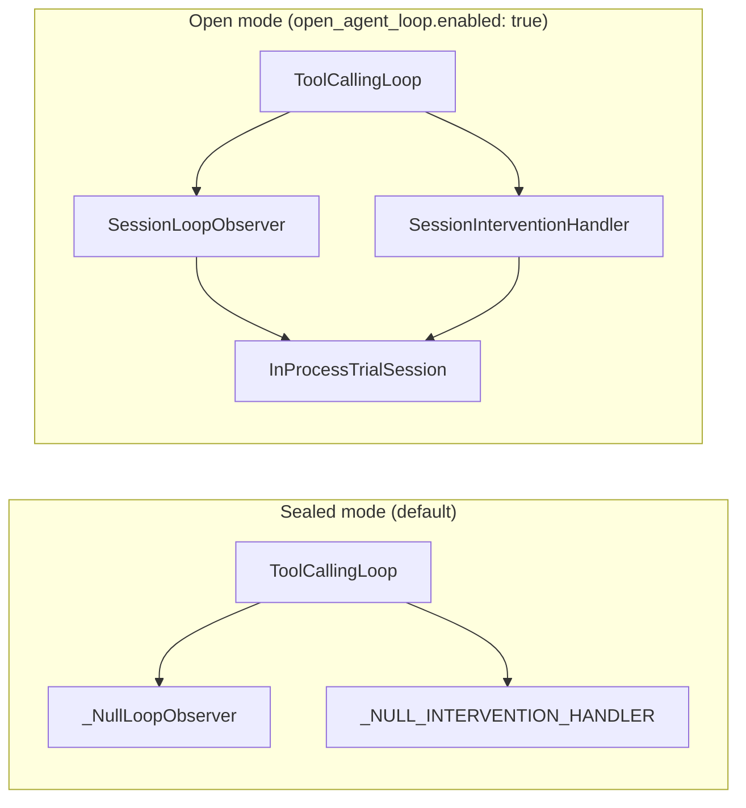
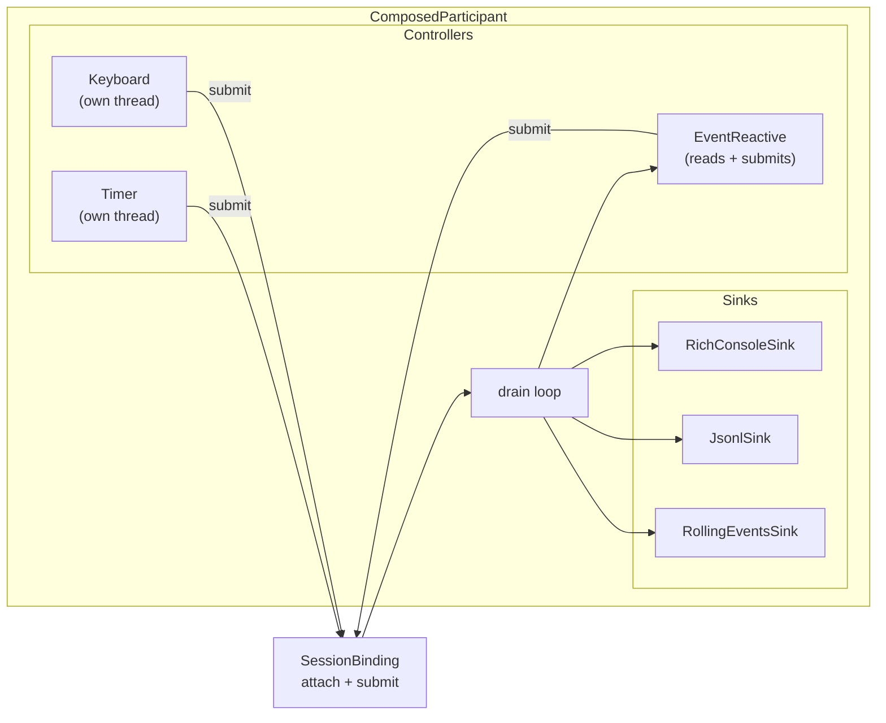
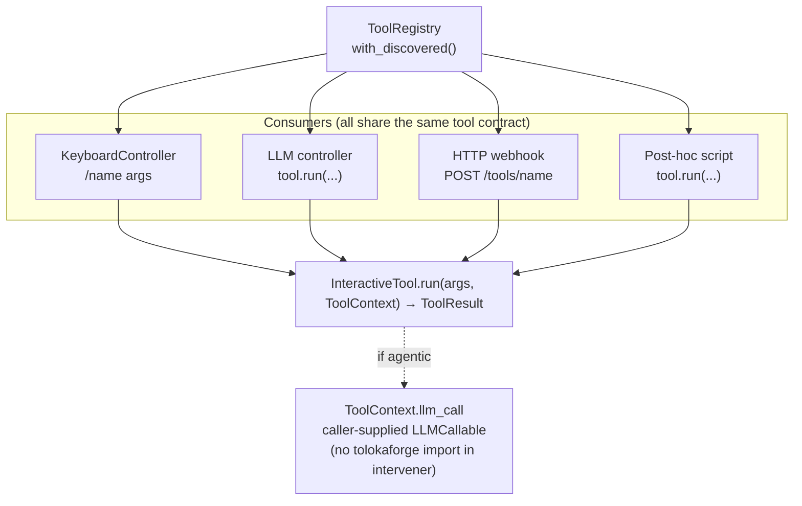

# 0019. Open Agent Loop — `TrialSession` Protocols and the participant gate

- **Status:** Accepted
- **Date:** 2026-07-15
- **Deciders:** @CiroGamboa
- **Supersedes:** —
- **Superseded by:** —

## TL;DR

Add a `TrialSession` bus (`TrialEvents` out, `TrialInterventions` in) and
two Protocol seams on `ToolCallingLoop` (`LoopObserver`,
`InterventionHandler`). A run-scoped `OpenAgentLoopManager` supplies the
concrete session-bound implementations via generic provider callables
threaded through `ConductorContext`. Sealed mode (default) hits null
implementations — byte-identical to pre-OAL benchmarks. Open mode
(`config.open_agent_loop.enabled: true`) activates the bus and lets any
number of participants — LLM copilots, humans, safety monitors,
cross-trial orchestrators — attach through the same contract.
Transport-orthogonal by construction; every wire type is a Pydantic
`extra="forbid"` discriminated union so additions are schema-safe.

## Context and Problem Statement

Every current eval harness — Inspect, Weave, Braintrust, Promptfoo, DeepEval,
Harbor — is batch: an agent runs, a trajectory is written, humans review after
the fact. There is no first-class way to attach mid-trial, observe events as
they happen, or inject a message / veto a tool call / pause / kill / resume
without patching the harness. LangGraph has interrupt / resume but is not an
eval harness. Tolokaforge's public roadmap has listed *Open agent loop* as a
future row for over a year.

The forcing question this ADR answers: **what is the smallest set of
protocols and seams that adds mid-trial participation without breaking sealed
benchmark reproducibility, and lets an in-process LLM copilot today become a
cross-process WebSocket-attached participant tomorrow without rewriting
either side?**

Three concrete constraints made the shape non-obvious:

1. **Sealed-mode invariant.** Benchmarks that never opt in must produce
   byte-identical trajectories. No allocation, no queueing, no observer, no
   handler in the loop's hot path when the flag is off.
2. **The gate must not be LLM-shaped.** A human at a terminal, a
   rule-based safety monitor, and a cross-trial orchestrator all need to
   attach through the same contract as an LLM copilot. Making the LLM the
   privileged case would ossify the wrong abstraction.
3. **Transport-orthogonality.** The first shipped participants live in the
   same Python process as the orchestrator. The second wave will live in
   another process or another machine. The Protocol has to survive both
   without changing shape.

## Decision Drivers

- **Determinism** — the sealed guarantee is load-bearing for the whole
  benchmark story; nothing here can weaken it.
- **Protocol-first architecture** — ADR-0007 (`RuntimeBackend`), ADR-0008
  (`Conductor`), ADR-0014 (`TrialGrader`), ADR-0015 (`TrialExecutor`) all
  establish the pattern: narrow, `@runtime_checkable`, value-in / value-out
  Protocol, per-run implementation binding. The gate belongs on the same
  spine.
- **Session-agnostic conductor** — the conductor's contract (ADR-0008) is
  *"give me a trial, I return a `TrialResult`"*. Widening it to know about
  sessions, participants, or interventions would recreate the fat
  `_run_trial` the ADR was written to delete.
- **Additive schemas** — every wire type crosses the trace-file boundary
  under open mode, so `extra="forbid"` + discriminated unions are the only
  responsible choice.

## Considered Options

1. **Extend `Conductor` with participant methods.** Add
   `conductor.attach_participant(...)`, `conductor.publish(...)` etc.
   Simplest to wire; smallest number of new files.
2. **Ship a `GatedConductor` subclass** that wraps a base conductor and
   adds session behaviour. Session-agnostic conductor stays session-agnostic
   because it does not know it is being wrapped.
3. **Add two generic seams to `ToolCallingLoop`** — an outbound `LoopObserver`
   Protocol and an inbound `InterventionHandler` Protocol — with null
   implementations by default. Attach the session-specific
   `SessionLoopObserver` / `SessionInterventionHandler` via a per-trial
   provider passed through `ConductorContext`. The loop and conductor stay
   generic; only the run-scoped `OpenAgentLoopManager` knows about sessions.

## Decision

**We adopted Option 3.** Two Protocol seams on the loop, plus a run-scoped
`OpenAgentLoopManager` that supplies session-bound implementations of those
seams via generic provider callables threaded through `ConductorContext`.

Concretely:

- **`tolokaforge.session`** — a new module. `TrialEvents`,
  `TrialInterventions`, `TrialSession` Protocols (all
  `@runtime_checkable`). Discriminated-union Pydantic models for
  `TrialEvent` (8 kinds) and `TrialIntervention` (7 kinds). Two transport
  implementations: `InProcessTrialSession` (live) and `RecordedTrialSession`
  (YAML replay). `SessionRegistry` for per-run trial-id → session lookup.
- **Loop seams** — `LoopObserver` and `InterventionHandler` Protocols
  land on `tolokaforge.core.loop`. `ToolCallingLoop` calls
  `intervention_handler.drain_and_apply(...)` at the top of every turn and
  `intervention_handler.intercept_tool_call(...)` before every tool
  dispatch. `_NULL_INTERVENTION_HANDLER` and `_NullLoopObserver` are the
  defaults — sealed mode hits these and does no work.
- **Conductor context** — `ConductorContext` gains
  `observer_provider: Callable[[str], LoopObserver | None] | None` and
  `intervention_handler_provider: Callable[[str], InterventionHandler | None] | None`.
  The conductor knows nothing about sessions; it just asks its context for
  an observer and handler per trial and hands them to the loop. Under
  sealed mode both providers are `None` and no wiring happens.
- **`OpenAgentLoopManager`** — the run-scoped coordinator. Owns the
  `SessionRegistry`. Its `observer_provider()` and
  `intervention_handler_provider()` methods each return a closure that
  gets-or-creates the trial's session and returns a
  `SessionLoopObserver` / `SessionInterventionHandler` bound to it. Its
  `write_trace(...)` method persists `open_agent_loop.yaml` at trial
  completion. The orchestrator calls it via
  `OrchestratorDeps.oal_manager`; if the caller does not supply one, the
  orchestrator auto-constructs one iff `config.open_agent_loop.enabled` is
  true (user-ergonomic fallback so flipping the config flag *just works*).

The session bus rules:

- **Events broadcast** to every attached participant; each has its own
  bounded queue, so a slow consumer never blocks the trial.
- **Interventions serialise** in submission order; conflict resolution uses
  role priority (`admin > participant > observer`, later-wins within a
  tier). Every attempt is recorded in the trace, including superseded and
  rejected ones.

## Consequences

### Positive

- **Sealed mode is byte-identical.** With no manager wired and the config
  flag off, the loop's observer and handler are the null defaults and the
  session module is never imported into the trial path.
- **The conductor stays session-agnostic.** ADR-0008's decision to make the
  conductor a narrow per-trial executor is preserved. The gate lives on the
  loop below and the manager above; the conductor is a transparent conduit
  for a pair of provider callables.
- **Transport-orthogonal by construction.** `InProcessTrialSession` and
  `RecordedTrialSession` satisfy the same Protocols today. A future
  `UnixSocketTrialSession` or `WebSocketTrialSession` slots in without any
  loop, conductor, or manager change — they satisfy the same three
  Protocols.
- **Distributed-services friendly.** The orchestrator's contract with the
  manager is a Python interface; the manager's contract with the conductor
  is a pair of callables; the conductor's contract with the loop is a pair
  of Protocols. Each seam can be split across processes independently. A
  future where the orchestrator runs on host A, the conductor + manager on
  host B, and the runner on host C is a wiring exercise, not a redesign.
- **Additive wire schemas.** Every new event kind or intervention kind is
  a Pydantic union addition with a new `Literal["…"]` discriminator. No
  breaking changes to the trace file.

### Negative / Trade-offs

- **Two seams to reason about.** `LoopObserver` and `InterventionHandler`
  are distinct Protocols; the pairing is a session convention, not a
  language-level guarantee. Someone plugging a metrics observer only can
  forget to hand back an intervention handler — this is fine (defaults
  cover it) but the pairing is not enforced by types.
- **Manager as a run-scoped singleton.** `OpenAgentLoopManager` holds the
  `SessionRegistry` for the run. A second concurrent orchestrator in the
  same process would need its own manager instance — supported but not
  enforced.
- **Companion trace file.** `open_agent_loop.yaml` sits next to
  `trajectory.yaml` rather than being merged into `Trajectory`. Consumers
  that want both must read two files. The reason this is worth it: the
  canonical trajectory snapshot tests stay undisturbed, and existing
  analytics tooling keeps working unchanged.
- **`EditState` deferred.** The intervention taxonomy includes an
  `edit_state` kind for future use, but no code path applies it — the
  runner does not expose a `WriteState` surface today. It rejects in the
  trace with a clear reason. See §9 of the user-facing doc.

### Follow-ups

- **Code changes required (done):** `tolokaforge/session/` (11 files, 2016
  LoC). `tolokaforge/core/loop.py` — the two Protocol seams and their
  callsites. `tolokaforge/core/conductor.py` — the provider fields on
  `ConductorContext`. `tolokaforge/core/orchestrator.py` — the
  `oal_manager` dep + trial-completion trace-write hook.
  `tolokaforge/core/models.py` — `OpenAgentLoopConfig` on `RunConfig`.
- **Documentation to update (done):** [`docs/OPEN_AGENT_LOOP.md`](../OPEN_AGENT_LOOP.md)
  as the user-facing guide, [`docs/CONFIG.md`](../CONFIG.md) for the
  config block, [`docs/REFERENCE.md`](../REFERENCE.md) for the schema
  reference, [`docs/ARCHITECTURE.md`](../ARCHITECTURE.md) building-block
  view, [`docs/ROADMAP.md`](../ROADMAP.md) status update.
- **Tests to add (done):** unit coverage for every session file, the
  manager, the loop observer bridge, the intervention pump (including the
  Pause / Resume state machine and tool-approval mid-turn gate).
- **Follow-up work not covered by this ADR:** cross-process attach CLI
  (M4), `EditState` implementation once the runner exposes the mediation
  surface.

## Addendum — `tools/intervener/` compositional layer (2026-07-16)

The first shipped `Participant` shape (`intervener.participants.Participant`)
is event-reactive — a single `handle_event(event) → EventReaction` hook
that fits LLM drafters and rule-based agents. It does not fit inputs whose
trigger is *not* an event: a human at a terminal pressing a key, an HTTP
webhook, a chaos timer.

To keep new input surfaces from bolting extra logic into `Participant`
subclasses (or into demo scripts that never get tested), the intervener
package adds a parallel compositional shape:

- `intervener.binding.SessionBinding` — thin per-participant façade
  around `TrialSession` (attach on init, submit, idempotent detach).
- `intervener.protocols.EventSink` — pure read side. `on_event(event)`.
- `intervener.protocols.InputController` — pure write side. `start(binding,
  terminal)` / `stop()`. Independent controllers spawn their own thread;
  event-reactive controllers additionally implement `EventSink` so the
  drain loop calls them on every event.
- `intervener.participants.ComposedParticipant` — wires N sinks + M
  controllers around one `SessionBinding`, drains events, forwards to
  every sink, sets a shared terminal event on `TerminalReached`, tears
  down cleanly.

Reference implementations that ship: sinks — `RichConsoleSink`,
`PlainLineSink`, `JsonlSink`, `SilentSink`, `CompoundSink`,
`RollingEventsSink`; controllers — `KeyboardController`,
`ScriptedController` (line-triggered *and* timed modes),
`EventReactiveController`, `TimerController`.

The existing `Participant`, `HumanIntervener`, and `LLMIntervener` are
unchanged. Purely additive; existing callers keep working; the new layer
is opt-in through `ComposedParticipant`.

Both shapes participate in the same session bus, the same trace, and the
same role priority — they are interchangeable from the OAL gate's
perspective. The choice is a callsite-ergonomics decision, not an
architectural boundary.

## Addendum — interactive tools plug-in surface (2026-07-17)

Building the first live human-attach demo (the keyboard REPL) surfaced a
recurring need: consumers attached to a session want to invoke shared
utilities — inspect the trial's context, summarise the last N turns, run
a retrieval query, call a safety monitor. Baking these into
`KeyboardController` alone would repeat the same buttons in every future
consumer (LLM controller, HTTP webhook, canned-scenario runner,
post-hoc script).

`intervener.tools` adds a **consumer-agnostic** plug-in surface:

- `InteractiveTool` Protocol — `name`, `description`, `run(args, context)`.
- `ToolContext` — every field optional; caller populates what it has.
- `ToolResult` — text output + optional structured `data` + intervention
  bookkeeping.
- `ToolRegistry` — explicit registration or auto-discovery via
  `importlib.metadata.entry_points(group="intervener.tools")`.

`ToolRegistry.with_discovered()` picks up every tool any installed
package registers under the `intervener.tools` entry-point group — the
"install a tool" story is `pip install <package>`. Reference tools
(`ContextTool`, `AnalyzeTool`) are registered in the intervener package's
own `pyproject.toml`, so `with_discovered()` returns them by default.

The keyboard REPL is one consumer; the design pattern is consumer-shape
independent. `KeyboardController(tools=…)` dispatches slash-commands to
the registry. Any other controller/participant/script that has (or can
build) a `ToolContext` invokes tools the same way:
`registry.get(name).run(args, ctx)`.

Tools MAY submit interventions via `context.binding.submit(…)` — same
authority as the participant that instantiated them. A safety-monitor
tool that calls `Kill` on demand is a valid design. `ToolResult.submitted_interventions`
bookkeeps the count so callers can surface "the tool submitted N
interventions" to a human.

**Decoupling constraint (critical):** the intervener package must not
import from `tolokaforge.core.llm` or any other stack-specific LLM
client. The conductor/runner side owns credentials, provider selection,
preset resolution, and secret loading for anything that runs *inside*
the trial. Tools that need an LLM receive one through
`ToolContext.llm_call`: a `Callable[[str, str], str]` supplied by the
caller. Callers wrap `tolokaforge.core.llm.LLMClient` (or any other
provider) into a two-line adapter and pass it in.

This means the same tool code runs identically whether the caller has
credentials from `SecretManager`, from an environment variable it
loaded itself, from an HTTP proxy, or from a test stub. Tools that get
`llm_call=None` fall back to a non-LLM path (heuristic summary, "not
available" message — the tool's choice).

No new architectural seam: tools reuse the same `SessionBinding` façade
introduced by the compositional layer, plus a narrow `LLMCallable`
type alias. This addendum documents an opt-in surface on top of what's
already there.

## Links

- Related ADRs: [ADR-0007 (RuntimeBackend)](0007-runtime-backend-protocol.md),
  [ADR-0008 (Conductor)](0008-conductor-protocol.md),
  [ADR-0014 (TrialGrader)](0014-trial-grader-protocol.md),
  [ADR-0015 (TrialExecutor)](0015-trial-executor-protocol.md).
- Related code: [`tolokaforge/session/`](../../tolokaforge/session/),
  [`tolokaforge/core/loop.py`](../../tolokaforge/core/loop.py),
  [`tolokaforge/core/conductor.py`](../../tolokaforge/core/conductor.py),
  [`tolokaforge/core/orchestrator.py`](../../tolokaforge/core/orchestrator.py).
- User-facing doc: [`docs/OPEN_AGENT_LOOP.md`](../OPEN_AGENT_LOOP.md).
- Example: [`examples/open_agent_loop/`](../../examples/open_agent_loop/).
- Reference participants: [`tools/intervener/`](../../tools/intervener/).
