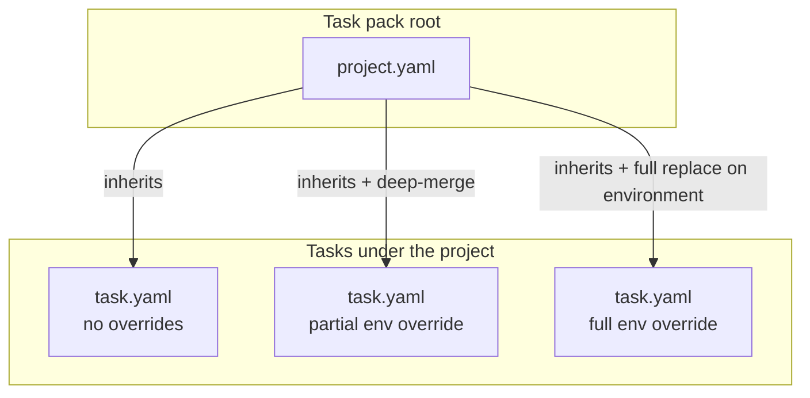

# Projects — the top-level abstraction

This document describes the **Project** as the top-level abstraction
in TolokaForge: what a project is, what settings it owns, how tasks
inherit from it, and how the schema extends across compute providers,
storage backends, observability sinks, and orchestration policies.

Companion reading:
[`RUNTIME_BACKENDS.md`](RUNTIME_BACKENDS.md) (the `RuntimeBackend`
seam that consumes a project's compute selection),
[`adr/0009-environment-manifest.md`](adr/0009-environment-manifest.md)
(the `EnvironmentManifest` schema that becomes the shape of
`default_environment` and per-task overrides).

## The mental model

A **Project** is a container for a set of tasks and the settings
they share. Every task belongs to a project. The project declares:

- The **default environment** the runtime provisions for its tasks.
- **Task-level defaults** (adapter, grading, tools) that individual
  tasks inherit unless they override.
- **Compute**, **storage**, **observability**, and **orchestration**
  policies that scope to the project as a whole and inherit down to
  its tasks.

A task **inherits** from its project by default. A task may
**override** any settings section (partial merge on typed sub-fields,
or full replacement in specific cases). There is no free-form deep-
merge: every override happens through a typed schema.

Two levels of precedence — Project → Task, task wins on conflict.
No trial-level overrides.



## The Project schema

`project.yaml` at the pack root:

```yaml
name: "microservices-eval"
version: 1
description: "Evaluation suite for microservices refactoring tasks."

# Shared default environment every task inherits unless it declares
# its own environment_manifest. The name signals "default for all
# tasks" — its task-level counterpart is called environment_manifest
# to signal "this task overrides."
default_environment:
  compose_file: "./shared/environment.compose.yaml"
  runner_service: "runner"
  inputs:
    postgres_version: "16"

# Shared task-level defaults. A task that doesn't declare adapter or
# grading_defaults inherits from here. Deep-typed merge on sub-fields.
task_defaults:
  adapter: "native"
  grading_defaults:
    max_score: 1.0

# Task inventory. Glob discovery is VCS-managed; an inline list of
# task records is UI-managed. Both modes coexist; the loader
# normalises to an internal list.
tasks:
  discovery:
    glob: "tasks/**/task.yaml"

# Compute — provider selection, resource limits, provider-specific
# configuration.
compute:
  provider: "local-docker"        # local-docker, kubernetes,
                                  # aws-batch, modal, gcp-batch,
                                  # azure-container-instances
  workers: 4
  resource_limits:
    memory: "8Gi"
    cpu: "2"
  # Provider-specific sub-sections live under `compute.<provider>`.
  # Only the block matching `provider:` is meaningful.
  # kubernetes:
  #   cluster: "prod-cluster"
  #   namespace: "toloka"
  #   resource_class: "gpu-large"
  #   service_account: "toloka-runner"

# Storage — artifacts, logs, and fixtures backends.
storage:
  artifacts:
    type: "local"                 # local, s3, gcs, azure-blob
    path: "./results"
  logs:
    type: "local"
    path: "./logs"
  # fixtures:
  #   type: "read-only-volume"
  #   path: "./fixtures"

# Observability — tracing, metrics, and logging exporters.
observability:
  tracing:
    exporter: "none"              # none, otlp
    # endpoint: "http://collector:4317"
  metrics:
    exporter: "none"              # none, prometheus
    # endpoint: "http://prom:9090"
  logging:
    level: "INFO"
    exporter: "stdout"            # stdout, otlp

# Orchestration — retry, priority, and schedule policies.
orchestration:
  retry_policy:
    max_attempts: 1
    backoff: "constant"           # constant, exponential
  priority: "normal"
  # schedule:
  #   cron: "0 6 * * *"
```

### Section responsibilities

| Section | Owns |
|---|---|
| `default_environment` | Shared env manifest — compose_file, runner_service, inputs, isolation defaults |
| `task_defaults` | Shared task-scoped fields — adapter, grading defaults, tools defaults |
| `tasks` | Task discovery — glob (VCS-managed) or inline list (UI-managed) |
| `compute` | Provider selection, resource limits, provider-specific configuration |
| `storage` | Artifacts, logs, fixtures backends |
| `observability` | Tracing, metrics, logging exporters |
| `orchestration` | Retry, priority, schedule policies |

Adding a new top-level section is a schema addition on the Project
model. Unknown sections warn but don't fail — older loaders keep
working when new packs declare newer sections.

## Task override semantics

### Partial override — inherit `compose_file`, override an input

```yaml
# tasks/postgres_upgrade_test/task.yaml
task_id: "postgres_upgrade_test"
description: "Verify the backend still works under postgres 17."

environment_manifest:
  inputs:
    postgres_version: "17"
```

The task inherits `compose_file`, `runner_service`, and every input
not named `postgres_version` from the project's `default_environment`.
Only the one input differs. The resolved manifest has a distinct hash
from the project default, so the runtime gives this task its own
stack.

### Full override — task ships its own compose file

```yaml
# tasks/schema_isolation_migration/task.yaml
task_id: "schema_isolation_migration"
description: "Apply a breaking schema migration."

environment_manifest:
  compose_file: "./environment.compose.yaml"
  runner_service: "runner"
```

The task declares its own `compose_file`, so the project's
`default_environment.compose_file` is replaced entirely. The resolved
manifest is completely different; this task gets its own stack. Use
this pattern when a task needs a bespoke environment that doesn't
compose cleanly with the project default.

### Rules

- **`environment_manifest` at task level is a deep-typed merge** with
  the project's `default_environment`. Task-declared sub-fields
  override; unspecified sub-fields inherit.
- **A change to `compose_file` is a full replacement** of the
  underlying compose file (paths don't merge). The task no longer
  shares the project's runtime stack.
- **`inputs` is a shallow map**; task-declared keys override; other
  keys inherit.
- **Sections other than `environment_manifest` at task level**
  (`task_compute`, `task_orchestration`, etc.) follow the same
  deep-typed merge rule.
- **Two levels only.** Project → Task. No trial-level overrides.

### Task file — everything else stays task-local

`task_id`, `description`, `grading` blocks, task-specific `tools`,
per-task `initial_state` — all remain in `task.yaml`, unaffected by
project inheritance. A task inherits *shared* concerns; identity and
task-specific behaviour stay on the task.

## Runtime mechanism — content-addressed stack dedup

The `RuntimeBackend` computes a stable hash over each task's resolved
`EnvironmentManifest` (compose file + bound inputs + per-service
isolation modes). Tasks whose hashes match share one running stack
within a single run.

```
                    project.yaml declares default_environment
                                    │
              ┌─────────────────────┼─────────────────────┐
              │                     │                     │
       task_a (inherits)     task_b (inherits)     task_c (partial override)
              │                     │                     │
       resolved=X            resolved=X            resolved=Y
              │                     │                     │
              └────── same ─────────┘                     │
                       │                                  │
              ┌────────▼────────┐               ┌─────────▼────────┐
              │   stack #1      │               │    stack #2      │
              │   hash=X        │               │    hash=Y        │
              └─────────────────┘               └──────────────────┘
```

Content-addressing is what makes the model correct: when three tasks
all inherit the project default, their resolved manifests are byte-
identical, hash identical, and share a stack. When a task overrides
a single input (partial), its resolved manifest hashes differently
and it gets its own stack. When a task overrides `compose_file`
(full), it hashes differently and gets its own stack. The schema
declares intent; the hash makes the intent operative.

**Registry and lifecycle.** The backend maintains an in-run registry
keyed by hash. The first task with a given hash provisions a fresh
stack and takes the initial reference. Every subsequent task with
the same hash increments the reference count. When a task finishes
its last trial the count decrements; when it drops to zero the
stack tears down.

**Hash inputs.** The canonicalised YAML representation of the
resolved compose file, the ordered service-name → isolation-mode
map, and the bound input values. Hash function: SHA-256.
Canonicalisation normalises key ordering, quoting, and whitespace
so syntactically-different-but-semantically-identical compose files
hash identically.

**Scope.** A single `tolokaforge run` invocation. Two separate runs
never share a stack even if their manifests hash identical. Cross-
run persistence is a distinct concern (the "middle-ground isolation"
arc in [`ROADMAP.md`](ROADMAP.md)) and lives on its own mechanism.

## Per-service isolation vocabulary

Services in the compose file are annotated with an isolation mode
via TolokaForge extension labels:

```yaml
services:
  postgres:
    image: "postgres:${postgres_version:-16}"
    labels:
      tolokaforge.isolation: "reset"
      tolokaforge.reset_primitive: "postgres_template_db"
```

| Mode | Behaviour | When to pick |
|---|---|---|
| `ephemeral` | Service is torn down and recreated between trials | Safest; trials mutate state destructively |
| `shared` | Service persists across trials on the same stack | Cheapest; safe only when trials don't mutate service state |
| `reset` | Service persists across trials; state resets between trials via a named primitive | Middle-ground; state-mutating tasks with cheap reset semantics |

The default when a service does not declare an isolation mode is
`ephemeral` (fail-loud).

Reset primitives are a closed enum:

```python
ResetPrimitive = Literal[
    "postgres_template_db",       # CREATE DATABASE new TEMPLATE base
    "sqlite_truncate",            # TRUNCATE across declared tables
    "filesystem_workspace_swap",  # rsnapshot-style dir swap
    "redis_flushdb",              # single-DB flush
    "none",                       # explicit no-op for shared-safe services
]
```

New primitives extend the enum via a schema change in tolokaforge
itself. There is no plugin mechanism: the set is small and slow-
changing, and the safety contract on a reset primitive is too load-
bearing to delegate to third parties.

**Interaction with dedup.** The isolation-mode map is part of the
hash input. Two tasks that agree on the compose file but disagree
on `services.postgres.isolation` do not share a stack.

## Compute providers

The `compute.provider` field selects the `RuntimeBackend`
implementation via a registry:

- `local-docker` — provisions stacks via Docker Compose on the
  orchestrator host.
- `kubernetes` — provisions stacks as Pods on a target cluster.
  Provider-specific sub-section (`compute.kubernetes.cluster`,
  `namespace`, `resource_class`, `service_account`).
- `aws-batch` — job-queue backend for batch workloads.
- `modal`, `gcp-batch`, `azure-container-instances` — additional
  substrates.

**Third-party providers** register via the entry-point group
`tolokaforge.compute_providers` (sits alongside the existing
`tolokaforge.adapters` group). A third-party provider ships its own
package, implements `RuntimeBackend`, and declares an entry-point;
packs reference it by string tag in `compute.provider`.

**Provider-specific configuration.** Each provider declares its own
typed sub-section under `compute.<provider>`. The loader validates
the sub-section against the selected provider's schema; sub-sections
for unselected providers are ignored. Discriminated-union pattern
lets a UI drive sub-section rendering based on `provider:`.

**Deployment/profile layer.** A `deployments/<name>.yaml` layer
above the Project provides values for placeholders in the project
spec — the same project runs on `dev-cluster` under one deployment
and `prod-cluster` under another without changing `project.yaml`.
The Project spec stays invariant; the deployment provides the
environment-specific values.

## Relationship to `run_config.yaml`

`project.yaml` and `run_config.yaml` live side-by-side in a pack
root and cover different concerns.

- **`project.yaml`** owns settings that are **invariant across
  runs** — what the project *is*. The default environment, task
  defaults, task inventory, compute provider, storage backends,
  observability exporters, orchestration policy defaults. Every
  invocation of the project reads these.
- **`run_config.yaml`** owns settings **specific to a single
  invocation** — how *this run* is configured. Which models to
  drive the agent with, how many times to repeat each trial, which
  output directory to write to for this run, which task packs to
  pull in. A pack can be run many times with different
  `run_config.yaml` files.

### Field ownership and precedence

Some fields live only in one file; others may appear in both, with
`run_config.yaml` winning on conflict.

| Setting | project.yaml | run_config.yaml | Resolution |
|---|---|---|---|
| `default_environment` | ✓ | — | Project-only |
| `task_defaults` | ✓ | — | Project-only |
| `tasks.discovery.glob` | ✓ | — | Project-only (a run may further filter via `evaluation.tasks_glob`) |
| `compute.provider` | ✓ | — | Project-only |
| `compute.<provider>` sub-sections | ✓ | — | Project-only |
| `compute.workers` (default) | ✓ | `orchestrator.workers` | run_config overrides |
| `storage.artifacts.path` (default) | ✓ | `evaluation.output_dir` | run_config overrides |
| `observability.*` | ✓ | — | Project-only |
| `orchestration.retry_policy` | ✓ | `orchestrator.retry` (if set) | run_config overrides |
| Runtime backend mode (`shared` / `per_trial` within a provider) | via `compute.provider` details | `orchestrator.runtime`, `--runtime` CLI | CLI > run_config > project |
| `models` | — | ✓ | run_config-only |
| `orchestrator.repeats` | — | ✓ | run_config-only |
| `orchestrator.max_turns` | — | ✓ | run_config-only |
| `orchestrator.queue_backend` | — | ✓ | run_config-only |
| `evaluation.task_packs` | — | ✓ | run_config-only |

**Full precedence order** (highest to lowest):

1. CLI overrides (`tolokaforge run --runtime per_trial`,
   `--workers 8`, etc.).
2. `run_config.yaml` fields for this invocation.
3. `project.yaml` fields (project defaults).
4. `task.yaml` overrides for a specific task, layered on top of
   whichever of the above sourced the value.

Task-level overrides interact with project defaults by the deep-typed
merge rule described in "Task override semantics"; they do not
interact with `run_config.yaml` directly (a run either includes a
task or it doesn't).

### Why the split

Keeping the two files separate lets a single project spec run
under many different configurations without editing it. A CI
pipeline runs with one `run_config.yaml` (parallel workers, fast
model), a nightly regression sweep runs with another (more
repeats, stronger model, larger output volume), and a stakeholder
demo runs with a third — all against the same `project.yaml`.
That's the same separation of *invariant spec* from
*variant execution* that `deployments/<name>.yaml` will formalise
at a broader scope: the deployment layer picks the substrate; the
run config picks the invocation parameters; the project picks
what's being run.

## UI-friendliness

The schema is designed for UI editing.

- **Section-per-form.** Every section under the Project is its own
  Pydantic model. A UI renders one form section per model, driven
  by the model's JSON Schema. New sections shipped by tolokaforge
  extend the schema; the UI adapts without bespoke code.
- **Typed primitives everywhere.** Sub-fields are strings, ints,
  enums, references (by name) to other resources, or further typed
  sub-objects. No untyped free-form fields.
- **Task inventory modes.** `tasks.discovery.glob` is VCS-managed;
  `tasks.inline: [...]` is a UI-managed list of task records
  embedded in the Project. Both modes coexist; the loader
  normalises to an internal list of task references.
- **Provider selection triggers sub-section reveal.**
  `compute.provider: kubernetes` makes the `compute.kubernetes`
  block meaningful; UI shows only the sub-section matching the
  current provider (discriminated union).
- **Version field.** `project.version` gives the UI a lever for
  schema migration when the shape breaks. Unknown top-level
  sections warn but preserve — forward-compat by design.

## Extensibility mechanisms

The Project schema is designed to grow without breaking existing
packs.

- **New top-level sections.** Add a Pydantic model, register it in
  the project schema. Older loaders warn on the unknown key but
  preserve the field. Newer packs can start using it immediately.
- **New providers for `compute`.** Ship a `RuntimeBackend`
  implementation, declare an entry-point in
  `tolokaforge.compute_providers`. No fork required.
- **New reset primitives.** Schema enum extension in tolokaforge
  itself. The safety contract stays engine-side.
- **Deployment/profile layer above the project.** Slots in without
  changing the Project schema; a deployment consumes the Project
  spec and provides placeholder values.
- **Workspace/organisation layer above projects.** For
  cross-project quotas, permissions, and cost accounting. Adds an
  entity above Project without changing the Project schema.

## Backward compatibility

- **Packs without `project.yaml` work unchanged.** The loader
  synthesises a default Project from `run_config.yaml` (adapter,
  orchestrator defaults) + the discovered task set. Existing
  task-level `environment_manifest` declarations are honoured as-is
  (full overrides of the synthetic project's absent
  `default_environment`).
- **Packs with a `project.yaml` get inheritance** for tasks that
  don't declare their own `environment_manifest`. Tasks that do
  continue to work exactly as before.
- **Adding sections to `project.yaml`** doesn't break older packs.
  Older packs simply don't declare those sections; the runtime uses
  hard-coded defaults.
- **Existing `native_shared_domain` semantics** (per-category
  `_shared/domain.yaml` merge for `tools:` and `system_prompt:`)
  continue to work in parallel. The project layer merges at the
  pack level; `native_shared_domain` merges per-category within a
  pack. Both compose.

## Failure modes

- **Silent cross-trial contamination.** A `shared` service persists
  across trials of a task; a trial mutates state; the next trial
  sees dirty state. Prevention: default isolation for undeclared
  services is `ephemeral` (fail-loud); `shared` is opt-in.
- **Silent cross-task contamination.** Tasks A and B share a stack
  via inheritance; A's trials mutate a `shared` service; B's trials
  see the mutation. Prevention: same as above — `shared` is opt-in
  with explicit intent.
- **Non-canonical YAML causing hash misses.** Prevention: the
  runtime canonicalises key order, quoting, and whitespace before
  hashing.
- **Cross-run assumption.** A user runs task A, then task B in a
  separate invocation, and expects B to see A's state. Prevention:
  the model is documented as within-run only.
- **Reset-primitive failure.** A `reset` service's primitive fails
  mid-run. Prevention: primitive failures terminate the affected
  task's remaining trials with an explicit reason (analogous to
  `TerminationReason.PROVISION_ERROR`); the stack itself does not
  tear down.
- **Input-override typos.** A task overrides `postgress_version`
  (misspelt); the compose file's `${postgres_version}` binds to its
  default. Prevention: input names are validated against the
  compose file's declared `${...}` references at load time;
  unknown input names warn.
- **Unknown section in `project.yaml`.** A pack declares a section
  an older loader doesn't recognise. Prevention: unknown sections
  warn but preserve; older loaders don't fail.

## What the model deliberately isn't

- **A free-form deep-merge system.** Every override is typed and
  bounded. Unknown sub-fields warn but don't merge into arbitrary
  containers.
- **A three-or-more-level precedence hierarchy.** Two levels only.
  Deployment/profile is a separate layer that provides placeholder
  values, not a third precedence level.
- **A plugin registry for reset primitives.** New primitives extend
  the engine's schema enum. Third-party extensibility for
  primitives is deliberately deferred.
- **A cross-run stack persistence surface.** All sharing is within
  a single `tolokaforge run` invocation.
- **In-place editing of compose files.** Compose files are read at
  load time, input-substituted in memory, hashed, and materialised.
  On-disk files are never mutated.

## Worked example

See
[`examples/native/example-microservices-pack/`](../../examples/native/example-microservices-pack/).
The pack ships a `project.yaml` at its root and six tasks
demonstrating:

| Task | Pattern | Resulting stack |
|---|---|---|
| `api_endpoint_add` | Full project inheritance (no `environment_manifest` in task.yaml) | **A** |
| `db_query_tuning` | Full project inheritance | **A** (shared) |
| `postgres_upgrade_test` | Partial override — `inputs.postgres_version: "17"` | **B** |
| `schema_isolation_migration` | Full override — task-local `compose_file` | **C** |
| `agent_flow_setup` | Full project inheritance — sequence part 1 | **A** (shared) |
| `agent_flow_verify` | Full project inheritance — sequence part 2 | **A** (shared) |

Four tasks share stack **A** (project default); one task each has
stack **B** (partial override) and stack **C** (full override).
Read the pack's
[`README.md`](../../examples/native/example-microservices-pack/README.md)
for the task-by-task walkthrough and the resolved-hash table.

---

*Return to [`docs/architecture/`](.) for the ADR index and the
canonical runtime-backends documentation.*
