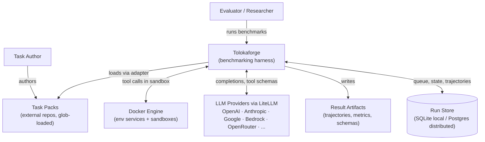
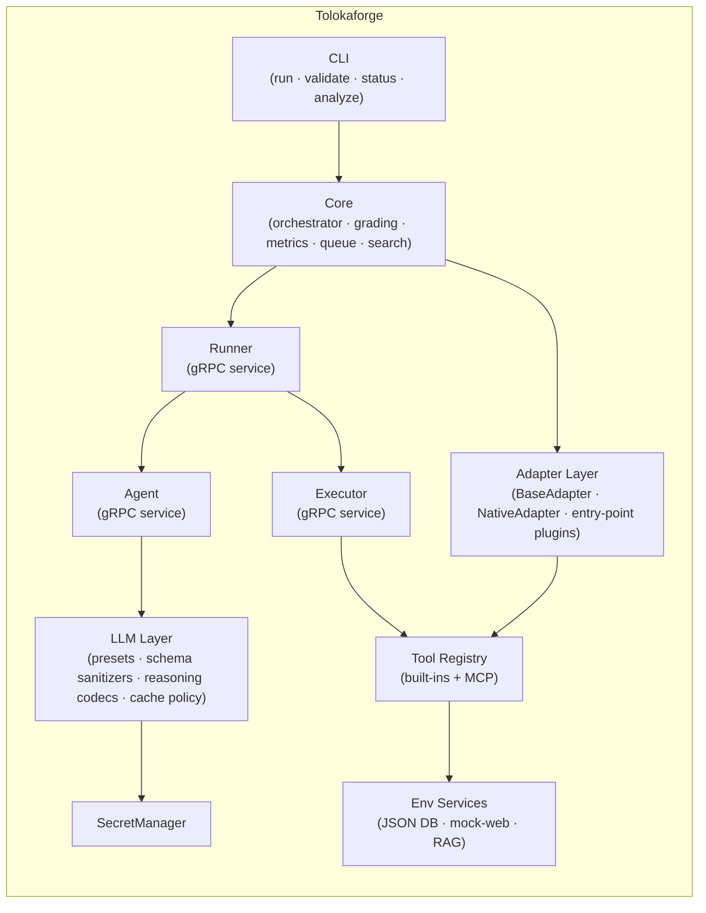
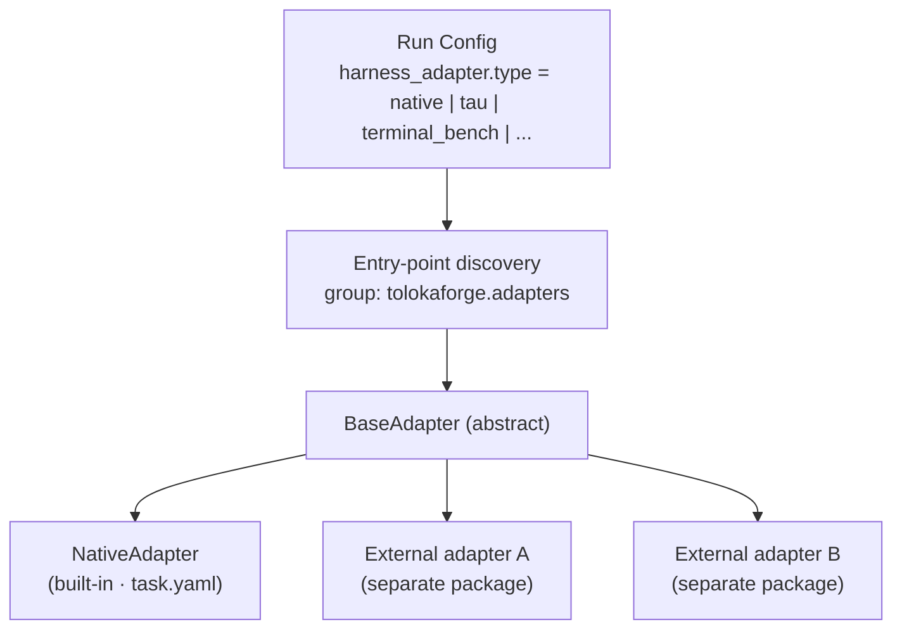
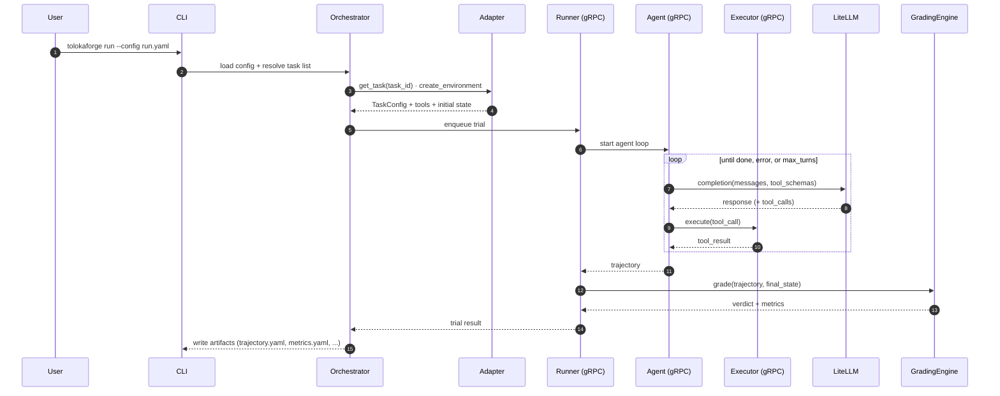
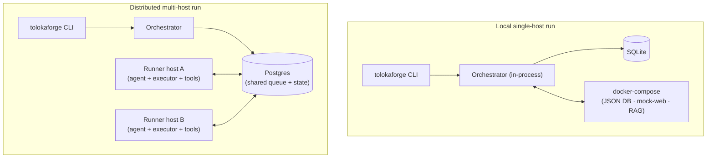

# Tolokaforge Architecture

This document is the entry point for the system-level architecture of Tolokaforge. It follows the [arc42](https://arc42.org/) section structure inlined as a single file, with [C4 model](https://c4model.com/) views drawn as Mermaid diagrams that render natively on GitHub.

For deep dives into individual subsystems, follow the links to `docs/*.md` from each section. For decision history and rationale, see [`adr/`](adr/).

> **How to evolve this doc:** keep the diagrams here at C4 Levels 1–2 (Context and Container). When a building block changes shape or a boundary moves, update the relevant section *and* add an ADR. When you want to propose a future state, add an ADR with status `Proposed`; once accepted, update the diagram in this file.

---

## 1. Introduction and Goals

Tolokaforge is a benchmarking harness for evaluating tool-using LLM agents. It runs multi-turn agent/user loops against sandboxed task environments and produces deterministic pass/fail verdicts plus rich telemetry.

### Quality goals

| Goal | What it means in practice |
|---|---|
| **Determinism** | Same task + same model + same seed should yield the same verdict. State hashes, snapshot grading, transcript rules. |
| **Provider-agnostic** | Any LLM reachable via LiteLLM is a first-class citizen. Provider-specific quirks are isolated in per-preset capability policies. |
| **Isolation** | Tool calls execute against sandboxed services with no external network reach by default. |
| **Honesty over convenience** | Failures surface explicitly. No silent fallbacks; no defaults that hide configuration mistakes. |
| **Extensibility** | New benchmark formats plug in as adapters without touching the core. |

### Primary stakeholders

- Model evaluators running benchmarks across providers.
- Task authors writing new benchmark task packs.
- Researchers analysing trajectories, failure modes, and cost/latency.

---

## 2. Constraints

### Technical

- **Language**: Python (managed via `uv`).
- **Service decomposition**: gRPC services (`agent`, `executor`, `runner`) so trial execution can be remoted and isolated.
- **LLM access**: routed through [LiteLLM](https://github.com/BerriAI/litellm) to keep provider-specific glue out of the core. Per-provider differences live in the LLM-layer preset registry.
- **Tools**: built-in tool registry plus [Model Context Protocol](https://modelcontextprotocol.io) servers loaded from task packs.
- **Environment services**: containerised JSON state DB, mock web, RAG indexer — orchestrated via Docker Compose.
- **Persistence**: SQLite for local single-host runs, Postgres for multi-host distributed runs.

### Organisational

- **Open source**: this repository is Apache-2.0; nothing committed here may reference internal-only systems by name.
- **Secrets**: only `SecretManager` reads credentials. Direct `os.environ` access for any secret is forbidden and CI-enforced. See [AGENTS.md § Secrets](../../AGENTS.md#secrets--single-abstraction).
- **Task packs are external**: benchmark task definitions live in separate repositories (public examples ship under `examples/`; production task packs are loaded via adapter glob from any directory the operator points at).

---

## 3. Context and Scope (C4 Level 1)

### Boundaries (what is *not* Tolokaforge)

- **LLM providers** — out of scope; accessed via LiteLLM.
- **Task content** — out of scope; lives in task pack repos. Tolokaforge defines the *contract* (task schema, tool interface, grading config), not the content.
- **Result analysis UI** — out of scope; result artifacts are stable YAML/JSON, consumed by downstream tooling.

---

## 4. Solution Strategy

| Decision | Rationale | Detail |
|---|---|---|
| **Adapter plugin architecture for benchmark formats** | Lets external task formats (tau-bench, terminal-bench, MCP-core, private formats) plug in without forking the core. | [`docs/ADAPTER_ARCHITECTURE.md`](../ADAPTER_ARCHITECTURE.md) |
| **gRPC service decomposition (`agent`, `executor`, `runner`)** | Each role has different isolation, scaling, and dependency profiles. gRPC makes the boundaries explicit and lets services live on different hosts in distributed runs. | [`docs/RUNNER.md`](../RUNNER.md) · [`docs/GRPC_PROTOCOL.md`](../GRPC_PROTOCOL.md) |
| **Provider-agnostic LLM layer with per-preset capability policies** | LiteLLM normalises envelopes, but providers diverge on schema dialects, reasoning encodings, caching, and tool naming. A preset registry keeps the quirks out of the orchestrator. | [`docs/LLM_LAYER.md`](../LLM_LAYER.md) |
| **Single secret abstraction** | One audited code path for every credential read; CI-enforced via static grep. | [AGENTS.md § Secrets](../../AGENTS.md#secrets--single-abstraction) |
| **Deterministic grading by default; LLM judges opt-in** | Deterministic verdicts are reproducible and cheap; judge calls are reserved for cases that genuinely need them. | [`docs/GRADING.md`](../GRADING.md) |

---

## 5. Building Block View (C4 Level 2 — Container)

### Block responsibilities

| Block | Responsibility | Source | Detail |
|---|---|---|---|
| **CLI** | User-facing commands; loads a run config and hands it to the orchestrator. | `tolokaforge/cli` | — |
| **Core** | Orchestration loop, trial queue, grading pipeline, metrics aggregation, task search. | `tolokaforge/core` | [`docs/RUNNER.md`](../RUNNER.md) |
| **Adapter Layer** | Resolves a benchmark format into `(TaskConfig, tools, grading, environment)`. Built-in `native` plus plugins discovered via `tolokaforge.adapters` entry points. | `tolokaforge/adapters` + `external_adapters/` | [`docs/ADAPTER_ARCHITECTURE.md`](../ADAPTER_ARCHITECTURE.md) |
| **Runner (gRPC)** | Owns trial lifecycle: starts agent/executor, mediates DB and RAG access, runs the grader. | `tolokaforge/runner` | [`docs/RUNNER.md`](../RUNNER.md) |
| **Agent (gRPC)** | Wraps a single agent turn: prompt assembly, model call, tool-call extraction. | `tolokaforge/agent` | [`docs/LLM_LAYER.md`](../LLM_LAYER.md) |
| **Executor (gRPC)** | Executes tool calls in an isolated environment; never sees model credentials. | `tolokaforge/executor` | — |
| **LLM Layer** | Provider-agnostic completion API. Per-provider presets carry capability policies for schema dialect, reasoning encoding, parameter handling, caching, tool-name discipline. | `tolokaforge/core/llm` | [`docs/LLM_LAYER.md`](../LLM_LAYER.md) |
| **Tool Registry** | Registers built-in tools and loads MCP servers declared by tasks. | `tolokaforge/tools` | [`docs/TOOLS.md`](../TOOLS.md) |
| **SecretManager** | Single read path for every credential (API keys, DB URLs, OAuth, signing keys). Subprocess export is the only sanctioned `os.environ` mutation, scoped narrowly. | `tolokaforge/secrets` | [AGENTS.md § Secrets](../../AGENTS.md#secrets--single-abstraction) |
| **Env Services** | Containerised support services tasks may need: JSON state DB, mock web, RAG index. | `tolokaforge/env` | [`docs/BROWSER_TOOLS.md`](../BROWSER_TOOLS.md) |

### Adapter plugin shape (zoom on the Adapter Layer)

Every adapter implements the same `BaseAdapter` contract (`get_task`, `create_environment`, `get_registry_tools`, `get_grading_config`, `grade`, `compute_golden_hash`, …). The orchestrator only sees the contract, never the concrete adapter. New benchmark formats — public or private — plug in by publishing a Python package that registers under `[project.entry-points."tolokaforge.adapters"]`.

---

## 6. Runtime View — One Trial

The agent never touches the executor's environment directly, and the executor never sees model credentials. The runner is the only component that joins the two views together.

---

## 7. Deployment View

The same code path drives both modes. The runner is the deployment unit that scales out; the orchestrator and storage scale up. See [`docs/RUNNER.md`](../RUNNER.md) for the distributed contract.

---

## 8. Cross-cutting Concepts

| Concern | Where to look |
|---|---|
| **Secrets handling** | [AGENTS.md § Secrets — single abstraction](../../AGENTS.md#secrets--single-abstraction) · `tolokaforge/secrets` |
| **Determinism & state hashing** | [`docs/GRADING.md`](../GRADING.md) · [`docs/GOLDEN_TRIALS.md`](../GOLDEN_TRIALS.md) |
| **Per-provider capability handling** | [`docs/LLM_LAYER.md`](../LLM_LAYER.md) · [AGENTS.md § Known Gotchas](../../AGENTS.md#known-gotchas) |
| **Tool isolation & sandboxing** | [`docs/SECURITY.md`](../SECURITY.md) · [`docs/BROWSER_TOOLS.md`](../BROWSER_TOOLS.md) |
| **Telemetry & metrics** | [`docs/LOGGING.md`](../LOGGING.md) · [`docs/ANALYTICS.md`](../ANALYTICS.md) |
| **Result artifact layout** | [`docs/OUTPUT_FORMAT.md`](../OUTPUT_FORMAT.md) |
| **Configuration reference** | [`docs/CONFIG.md`](../CONFIG.md) · [`docs/REFERENCE.md`](../REFERENCE.md) |

---

## 9. Architecture Decisions

All architecturally significant decisions are recorded as ADRs in [`adr/`](adr/). The index is maintained by appending new ADRs in numerical order — never renumber, never delete. When an ADR is superseded, change its status and link forward to the superseding ADR.

See [`adr/README.md`](adr/README.md) for the process and [`adr/0000-template.md`](adr/0000-template.md) for the template.

---

## 10. Risks and Known Limitations

| Area | Note |
|---|---|
| **Provider drift** | Tool-schema dialects and reasoning encodings change without notice. Mitigated by capability tests per preset (see [`docs/LLM_LAYER.md`](../LLM_LAYER.md)) and explicit `ModelCertificate` declarations. |
| **Multi-turn vs single-turn behaviour gap** | Some model failures only surface in long-context multi-turn runs and pass synthetic single-turn probes. Tracked in [AGENTS.md § Known Gotchas](../../AGENTS.md#known-gotchas) #22. |
| **Container resource accounting** | Sandboxed executors share the host; resource accounting is per-process, not cgroup-bounded. |

---

## Glossary

| Term | Meaning |
|---|---|
| **Adapter** | Plugin that maps a benchmark format to the harness contract (`BaseAdapter`). |
| **Task pack** | A directory tree of tasks resolved by an adapter (`task.yaml` for native; format varies per adapter). |
| **Trial** | One attempt at one task with one model configuration. A run produces `N_tasks × repeats` trials. |
| **Trajectory** | The full message + tool-call log for one trial, written as `trajectory.yaml`. |
| **Preset** | Per-provider capability bundle (schema sanitizer, reasoning codec, params policy, cache policy, tool-content policy). |
| **Grading config** | Declarative spec of how a trajectory and final state are turned into a pass/fail verdict. |
