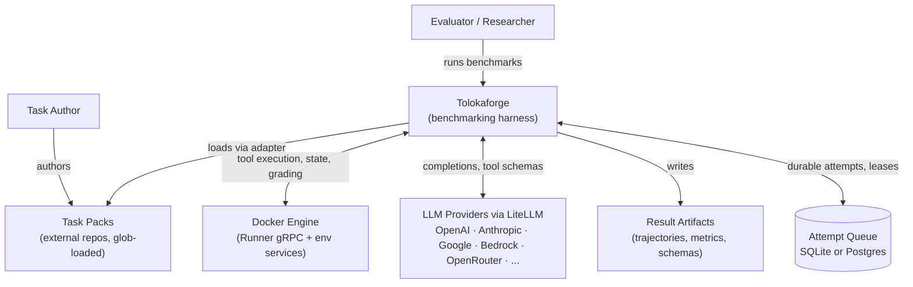
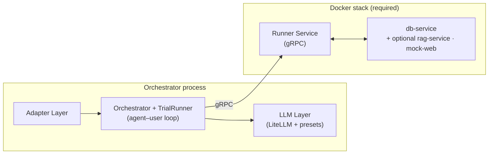
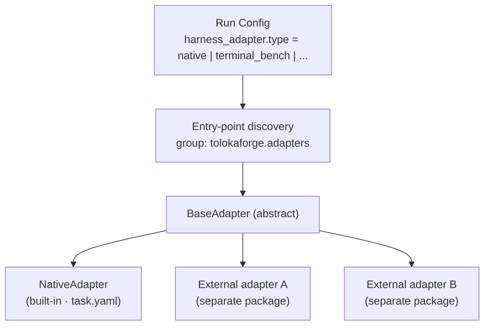
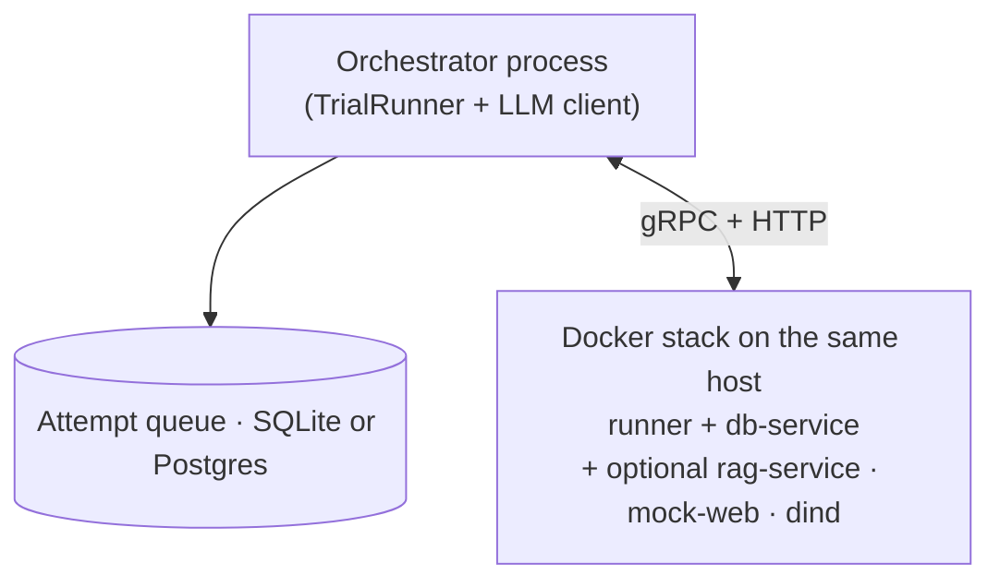

# Tolokaforge Architecture

This document is the entry point for the system-level architecture of Tolokaforge. It follows the [arc42](https://arc42.org/) section structure inlined as a single file, with [C4 model](https://c4model.com/) views drawn as Mermaid diagrams that render natively on GitHub.

For deep dives into individual subsystems, follow the links to `docs/*.md` from each section. For decision history and rationale, see [`adr/`](adr/).

> **How to evolve this doc:** keep the diagrams here at C4 Levels 1–2 (Context and Container) and treat them as a *reflection of what the code actually does today* — not what we plan to build. When a building block changes shape or a boundary moves, update the relevant section *and* add an ADR. When you want to propose a future state, add an ADR with status `Proposed`; once accepted, update the diagram in this file. Verify diagrams against the source (`tolokaforge/`) before merging changes here.

---

## 1. Introduction and Goals

Tolokaforge is a benchmarking harness for evaluating tool-using LLM agents. It runs multi-turn agent/user loops against task environments and produces deterministic pass/fail verdicts plus rich telemetry.

### Quality goals

| Goal | What it means in practice |
|---|---|
| **Determinism** | Same task + same model + same seed should yield the same verdict. State hashes, snapshot grading, transcript rules. |
| **Provider-agnostic** | Any LLM reachable via LiteLLM is a first-class citizen. Provider-specific quirks are isolated in per-preset capability policies. |
| **Isolation** | Tool calls always execute in a separate process — a Docker-hosted Runner gRPC service — so the agent loop never touches tool state directly. |
| **Honesty over convenience** | Failures surface explicitly. No silent fallbacks; no defaults that hide configuration mistakes. |
| **Extensibility** | New benchmark formats plug in as adapters without touching the core. |

### Primary stakeholders

- Model evaluators running benchmarks across providers.
- Task authors writing new benchmark task packs.
- Researchers analysing trajectories, failure modes, and cost/latency.

---

## 2. Constraints

### Technical

- **Language**: Python (managed via `uv`).
- **LLM access**: routed through [LiteLLM](https://github.com/BerriAI/litellm) — provider-specific glue is kept out of the core. Per-provider differences live in the LLM-layer preset registry (`tolokaforge/core/llm/presets.py`).
- **Tools**: built-in Python tools plus [Model Context Protocol](https://modelcontextprotocol.io) servers loaded from task packs. All tool code runs inside the Runner container; the orchestrator only sees the gRPC interface.
- **Docker is required.** Tool execution, environment state, and grading always run inside a Docker stack containing a **Runner gRPC service** (`tolokaforge/runner/service.py`) and supporting environment services (JSON state DB, plus optional RAG indexer / mock web). The orchestrator auto-starts this stack on `tolokaforge run` (`auto_start_services: true` by default) — there is no in-process tool-execution path.
- **In-process loop, remote tools.** The agent–user message loop itself (`tolokaforge/core/runner.py:TrialRunner`) and the LLM calls run inside the orchestrator process; every tool call from that loop is dispatched as a gRPC `ExecuteTool` RPC to the Runner service.
- **Durable attempt queue**: SQLite for single-host runs, optional Postgres for multi-host workers (`tolokaforge/core/run_queue.py`).

### Organisational

- **Open source**: this repository is Apache-2.0; nothing committed here may reference internal-only systems by name.
- **Secrets**: only `SecretManager` reads credentials. Direct `os.environ` access for any secret is forbidden and CI-enforced. See [AGENTS.md § Secrets](../../AGENTS.md#secrets--single-abstraction).
- **Task packs are external**: benchmark task definitions live in separate repositories (public examples ship under `examples/`; production task packs are loaded via adapter glob from any directory the operator points at).

---

## 3. Context and Scope (C4 Level 1)



### Boundaries (what is *not* Tolokaforge)

- **LLM providers** — out of scope; accessed via LiteLLM.
- **Task content** — out of scope; lives in task pack repos. Tolokaforge defines the *contract* (task schema, tool interface, grading config), not the content.
- **Result analysis UI** — out of scope; result artifacts are stable YAML/JSON, consumed by downstream tooling (see [`tools/benchmark-analyzer`](../../tools/benchmark-analyzer/)).

---

## 4. Solution Strategy

| Decision | Rationale | Detail |
|---|---|---|
| **Adapter plugin architecture for benchmark formats** | Lets external task formats (`native` built-in, `terminal_bench` and other plugins) plug in without forking the core. | [`docs/ADAPTER_ARCHITECTURE.md`](../ADAPTER_ARCHITECTURE.md) |
| **In-process agent–user loop, Docker-delegated tools/state/grading** | The trial control flow (agent prompt assembly, LLM calls, user simulator, message accumulation) stays in the orchestrator process so it can be debugged and instrumented with normal Python tooling. Everything that touches task state — tool execution, env services, grading — runs inside a Docker stack reached over gRPC, giving sandbox isolation and the same code path on every host. | [`docs/RUNNER.md`](../RUNNER.md) · [`docs/GRPC_PROTOCOL.md`](../GRPC_PROTOCOL.md) |
| **Provider-agnostic LLM layer with per-preset capability policies** | LiteLLM normalises envelopes, but providers diverge on schema dialects, reasoning encodings, caching, and tool naming. A preset registry keeps the quirks out of the orchestrator. | [`docs/LLM_LAYER.md`](../LLM_LAYER.md) |
| **Single secret abstraction** | One audited code path for every credential read; CI-enforced via static grep. | [AGENTS.md § Secrets](../../AGENTS.md#secrets--single-abstraction) |
| **Deterministic grading by default; LLM judges opt-in** | Deterministic verdicts are reproducible and cheap; judge calls are reserved for cases that genuinely need them. | [`docs/GRADING.md`](../GRADING.md) |
| **Durable attempt queue (SQLite / Postgres) with worker leases** | Lets long runs survive crashes and lets `prepare` + `worker` commands split a run across hosts. | `tolokaforge/core/run_queue.py` |
| **Search subsystem split: engine owns container + primitives, adapters own provider** | The TypeSense container lifecycle and a small set of primitives (thread-safe domain-init coordination, result envelopes) live in the engine. The per-benchmark provider — which tends to drag in benchmark-specific dependencies — lives in the adapter. Adapters use the `typesense` Python package directly; the engine does not ship a `TypeSenseClient` abstraction. | [`docs/TYPESENSE_INTEGRATION.md`](../TYPESENSE_INTEGRATION.md) · [ADR 0003](adr/0003-search-subsystem-engine-adapter-split.md) |

---

## 5. Building Block View (C4 Level 2 — Container)



Component-level detail (CLI commands, the run-queue client, SecretManager, individual env services) is described in the table below rather than spelled out in the diagram, to keep the container view at C4 Level 2.

### Block responsibilities

| Block | Responsibility | Source | Detail |
|---|---|---|---|
| **CLI** | User-facing commands. `run` executes locally end-to-end; `prepare` + `worker` split a run for distributed execution. | `tolokaforge/cli` | — |
| **Orchestrator + Core** | Loads run config, instantiates the adapter, builds the task list, manages the attempt queue, runs trials, aggregates grades and metrics, writes artifacts. | `tolokaforge/core` (`orchestrator.py`, `grading/`, `metrics.py`, `search/`) | [`docs/RUNNER.md`](../RUNNER.md) |
| **TrialRunner** | One instance per trial. Owns the agent–user message loop, calls the LLM for both agent and user simulator turns, and dispatches every tool call as a gRPC `ExecuteTool` RPC to the Runner service. | `tolokaforge/core/runner.py` | — |
| **Adapter Layer** | Resolves a benchmark format into `(TaskConfig, tools, grading, environment, docker_stack_requirements, task_description)`. Built-in `native` plus plugins discovered via the `tolokaforge.adapters` entry-point group. | `tolokaforge/adapters` + `external_adapters/` | [`docs/ADAPTER_ARCHITECTURE.md`](../ADAPTER_ARCHITECTURE.md) |
| **LLM Layer** | Provider-agnostic completion API on top of LiteLLM. Per-provider presets carry capability policies for schema dialect, reasoning encoding, parameter handling, caching, tool-name discipline. Used by both agent and user-simulator turns. | `tolokaforge/core/llm` | [`docs/LLM_LAYER.md`](../LLM_LAYER.md) |
| **Runner Service (gRPC)** | The sole tool-execution path. Owns per-trial state, reconstructs tools from a `TaskDescription`, executes tool calls, runs grading. A single service — not split into separate "agent" and "executor" services. Auto-started by the orchestrator (`auto_start_services: true`). | `tolokaforge/runner` | [`docs/RUNNER.md`](../RUNNER.md) · [`docs/GRPC_PROTOCOL.md`](../GRPC_PROTOCOL.md) |
| **db-service** | JSON state DB accessed by the Runner over HTTP. Namespaced per `(task_id, trial_index)` for parallel isolation. | `tolokaforge/env/json_db_service` | — |
| **rag-service / mock-web** | Optional support services for RAG tasks and browser-style tasks. | `tolokaforge/env/rag_service`, `tolokaforge/env/mock_web_service` | [`docs/BROWSER_TOOLS.md`](../BROWSER_TOOLS.md) |
| **SecretManager** | Single read path for every credential (API keys, DB URLs, OAuth, signing keys). Subprocess export is the only sanctioned `os.environ` mutation, scoped narrowly. | `tolokaforge/secrets` | [AGENTS.md § Secrets](../../AGENTS.md#secrets--single-abstraction) |
| **Run-queue client** | Durable attempt queue. SQLite for single-host runs, Postgres for distributed worker pools. | `tolokaforge/core/run_queue.py` | — |

> **Note on the `tolokaforge/agent/` and `tolokaforge/executor/` packages.** These contain protobuf definitions and `*ServiceServicer` implementations for a planned multi-service decomposition, but they are not currently invoked by the orchestrator (`grep -rn "AgentServiceStub\|ExecutorServiceStub" tolokaforge/` returns no callers). Today only the single **Runner Service** is part of the live architecture. The dormant scaffolding is preserved while a decision about service decomposition is open — when that decision lands, an ADR should record the direction.

### Adapter plugin shape (zoom on the Adapter Layer)



Every adapter implements the same `BaseAdapter` contract — including `get_task`, `create_environment`, `get_registry_tools`, `get_grading_config`, `grade`, `compute_golden_hash`, `to_task_description` (for Docker Runner registration), and `docker_stack_requirements` (to declare bind-mounts, Docker socket access, or DinD needs). The orchestrator only sees the contract, never the concrete adapter. New benchmark formats — public or private — plug in by publishing a Python package that registers under `[project.entry-points."tolokaforge.adapters"]`.

### Extension points (where external repos plug in)

Tolokaforge is the harness; the *content* (tasks, domain tools, grading data) lives in repositories outside this one. Four contracts let external repos extend the system without forking the core. Public adapter repos and internal/private task-and-tool repos use the same four contracts.

| Surface | Contract | Lives where |
|---|---|---|
| **Task packs** | A directory tree of `task.yaml` files (for the `native` adapter) or whatever format the adapter expects. Resolved via `evaluation.tasks_glob` and `evaluation.task_packs` in the run config. | Any directory the operator points at, in any repo. |
| **Domain tools (MCP servers)** | Each `task.yaml` may set `tools.agent.mcp_server: "mcp_server.py"` — a path *relative to the task directory* to a Python module that implements the task's tools (typically [FastMCP](https://github.com/modelcontextprotocol/python-sdk)). The harness imports it dynamically. Tools may also be declared as built-ins via `tools.agent.enabled`. | Alongside the task pack, or vendored from a separate tool library and referenced by import path. |
| **Custom adapters** | A separate Python package that subclasses `BaseAdapter` and registers under `[project.entry-points."tolokaforge.adapters"]`. The harness discovers it on `pip install`. | Independent Python package. `external_adapters/` shows the public pattern. |
| **Custom secret providers** | A subclass of `SecretProvider` registered with the `SecretManager` chain. Used to integrate Vault, AWS Secrets Manager, or other backends without changing call sites. | Anywhere in your Python environment; wired in at startup. |

These four contracts are the entire integration surface. Anything an external task-and-tool repo wants to do — supply new benchmark content, ship custom tools, register a new task format, swap credential backends — should fit through one of them. If something doesn't, that's a signal the contract needs an ADR-recorded extension.

---

## 6. Runtime View — One Trial

```mermaid
sequenceDiagram
    autonumber
    participant CLI
    participant Loop as Orchestrator + TrialRunner
    participant LLM as LiteLLM
    participant Runner as Runner Service (gRPC)

    CLI->>Loop: run config + tasks
    Loop->>Runner: RegisterTrial(task_description)
    loop agent–user loop
        Loop->>LLM: agent completion
        LLM-->>Loop: response + tool calls
        Loop->>Runner: ExecuteTool
        Runner-->>Loop: tool result
        Loop->>LLM: user simulator reply
        LLM-->>Loop: user turn
    end
    Loop->>Runner: GradeTrial
    Runner-->>Loop: verdict + metrics
```

The agent loop, the user-simulator loop, and the LLM calls all happen inside the orchestrator process; every tool call and the final grade go over gRPC to the Runner service. Setup steps (loading config, resolving tasks via the adapter, enqueueing attempts, writing artifacts) bracket the loop but are omitted from the diagram for clarity.

---

## 7. Deployment View



The orchestrator process and the Docker stack live on the same host. There is no in-process tool path — Docker is always required. **Distributed runs** share the attempt queue across hosts: one host runs `tolokaforge prepare` to populate a Postgres queue; one or more hosts run `tolokaforge worker`, each instantiating a full orchestrator + Docker stack. There is no central scheduler — coordination is entirely through the queue. See [`docs/RUNNER.md`](../RUNNER.md) for the distributed contract.

---

## 8. Cross-cutting Concepts

| Concern | Where to look |
|---|---|
| **Secrets handling** | [AGENTS.md § Secrets — single abstraction](../../AGENTS.md#secrets--single-abstraction) · `tolokaforge/secrets` |
| **Determinism & state hashing** | [`docs/GRADING.md`](../GRADING.md) · [`docs/GOLDEN_TRIALS.md`](../GOLDEN_TRIALS.md) |
| **Per-provider capability handling** | [`docs/LLM_LAYER.md`](../LLM_LAYER.md) · [AGENTS.md § Known Gotchas](../../AGENTS.md#known-gotchas) |
| **Tool isolation & sandboxing** | [`docs/SECURITY.md`](../SECURITY.md) · [`docs/BROWSER_TOOLS.md`](../BROWSER_TOOLS.md) |
| **Telemetry & metrics** | [`docs/LOGGING.md`](../LOGGING.md) · [`docs/ANALYTICS.md`](../ANALYTICS.md) |
| **Result artifact layout** | [`docs/OUTPUT_FORMAT.md`](../OUTPUT_FORMAT.md) |
| **Configuration reference** | [`docs/CONFIG.md`](../CONFIG.md) · [`docs/REFERENCE.md`](../REFERENCE.md) |

---

## 9. Architecture Decisions

All architecturally significant decisions are recorded as ADRs in [`adr/`](adr/). The index is maintained by appending new ADRs in numerical order — never renumber, never delete. When an ADR is superseded, change its status and link forward to the superseding ADR.

See [`adr/README.md`](adr/README.md) for the process and [`adr/0000-template.md`](adr/0000-template.md) for the template.

---

## 10. Risks and Known Limitations

| Area | Note |
|---|---|
| **Provider drift** | Tool-schema dialects and reasoning encodings change without notice. Mitigated by capability tests per preset (see [`docs/LLM_LAYER.md`](../LLM_LAYER.md)) and explicit `ModelCertificate` declarations. |
| **Multi-turn vs single-turn behaviour gap** | Some model failures only surface in long-context multi-turn runs and pass synthetic single-turn probes. Tracked in [AGENTS.md § Known Gotchas](../../AGENTS.md#known-gotchas) #22. |
| **Dormant gRPC scaffolding** | `tolokaforge/agent/` and `tolokaforge/executor/` packages contain gRPC service implementations that nothing currently calls. Whether to wire them up or remove them is an open decision; an ADR should land before the next significant change to the Runner boundary. See also [`docs/FUTURE_DEVELOPMENT.md`](../FUTURE_DEVELOPMENT.md). |
| **Container resource accounting** | Sandboxed Runner shares the host; resource accounting is per-process, not cgroup-bounded. |

---

## Glossary

| Term | Meaning |
|---|---|
| **Adapter** | Plugin that maps a benchmark format to the harness contract (`BaseAdapter`). |
| **Task pack** | A directory tree of tasks resolved by an adapter (`task.yaml` for native; format varies per adapter). |
| **Trial** | One attempt at one task with one model configuration. A run produces `N_tasks × repeats` trials. |
| **Trajectory** | The full message + tool-call log for one trial, written as `trajectory.yaml`. |
| **TrialRunner** | The in-process Python class (`tolokaforge/core/runner.py`) that owns one trial's agent–user loop and dispatches every tool call to the Runner Service over gRPC. |
| **Runner Service** | The gRPC service (`tolokaforge/runner/service.py`) that owns tool execution, environment state, and grading. Runs in a Docker container; always required. Distinct from `TrialRunner`. |
| **Preset** | Per-provider capability bundle (schema sanitizer, reasoning codec, params policy, cache policy, tool-content policy). |
| **Grading config** | Declarative spec of how a trajectory and final state are turned into a pass/fail verdict. |
| **Attempt queue** | Durable record of pending and in-flight trial attempts (SQLite single-host or Postgres distributed); leased by workers. |
