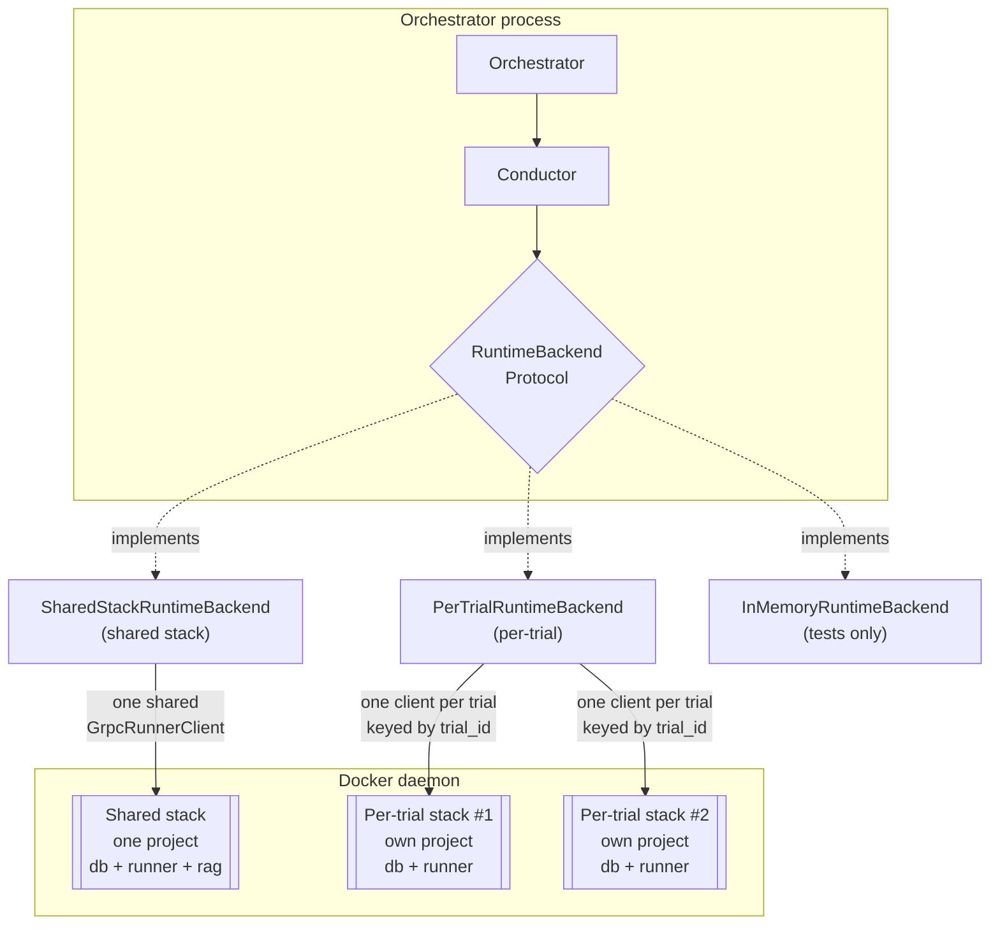
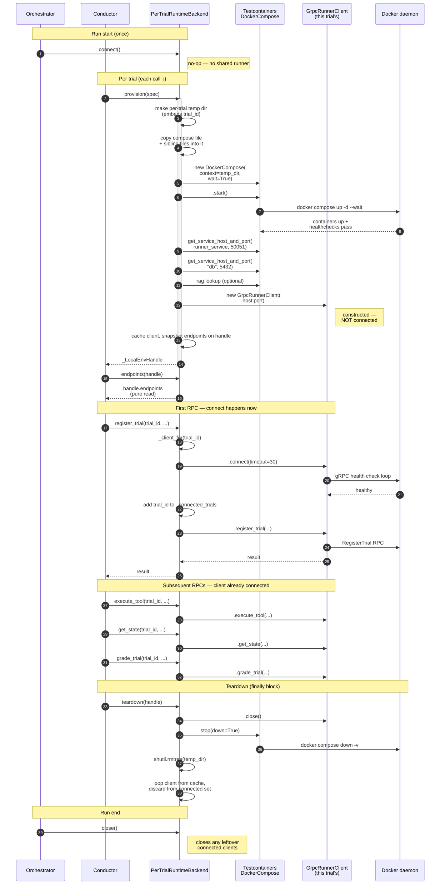
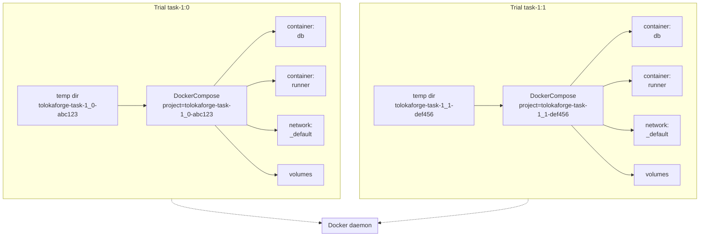
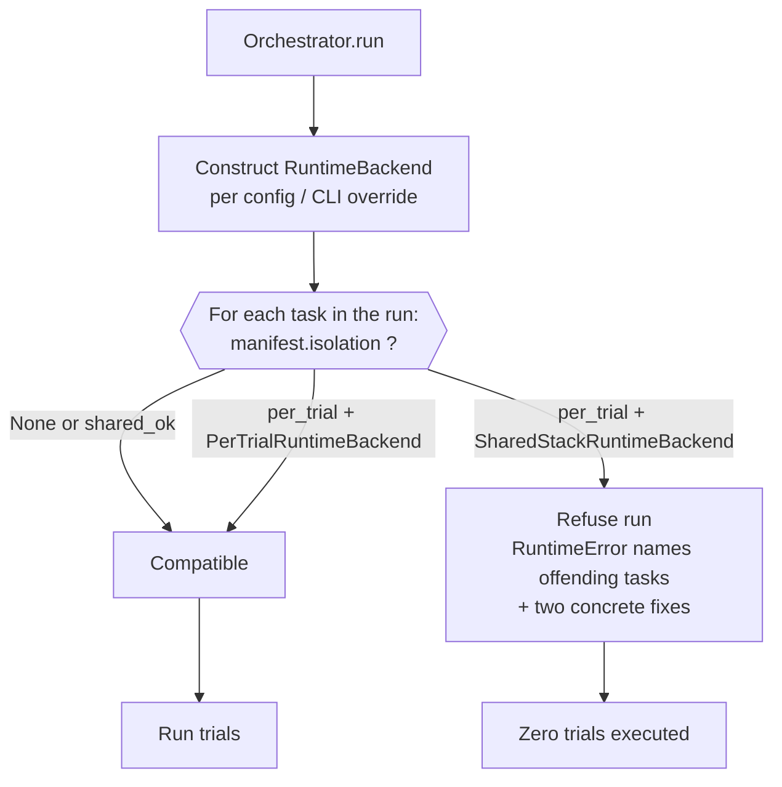

# Runtime backends — how a trial actually runs

This document walks through the `RuntimeBackend` seam end-to-end: what the
Protocol demands, how each production implementation satisfies it, what
happens over the lifetime of a single trial, and how per-trial isolation
composes with the compose-as-source-of-truth manifest.

Companion reading: ADR-0007 (`RuntimeBackend` Protocol), ADR-0010 (per-trial
provisioning contract), ADR-0013 (per-trial RPC methods on the backend),
ADR-0009 (`EnvironmentManifest`), ADR-0011 (Pattern B addendum — typed
wrapper over an external artifact).

## The seam

`RuntimeBackend` is the orchestrator's execution surface. A single Protocol,
nine methods, three concerns:

| Group | Methods | Called when |
|---|---|---|
| Run-level lifecycle | `connect`, `close`, `health_check` | Once per orchestrator run |
| Per-trial provisioning (ADR-0010) | `provision`, `await_ready`, `endpoints`, `teardown` | Around every trial body |
| Per-trial RPC (ADR-0013) | `register_trial`, `execute_tool`, `grade_trial`, `get_state`, `reset_trial`, `cleanup_trial` | Inside the trial body |

Every implementation ships all nine. The orchestrator holds one backend
instance for the whole run; the conductor calls it per-trial.



Selection is a run-level choice with two knobs and a safety enforcement:

- **Config**: `orchestrator.runtime: shared | per_trial` in the run config YAML. Default `shared`.
- **CLI override**: `tolokaforge run --runtime {shared,per_trial}` overrides the config for a single invocation. The banner printed at run start names the backend and the source (`cli-flag` vs `config` vs `default`) so operators can see what actually got chosen.
- **Task-side enforcement**: every task's `environment_manifest.isolation` declares its requirement (`per_trial` default, `shared_ok` opt-out). The orchestrator refuses to start the run if any task requires `per_trial` and the selected backend is `SharedStackRuntimeBackend` — silent cross-trial state contamination is what this guard prevents. See "Isolation enforcement" below.

Legacy `orchestrator.runtime: docker` is accepted as a deprecated alias for `shared` with a `DeprecationWarning` at config load.

## Concrete backends

**`SharedStackRuntimeBackend`** — the original. One compose project brought up at
`connect()` time and shared across every trial in the run. Per-trial
"isolation" is `trial_id`-in-URL only; cross-trial state contamination is
structural. `provision` / `teardown` are no-ops on the run-wide stack. Fine
for single-tenant, sequential runs; caps concurrency at one trial per
service that has stateful side effects.

**`PerTrialRuntimeBackend`** — this PR. One compose project per trial via
`testcontainers.compose.DockerCompose`. Each `provision` call materialises
an isolated stack; the trial's runner container is only reachable through
its own network + host-side port. Concurrent trials each get independent
containers, networks, and volumes. Backwards-compatible because it is
opt-in: tasks that do not declare an `environment_manifest` still run on
`SharedStackRuntimeBackend`.

**`InMemoryRuntimeBackend`** — test-only. Records every method call on a
`RuntimeBackendCallLog`; no Docker daemon required. Used by canonical
contract tests.

## A trial's lifecycle on `PerTrialRuntimeBackend`

The following sequence covers one trial end-to-end. Reads left-to-right in
time; each arrow is a real method call on the class instances named at the
column headers.



Every step above is a single method call in `tolokaforge/core/per_trial_runtime.py`.

## Deep-dive — `provision()`

Nine steps, in order. Failure at any step raises `ProvisionError(stage="provision")` and cleans up whatever ran successfully before the raise.

1. **Guard on manifest presence.** `spec.task.environment_manifest is None` → raise. Tasks without a manifest belong on `SharedStackRuntimeBackend`, not this backend.
2. **Make a per-trial temp directory.** Path like `/tmp/tolokaforge-<sanitised-trial-id>-<random>/`. The basename is what Docker Compose reads for its auto-generated project name — encoding the trial id here is what gives each concurrent trial its own project.
3. **Copy the compose context.** Everything in the compose file's parent directory (compose YAML, adjacent bind-mount source files, initial-state fixtures) copies into the temp dir. Bind mounts declared as relative paths resolve inside the copied context; safety validators (ADR-0009) already reject `..` and absolute paths, so the copy is closed and complete.
4. **Construct `DockerCompose`** with `context=<temp_dir>`, `compose_file_name=<manifest.compose_file.name>`, `pull=False`, `build=False`, `wait=True`.
5. **`compose.start()`.** Runs `docker compose up -d --wait`. Blocks until every service's compose `healthcheck:` reports healthy. On failure, raise `ProvisionError` and rmtree the temp dir.
6. **Construct the runner client** — `GrpcRunnerClient(runner_address="<host>:<port>")`. Host + port come from `compose.get_service_host_and_port(manifest.runner_service, 50051)`. **The client is not connected here** — `connect()` is deferred to first RPC use (see next section).
7. **Snapshot endpoints on the handle.** `_resolve_endpoints(...)` looks up `runner_service` at 50051 and the conventional `db` service at 5432, plus an optional `rag` service. Missing `db` raises `ProvisionError` (see follow-up ticket for making this customisable).
8. **Cache the client** — `self._clients[spec.trial_id] = client`. This is the map every per-trial RPC method reads from.
9. **Return `_LocalEnvHandle`** carrying the trial_id (public), the compose stack, the runner service name + port, the temp dir, and the endpoints snapshot. All except `trial_id` are backend-private; callers treat the handle as an opaque token.

## Endpoint resolution

`endpoints(handle)` is a **pure read** — it returns `handle.endpoints`, resolved once at provision time. This is a deliberate departure from an earlier design where `endpoints()` re-queried the compose stack every call: a method named `endpoints` mutating state on missing-service was surprising, and the missing-db check now fails fast at provision time before a handle exists.

Where each URL comes from (defaults; customisation is a follow-up):

| Field | Source | Port |
|---|---|---|
| `runner_url` | `manifest.runner_service` (default `"default"`) | `50051` |
| `db_url` | compose service named **`db`** | `5432` |
| `rag_url` | compose service named `rag` or `rag-service`; else `None` | service's declared port |

All three are resolved via `compose.get_service_host_and_port(name, port)`, which returns the host-assigned port that maps to a service's container port. Two concurrent trials of the same task get **different** host-assigned ports for the same container port — that is what makes concurrent stacks not clash.

## Per-trial isolation

Testcontainers' `DockerCompose` does not accept a `project_name` parameter. Docker Compose derives the project name from the context directory basename by default. `PerTrialRuntimeBackend` leverages that: each trial's compose file is copied into a temp directory whose name embeds the trial id, so each trial's `DockerCompose` instance sees a unique project name.



Same compose file → two independent projects → independent networks (no cross-trial reachability), independent volumes (no cross-trial state), independent host ports (no port collision).

## Lazy runner-client connect

`GrpcRunnerClient.connect()` runs a gRPC health-check retry loop (up to 30s
by default). For a run-wide backend like `SharedStackRuntimeBackend`, that cost is
amortised — one connect at run start covers every trial. For a per-trial
backend, connecting eagerly at `provision()` time would add the connect cost
to every trial's provisioning latency, even for trials that never actually
call an RPC (e.g., a trial that fails inside the provision path but not
inside the runner).

The industry pattern is lazy: gRPC channels connect on first RPC call; boto3,
`kubernetes-client`, and the Docker SDK all construct lazily; Testcontainers
itself separates "container up" (via `--wait`) from "application-level
connect" (caller's problem).

`PerTrialRuntimeBackend` follows suit:

- `provision()` constructs the `GrpcRunnerClient` but does not call `.connect()`.
- The `_connected_trials: set[str]` tracks which trials' clients have already been through their connect health check.
- `_client_for(trial_id)` — invoked by every per-trial RPC method — checks the set; if the trial isn't in it, calls `.connect()` once and adds it. Subsequent calls to the same trial's RPCs skip the connect.
- `teardown(handle)` and `close()` only invoke `.close()` on clients that were actually connected — closing a never-used client would have nothing to close on the gRPC side.

This means the compose `--wait` gate (which already blocks until every container reports healthy) is the only latency `provision()` adds beyond the compose CLI itself. First RPC call pays the connect cost; subsequent calls hit a warm client.

## Teardown + cleanup

`teardown(handle)` is idempotent, per ADR-0010. It performs, in order:

1. Pop the client from `_clients` (returns None if already torn down).
2. Discard the trial id from `_connected_trials`; capture whether it was in the set (that determines whether the client needs closing).
3. If the client existed AND was connected, call `.close()` on it. Best-effort — logs on failure, does not raise.
4. `_shutdown_compose(handle.compose)` — runs `compose.stop(down=True)`, which is `docker compose down -v` under the hood. Best-effort. Removes containers, network, and anonymous volumes.
5. `shutil.rmtree(handle.temp_dir, ignore_errors=True)` — removes the per-trial context directory.

A second `teardown(handle)` call finds nothing in the cache, exits quickly. Foreign handles (anything not `_LocalEnvHandle`) return silently — Protocol semantics say teardown of an already-torn-down handle is a no-op.

`close()` (run-level) walks every connected trial, closes their clients, clears the cache. Rarely necessary in practice because the conductor calls `teardown(handle)` in a `finally`; `close()` catches trials that leaked past that (e.g., a caller that forgot to teardown).

## Isolation enforcement

Every `EnvironmentManifest` declares a `TaskIsolation` (default `per_trial`, opt-out `shared_ok`). The orchestrator reads this immediately after backend selection and refuses the run if the combination is unsafe.



Fail-loud fix message names both remedies:

- Switch the runtime: pass `--runtime per_trial` or set `orchestrator.runtime: per_trial` in the config.
- Opt the task out: set `environment_manifest.isolation: shared_ok` (only appropriate for genuinely stateless tasks).

Enforcement lives at the orchestrator layer, not on `SharedStackRuntimeBackend.provision()`. Refusing the run BEFORE any trial starts (rather than trial-by-trial) means the operator sees the whole failure at once instead of watching trials time out or produce garbage verdicts.

`PerTrialRuntimeBackend` accepts every task — per-trial isolation is a superset of shared-stack semantics for correctness purposes. Cost of per-trial provisioning for genuinely stateless tasks is a separate concern (the loud-defaults banner surfaces the cost/benefit trade so operators can pick the right backend for their workload).

## Failure modes

| Where | What is raised | What is cleaned up before the raise |
|---|---|---|
| `provision` — no manifest | `ProvisionError(stage="provision")` | Nothing to clean |
| `provision` — compose start fails | `ProvisionError(stage="provision")` wrapping the compose error | Per-trial temp dir removed |
| `provision` — runner-client construction (host/port unresolvable) | `ProvisionError(stage="provision")` | Compose stack torn down + temp dir removed |
| `provision` — endpoint resolution (missing `db` service) | `ProvisionError(stage="provision")` | Compose stack torn down + temp dir removed |
| `await_ready` | Never raises today (`--wait` gates during provision); reserved for future backends | — |
| `endpoints` — foreign handle | `TypeError` | — |
| `endpoints` — everything else | Never raises (pure read on the handle's snapshot) | — |
| Any per-trial RPC — trial not provisioned | `RuntimeError("provision() must be called before…")` | — |
| Any per-trial RPC — inside the RPC itself | Whatever `GrpcRunnerClient` raises (typically `grpc.RpcError`) | — |
| `teardown` — foreign handle | Silent no-op (idempotency contract) | — |
| `teardown` — compose down fails | Silent, logged | Whatever succeeded before the failure |

The provisioning contract (ADR-0010) requires provisioners to make a
best-effort teardown of anything partially materialised before raising.
`PerTrialRuntimeBackend` honours that at every failure point above — no
half-provisioned resources leaked to the daemon.

## `SharedStackRuntimeBackend` vs `PerTrialRuntimeBackend` side-by-side

| Concern | `SharedStackRuntimeBackend` | `PerTrialRuntimeBackend` |
|---|---|---|
| Compose scope | One project per **run** | One project per **trial** |
| Container lifetime | Whole run | Bracketed by `provision` / `teardown` |
| Cross-trial state | Shared DB, shared runner state | Isolated per trial |
| Concurrency ceiling | One trial per stateful service | Bounded by host resources (memory, CPU, docker daemon throughput) |
| Runner client | One `GrpcRunnerClient` for the whole run | One `GrpcRunnerClient` per trial, keyed by `trial_id` |
| Client connect timing | Eager, at `connect()` | Lazy, at first RPC call |
| Network isolation | Trial ids in URL paths | Docker network per trial (no cross-project reachability) |
| Volume isolation | None (shared) | Docker anonymous volumes per trial; removed on `teardown` |
| Backwards compat | Yes — default backend | Yes — opt-in via task's `environment_manifest` |
| Config gate | Always available | Task declares an `environment_manifest`; orchestrator selects the backend based on config |

Both satisfy the same `RuntimeBackend` Protocol. Callers depend only on the Protocol — swapping backends is a construction-time choice, not a callsite change.

## Extending to new substrates

The manifest is **substrate-neutral by design**: `EnvironmentManifest` points at a Docker Compose file, but compose is the *vocabulary* the manifest speaks — every backend owns the *translation* from compose to its own substrate. Adding a new substrate means adding a new `RuntimeBackend` implementation; task manifests do not change.

Concretely, when the next substrate lands (e.g. Kubernetes):

- Write a new class that satisfies the nine-method `RuntimeBackend` Protocol.
- Inside `provision`, translate `manifest.load_compose()` into that substrate's shape (a k8s backend would use `kompose` or a small owned translator to render Pod / Service specs, then `kubectl apply`; a Modal / E2B backend would render into its SDK's spec type).
- Advertise the backend's isolation posture by setting the class-level `isolation_mode: IsolationMode` attribute — `SHARED_STACK` if trials share one materialisation, `PER_TRIAL_STACK` if each trial gets its own. The orchestrator's isolation-compatibility check reads this attribute, not the class name, so a `KubernetesPerTrialRuntimeBackend` (or whatever it's called) slots into the enforcement path with zero orchestrator changes.
- Wire the backend into config: extend the `orchestrator.runtime` selector so operators can pick between the shipped backends.

The isolation axis (shared vs per-trial) and the substrate axis (docker compose vs kubernetes vs hosted sandbox) are orthogonal — a substrate can support either isolation mode, or specialise in one. Class names today collapse the substrate axis (both current backends are docker-compose-based) because there is only one substrate; when a second substrate arrives, the naming can grow to make the substrate explicit alongside the mode.

## Per-trial substrate bracket (`TrialExecutor`)

The orchestrator brackets each `conductor.run` call with the substrate contract through a dedicated seam: the `TrialExecutor` Protocol (ADR-0015). The production concrete `ProvisioningTrialExecutor` composes a `RuntimeBackend`, a `Conductor`, and a `StructuredLogger`, and owns exactly this shape:

```python
handle = runtime_backend.provision(spec)
try:
    runtime_backend.await_ready(handle)
    real_endpoints = runtime_backend.endpoints(handle)
    final_spec = spec.model_copy(update={"env_endpoints": real_endpoints})
    return conductor.run(final_spec, task_config)
except ProvisionError as e:
    return synthesize_failed_result(spec, e)
finally:
    runtime_backend.teardown(handle)
```

The `Orchestrator._build_trial_executor(runtime_backend, conductor)` helper composes one per run; both dispatch sites (`Orchestrator.run()` and `Orchestrator.run_worker()`) submit `trial_executor.execute` to their worker pools in place of `conductor.run`. Provisioning parallelism = worker count. Both backends now uniformly source per-trial endpoints from `endpoints(handle)`, so the `env_endpoints` substitution is substrate-agnostic — a no-op for the shared-stack path (same value across trials, resolved once at backend construction) and load-bearing for the per-trial path (real per-trial URLs).

`ProvisionError` at any provisioning stage synthesises a failed `TrialResult` with `TerminationReason.PROVISION_ERROR`; `attribute_failure()` classifies it as `provision_failure` (deterministic=True) in `DETERMINISTIC_CLASSES`, so retry logic and dashboards can distinguish substrate failures from tool / grader / model-reasoning failures.

The Protocol boundary is what future variants slot into — a `RemoteTrialExecutor` (gRPC client to a trial-plane worker per CLOUD_RUNTIME §6.4) replaces `ProvisioningTrialExecutor` behind the same interface, and neither the Orchestrator nor the Conductor changes.

## Referencing the runner image from task manifests

`PerTrialRuntimeBackend` materialises each trial's compose stack via Testcontainers. When a task's `environment_manifest.compose_file` declares a `runner` service, the compose entry needs an `image:` ref — a *pinned* name (the manifest validator rejects floating tags like `:latest`, `:main`, `:edge` for reproducibility).

The tolokaforge runner + db-service images are built locally on every run (content-hash-tagged, cache-hit-driven). To give task-pack authors stable names to reference, the orchestrator applies **`:local` aliases** on top of each content-hash build: after `ServiceStack.start_all()`, `Orchestrator._ensure_engine_image_local_aliases()` runs `docker tag tolokaforge-runner:<content-hash> tolokaforge-runner:local` (and the same for `tolokaforge-db-service`) — same images, two names each. Task compose files reference the aliases:

```yaml
services:
  runner:
    image: tolokaforge-runner:local
    ports:
      - "50051"
  db:
    image: postgres:16.6-alpine3.21@sha256:...
    environment: {...}
    ports:
      - "5432"
```

`:local` is a legal pinned tag (not one of the floating names — `latest` / `main` / `master` / `edge` / `stable` / `dev` / `develop` / `nightly` / `head` — that the validator rejects) and is decoupled from the tolokaforge release version, so task compose files don't rotate on every package bump.

The alias step is best-effort and logged, not raise-and-fail — the shared-stack path still works with the content-hash tag whether or not the alias applies. Only per-trial task compose files referencing `tolokaforge-runner:local` would then fail, at which point the operator sees the aliasing warning from run start and knows what to fix.

Forward-looking: when the runner image ships to a public registry, task composes will switch to the published reference (e.g. `image: ghcr.io/toloka/tolokaforge-runner:X.Y.Z`) — a task-side edit, not an engine change. `:local` stays as the local-dev alias.

## What this PR does *not* do

- **No runner image publication.** The `tolokaforge/runner` image is still a local build. Real RPC coverage against a task pack that declares `environment_manifest` waits for the validation-gate follow-up.
- **No opt-in from any real task pack.** Zero task packs declare an `environment_manifest` today; the validation-gate follow-up will migrate one existing multi-service task to prove the design end-to-end. On its green, ADR-0009 / 0010 / 0014 / 0015 flip from `Proposed` to `Accepted`.
- **No endpoint customisation.** The `runner_service` / `db` service / `rag` service conventions are still hardcoded (see `PerTrialRuntimeBackend`). `runner_port` / `db_service` / `db_port` / `rag_service` / `rag_port` manifest fields remain a follow-up ticket.
- **No perf optimisations.** Image pre-pull, postgres template-DB, container pool, orphan sweep, resource caps, benchmark harness — all filed as a follow-up umbrella ticket.
- **No layered-image guide.** The SWE-bench 3-tier pattern (base → environment → instance, cited in ADR-0009) applies transparently to any pinned images the compose file references, but the concrete Dockerfile recipes for task-pack authors are a docs follow-up.

## Where to read next

- `tolokaforge/core/per_trial_runtime.py` — implementation.
- `tolokaforge/core/runtime.py` — the `RuntimeBackend` Protocol + `InMemoryRuntimeBackend`.
- `tolokaforge/core/shared_stack_runtime.py` — `SharedStackRuntimeBackend` + `RunnerClient` Protocol + `GrpcRunnerClient`.
- `tests/canonical/test_per_trial_runtime_backend.py` — the unit tests exercise every lifecycle branch documented above with fakes.
- `tests/integration/docker/test_per_trial_runtime_backend_integration.py` — the real-daemon lifecycle smoke.
- `docs/architecture/adr/0010-runtime-backend-provisioning-contract.md` — the contract this document implements.
