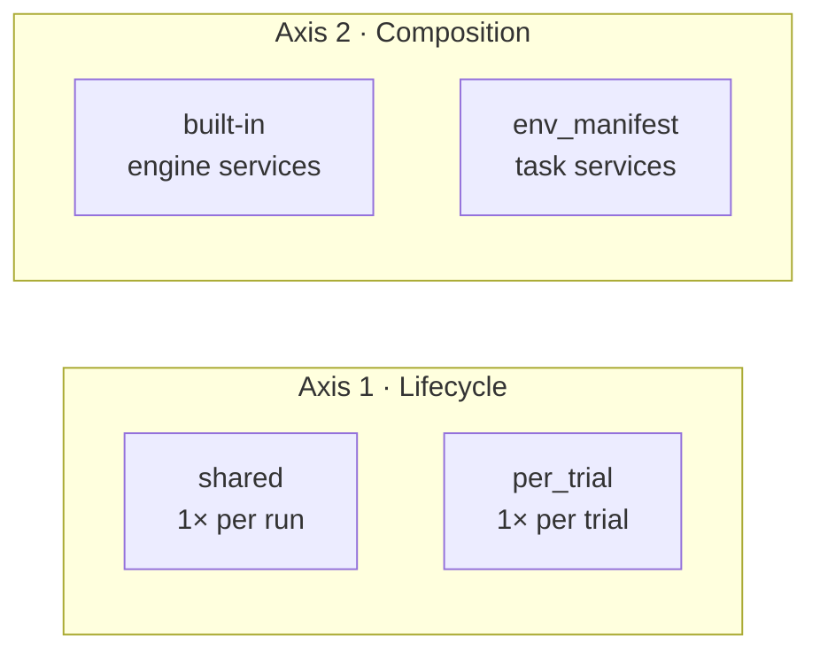
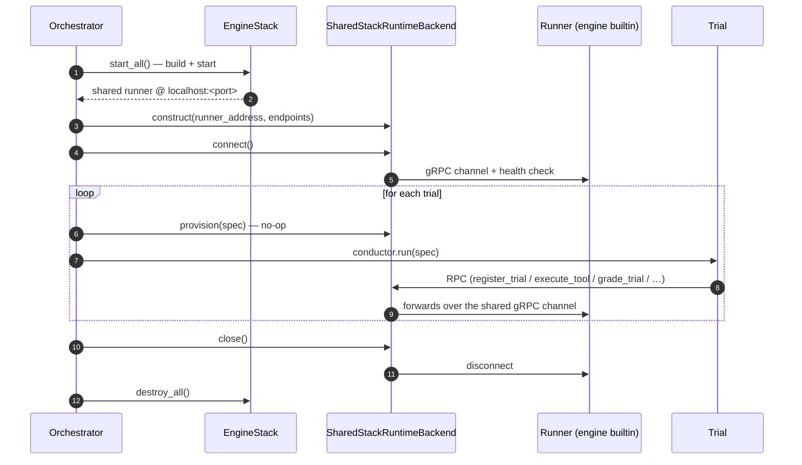
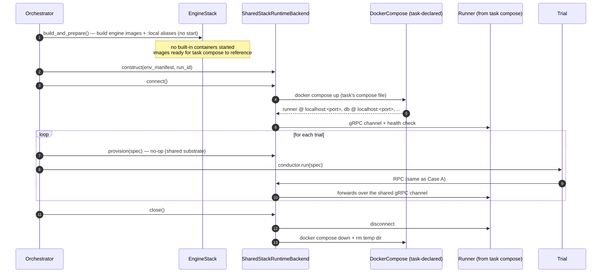
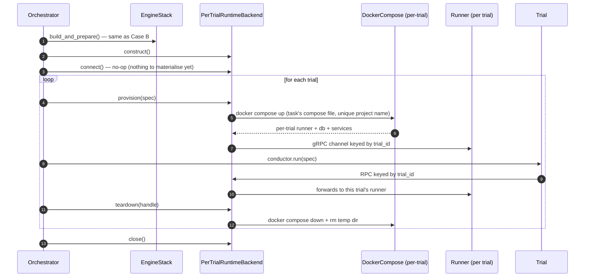
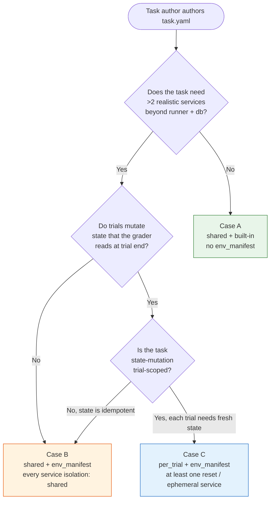

# 0018. Multi-container capability under shared runtime

- **Status:** Accepted (amended)
- **Date:** 2026-07-04
- **Amended:** 2026-07-14 — isolation is per-service in the manifest;
  backend selection is task-driven; `orchestrator.runtime` is a
  deprecated override.
- **Deciders:** @CiroGamboa
- **Supersedes:** —
- **Superseded by:** —

## TL;DR

**Multi-container capability** and **per-trial isolation** are independent
concerns. Before this ADR, they were entangled: the only way to run a task with
a rich task-declared compose file was to opt into per-trial isolation. Tasks
that needed a realistic multi-service environment but were fine sharing state
across trials had no path. This ADR decouples them by extending
`SharedStackRuntimeBackend` to consume `environment_manifest` — task-declared
services get materialised **once per run** under shared semantics.

## Amendment — per-service isolation, task-driven backend selection

The originally-shipped whole-manifest `isolation` field
(`per_trial` / `shared_ok`) is superseded. Isolation now lives per
compose service under `default_environment.services.<name>.isolation`
in the manifest, with the vocabulary `shared` / `reset` /
`ephemeral`. Services without a manifest entry default to `ephemeral`;
the overall default per ADR-0009 stays `per_trial` (a manifest with no
explicit `services` entries is treated as per-trial-requiring).

Backend selection is **task-driven**: the orchestrator resolves the
task set, reads each task's `EnvironmentManifest.requires_per_trial`
(true iff any service is not `shared`), and picks
`PerTrialRuntimeBackend` when any task requires it, otherwise
`SharedStackRuntimeBackend`. The legacy `orchestrator.runtime` field
survives as a deprecated operator override — setting it emits a
`DeprecationWarning`; retirement is deferred to a later milestone.
The isolation-compatibility guard (`_verify_isolation_compatibility`)
now only fires under that override path — when an operator forces a
shared backend against a per-trial-requiring task set (or asks for an
`ephemeral` service on a shared backend, which cannot be honoured
without a compose-down between trials).

The 2×2 matrix below is unchanged in shape — cases A / B / C still
map onto the same cells — but each cell is now reached via the
task-driven signal derived from the per-service isolation map. Case B
(shared + task-declared stack) is entered by declaring every service
`isolation: shared`; case C (per-trial + task-declared stack) by
declaring at least one `reset` or `ephemeral` service.

Compose files carry **zero isolation semantics**. The manifest is the
single authority; the compose file is the substrate definition. A
task can declare its own `services.<name>` entries as a patch on top
of the project's; the resolver treats a task override of a service as
an atomic replacement of that service's whole `ServiceSpec` (a stale
`reset` sibling from the project side can't leak through). Atomic
`stack` replacement (a task supplying its own `stack.compose_file`)
still discards the project's service-treatment fields — the project's
per-service opt-outs reviewed the project's services, not the
replacement stack.

The substrate-agnostic resolver lives at
`tolokaforge/runtime/isolation.py` (`resolve_service_isolation`,
`resolve_service_specs`). It consumes `EnvironmentPatch` inputs only —
no filesystem I/O — so a future Kubernetes backend consumes the same
resolved per-service map without any change to the resolver's shape.

See also [ADR-0009](0009-environment-manifest.md); the manifest's
outer contract is unchanged, only the isolation surface it carries
moved sub-tree.

## The two independent axes

Runtime backends live on a 2×2 matrix, not a line. The two axes describe
different concerns:

- **Axis 1 — Stack lifecycle.** *When* is the substrate materialised and torn
  down? Once per **run** (shared) or once per **trial** (per_trial)?
- **Axis 2 — Stack composition.** *What* services live in the substrate? A
  fixed set of **engine built-ins** (runner + db-service ± mock-web ± rag), or
  a **task-declared compose file** whose services are whatever the task wants?

Every real run occupies exactly one cell of that 2×2:

| Lifecycle ↓ / Composition → | **Built-in stack** (no `env_manifest`) | **Task-declared stack** (`env_manifest` set) |
|---|---|---|
| **`shared`** (once per run) | **Case A** — Default. Historical baseline. | **Case B** — Added by this ADR. |
| **`per_trial`** (once per trial) | **Case D** — Legal but pointless. Trials get identical fresh built-in substrates. Not exercised in practice. | **Case C** — Shipped in [ADR-0009](0009-environment-manifest.md) + [ADR-0010](0010-runtime-backend-provisioning-contract.md). |

Cases A, B, and C are the three the engine actively supports. Case D is a
legal but pointless combination (per-trial isolation on a built-in stack buys
nothing — you pay compose-up cost every trial to get an identical substrate);
the engine won't refuse to run it, but no task packs opt in.

## Naming note: `EngineStack` is deliberately docker-only and non-Protocol

The engine's built-in service bring-up primitive is called `EngineStack`
(in `tolokaforge/docker/stack.py`, previously named `ServiceStack`). Two
deliberate constraints on its shape are worth stating so future readers
don't try to "generalise" it:

1. **Docker-only.** `EngineStack` drives `docker-py` directly. It is not
   a substrate-agnostic abstraction. A future Kubernetes / Modal / EC2
   backend would ship its own engine-bring-up primitive (or not need one
   at all if that substrate is always task-declared). "Engine" in the
   class name signals the scope (the engine's built-in services); the
   docker-mode-ness is signalled by the module path
   (`tolokaforge/docker/stack.py`).
2. **Not a Protocol.** `EngineStack` sits below the
   :class:`RuntimeBackend` seam as a docker-mode implementation detail.
   The substrate-agnostic seam is `RuntimeBackend` (ADR-0007), and the
   design doc's D15 plug-in list does not include `EngineStack`. We
   don't have a second implementation, we don't know the shape of a
   second implementation (a k8s engine-bring-up might not even look
   like a compose-shaped stack), and premature abstraction risks
   locking in the wrong shape. If a second implementation arrives with
   a demonstrable shape, we Protocol-ise then — that's a 1-hour
   mechanical refactor when the demand is real, and zero cost to defer.

In the case diagrams below, `EngineStack` appears as an actor only in
Case A (shared + built-in). Cases B and C use it only as an *image
builder* via `build_and_prepare()` — the actual substrate materialisation
happens inside the `RuntimeBackend` implementation via
testcontainers-`DockerCompose` (see `compose_materialisation.py`).

## Package composition is a separate concern

This ADR is about **which services live in the substrate** and **when they
come up**. It does **not** decide **how those services are packaged for
distribution**. Those are independent axes:

- **Substrate composition** (this ADR): the runtime backend materialises
  either the engine's built-in services (`core_stack` = runner + db-service,
  optionally augmented to `full_stack` = mock-web + rag-service) or the
  task-declared services from `environment_manifest.compose_file`.
- **Package composition** (roadmap, not this ADR): today all engine services
  ship in a single PyPI package (`tolokaforge`) and are referenced by a
  single `:local` engine image alias. Runner and db-service are already
  independent *services* — they talk over HTTP with a configurable
  `DB_SERVICE_URL` — but they share a package and a build. The **D16**
  decision in `CLOUD_RUNTIME_ARCHITECTURE.md` commits to designing internal
  module boundaries as if a future split into multiple published
  artifacts is inevitable; the eventual "Runner as consumable artifact"
  work makes the split concrete.

Every cell of the 2×2 is compatible with either package shape. A Case A run
uses the engine's built-in services regardless of whether they ship as one
package or ten. A Case B/C run declares services in its own compose file
regardless of which engine images those services reference. The
composition axis and the packaging axis do not interact.

One subtlety worth flagging for future runner-artifact planning: the
runner currently **assumes** a reachable db-service (some tool-execution
paths error out if the db HTTP endpoint returns errors). The **seam is
decoupled**, but the runner's current dependency shape **assumes the
seam is filled**. Standalone-runner distribution will need to pick one
of: null-tolerant runner (unfilled seams become no-ops), ship db-service
alongside the runner in the same distribution, or make db-service opt-in
via runner config. Out of scope for this ADR.

## What each case looks like — end to end

### Case A — `shared` + built-in stack (default, unchanged)

The engine's shared substrate. `EngineStack` brings up `core_stack`
(runner + db-service) or `full_stack` (adds mock-web + rag-service based on
task tools) once at run start. Every trial connects to the same containers.

Everything about this path is documented in [ADR-0016](0016-runtime-backend-comparison.md) and `RUNTIME_BACKENDS.md`. Untouched by this ADR.

### Case B — `shared` + task-declared stack (new)

The task's `environment.compose.yaml` declares its own services (runner +
db-service + application services + application db + …). The engine
materialises that compose file **once at run start**, resolves endpoints from
the running stack, and every trial connects to the same substrate. Tear-down
happens at run end.

Key differences from Case A:

- **Materialisation is at `connect()`, not at construction.** The task's
  compose file gets `docker compose up`'d when the backend connects.
  Endpoints are resolved *from* the running stack — testcontainers-python
  allocates host ports; the backend reads them back.
- **`EngineStack` takes the `build_and_prepare()` path** (build engine
  images + apply `:local` aliases, no built-in container start). The
  engine's runner + db-service go unused; the task's compose owns them via
  `:local` alias references.
- **Every trial sees the same substrate.** State persists across trials.
  Task authors opt into this by labelling every service
  `services.<name>.isolation: shared` in the manifest; any `reset` or
  `ephemeral` label routes the run onto `PerTrialRuntimeBackend` via
  task-driven selection.

### Case C — `per_trial` + task-declared stack (already shipped)

Same task compose file, but the backend materialises it fresh **per trial**.
Every trial gets an isolated substrate; teardown happens per trial.

Key differences from Case B:

- **Materialisation is per trial, not per run.** Every trial pays the
  compose-up cost.
- **Per-trial runner clients.** The backend keeps a `dict[trial_id →
  GrpcRunnerClient]`; Case B has a single client for the run.
- **Isolation.** Trial N never sees trial N-1's state (containers +
  volumes are physically distinct).

Shipped in v0.7.0 (`PerTrialRuntimeBackend` + `--runtime` CLI).

## Choosing a case — decision flow

**Rules of thumb:**

- **Default is Case A.** Only reach for `env_manifest` if the built-in stack
  is genuinely insufficient (e.g., the task needs an application backend the
  agent interacts with, and the engine's built-ins don't provide it).
- **Prefer Case B over Case C when possible.** Case B pays compose-up cost
  once per run; Case C pays it every trial. Case C is only worth its
  overhead when trials genuinely need fresh state that the grader reads.
- **Isolation is a task-author declaration, not an operator choice.**
  The manifest's per-service isolation map determines the case; backend
  selection is task-driven from that map. The deprecated
  `orchestrator.runtime` override still wins if set, and the isolation-
  compatibility guard refuses incompatible overrides (shared runtime
  forced against a per-trial-requiring task set → fail loud).

## Consequences

### Positive

- **Multi-container tasks no longer force per-trial isolation.** Task
  authors who need realism without isolation now have Case B.
- **Both backends share the same materialisation primitives.** The
  `compose_materialisation` module extracted alongside this ADR made
  this possible without code duplication. `PerTrialRuntimeBackend` and
  `SharedStackRuntimeBackend` now differ only in *when* they materialise,
  not *how*.
- **The 2×2 matrix generalises to future substrates.** When a Kubernetes
  or Modal backend lands, it will occupy a *third row* of the same 2×2:
  its own lifecycle (still "per run" or "per trial") combined with either
  built-in or task-declared composition. The framework is already right.

### Negative / Trade-offs

- **Case B ties every trial to the same substrate.** State contamination
  is the task author's problem to prevent, same as Case A. Labelling
  every service `isolation: shared` in the manifest is a task-author
  acknowledgment of that responsibility.
- **A run whose tasks declare different `environment_manifest.compose_file`
  values cannot be materialised into one shared substrate.** The
  orchestrator's `_extract_run_env_manifest()` helper fails loud at run
  start with the offending task ids. Operators must split the run.
- **Distributed worker mode does not currently support Case B.** The
  parent orchestrator's dynamic (testcontainers-allocated) runner address
  is not propagated to workers. Guarded loudly by `run_worker`; workers
  refuse env_manifest runs until follow-up work threads the materialised
  address through the run-state.
- **TypeSense is currently incompatible with Case B (and Case C).** The
  TypeSense bridge routes to the built-in `runner-net`; task-declared
  runners live on task-side networks and can't reach it. Guarded loudly.
  See "Follow-ups" below.

### Follow-ups

- **Task-declared `db_service` / `db_port` overrides** — the well-known
  endpoint convention now looks for `db-service` at port 8000, matching
  the HTTP JSON state backend the engine ships (and dropping the earlier
  phantom `db:5432` postgres requirement). Task compose files that name
  their state backend differently would need optional manifest fields
  to override the defaults. Not needed for any current task; deferred
  until a real use case surfaces.
- **TypeSense + task-declared substrates** — a dedicated follow-up ticket
  tracks the unblock (design options: task-declared TypeSense in the
  compose file, per-run bridge to the task-declared network, per-trial
  TypeSense). Prerequisite: the TypeSense provider unfreeze.
- **Distributed workers + Case B** — thread the parent's materialised
  runner address through the run-state file so workers can pick it up.
  Small change, deferred until the demand is real.
- **Kubernetes / at-scale substrate** — natural next backend. Adds a
  third row to the 2×2 (or generalises the lifecycle axis to
  substrate-shape-agnostic). Design deferred to the "Later" section of
  the roadmap.

## Links

- Related ADRs:
  - [ADR-0007](0007-runtime-backend-protocol.md) — RuntimeBackend Protocol
  - [ADR-0009](0009-environment-manifest.md) — EnvironmentManifest
  - [ADR-0010](0010-runtime-backend-provisioning-contract.md) — Provisioning contract
  - [ADR-0016](0016-runtime-backend-comparison.md) — Runtime backend comparison (lifecycle axis)
- Related code:
  - `tolokaforge/core/shared_stack_runtime.py` — Case A + Case B backend
  - `tolokaforge/core/per_trial_runtime.py` — Case C backend
  - `tolokaforge/core/compose_materialisation.py` — shared materialisation primitives
  - `tolokaforge/core/orchestrator.py` — `_extract_run_env_manifest`, `task_stack_mode`, backend construction
- Related docs:
  - `docs/architecture/RUNTIME_BACKENDS.md` — mechanics deep-dive
- Case B examples (all under `examples/native/`):
  - `multi_service/` — minimum Case B: one task-specific HTTP service (nginx + static JSON)
  - `multi_service_advanced/` — multi-endpoint join across two task-specific HTTP services + smaller-model tier (Haiku)
  - `multi_service_postgres/` — three-tier stack (agent → PostgREST → real `postgres:16`); the task's application backend is a genuine relational database
