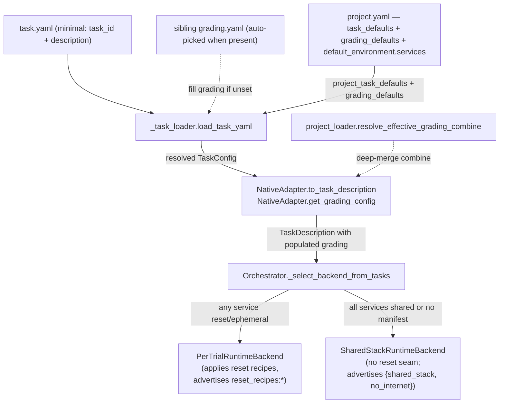

# Milestone 16: Project layer runnability

Milestone: [`Toloka/tolokaforge#milestone/16`](https://github.com/Toloka/tolokaforge/milestone/16)
Umbrella issue: [#375](https://github.com/Toloka/tolokaforge/issues/375)
Integration branch: `feat/project-layer-runnability`

## TL;DR

The reference project for the Project schema — `examples/native/example-microservices-pack` — could not run end-to-end after milestone 12 landed. `TaskConfig` still required four fields (`initial_state` / `tools` / `user_simulator` / `grading`) that the minimal shape documented in `docs/architecture/PROJECTS.md` (`task_id` + `description`) doesn't set, and `project.task_defaults.grading_defaults.combine` was declared on the model but never merged into any task's grading, so judge-only tasks graded against a non-existent `state_checks` component. This milestone realises both documented contracts, deletes an unreachable dead-code seam that ADR-0018 flagged for cleanup, and clears the residual doc drift from the ADR-0018 amendment vocabulary swap.

Closes #366, #310, #311, #369, #370, #371, #376, #380.

Compatibility impact is small and additive: `task.yaml` gains four optional fields (previously required); backend capability advertisements shrink to what each backend can actually honour; project-level `grading_defaults.combine` now flows through, changing the resolved combine for tasks that previously fell back to a hardcoded `{state_checks: 1.0}` — no shipping non-microservices pack was affected (all ship full explicit `combine` blocks). Full detail in "Impact on existing tasks" below.

## Impact on existing tasks — read this first

**Non-breaking** for every currently-runnable pack. Tests + integration sweeps green across all example packs and the full unit/canonical suite.

- **`task.yaml` schema**: four fields (`initial_state`, `tools`, `user_simulator`, `grading`) went from required to optional. Any existing task file that declares these keeps working byte-for-byte identically. Tasks that omit them get sane defaults — empty state, no tools, cooperative LLM user simulator (already the documented default), and either a sibling `grading.yaml` (auto-picked when present) or a fail-loud `ValueError` on grading construction if there's genuinely no grading configured. This is additive on the `task.yaml` compatibility surface (Core Rule 5).
- **`SharedStackRuntimeBackend`**: dropped four `reset_recipes:*` capability advertisements. No shipping run config requests those capabilities under a shared-selected run (verified via `rg` over `examples/`), and reset-labelled services always route to `PerTrialRuntimeBackend` anyway. The deleted `reset_services_for_next_trial` method was unreachable via `tolokaforge run` — only its own integration test called it. Cleanup, not a contract change.
- **Grading combine resolution**: tasks now inherit `combine.method / weights / pass_threshold` from `project.task_defaults.grading_defaults.combine` when they don't specify their own. Every shipped example task outside `example-microservices-pack` already ships a full explicit `combine` block, so resolved combines are byte-identical for them. Only the 5 judge-only tasks in `example-microservices-pack` change behaviour — they now grade with `{llm_judge: 1.0}` weights instead of the previous silent `{state_checks: 1.0}` fallback (which was against a non-existent component).
- **`orchestrator.runtime` + `--runtime`**: no behaviour change. Both surfaces still exist, still emit `DeprecationWarning` when explicitly set (unchanged behaviour). The docs now correctly describe them as deprecated overrides rather than "opt-in surfaces in ascending order of precedence".

Two guards remain fail-loud, as before:
- `NativeAdapter.get_grading_config` now raises a clear `ValueError` naming the task when `task.grading` is `None` and no sibling `grading.yaml` exists — was a bare `TypeError` inside `task_dir / None`. Same failure mode, better message.
- Forced `orchestrator.runtime: shared` against a task set requiring per-trial isolation still refuses at startup with the same `RuntimeError` (`_verify_isolation_compatibility`); message updated to match the per-service vocabulary.

## Design walkthrough

The two central seams: **task loading** (the minimal `task.yaml` shape flows through to a fully-populated `TaskDescription`) and **grading resolution** (project-level `grading_defaults.combine` merges into each task's own `combine`, task-wins-per-field). Backend selection remains task-driven per ADR-0018 — the docs now describe it that way.

## Key design choices

| Decision | Rationale |
|---|---|
| `TaskConfig`'s four "required by history, unused by minimal packs" fields (`initial_state` / `tools` / `user_simulator` / `grading`) become optional. | The Project schema (PROJECTS.md) documents the minimal task as `task_id` + `description`; every unshipped Project pack (like `example-microservices-pack`) was authored against that shape. Required-only-because-legacy fields blocked the reference pack from loading. |
| Three of the four defaults are model instances (`Field(default_factory=…)`), not `None`. | The live trial path (conductor + native adapter) has ~15 unguarded derefs of `task.user_simulator.mode`, `task.tools.agent`, `task.initial_state.json_db`. Model-instance defaults keep every consumer working with zero consumer changes — cheaper than a guard sweep, and the default `UserSimulatorConfig()` is already the cooperative LLM user the Project contract asks for. |
| `grading` is `str \| None` (path, not model) with a fail-loud `ValueError` guard on `NativeAdapter.get_grading_config`. | `grading` is a path to a sibling file, not a nested config — the model shape doesn't fit. A dereferenced `None` would `TypeError` inside `task_dir / None`; the guard converts that into a clear "task X has no grading configured" error, matching Core Rule 1 (fail-loud on real errors). |
| Sibling `grading.yaml` next to `task.yaml` is auto-picked; explicit `grading:` from any merge layer wins. | Matches the pack convention — every pack task ships its own `grading.yaml` next to `task.yaml`. Explicit-wins preserves per-task overrides. Absolute-path materialisation (via `.resolve()`) survives all downstream `task_dir / task.grading` joins layout-independently. |
| Delete `SharedStackRuntimeBackend.reset_services_for_next_trial` rather than wire it in. | The method has no run-loop caller and cannot be reached from the CLI (any `reset` service routes to `PerTrialRuntimeBackend`; forced-shared override is refused by the isolation-compat gate). Its four seed-kind semantics are incoherent under a shared stack — sql_dump requires idempotent seeds, filesystem_dir is a partial/leaky wipe, redis_dump implies a container restart that blurs "long-lived shared", bare is a genuine no-op. No shipped example asks for it. ADR-0018's own guidance is defer-and-re-add-cleanly-when-real. |
| Drop the four `reset_recipes:*` entries from `SharedStackRuntimeBackend.advertised_capabilities`. | Direct consequence of the deletion — a false capability claim (Core Rule 1). `PerTrialRuntimeBackend` still advertises them; `CAPABILITY_REGISTRY` vocabulary unchanged. Shared-selected runs that requested these were being admitted for a capability the backend could never deliver. |
| ADR-0013 flipped `Proposed → Accepted`; date recorded in the ADR's existing "Status transition" section (bare-header + date-in-transition matches repo convention). | The per-trial RPC methods on `RuntimeBackend` shipped in #141 + #148, and a release cycle has passed with no fresh test breakage — the ADR's own "shipped + one release" condition is met. Kept the historical Proposed date as an audit trail. |
| ADR-0016 + `isolated_trials.md` vocabulary rewritten around per-service `services.<name>.isolation: shared \| reset \| ephemeral` + task-driven selection. ADR-0009 gains a `Superseded by: ADR-0018 (isolation surface only)` pointer; ADR-0018 gains the reciprocal `Supersedes: ADR-0009`. | Rule 8: docs describe current state, not past decisions. The ADR-0018 amendment (2026-07-14) moved isolation to per-service — every user-facing doc that still said `isolation: shared_ok | per_trial` was documenting a value that no longer exists. Historical ADR-0009 keeps its body as an audit trail of the superseded decision; only the header pointer moves. |
| ROADMAP.md rows aligned with CHANGELOG shipped-status: v0.10.0 `In flight → Shipped`, v0.11.0 `Planned → In flight`; two "design investigations in flight" bullets pruned because they crystallised into ADR-0016. | Rule 8: docs describe current state. Rows the CHANGELOG says shipped can't still read `Planned`. |
| Six top-level docs (GETTING_STARTED, RUNNER, TASK_PACKS, REFERENCE, SECURITY, BENCHMARK_BACKEND_DESIGNS) gain a one-paragraph or one-line breadcrumb to the multi-container documentation. | Reader landing on any of these previously had no path onward. Breadcrumbs point at the closest-fit primary doc (guide / RUNTIME_BACKENDS / PROJECTS) without duplicating content. |
| `project.task_defaults.grading_defaults.combine` now merges into each task's resolved grading (deep-merge, task-wins-per-field, `weights` key-by-key) via a pure `resolve_effective_grading_combine` helper. `NativeAdapter` routes both grading-construction sites through it; the arbitrary `{state_checks: 1.0}` fallback is gone. | The project-level `grading_defaults` was dead config — declared in PROJECTS.md but never merged. Judge-only tasks in `example-microservices-pack` graded against a non-existent `state_checks` component. Same root cause also caused `get_grading_config` to `ValidationError`-crash on any task without a `combine` block (folded into the same PR). Fix realises the documented merge algebra. |
| `isolated_trials.md` §"How to opt in" reframed as §"How isolation is decided"; task-level declaration presented as the mechanism, `orchestrator.runtime` + `--runtime` demoted to deprecated overrides. | The section was written pre-ADR-0018-amendment when isolation was an operator opt-in; task-driven selection made the "three surfaces in ascending order of precedence" framing false. Fix aligns the guide with `_select_backend_from_tasks`'s actual behaviour and scopes "refuses to start" to the override-conflict path only. |

## Concepts introduced

- **Minimal task shape**: `task_id` + `description` alone loads a valid `TaskConfig` with cooperative-LLM defaults and auto-picked sibling grading.
- **Backend capability advertisements reflect what a backend can actually honour** — the shared backend no longer advertises reset-recipe capabilities it cannot deliver via the (now-deleted) unreachable seam.
- **Task-driven isolation selection** is now the guide's front-door framing, matching ADR-0018's amendment and `Orchestrator._select_backend_from_tasks`. The CLI/config overrides remain documented but as deprecated escape hatches, not primary opt-in surfaces.

## Industry precedents

N/A — the changes here realise contracts already documented in this repo's own architecture (PROJECTS.md, ADR-0009, ADR-0018) rather than borrowing from external prior art.

## Suggested review order

Read in order to follow the logical arc of the milestone:

1. **`b874951` — #366 task-schema relaxation** (PR #377). The foundation — `TaskConfig` accepts the minimal shape, sibling `grading.yaml` auto-picked. All the downstream work assumes this.
2. **`d26cefd` — #376 grading_defaults merge** (PR #386). Wires the project-level `grading_defaults.combine` through to resolved task grading. Same PR fixes a `ValidationError` crash surfaced by #366 (no-`combine` tasks). This is the piece that lets the reference pack actually grade correctly.
3. **`13fe08e` — #310 delete unreachable shared-stack reset seam** (PR #378). Small internal cleanup; also drops the false `reset_recipes:*` capability advertisement on the shared backend.
4. **`24f7581` — #369 ADR-0013 status flip** (PR #379). Cosmetic ADR housekeeping.
5. **`d0f1681` — #370 ADR-0016 + isolated_trials.md vocabulary** (PR #381). Vocab drift from the ADR-0018 amendment — reads as the same class of Rule-8 fix as the doc updates in milestone 12.
6. **`f0016af` — #311 ROADMAP alignment** (PR #382). ROADMAP status catches up with CHANGELOG.
7. **`85672ad` — #371 top-level docs breadcrumbs** (PR #383). Adds paths from six top-level docs to the multi-container documentation.
8. **`deb4813` — #380 isolated_trials.md framing rewrite** (PR #388). The final residue from the ADR-0018 amendment — the section title + framing move off "operator opt-in" onto task-driven selection.

## Verification

Every per-issue PR ran the standard branch-attributable CI lanes on the integration branch:

- **lint** (ruff) — green on every PR.
- **test-smoke** — green on every PR that touched code.
- **CodeQL / Analyze (actions/python)** — green on every PR.
- **hygiene-review** — pre-existing red (documented in AGENTS.md gotchas; not branch-caused).

Targeted test paths run per-issue:

- `tests/unit/test_schema_reservations.py` — #366 (rewritten placeholder + new fail-loud guard).
- `tests/unit/test_task_loader.py::TestSiblingGradingAutoPickup` — #366 (auto-pickup semantics).
- `tests/unit/test_project_loader.py::TestResolveEffectiveGradingCombine` — #376 (7 merge-semantics cases).
- `tests/integration/test_example_microservices_pack.py` — expanded from 4 → 21 tests across #366 and #376 (real `NativeAdapter` load, all 5 pack tasks build a `TaskDescription` with populated `grading.llm_judge` + inherited combine weights; crash-regression on `api_endpoint_add`).
- `tests/unit/test_orchestrator_isolation_enforcement.py::TestSharedStackRuntimePath::test_no_reset_services_for_next_trial_seam` — #310 (absence-of-method regression lock).
- `tests/unit/test_backend_capabilities.py::TestBackendAdvertisements` — #310 (advertisement-split assertions).

Post-merge on the integration branch: broader `mcp__dev__run_tests` sweeps (unit + canonical) — 2371 pass, 1 pre-existing skip. No regressions.

No integration lane requiring API keys was skipped in a way that hid the behaviour under test — the microservices pack's `TaskDescription` build is exercised without Docker or LLM keys per the existing test-file philosophy.

## What's next

Three follow-ups surfaced during execution, all filed and left for later:

- **#384** — divergent `combine` defaults across model layers (core / runner / native). #376 fixed the adapter path; the runner-side default still diverges.
- **#385** — `deep_merge` doesn't implement PROJECTS.md's documented `null`-unset merge rule. Pre-existing doc-vs-impl gap.
- **#387** — CLI `--runtime` help text + `_print_runtime_banner` still frame the flag as a live selector, not a deprecated override. #380 fixed the guide; help/banner remain stale.

The two follow-ups filed earlier for the same milestone flow but scoped out (#384, #385, #387) all carry `Low` priority and no blocking dependency.
