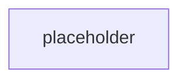

# Milestone 16: Project layer runnability

Milestone: [`Toloka/tolokaforge#milestone/16`](https://github.com/Toloka/tolokaforge/milestone/16)
Umbrella issue: [#375](https://github.com/Toloka/tolokaforge/issues/375)
Integration branch: `feat/project-layer-runnability`

## TL;DR

_Populated at Step 4 finalize._

## Impact on existing tasks — read this first

_Populated at Step 4 finalize._

## Design walkthrough

## Key design choices

| Decision | Rationale |
|---|---|
| `TaskConfig`'s four "required by history, unused by minimal packs" fields (`initial_state` / `tools` / `user_simulator` / `grading`) become optional. | The Project schema (PROJECTS.md) documents the minimal task as `task_id` + `description`; every unshipped Project pack (like `example-microservices-pack`) was authored against that shape. Required-only-because-legacy fields blocked the reference pack from loading. |
| Three of the four defaults are model instances (`Field(default_factory=…)`), not `None`. | The live trial path (conductor + native adapter) has ~15 unguarded derefs of `task.user_simulator.mode`, `task.tools.agent`, `task.initial_state.json_db`. Model-instance defaults keep every consumer working with zero consumer changes — cheaper than a guard sweep, and the default `UserSimulatorConfig()` is already the cooperative LLM user the Project contract asks for. |
| `grading` is `str \| None` (path, not model) with a fail-loud `ValueError` guard on `NativeAdapter.get_grading_config`. | `grading` is a path to a sibling file, not a nested config — the model shape doesn't fit. A dereferenced `None` would `TypeError` inside `task_dir / None`; the guard converts that into a clear "task X has no grading configured" error, matching Core Rule 1 (fail-loud on real errors). |
| Sibling `grading.yaml` next to `task.yaml` is auto-picked; explicit `grading:` from any merge layer wins. | Matches the pack convention — every pack task ships its own `grading.yaml` next to `task.yaml`. Explicit-wins preserves per-task overrides. Absolute-path materialisation (via `.resolve()`) survives all downstream `task_dir / task.grading` joins layout-independently. |

## Concepts introduced

- **Minimal task shape**: `task_id` + `description` alone loads a valid `TaskConfig` with cooperative-LLM defaults and auto-picked sibling grading.

## Industry precedents

_Populated at Step 4 finalize (or omitted with a note if N/A)._

## Suggested review order

_Populated at Step 4 finalize — one numbered entry per merged per-issue PR with its squash SHA._

## Verification

_Populated at Step 4 finalize — CI lane pass counts, post-merge validations that ran, deliberate skips + reasons._

## What's next

_Populated at Step 4 finalize — one or two sentences of forward links to follow-up issues or the next milestone._
