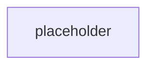

# Milestone 16: Project layer runnability

Milestone: [`Toloka/tolokaforge#milestone/16`](https://github.com/Toloka/tolokaforge/milestone/16)
Umbrella issue: [#375](https://github.com/Toloka/tolokaforge/issues/375)
Integration branch: `feat/project-layer-runnability`

## TL;DR

_Populated at Step 4 finalize._

## Impact on existing tasks — read this first

_Populated at Step 4 finalize._

## Design walkthrough

## Key design choices

| Decision | Rationale |
|---|---|
| _(populated per-issue in Step 3.6)_ | _(populated per-issue in Step 3.6)_ |

## Industry precedents

_Populated at Step 4 finalize (or omitted with a note if N/A)._

## Suggested review order

_Populated at Step 4 finalize — one numbered entry per merged per-issue PR with its squash SHA._

## Verification

_Populated at Step 4 finalize — CI lane pass counts, post-merge validations that ran, deliberate skips + reasons._

## What's next

_Populated at Step 4 finalize — one or two sentences of forward links to follow-up issues or the next milestone._
