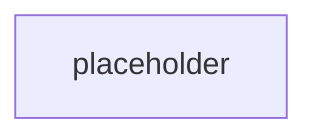

# Milestone 16: Project layer runnability

Milestone: [`Toloka/tolokaforge#milestone/16`](https://github.com/Toloka/tolokaforge/milestone/16)
Umbrella issue: [#375](https://github.com/Toloka/tolokaforge/issues/375)
Integration branch: `feat/project-layer-runnability`

## TL;DR

_Populated at Step 4 finalize._

## Impact on existing tasks — read this first

_Populated at Step 4 finalize._

## Design walkthrough

## Key design choices

| Decision | Rationale |
|---|---|
| `TaskConfig`'s four "required by history, unused by minimal packs" fields (`initial_state` / `tools` / `user_simulator` / `grading`) become optional. | The Project schema (PROJECTS.md) documents the minimal task as `task_id` + `description`; every unshipped Project pack (like `example-microservices-pack`) was authored against that shape. Required-only-because-legacy fields blocked the reference pack from loading. |
| Three of the four defaults are model instances (`Field(default_factory=…)`), not `None`. | The live trial path (conductor + native adapter) has ~15 unguarded derefs of `task.user_simulator.mode`, `task.tools.agent`, `task.initial_state.json_db`. Model-instance defaults keep every consumer working with zero consumer changes — cheaper than a guard sweep, and the default `UserSimulatorConfig()` is already the cooperative LLM user the Project contract asks for. |
| `grading` is `str \| None` (path, not model) with a fail-loud `ValueError` guard on `NativeAdapter.get_grading_config`. | `grading` is a path to a sibling file, not a nested config — the model shape doesn't fit. A dereferenced `None` would `TypeError` inside `task_dir / None`; the guard converts that into a clear "task X has no grading configured" error, matching Core Rule 1 (fail-loud on real errors). |
| Sibling `grading.yaml` next to `task.yaml` is auto-picked; explicit `grading:` from any merge layer wins. | Matches the pack convention — every pack task ships its own `grading.yaml` next to `task.yaml`. Explicit-wins preserves per-task overrides. Absolute-path materialisation (via `.resolve()`) survives all downstream `task_dir / task.grading` joins layout-independently. |
| Delete `SharedStackRuntimeBackend.reset_services_for_next_trial` rather than wire it in. | The method has no run-loop caller and cannot be reached from the CLI (any `reset` service routes to `PerTrialRuntimeBackend`; forced-shared override is refused by the isolation-compat gate). Its four seed-kind semantics are incoherent under a shared stack — sql_dump requires idempotent seeds, filesystem_dir is a partial/leaky wipe, redis_dump implies a container restart that blurs "long-lived shared", bare is a genuine no-op. No shipped example asks for it. ADR-0018's own guidance is defer-and-re-add-cleanly-when-real. |
| Drop the four `reset_recipes:*` entries from `SharedStackRuntimeBackend.advertised_capabilities`. | Direct consequence of the deletion — a false capability claim (Core Rule 1). `PerTrialRuntimeBackend` still advertises them; `CAPABILITY_REGISTRY` vocabulary unchanged. Shared-selected runs that requested these were being admitted for a capability the backend could never deliver. |
| ADR-0013 flipped `Proposed → Accepted`; date recorded in the ADR's existing "Status transition" section (bare-header + date-in-transition matches repo convention). | The per-trial RPC methods on `RuntimeBackend` shipped in #141 + #148, and a release cycle has passed with no fresh test breakage — the ADR's own "shipped + one release" condition is met. Kept the historical Proposed date as an audit trail. |
| ADR-0016 + `isolated_trials.md` vocabulary rewritten around per-service `services.<name>.isolation: shared \| reset \| ephemeral` + task-driven selection. ADR-0009 gains a `Superseded by: ADR-0018 (isolation surface only)` pointer; ADR-0018 gains the reciprocal `Supersedes: ADR-0009`. | Rule 8: docs describe current state, not past decisions. The ADR-0018 amendment (2026-07-14) moved isolation to per-service — every user-facing doc that still said `isolation: shared_ok | per_trial` was documenting a value that no longer exists. Historical ADR-0009 keeps its body as an audit trail of the superseded decision; only the header pointer moves. |
| ROADMAP.md rows aligned with CHANGELOG shipped-status: v0.10.0 `In flight → Shipped`, v0.11.0 `Planned → In flight`; two "design investigations in flight" bullets pruned because they crystallised into ADR-0016. | Rule 8: docs describe current state. Rows the CHANGELOG says shipped can't still read `Planned`. |
| Six top-level docs (GETTING_STARTED, RUNNER, TASK_PACKS, REFERENCE, SECURITY, BENCHMARK_BACKEND_DESIGNS) gain a one-paragraph or one-line breadcrumb to the multi-container documentation. | Reader landing on any of these previously had no path onward. Breadcrumbs point at the closest-fit primary doc (guide / RUNTIME_BACKENDS / PROJECTS) without duplicating content. |
| `project.task_defaults.grading_defaults.combine` now merges into each task's resolved grading (deep-merge, task-wins-per-field, `weights` key-by-key) via a pure `resolve_effective_grading_combine` helper. `NativeAdapter` routes both grading-construction sites through it; the arbitrary `{state_checks: 1.0}` fallback is gone. | The project-level `grading_defaults` was dead config — declared in PROJECTS.md but never merged. Judge-only tasks in `example-microservices-pack` graded against a non-existent `state_checks` component. Same root cause also caused `get_grading_config` to `ValidationError`-crash on any task without a `combine` block (folded into the same PR). Fix realises the documented merge algebra. |

## Concepts introduced

- **Minimal task shape**: `task_id` + `description` alone loads a valid `TaskConfig` with cooperative-LLM defaults and auto-picked sibling grading.
- **Backend capability advertisements reflect what a backend can actually honour** — the shared backend no longer advertises reset-recipe capabilities it cannot deliver via the (now-deleted) unreachable seam.

## Industry precedents

_Populated at Step 4 finalize (or omitted with a note if N/A)._

## Suggested review order

_Populated at Step 4 finalize — one numbered entry per merged per-issue PR with its squash SHA._

## Verification

_Populated at Step 4 finalize — CI lane pass counts, post-merge validations that ran, deliberate skips + reasons._

## What's next

_Populated at Step 4 finalize — one or two sentences of forward links to follow-up issues or the next milestone._
